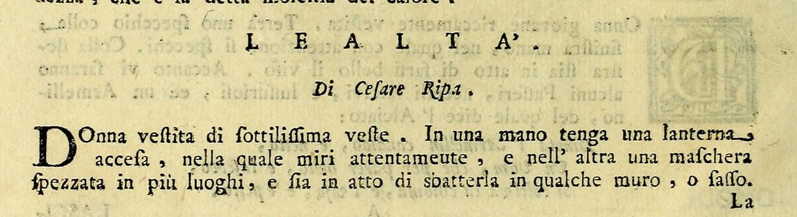
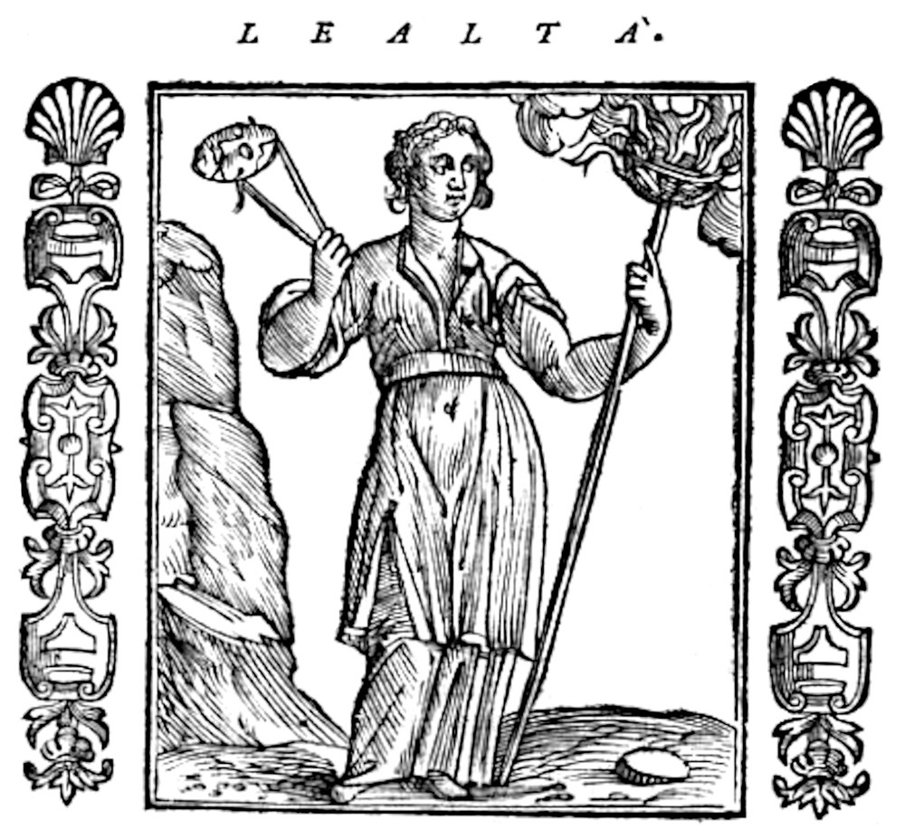

# 충직함(Lealtà) — 등불과 깨진 가면을 든 여인

## 카드 요약

**Q.** 리파는 '충직함(Lealtà)'을 어떻게 의인화했는가?

**A.** 얇은 옷을 입은 여인이 한 손에는 켜진 등불(랜턴)을 들고 주시하며, 다른 손에는 여러 곳이 깨진 가면을 들고 벽이나 돌에 내리치려는 모습이다.

---

## 원문 (Orlandi판 『Iconologia』 제4권, 첫 표제어)

> **LEALTÀ.** *Di Cesare Ripa.*
> Donna vestita di sottilissima veste. In una mano tenga una lanterna accesa, nella quale miri attentamente, e nell'altra una maschera spezzata in più luoghi, e sia in atto di sbatterla in qualche muro, o sasso.

즉 —

- **sottilissima veste**: 아주 얇은(비치는) 옷을 입은 여인
- **lanterna accesa … miri attentamente**: 한 손에 **켜진 등불**을 들고 그 속을 **주의 깊게 응시**함
- **maschera spezzata in più luoghi**: 다른 손에는 **여러 군데가 깨진 가면**
- **in atto di sbatterla in qualche muro, o sasso**: 그것을 **벽이나 돌에 내리치려는 동작**

카드의 답은 이 한 문장을 그대로 옮긴 것이다. 이 항목은 리파 원문(`Di Cesare Ripa`) 그대로이고, Orlandi가 뒤에 붙인 두 개의 변형안(아래 "다른 판본" 참조)과는 구별된다.

---

## 도상 (1611년 Padova판 목판화)

> 참고: 이 카드의 저본인 Orlandi 증보판(Perugia, 1764) 제4권에서는 Lealtà 항목이 **삽화 없이 텍스트만** 실려 있다(2–3쪽. 바로 앞 Lascivia와 바로 뒤 Lega에는 동판화가 있으나 Lealtà에는 없다). 위 그림은 같은 표제어를 목판화로 실은 1611년 파도바판의 도상이다.

그림에서 실제로 확인되는 요소를 답과 연결하면:

| 그림에서 보이는 것 | 원문 어구 | 의미 |
|---|---|---|
| 몸의 윤곽이 그대로 드러나는 얇고 헐렁한 홑옷, 맨발 | *sottilissima veste* | 감출 것이 없음 |
| 왼손에 든 긴 장대 끝의 **불붙은 등불**, 그쪽으로 돌린 시선 | *lanterna accesa … miri attentamente* | 안의 빛이 그대로 밖으로 나감 |
| 오른손에 치켜든 **가면** | *maschera spezzata* | 위선의 도구 |
| 왼편에 우뚝 선 **바위 덩어리**, 발치에 굴러다니는 파편 | *sbatterla in qualche muro, o sasso* | 가면을 부수는 행위 자체 |

---

## 각 지물의 근거 (원문 해설)

### 1. 얇디얇은 옷 — 말은 영혼의 옷

> La veste sottile mostra, che nelle parole dell'Uomo leale si deve scuoprire l'animo sincero e senza impedimento, essendo le parole i concetti dell'animo nostro, come la veste ad un corpo ignudo.

**옷 : 벌거벗은 몸 = 말 : 영혼**이라는 비유다. 옷이 몸을 감싸듯 말은 영혼을 감싸는 껍데기인데, 충직한 사람의 말은 **아무 방해 없이(senza impedimento)** 그 안의 진실한 마음이 비쳐 보이게 해야 한다. 그래서 옷이 두껍거나 화려하면 안 되고 **비칠 만큼 얇아야** 한다. 감출 것이 없다는 뜻이다.

### 2. 켜진 등불 — 안의 빛과 밖의 빛이 같음

> La lanterna medesimamente si pone per l'anima, e per il cuor nostro; e lo splendore, che penetra di fuori col vetro, sono le parole e le azioni esteriori; e siccome la lanterna manda fuori quel medesimo lume che nasce dentro di lei, così l'Uomo leale deve esser dentro e fuori della medesima qualità.

등불의 알레고리는 **부품별 대응**으로 짜여 있다.

- **등불(랜턴) 자체** = 우리의 **영혼(anima)과 심장(cuore)** — 내면
- **유리를 통과해 밖으로 새어 나오는 광채** = **말과 겉으로 드러난 행동** — 외면
- 핵심: 유리를 지나면서도 빛은 **변질되지 않는다**. 등불은 자기 안에서 생겨난 바로 그 빛(*quel medesimo lume che nasce dentro di lei*)을 그대로 밖으로 내보낸다.

따라서 충직한 사람은 **안과 밖이 같은 성질(dentro e fuori della medesima qualità)** 이어야 한다. 여인이 등불을 그냥 들고만 있지 않고 **그 안을 응시하는(miri attentamente)** 것도 같은 맥락 — 자기 내면을 스스로 점검한다는 뜻이다. 횃불이 아니라 굳이 **유리가 있는 랜턴**인 이유가 여기에 있다. 유리는 '통과시키되 왜곡하지 않는 매개'이기 때문이다.

원문은 여기에 마태복음 5:16을 인용한다.

> A questo proposito disse Cristo Nostro Signore: Sia tale la vostra luce presso agli Uomini, che essi ne rendano gloria a Dio; e che alla fama de' meriti vostri corrispondano le opere.
>
> (너희 빛이 사람 앞에 비치게 하여 그들이 하나님께 영광을 돌리게 하라 — 그리고 **너희 명성에 실제 행실이 부합하게 하라**.)

마지막 구절이 리파가 덧붙인 요점이다. **평판(fama)과 실제 행위(opere)가 일치해야 한다**는 것이 곧 lealtà다.

### 3. 깨진 가면 — 위선에 대한 경멸

> La maschera, che getta per terra, e spezzata, mostra medesimamente il disprezzo della finzione, e della doppiezza dell'animo.

가면은 리파 도상학에서 일관되게 **거짓 얼굴 / 흉내 / 위장**의 지물이다. 여기서는 세 층위가 겹쳐 있다.

1. **이미 여러 군데 깨져 있음(spezzata in più luoghi)** — 위선은 이미 못 쓰게 된 물건
2. **땅에 내던짐(getta per terra)** — 버림
3. **벽이나 돌에 내리치려는 동작** — 단순히 안 쓰는 정도가 아니라 **적극적으로 박살 내는** 것. 소극적 정직이 아니라 위장(finzione)과 이중성(doppiezza dell'animo)에 대한 **경멸(disprezzo)** 의 표현

등불이 "안=밖"을 **긍정적으로** 말한다면, 가면 깨기는 같은 명제를 **부정 쪽에서** 말한다. 두 지물이 한 쌍으로 작동한다.

> 대조 참고: 같은 책의 다른 항목에서 가면은 다른 뜻으로도 쓰인다. **Malignità(악의)**에서는 얼굴에 내려 쓰려는 가면이 악인이 남에게 안기는 수치와 불명예를, **Pittura(회화)**에서는 목걸이에 달린 가면이 `Imitatio`(모방)를, **Commedia/Talia** 등 무제(Muse) 항목에서는 희극의 표상을 뜻한다. 즉 가면 = 무조건 위선은 아니고, **"깨져서 내던져진" 가면**일 때 위선 거부가 된다.

---

## 같은 표제어의 다른 안(Orlandi 증보)

리파 본안 바로 뒤에 Orlandi는 훨씬 단순한 두 가지 대안을 덧붙인다. 시험 문제에서 혼동하기 쉬우니 구분해 둘 것.

| 안 | 모습 | 근거 |
|---|---|---|
| **본안 (Di Cesare Ripa)** | 얇은 옷 + 켜진 등불 + 깨진 가면 | 안팎의 일치, 위선 파괴 |
| 대안 1 | 흰옷을 입고 **가슴을 열어 자기 심장을 보여 줌** | 마음과 말·행동의 일치(corrispondenza)를 그대로 노출 → 온전히 신뢰받기 위해 |
| 대안 2 | 흰옷에 **오른손을 가슴에 얹고 곁에 작은 개(Cagnolino)** | 가슴 위의 오른손 = 영혼의 온전함(integrità), 개 = 타고난 성향으로서의 충실함(fedeltà)·충직함 |

세 안 모두 **흰색 / 노출 / 은폐 없음**이라는 공통 코드를 쓴다. 항목 끝에는 `De' Fatti, vedi Fedeltà, e Sincerità`(관련 일화는 '신의'와 '진실함' 항목 참조)라는 상호 참조가 붙어 있다.

---

## 암기 포인트

- **여인 + 얇은 옷 + 켜진 등불(응시) + 깨진 가면(내리치기)** — 이 네 요소 세트
- 등불 = **영혼/심장**, 유리를 통과한 빛 = **말/행동** → 안의 빛 = 밖의 빛
- 가면 = **finzione(위장) + doppiezza(이중성)**, 깨서 던짐 = **disprezzo(경멸)**
- 얇은 옷 = **말은 영혼의 옷** → 비쳐 보여야 함
- 성경 근거: **마태복음 5:16** (명성과 행실의 일치)

---

## 출처

- 저본: `01 Weariness to Pandering.md` (Cesare Orlandi 증보, *Iconologia del cavaliere Cesare Ripa, perugino*, Tomo Quarto, Perugia: Piergiovanni Costantini, 1764, pp. 2–3)
- fig-2: 위 판본 스캔 (Internet Archive, `iconologiadelcav642ripa`, leaf 9)
- fig-1: *Iconologia*, Padova 1611, p.309 목판화 (Università di Pisa, "Le allegorie di Cesare Ripa" 프로젝트)
