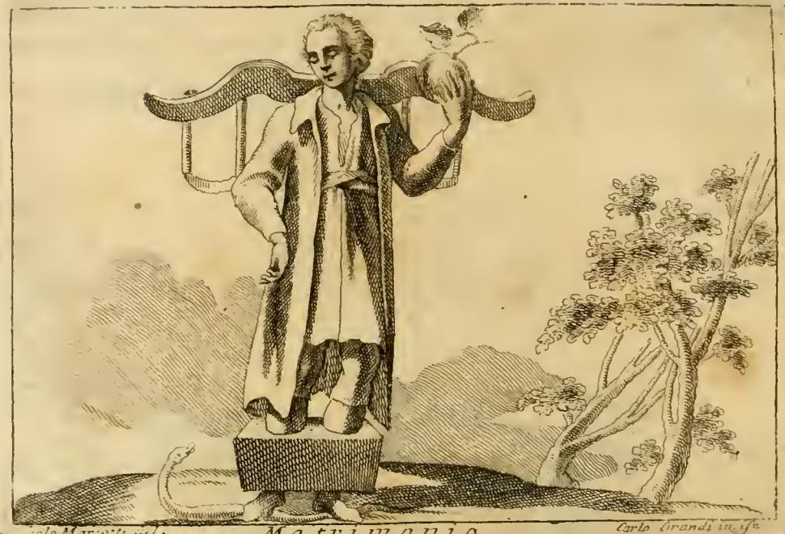

# '결혼(MATRIMONIO)' 도상의 마르멜로(cotogno)

**질문** — '결혼' 도상에서 마르멜로(cotogno)는 왜 등장하는가?

**답** — 솔론의 법에 따라 아테네에서 신혼부부에게 베누스에게 바쳐진 마르멜로를 주었는데, 이는 다산의 상징이자 피에리오에 따르면 상호 사랑의 표시이기 때문이다. 여러 메달에도 같은 의미로 새겨져 있다.

---

## 1. 리파의 원문

리파 『이코놀로지아』의 MATRIMONIO 항목은 먼저 인물 전체를 이렇게 규정한다.

> *Un Giovane pompofamente veſtito, con un giogo ſopra il collo, e co' ceppi a' piedi, con un anello, ovvero una fede di oro in dito; tenendo nella medeſima mano un cotogno, e ſotto a' piedi avrà una Vipera.*
>
> — 화려하게 차려입은 젊은이. 목에는 **멍에(giogo)**, 발에는 **족쇄(ceppi)**, 손가락에는 **반지 곧 황금 결혼반지(fede d'oro)**를 끼고, **같은 손에 마르멜로 한 알**을 들고 있으며, 발밑에는 **살무사(Vipera)**가 있다.

이어지는 마르멜로 해설이 이 카드의 직접 전거다.

> *Il cotogno, per comandamento di Solone, ſi preſentava a' Spoſi in Atene, come dedicato a Venere, per la fecondità, e ſi vede in molte Medaglie ſcolpito in queſto ſteſso propoſito, perchè ſono indizio di amore ſcambievole, come dice il Pierio; gettandoli alle Donne nobili in alcuni luoghi, per effetto amoroſo, con baciamento di mani dall' una e dall' altra parte; o piuttoſto, perchè ſi dice l' Uomo coglie il frutto, quando viene a quel fine, che ſi conſeguiſce lecitamente per mezzo del Matrimonio, eſſendo altrimenti peccato grave...*
>
> — 마르멜로는 **솔론의 명령에 따라** 아테네에서 신혼부부에게 주어졌다. **베누스에게 봉헌된 열매**이며 **다산(fecondità)**을 뜻하기 때문이다. 같은 취지로 **여러 메달에 새겨진 것**을 볼 수 있는데, 피에리오가 말하듯 **상호 사랑(amore scambievole)의 표시**이기 때문이다. 어떤 지역에서는 애정의 표시로 귀부인들에게 이 열매를 던지고 서로 손에 입맞춤을 했다. 또는 오히려, 결혼을 통해서만 합법적으로 도달하는 그 목적에 이를 때 "사람이 **열매를 딴다**"고 말하기 때문이다 — 그렇지 않으면 중죄이니.

즉 리파는 마르멜로 하나에 **① 솔론 법의 고증 ② 베누스 봉헌·다산 ③ 피에리오의 상호 사랑 ④ 화폐·메달 도상 근거 ⑤ '열매를 딴다'는 성적 완성의 비유**를 겹쳐 놓았다. 카드의 답은 ①~④에 해당한다.

## 2. 판화에서 실제로 보이는 것

- 젊은이가 **왼팔을 높이 들어 크고 둥근 열매 한 알을 손바닥으로 감싸 쥐고 있다.** 확대해 보면 열매 꼭지에서 **잎이 달린 짧은 가지**가 솟아 있어 사과·석류가 아닌 **마르멜로의 잎 붙은 과실** 표현임을 알 수 있다. 사과보다 크고 배처럼 어깨가 부푼 윤곽도 마르멜로에 부합한다.
- 손가락 밑단에 짧은 띠 형태의 음영이 있으나, 이 인쇄 상태에서 **반지(fede d'oro)를 확정적으로 판독하기는 어렵다.** 텍스트가 "**같은 손에**" 반지와 마르멜로를 둔다고 못박은 것은 우연이 아니다. 서약의 표지(반지)와 그 서약이 낳는 결실(마르멜로)을 **한 손에 묶어** 계약과 생식이 분리될 수 없음을 말한다.
- 목과 어깨를 가로지르는 **비늘무늬 멍에**, 두 발을 물린 **족쇄 상자**, 바탕 왼쪽 아래를 기어가는 **살무사**가 모두 확인된다. 멍에·족쇄는 결혼의 무게와 구속, 살무사는 배우자를 해치는 생각(교미 뒤 수컷을 죽인다는 전승)을 짓밟는다는 뜻이다.
- 즉 이 도판은 **부정(멍에·족쇄·살무사)과 긍정(반지·마르멜로)을 좌우로 갈라 배치**하며, 마르멜로는 이 구도에서 유일하게 "그럼에도 결혼이 바람직한 이유"를 담은 사물이다.

> 참고: 같은 챕터의 `_page_86_Picture_3.jpeg`는 장식용 머리띠(headpiece)일 뿐이므로 이 항목의 도판이 아니다.

## 3. 전거 확인 — 솔론의 혼인법 (플루타르코스 『솔론전』 20)

리파가 "솔론의 명령"이라 한 것의 원 전거는 **플루타르코스 『솔론전』 20장 3절**이다.

> "the bride eat a quince and be shut up in a chamber with the bridegroom; and that the husband of an heiress shall approach her thrice a month without fail."
>
> — 신부는 **마르멜로(κυδώνιον μῆλον)를 먹고** 신랑과 함께 방에 들어가 문을 닫을 것이며, 상속녀의 남편은 **매달 세 번은 반드시** 그에게 다가갈 것.

여기서 중요한 맥락이 두 가지 있다.

1. **원 규정의 자리**는 결혼 일반의 축하 예식이 아니라 **에피클레로스(ἐπίκληρος, 남자 형제 없는 상속녀)** 관련 조항 안이다. 플루타르코스는 이 조항들을, 재산만 노리고 상속녀와 혼인한 뒤 부부의 의무를 방기하는 것을 막기 위한 장치로 설명한다. "월 3회" 규정과 나란히 놓인, **혼인 성립을 실효적으로 확인하는 절차적 의무**에 가깝다.
2. 규정의 동작은 "**신부가 씹어 먹는다**"이다. 선물을 주고받는 예물이 아니다.

플루타르코스는 다른 저작 『혼인 교훈(Coniugalia praecepta, Moralia 138D)』에서 이 관습을 스스로 해석한다.

> "Solon advised that the bride should eat a quince before she entered the nuptial sheets; intimating thereby... that the man was to expect his first pleasures from the breath and speech of his new-married bed-fellow."
>
> — 솔론은 신부가 신방에 들기 전 마르멜로를 먹으라 했다. 이는 남편이 누릴 첫 즐거움이 **아내의 입김과 말씨**에서 오도록, 처음부터 입과 목소리에서 나오는 즐거움이 조화롭고 유쾌하기를 뜻한 것이다.

즉 플루타르코스의 해석축은 **향기·말씨의 조화**(마르멜로의 강한 방향성)이고, 법 조문 자체는 **혼인의 실질적 완성**을 겨눈다.

### 리파/피에리오는 원 규정에서 어떻게 미끄러졌나

| | 플루타르코스 『솔론전』 20.3 | 리파(피에리오 경유) |
|---|---|---|
| 행위 | 신부가 마르멜로를 **먹는다** | 신혼부부에게 마르멜로를 **준다(si presentava a' Sposi)** |
| 대상 | **신부 한 사람**(특히 상속녀) | **부부 양쪽** |
| 취지 | 혼인의 실효적 성립·동침 의무 | **다산**, 그리고 **상호 사랑(amore scambievole)** |
| 성격 | 법적·절차적 강제 | 상징적 예물·애정의 표지 |

핵심 차이는 두 겹이다. 첫째, **먹기 → 주기**로 동작이 바뀌면서 규정이 **선물 관습(예물)**으로 재해석되었다. 둘째, **일방(신부의 의무) → 쌍방(상호 사랑)**으로 방향이 뒤집혔다. 원 규정에서 마르멜로는 아내에게 부과된 의무의 표지였지만, 피에리오의 '상호 사랑' 독법에서는 **양쪽이 서로에게 주는 애정의 상징**이 된다. 리파가 곧바로 덧붙인 "어떤 지역에서는 귀부인에게 열매를 던지고 서로 손에 입맞춤한다"는 삽화는 바로 이 **쌍방성**을 보강하는 근거다. 르네상스 상징학이 고전 전거를 인용하면서도 자기 시대의 결혼관(부부애 ideal)을 소급 투사한 전형적 사례로 읽으면 된다.

## 4. 왜 마르멜로가 베누스(아프로디테)의 열매인가

### 어원과 원산
- 그리스어 **κυδώνιον μῆλον(kydonion melon)** = "**키도니아의 사과**". 키도니아(Kydonia)는 **크레타 서부의 미노아 도시**(오늘날 하니아)로, 마르멜로가 이곳을 통해 그리스에 알려졌다고 보았다.
- 라틴어 *cydonium malum* → *cotoneum malum* → 이탈리아어 **mela cotogna**, 리파의 **cotogno**. 학명 **Cydonia oblonga**도 여기서 나왔다. 영어 quince는 고대 프랑스어 *cooin*을 거친 같은 계통이다.
- 고대인들은 이 열매가 **레반트(동방)에서 아프로디테와 함께 건너왔다**고 여겼다. 아프로디테는 **키프로스(Kypris)** 상륙 신화와 동방 기원의 여신이라는 관념을 함께 가지므로, "동방에서 온 향기로운 열매"라는 마르멜로의 성격이 여신의 계보와 겹쳐 읽혔다. 결혼 의례에서 마르멜로가 **아프로디테에게 바치는 봉헌물**이 된 배경이다.

### '황금 사과'는 실은 마르멜로였다는 논쟁
그리스 문헌의 *melon*은 사과에 국한되지 않고 둥근 과실 일반을 가리켰다. 이 때문에 고전학·식물사에서는 신화의 '황금 사과'가 실제로는 **익으면 금빛으로 물드는 마르멜로**였다는 견해가 오래 이어졌다.

- **헤스페리데스의 황금 사과** — 이미 고대에 식물학자 **테오프라스토스**가 이를 마르멜로와 동일시했다. 헤라클레스의 열두 번째 과업의 과실이자, 용 라돈이 지키는 정원의 열매.
- **파리스의 심판의 사과** — 아프로디테에게 돌아간 그 열매를 마르멜로로 보는 독법. 사랑의 여신에게 봉헌된 열매가 곧 "가장 아름다운 자"의 상금이라는 점에서 정합적이다.
- **아탈란테 신화** — 달리기에서 아탈란테의 발을 늦춘 황금 열매. 구애·혼인 성사의 결정적 매개라는 점에서 결혼 상징과 직결된다.

세 신화 모두 **혼인·구애·아름다움의 판정**에 걸려 있어, 마르멜로를 결혼 도상의 지물로 쓰는 데 두터운 근거를 제공한다.

## 5. 아이러니 — 같은 챕터의 '황금 사과'

주의할 점은, **같은 챕터 파일(`03 Machine of the World to Marriage.md`)의 MAGNIFICENZA(호화) 항목**에 정반대 방향의 황금 열매가 나온다는 것이다.

> *Non fu dove più ſpiccaſſe la Magnificenza della favoloſa celeſtial Corte, che nelle nozze della Dea Teti con Peleo... La Diſcordia ſola ne fu eſcluſa; la quale per vendicarſi dell' ingiuria, gittò ſulla tavola del convito un **Pomo di oro**, con uno ſcritto ſopra, che dicea = PER LA PIÙ BELLA =. Giunone, Pallade, e Venere garreggiarono per averlo; ed alfine fu eletto Paride per Giudice della conteſa; la qual coſa fu poi cagione d' infinite diſgrazie.*
>
> — 천상 궁정의 호화가 가장 빛난 곳은 **테티스 여신과 펠레우스의 결혼식**이었다. … 오직 **불화(Discordia)**만 초대받지 못했고, 그 모욕을 갚으려 잔치 상 위에 "**가장 아름다운 이에게**"라 새긴 **황금 사과 한 알을 던졌다.** 유노·팔라스·베누스가 다투었고 결국 파리스가 심판자로 뽑혔으니, 이것이 훗날 **끝없는 재앙의 원인**이 되었다.

여기서 아이러니가 발생한다. **4절의 고전학 논쟁을 받아들이면, MATRIMONIO의 손에 들린 마르멜로와 테티스 결혼식 상에 던져진 '황금 사과'는 같은 열매다.** 그런데 기능은 정반대다.

| | MATRIMONIO의 마르멜로 | MAGNIFICENZA의 황금 사과 |
|---|---|---|
| 사건 | 아테네 신혼부부의 혼례 예물 | 테티스·펠레우스 혼례에 던져진 물건 |
| 행위자 | 솔론의 법 / 베누스 | **불화(Discordia)** |
| 의미 | 다산, **상호 사랑**, 화합 | 질투, 경쟁, **트로이아 전쟁**의 발단 |
| 방향 | 부부를 **묶는다** | 세 여신을 **갈라놓는다** |

두 항목 모두 **결혼식 장면**이고, 두 열매 모두 **베누스와 연결**되며(한쪽은 봉헌 열매, 한쪽은 베누스가 획득), 심지어 **파리스의 심판**은 두 계열이 만나는 지점이다. 같은 열매가 화합의 표지이자 불화의 씨앗으로 갈라지는 것은 상징 사전(emblem book)의 전형적 성질이다 — **사물의 의미는 사물 자체가 아니라 인용된 전거와 문맥이 결정한다.** 리파가 각 항목에서 서로 다른 전거(솔론·피에리오 vs 호메로스·히기누스·파우사니아스)를 명시적으로 대는 이유가 여기에 있다. 카드를 외울 때 "마르멜로 = 사랑"으로만 기억하면 이 대칭을 놓친다.

## 6. 실제 열매의 성질과 상징의 접점

마르멜로의 상징이 임의적이지 않은 이유는 열매의 물리적 특성에 있다.

- **씨가 많다** — 씨방에 많은 씨가 촘촘히 들어 있어 **다산(fecondità)**의 자연스러운 표상이다. 리파가 첫 의미로 다산을 든 근거.
- **향이 매우 강하다** — 방 안에 두면 며칠간 향이 퍼진다. 플루타르코스가 마르멜로 씹기를 "**입김과 말씨의 조화**"로 풀이한 것, 그리고 향이 두 사람 사이의 공기를 공유하게 만든다는 점에서 **상호성**의 은유로도 이어진다. 향은 던져 주고받는 애정의 예물로도 알맞다.
- **단단하고 떫어 생식(生食)이 거의 불가능하다** — 익혀야, 즉 **가공과 시간을 들여야** 먹을 수 있고 그때 비로소 붉게 변하며 단맛을 낸다. 결혼이 멍에·족쇄로 표상되는 수고를 통과한 뒤에야 결실이 된다는 이 도상의 전체 구도와 정확히 겹친다. "**사람이 열매를 딴다**"는 리파의 마지막 비유도 이 '노력 뒤의 결실' 감각 위에 있다.
- **익으면 금빛이 된다** — '황금 사과' 동일시 논쟁의 물질적 근거.

## 7. 정리 및 함정 포인트

- 카드가 요구하는 답의 네 축: **솔론의 법(아테네 관습)** / **베누스 봉헌** / **다산** / **피에리오의 상호 사랑 + 메달 도상 근거**.
- 헷갈리기 쉬운 점
  - 마르멜로는 **반지와 같은 손**에 든다(별개 지물이 아니다).
  - 원 규정은 **신부가 먹는 것**이지 부부에게 주는 예물이 아니다 — 리파의 "presentava a' Sposi"는 후대 해석.
  - '상호 사랑'은 솔론이 아니라 **피에리오 발레리아노**의 해석이다.
  - 같은 챕터의 **황금 사과는 불화**의 지물이므로 마르멜로 항목과 섞지 말 것.
  - 결혼 도상의 부정적 지물(멍에·족쇄·살무사)과 긍정적 지물(반지·마르멜로)을 구분해 둘 것.

---

### 참고 자료

- Plutarch, *Life of Solon* 20 — [Perseus (Perrin 역)](http://www.perseus.tufts.edu/hopper/text?doc=Perseus:abo:tlg,0007,007:20), [LacusCurtius](https://penelope.uchicago.edu/Thayer/E/Roman/Texts/Plutarch/Lives/Solon*.html)
- Plutarch, *Coniugalia Praecepta* (Moralia 138D) — [본문](https://www.bible-researcher.com/plutarch1.html)
- [Kydonia (Wikipedia)](https://en.wikipedia.org/wiki/Kydonia) — 어원 κυδώνιον μῆλον
- [Quince: The Golden Apple of Ancient Greece — Cricket Hill Garden](https://www.treepeony.com/blogs/fruits-berries/quince-the-golden-apple-of-ancient-greece)
- [The Medieval Garden Enclosed — The Golden Quince (The Met)](https://www.metmuseum.org/perspectives/medieval-garden-enclosed-quince)
- [Quince — History of Greek Food](https://1historyofgreekfood.wordpress.com/2007/11/04/the-quince/)
- [The "Mela Cotogna": a Sustainable Golden Apple (Syracuse University Florence)](https://sufblog.syr.edu/2014/01/the-mela-cotogna-a-sustainable-golden-apple/)
- 원본 자료: `.fm/assets/03 Machine of the World to Marriage.md` (MATRIMONIO 및 MAGNIFICENZA 항목), 도판 `_page_87_Picture_2.jpeg`
