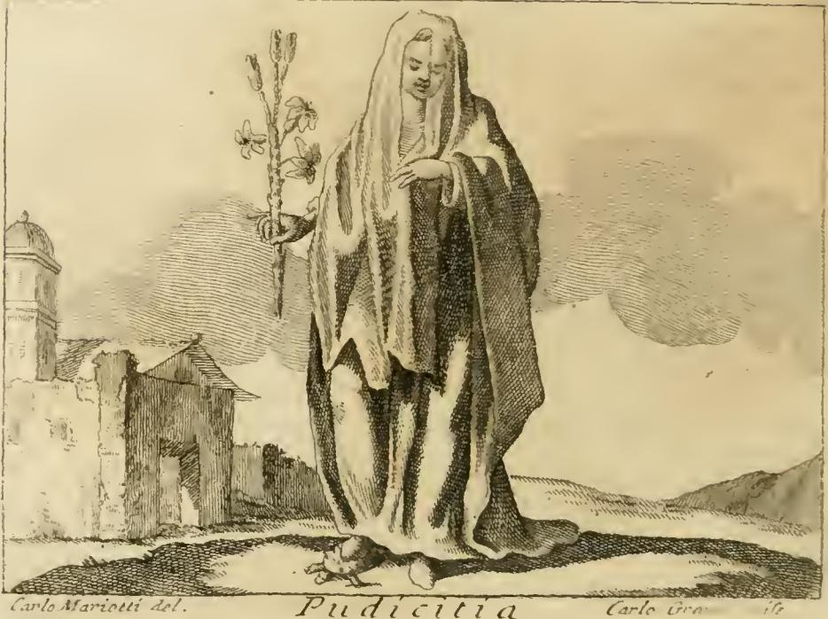

# 정숙(Pudicizia) 도상에서 베일이 뜻하는 것



*체사레 리파 『이코놀로지아』(1760년대 페루자판) 「PUDICIZIA」 항목의 판화. 흰 옷을 입은 소녀가 머리에서 허리까지 흘러내리는 흰 베일을 쓰고, 오른손에 흰 백합을 들고 오른발 아래 거북을 밟고 있다.*

---

## 1. 도상 전체 구성 속에서의 베일

리파의 첫 번째 「Pudicizia」 정의는 다음과 같다.

> "Una Giovanetta vestita di bianco. In testa abbia un velo dell'istesso colore, che le cuopre la faccia fino alla cinta. Colla destra mano tenga un giglio parimente bianco, e sotto il piede destro una Testugine."
> (흰 옷을 입은 소녀. 머리에는 같은 색 베일을 써서 **얼굴부터 허리까지** 덮는다. 오른손에는 역시 흰 백합을, 오른발 아래에는 거북을 둔다.)

네 요소가 각각 논증 하나씩을 담당한다.

| 요소 | 의미 | 전거 |
|---|---|---|
| 흰 옷 | 삶의 순수·완전성 | 전도서 9:8 "In omni tempore candida sint vestimenta tua" |
| **베일** | **아름다움을 감춤 = 시선의 유혹 기회 제거** | **테르툴리아누스, 로마 혼례, 바울** |
| 흰 백합 | 정결·처녀성의 꽃 | 히에로니무스 『아드베르수스 요비니아눔』, 아가 2:16 "pascitur inter lilia" |
| 발밑의 거북 | 집을 지고 다님 = 여인은 집 안에 머묾 | 피디아스의 조상(彫像), 투키디데스(플루타르코스 『부부 훈계』 경유) |

베일은 이 네 요소 가운데 리파가 가장 길게, 가장 많은 전거를 동원해 논증하는 항목이다.

---

## 2. 리파가 든 베일의 근거 — 원문의 논리

> "Si fa velata... perciocché la Donna pudica deve **celare la bellezza della sua persona, e levare l'occasione agli occhi**, i quali sono cagione il più delle volte di contaminare la pudicizia."

핵심 논리는 **"시선이 정숙을 오염시키는 주요 원인이므로, 아름다움을 감춤으로써 눈에게서 기회(occasione)를 빼앗는다"**는 것이다. 베일은 소극적 은폐가 아니라 **선제적 방어 장비**다. 그래서 다음 문장에서 곧바로 군사적 은유가 등장한다.

---

## 3. 테르툴리아누스 『De virginibus velandis』 — 라틴 원문

리파의 "armatura di timor d'infamia e pudicizia, bastione di modestia, muro del sesso femminile, il quale non è passato dagli occhi di altrui"는 『처녀들의 베일에 관하여』 **16장**의 유명한 명령문을 이탈리아어로 옮긴 것이다.

> **"Indue armaturam pudoris, circumduc vallum verecundiae, murum sexui tuo strue, qui nec tuos emittat oculos nec admittat alienos."**
> (수치의 갑옷을 입고, 겸양의 방벽을 둘러치고, 네 성(性)을 위한 성벽을 쌓아라 — **네 눈을 밖으로 내보내지도, 남의 눈을 안으로 들이지도 않는** 성벽을.)
>
> — Tertullianus, *De virginibus velandis* 16

세 은유가 정확히 대응한다.

- `armatura(m) pudoris` → "수치를 두려워하는 마음의 갑옷"
- `vallum verecundiae` → "겸양의 보루(堡壘)"
- `murum sexui tuo` → "여성의 성벽"

**주의할 점**: 리파의 "il quale non è passato dagli occhi di altrui"는 라틴어 관계절 `qui nec tuos emittat oculos nec admittat alienos`의 축약이다. 원문은 **양방향** — 안에서 나가는 시선까지 막는다 — 인데, 리파는 "남의 눈이 뚫지 못하는" 쪽만 남겼다. 이 축약 때문에 리파의 논지가 "타인의 시선 차단"으로 단순화된다.

같은 책 **17장**에는 베일의 규격이 나온다.

> **"Quantum resoluti crines occupare possunt, tanta est velaminis regio, ut cervices quoque ambiantur."**
> (풀어 내린 머리카락이 덮을 수 있는 만큼이 베일의 영역이며, 목까지도 감싸야 한다.)

리파는 이 대목을 받아 "머리카락을 풀었을 때 닿는 길이만큼 베일이 덮어야 한다"고 옮기면서, 목(cervices)이 아니라 **허리(cintura)까지** 확장한다. 도상의 판화가 실제로 허리까지 내려오는 베일을 그린 근거다. 즉 리파는 테르툴리아누스의 규정을 "도상으로 알아볼 수 있는 형태"로 한 단계 과장한 셈이다.

리파는 또 테르툴리아누스 『De corona militis』 4장도 인용한다.

> "Apud Iudaeos tam sollemne est feminis eorum velamen capitis, ut inde dignoscantur."
> (유대인들에게 여인의 머리 가림은 너무나 관례적이어서, 그것으로 그들을 식별할 수 있다.)

그리고 항목 끝에서 독자를 원전으로 돌려보낸다: "Chi desidera più cose intorno al velo, legga il Trattato di Tertulliano, *de Velandis Virginibus*."

---

## 4. 로마 혼례의 flammeum과 nubere → nuptiae 어원

리파: "Le Spose Romane, per segno di pudicizia, eziandio nello stesso giorno che andavano a Marito, si velavano il capo."

### 4-1. 리파가 인용한 페스투스

리파의 OCR 훼손된 "in Selio Pompeo"는 **섹스투스 폼페이우스 페스투스**(Sextus Pompeius Festus, 『De verborum significatione』)를 가리킨다. 인용문은 다음 항목이다.

> **"Obnubit, caput operit; unde et nuptiae dictae a capitis opertione."**
> (obnubit는 '머리를 덮는다'. 여기서 nuptiae라는 말도 **머리를 덮음**에서 나왔다.)

페스투스는 또 아엘리우스와 킨키우스의 설명을 전한다: nuptiae는 **flammeo caput nubentis obvolvatur** — 신부의 머리를 flammeum으로 감쌌기 때문이며, 고대인은 그것을 `obnubere`라 불렀다.

### 4-2. 바로

> **"Neptunus, quod mare terras obnubuit ut nubes caelum, ab nuptu, id est opertione, ut antiqui, a quo nuptiae, nuptus dictus."**
> — Varro, *De lingua Latina* 5.72

바로는 넵투누스를 설명하면서 같은 어근을 쓴다: `nuptus` = `opertio`(가림). 여기서 `nuptiae`(혼인), `nupta`(신부)가 파생된다.

### 4-3. flammeum

- **flammeum**: 불꽃색(주황~적황)의 큰 혼례 베일. 로마 신부 복장에서 가장 상징성이 큰 물건이었다.
- 신부가 되는 것 자체가 `nubere viro`, 즉 **"남자를 향해 베일을 쓰는 것"**으로 표현되었다. 라틴어에서 "결혼하다"라는 동사가 곧 "베일 쓰다"인 것이다.
- flammeum은 색만 다를 뿐 `rica`/`ricinium`과 같은 종류였고, 이는 **flaminica Dialis**(플라멘 디알리스의 아내)의 복장이기도 했다. flaminica는 이혼이 불가한, 영구적 `nova nupta` 상태였다.

**언어학적 유보**: `nubere` ↔ `nubes`(구름) 연결은 고대의 어원 해석이며, 오늘날에는 `nubere`를 '가리다/시집가다' 계열(*sneubh-)로 보고 `nubes`와의 관계는 논쟁적이다. 다만 리파에게 중요한 것은 **로마인 스스로가 혼인을 '가림'으로 이해했다는 사실** 자체다.

### 4-4. 리파가 덧붙인 로마 일화들

- **Barnabé Brisson**(il Brissonio) 『De ritu nuptiarum』을 상세 논의의 출처로 지시한다.
- **포파이아 사비나**(네로의 아내): "ancorché impudica fosse, per parer pudica, compariva in pubblico velata" — 부정한 여자였지만 정숙해 보이려고 베일을 쓰고 공적으로 나타났다. (타키투스 『연대기』 13.45: 얼굴 일부를 가려 사람들의 시선을 채워주지 않았다.)
- **가이우스 술피키우스 갈루스**: 아내가 얼굴을 드러내고 밖에 나갔다는 이유로 이혼했다. (발레리우스 막시무스 6.3.10)
- **여신 Pudicitia의 화폐 도상**: 하드리아누스의 아내 **사비나**, **헤렌니아**(에트루스킬라, 리파 판본 OCR "Pierennia"), **마르키아 오타킬리아 세베라**의 메달에 `PUDICITIA AUG` 명문과 함께 **얼굴을 가린 여신**이 새겨졌다. → 리파의 판화 자체가 고대 화폐 도상의 계승임을 주장하는 근거.
- **그리스**: 무사이오스의 헤로, 호메로스의 페넬로페, 『일리아스』 3권의 헬레네("Protinus autem candidis operta velis ferebatur e domo" — 흰 베일을 쓰고 집에서 나왔다).

---

## 5. 고린도전서 11:5-6의 문맥

리파: "Alle Donne poi Cristiane S. Paolo a' Corinti comandò, che orassero col capo velate."

불가타 원문(리파 인용 그대로):

> **"Omnis autem mulier orans aut prophetans non velato capite, deturpat caput suum: unum enim est ac si decalvetur. Nam si non velatur mulier, tondeatur. Si vero turpe est mulieri tonderi aut decalvari, velet caput suum."** (1Cor 11:5-6)
>
> (머리를 가리지 않고 기도하거나 예언하는 여인은 자기 머리를 부끄럽게 한다. 이는 머리를 밀린 것과 마찬가지다. 여인이 가리지 않겠다면 머리를 깎으라. 그러나 여인에게 깎이거나 밀리는 것이 부끄러운 일이라면, 머리를 가려라.)

**문맥상 유의점** — 리파는 이 구절을 "정숙 = 은폐"의 증거로 단선적으로 쓰지만, 바울의 원래 논증은 더 복잡하다.

1. 11:3의 **머리(κεφαλή) 위계** 논증에서 출발한다 — 베일은 성적 방어 장비가 아니라 창조 질서의 표지다.
2. 11:5-6은 **귀류법**이다: "가리지 않으려면 아예 삭발하라, 삭발이 수치라면 가려라." 논리는 수치의 등가성에 걸려 있다.
3. 11:10의 "propter angelos"(천사들 때문에)는 고대부터 해석이 갈리는 난문이다.
4. 11:15는 **긴 머리 자체가 이미 여인에게 주어진 covering(peribolaion)**이라고 말한다 — 천 베일 필수론과 긴장 관계에 있다.
5. 무대는 **예배 중의 기도·예언**이며, 거리에서의 일상 복장 규범이 아니다.

즉 바울의 관심은 전례 질서인데, 리파는 이를 **정숙의 시각적 표지**로 재배치한다. 흥미롭게도 테르툴리아누스 17장의 "풀어 내린 머리카락이 덮는 만큼"이라는 규격은 고린도전서 11:15(머리카락 = 자연의 베일)를 천 베일의 **치수 기준**으로 전용한 것으로, 리파는 이 이미 가공된 해석을 그대로 물려받는다.

리파는 여기에 교회 전승을 하나 더 얹는다: **베드로**가 모든 여인이 베일을 쓰고 성전에 들어오도록 명했고, 후계자 **리누스 교황**이 이를 시행했다(플라티나 『교황전』). 역사적 근거는 없는 후대 전승이지만, 리파에게는 "사도 → 교황 → 교회법"의 연속성을 만들어주는 고리다.

---

## 6. 리파는 이 전거들을 어떻게 하나의 논증으로 엮는가

리파의 서술 순서 자체가 논증 구조다.

```
[1] 원리   여인은 아름다움을 감추어 "눈들의 기회"를 없애야 한다
             ↓
[2] 신학   테르툴리아누스: 베일 = 갑옷 / 보루 / 성벽   (왜 필요한가 — 방어)
             ↓
[3] 규격   테르툴리아누스 17장: 풀어 내린 머리 길이만큼 → 허리까지   (얼마나 — 도상 치수)
             ↓
[4] 이교   로마 여신 Pudicitia 화폐 도상: 얼굴을 가린 모습        (형태의 고대적 권위)
             ↓
[5] 어원   nubere/obnubere = 가림 → nuptiae   (언어 자체가 증언한다)
             ↓
[6] 사례   포파이아 · 술피키우스 갈루스 · 헤로 · 페넬로페 · 헬레네 · 유대 여인
             ↓
[7] 계시   바울 1Cor 11 → 베드로 → 리누스 교황   (율법이 되어 확정)
```

논증 전략의 특징:

- **삼중 권위의 합류**: 그리스도교 교부(테르툴리아누스) + 이교 로마·그리스(화폐·어원·일화) + 성경(바울)이 **같은 결론**에 도달하므로, 베일의 정숙 의미는 특정 종파의 규율이 아니라 **인류 보편의 자연법적 진리**로 제시된다. 리파의 전형적 수법이다.
- **어원학을 물증으로 쓴다**: `nuptiae`가 '가림'에서 나왔다는 것은, 로마인이 **혼인 자체를 베일로 정의했다**는 뜻이다. 관습의 우연이 아니라 언어에 화석화된 필연이라는 주장. 이것이 리파 논증에서 가장 강한 카드다.
- **반례를 흡수한다**: 포파이아 사비나는 **부정했으나** 베일을 썼다. 베일이 정숙을 보증하지 못하는 사례인데, 리파는 이를 반증이 아니라 "정숙해 **보이려면** 반드시 베일이 필요했다"는 증거로 뒤집는다 — 즉 베일 = 정숙의 **필수 기호**임을 강화하는 데 쓴다.
- **기호와 실체의 등치**: 테르툴리아누스의 은유(갑옷·성벽)에서 베일은 실제 **작동하는 도구**다. 화폐 도상에서 베일은 **표상**이다. 리파는 이 둘을 구별하지 않고 겹쳐 놓아, 베일이 정숙을 *보호하면서 동시에 지시하는* 이중 기능을 갖게 만든다. 이것이 도상학이라는 장르에 필요한 조작이다.
- **거북과의 상보 관계**: 베일이 "몸 위의 벽"이라면, 발밑 거북은 "집이라는 벽"이다("여인의 이름과 몸은 집의 담장 안에 담겨 있어야 한다" — 투키디데스). 두 상징이 같은 봉쇄 논리를 각각 신체 규모와 사회 규모에서 반복한다.

---

## 7. 항목의 다른 판본(참고)

리파는 같은 항목 아래 Pudicizia의 변형을 더 제시하는데, 베일이 계속 등장한다.

- **제2형**: 흰 옷 + 오른손에 **흰 담비(armellino)** + 얼굴에 베일. 담비는 몸을 더럽히지 않으려 죽음을 택하는 동물. 여기서는 베일의 기원을 **페넬로페**에게 돌린다 — 아버지의 만류와 오디세우스에 대한 사랑 사이에서, 겸양 때문에 뜻을 드러내지 못하고 **얼굴을 가린 채 침묵했다**. 즉 베일 = 말할 수 없는 것을 표시하는 침묵의 기호.
- **제3형**: 초록 옷 + 금과 토파즈 목걸이를 한 담비. 페트라르카 『정결의 승리』의 "In campo verde un candido ermellino" 인용. 초록은 그리스도가 약속한 상(賞)에 대한 **희망**.

---

## 핵심 정리

- 베일 = **정숙한 여인이 자기 아름다움을 감추어, 정숙을 오염시키는 주된 원인인 "눈"에게서 유혹의 기회를 박탈하는 장치**.
- 테르툴리아누스 『De virginibus velandis』 16: `Indue armaturam pudoris, circumduc vallum verecundiae, murum sexui tuo strue` — 갑옷 · 보루 · 성벽.
- 같은 책 17: 베일 길이 = 풀어 내린 머리카락이 덮는 범위(리파는 허리까지 확장).
- 로마 신부는 flammeum으로 머리를 가렸고, 페스투스 `Obnubit, caput operit; unde et nuptiae dictae a capitis opertione` / 바로 `ab nuptu, id est opertione, a quo nuptiae` — **혼인을 뜻하는 말 자체가 '가림'에서 나왔다**.
- 바울 1Cor 11:5-6: 가리지 않고 기도·예언하는 여인은 삭발한 것과 같다 → 머리를 가려라.
- 리파의 수법: 교부 · 이교 고전 · 성경이 모두 같은 결론에 이르게 배열해, 베일의 의미를 보편 진리로 승격시킨다.
