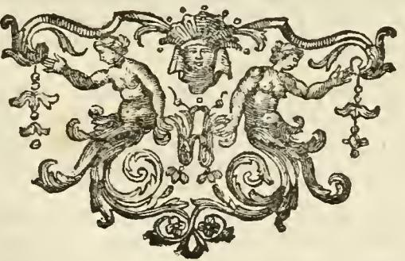
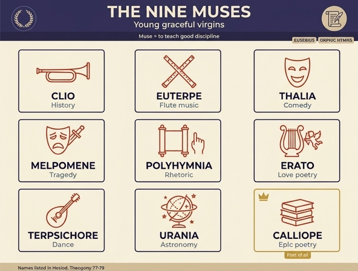

# 무사(Muse) 여신들 — 도상과 이름의 뜻

## 1. 카드 요약

리파의 『이코놀로지아』 제4권 「MUSE」 항목은 무사들을 이렇게 시작한다.

> "Furono rappresentate le Muse dagli antichi, giovani, graziose, e vergini"
> (고대인들은 무사들을 젊고, 우아하며, 처녀인 모습으로 표현했다)

세 가지 요소가 카드의 뼈대다.

1. **모습**: 젊고 우아한 처녀 — 남성적 정념(에로스)에 물들지 않는 순결함.
2. **이름의 뜻**: 에우세비우스에 따라 "정직하고 좋은 규율을 가르치다"는 뜻의 그리스어 동사에서 유래.
3. **아홉 명단**: 클리오, 에우테르페, 탈리아, 멜포메네, 폴림니아, 에라토, 테르시코레, 우라니아, 칼리오페.

---

## 2. "젊고 우아한 처녀" — 플라톤 에피그램의 근거

리파는 무사들이 처녀로 그려지는 근거를 디오게네스 라에르티오스가 전하는 **플라톤의 에피그램**(『그리스 명시선집』 Anthologia Graeca 9.39로도 전해짐)에서 찾는다. 리파가 인용한 라틴역은 다음과 같다.

> *Haec Venus ad Musas: Venerem exhorrescite, Nymphae, / Armatus vobis aut Amor insiliet.*
> *Tunc Musae ad Venerem: Lepida haec joca tolle precamur, / Aliger huc ad nos non volat ille [puer].*

- 베누스: "님프들아, 베누스를 두려워하라. 그러지 않으면 무장한 아모르(에로스)가 너희에게 덤벼들 것이다."
- 무사들: "그런 시시한 농담은 거두시길. 그 날개 달린 아이는 우리에게는 날아오지 않습니다."

즉 무사의 처녀성은 단순한 나이 설정이 아니라 **학문·규율의 영역은 정욕이 침범하지 못한다**는 알레고리다. 유일한 예외가 에라토인데, 그녀는 사랑의 시를 관장하므로 리파도 그 옆에만 활·화살통·횃불을 든 날개 달린 쿠피도(Amorino)를 세운다.

## 3. 이름의 어원 — 에우세비우스와 오르페우스 찬가

리파의 원문:

> "Ed Eusebio nel libro della preparazione evangelica, dice esser chiamate le Muse dalla voce Greca [μυέω], che significa istruire di onestà, e buona disciplina, onde Orfeo ne' suoi Inni canta, come le Muse hanno dimostrata la Religione, ed il ben vivere agli Uomini."

두 전거를 정리하면,

| 전거 | 내용 |
|---|---|
| **에우세비우스 『복음의 준비』**(Praeparatio evangelica) | Μοῦσαι를 그리스어 **μυέω**(myeō, "입문시키다·비의를 가르치다")에서 파생시킨다. 리파는 이를 "정직함과 좋은 규율을 가르치다(istruire di onestà e buona disciplina)"로 옮겼다. |
| **오르페우스 찬가**(오르페우스교 찬가 76번 「무사들에게」) | 무사들이 인간에게 **종교(Religione)와 바른 삶(il ben vivere)**을 보여주었다고 노래한다. |

핵심: 리파의 무사는 "영감을 주는 뮤즈"라기보다 **가르치는 교사(教師) 여신**이다. 어원 μυέω도, 오르페우스 찬가의 내용도 모두 '교육'으로 수렴한다. (고전 문헌학에서 더 널리 받아들여지는 어원은 인도유럽어 어근 *men-, 즉 '생각·기억'에서 온 것으로 보는 설이며, 어머니가 기억의 여신 므네모시네인 점과 맞물린다. 에우세비우스식 μυέω 어원은 후대의 교훈적 재해석이다.)

## 4. 아홉 이름 — 헤시오도스 『신들의 계보』 77–79행

아홉 무사의 이름 목록의 정본은 헤시오도스다.

> Κλειώ τ' Εὐτέρπη τε Θάλειά τε Μελπομένη τε
> Τερψιχόρη τ' Ἐρατώ τε Πολύμνιά τ' Οὐρανίη τε
> Καλλιόπη θ'· ἡ δὲ προφερεστάτη ἐστὶν ἁπασέων.
> — 헤시오도스, 『신들의 계보』(Theogonia) 77–79

즉 "클레이오, 에우테르페, 탈레이아, 멜포메네, / 테르프시코레, 에라토, 폴림니아, 우라니아, / 그리고 칼리오페 — 그녀가 모두 중에 가장 뛰어나다."

리파의 나열 순서는 헤시오도스와 거의 같지만 **폴림니아의 자리가 다르다**.

- 헤시오도스: … 멜포메네 → **테르프시코레 → 에라토 → 폴림니아** → 우라니아 → 칼리오페
- 리파: … 멜포메네 → **폴림니아 → 에라토 → 테르시코레** → 우라니아 → 칼리오페

리파는 개별 항목 서술도 이 자기 순서대로 배치했다. 마지막이 칼리오페인 것은 공통이며, 헤시오도스가 "가장 뛰어나다(προφερεστάτη)"고 한 대목을 리파도 이어받아 칼리오페의 이마에 **황금 고리**를 씌운다("secondo Esiodo è la più degna, e la prima tra le sue compagne").

---

## 5. 아홉 무사 정리표 (리파 본문 기준)

| 무사 | 이름의 뜻·어원 (리파의 설명) | 관장 분야 | 핵심 지물 |
|---|---|---|---|
| **클리오** Clio | κλείω(칭송하다) 또는 κλέος(영광·명성). 코르누투스를 인용해 "시인이 학자들 사이에서 얻는 영광", 또 "시인에게 칭송받는 이들이 받는 영광" | 역사(Storia) | 월계관, 오른손에 **트럼펫**, 왼손에 겉면에 *HERODOTUS*라 쓴 책 |
| **에우테르페** Euterpe | "즐겁고 유쾌한(gioconda, dilettevole)" — 라틴어로 *bene delectant*. 디오도로스 시켈로스 인용. 좋은 학식에서 오는 즐거움 | 관악(티비아). 일부는 변증술(Dialettica)로 봄 | 여러 꽃을 엮은 화관, 두 손에 **여러 관악기(tibie)** |
| **탈리아** Thalia | (리파는 어원 대신 코미디 귀속을 서술; 그리스어 θάλλω '피어나다·번성하다' 계열) | 희극(Commedia) | 담쟁이(edera) 화관, 왼손에 **우스꽝스러운 가면**, 발에 **소키**(socci, 희극 배우의 낮은 신) |
| **멜포메네** Melpomene | μολπή(molpe) = 노래·가락. 청중을 감미롭게 하는 노래의 발명자로도 전해짐 | 비극(Tragedia) | 무거운 표정·복장, 화려한 머리장식, 왼손에 높이 든 **왕홀과 왕관** + 땅에 내던져진 왕홀·왕관, 오른손에 **뽑아 든 단검**, 발에 **코투르누스**(coturni, 비극 배우의 높은 신) |
| **폴림니아** Polyhymnia | πολύ + μνεία = **"많은 기억"**. 수사학이 발명·배열·기억·발화(pronuntiatio)를 쓰기 때문 | 수사학(Rettorica) | 연설하는 자세로 오른손 **집게손가락을 치켜듦**, 진주·보석 머리장식, 온통 **흰옷**, 왼손에 *SUADERE*(설득하다)라 쓴 두루마리 |
| **에라토** Erato | ἔρως(사랑). 오비디우스 『사랑의 기술』 2권 "Nunc Erato, nam tu nomen amoris habes" | 사랑의 시(cose amorose) | **미르테와 장미** 관(베누스의 식물), 왼손에 **리라** + 다른 손에 **플렉트럼**, 옆에 횃불·활·화살통을 든 **날개 달린 쿠피도** |
| **테르시코레** Terpsichore | (θέρπω/τέρπω '즐기다' + χορός '춤'. 리파는 "무용을 관장한다"로만 서술) | 무용(balli) | **체트라**(cetra)를 연주하는 자세, **까치(gazza) 깃털**이 섞인 여러 색 깃털 화관, 우아하게 춤추는 자세 |
| **우라니아** Urania | οὐρανός(하늘) — 라틴어로 *caelestis*. "학자들을 하늘로 들어올린다"는 해석도 | 천문·점성술(Astrologia) | **별들의 관**, **하늘색(azzurro) 옷**, 손에 천구(sfere celesti)를 나타내는 **구체** |
| **칼리오페** Calliope | καλὴ ὄψ = **"아름다운 목소리"**. 호메로스는 그녀를 *Deam clamantem*(외치는 여신)이라 부름 | 영웅시·서사시(verso eroico) | 이마의 **황금 고리**(가장 으뜸이라는 표지), 왼팔에 여러 개의 **월계관**, 오른손에 *Odissea / Iliade / Eneide* 제목이 적힌 **세 권의 책** |

### 리파가 인용한 시행 (위(僞)베르길리우스 『무사들에 관하여』 *Opusculum de Musis*)

리파는 아홉 무사의 소관을 각각 다음 육행시로 뒷받침한다.

- Clio: *Clio gesta canens transacti tempora reddit.*
- Euterpe: *Dulciloquis calamos Euterpe flatibus urget.*
- Thalia: *Comica lascivo gaudet sermone Thalia.*
- Melpomene: *Melpomene tragico proclamat maesta boatu.*
- Polyhymnia: *Signat cuncta manu, loquitur Polyhymnia gestu.*
- Erato: *Plectra gerens Erato saltat pede, carmine, vultu.*
- Terpsichore: *Terpsichore affectus citharis movet, imperat, auget.*
- Urania: *Urania caeli motus scrutatur et astra.*
- Calliope: *Carmina Calliope libris heroica mandat.*

리파는 이 시행들이 **풀비오 오르시니(Fulvio Orsini)의 『로마인의 가문들』(de Familiis Romanorum)에 실린 폼포니아 씨족(Gens Pomponia) 메달의 무사 도상**과 일치한다고 덧붙이고, 더 읽을 것으로 **플루타르코스 『향연 담화』 제9권 문제 14**를 지목한다.

---

## 6. 리파가 함께 제시한 세 종의 변형 도상

「MUSE」 항목의 특징은 **표준 도상 뒤에 세 벌의 다른 계열을 나란히 붙였다**는 점이다. 즉 리파는 "정답 하나"를 주장하지 않고 전거별 차이를 그대로 보여준다.

| 계열 | 출처 | 표준본과 다른 점(예) |
|---|---|---|
| ① 고대 메달 계열 | 빈첸치오 델라 포르타(Vincenzio della Porta)의 고대 메달 | **에라토가 리라**, **폴림니아가 바르비톤과 펜**, 우라니아는 콤파스로 원을 그리지만 "차라리 구체를 드는 것이 더 좋다", **칼리오페는 두루마리** |
| ② 회화 계열 | 피렌체 신사 프란체스코 보나벤투라 소장 회화 | **탈리아가 두루마리**, **멜포메네가 가면**, **테르시코레가 하프**, **에라토가 직각자(squadro)**, 칼리오페는 책 |
| ③ 정원 프레스코 계열 | 페라라 추기경의 몬테 카발로 정원 | 가면이 여러 무사에게 흩어져 있음. **에우테르페가 두 손으로 가면**, **탈리아는 뿔 달린 가면 + 코르누코피아 + 바닥에 쟁기**, 멜포메네는 가면과 트럼펫, **우라니아는 흰 서판과 거울** |

교훈: 무사의 "지물 세트"는 근세에도 고정되어 있지 않았다. 오늘날 교과서적으로 외우는 조합(클리오=트럼펫/역사서, 우라니아=천구 등)은 리파가 첫머리에 제시한 **표준본**에 해당한다.

---

## 7. 도판으로 보기

### 무사와 세이렌 — 노래 경연의 패자

이 챕터에서 「MUSE」 바로 앞에 놓인 **세이렌(Sirene)** 판화는 무사 항목과 직접 이어진다.

- 그림 속 세 처녀는 하반신이 물고기이고, 각각 **피페·플루트를 입에 대고**, **리라를 켜며**, **노래하는 자세**를 취한다. 뒤편 배에는 잠들거나 물로 떨어지는 선원들이 보인다. 무사와 똑같이 "젊은 처녀 + 악기"인데, 그 음악의 목적이 **가르침이 아니라 파멸**이라는 점만 반대다.
- 리파는 세이렌의 계보를 소개하며 이들이 **칼리오페**의 딸, 혹은 **테르시코레**의 딸, 혹은 **멜포메네**의 딸이라는 여러 전승을 나열한다. 무사와 세이렌은 혈연으로 얽힌 대칭쌍이다.
- 그리고 **테르시코레** 항목에서 리파는 그녀의 깃털 화관을 설명하며, 파우사니아스 『그리스 안내기』 제9권을 근거로 **무사들이 노래로 세이렌을 이겨 그 깃털을 전리품(trofeo della vittoria)으로 삼았다**고 적는다. 이어 오비디우스 『변신 이야기』 제5권의 이야기 — 피에로스와 에우이페의 아홉 딸이 무사에게 도전했다가 **까치(gazza)로 변했다** — 를 덧붙인다. 그래서 테르시코레의 화관에는 **까치 깃털**이 섞여 있다.

즉 이 세이렌 도판은 카드의 "무사는 인간에게 종교와 바른 삶을 가르쳤다"라는 명제의 **거울상**으로 읽으면 된다. 같은 처녀·같은 악기, 정반대의 효과.

### 「MUSE」 항목 마무리 장식

리파의 무사 항목은 개별 초상 판화 대신 이런 **장식 컷(vignette)**으로 마감된다. 좌우 두 여성 반신상이 아칸서스 넝쿨로 이어지고, 중앙에는 **가면(mascherone)**이 걸려 있다. 가면은 본문에서 탈리아(희극 가면)와 멜포메네(비극 가면)의 표지이자, 위 ③번 계열에서 여러 무사에게 나누어 주어진 지물이다. 처녀 형상 + 가면의 조합이 곧 이 항목의 압축된 상징이라 볼 수 있다.

---

## 8. 암기 정리

- **모습**: 젊고 우아한 **처녀** (플라톤 에피그램 — 에로스는 무사에게 날아오지 않는다).
- **어원**: 에우세비우스 『복음의 준비』 → 그리스어 **μυέω** = "정직함과 좋은 규율을 **가르치다**".
- **역할**: 오르페우스 찬가 → 인간에게 **종교와 바른 삶**을 가르쳤다.
- **명단(헤시오도스 『신들의 계보』 77–79)**: 클리오 · 에우테르페 · 탈리아 · 멜포메네 · (테르시코레·에라토·)폴림니아 · 우라니아 · **칼리오페(으뜸)**.
- 지물 3개만 확실히: **클리오=트럼펫+헤로도토스**, **멜포메네=단검+코투르누스**, **우라니아=별관+천구**.

## 인포그래픽

