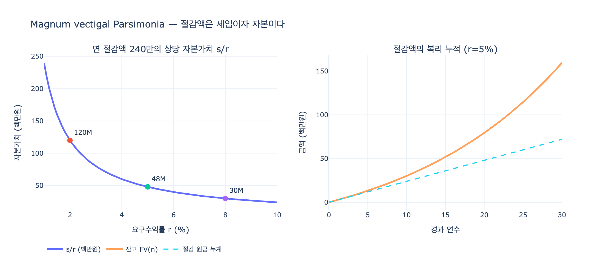

# 검약(PARSIMONIA)의 가치를 뒷받침하는 격언들

> **Q.** 검약의 가치는 어떤 격언들로 뒷받침되는가?

체사레 리파 『이코놀로지아』 제4권 **PARSIMONIA(검약)** 항목은 검약을 "**후덕(liberalità)의 두 주요 부분 중 하나**"로 규정하고, 그 가치를 라틴 격언과 고전 철학자들의 잠언으로 층층이 뒷받침한다.

판화에서 **장년(età virile)의 여인**이 **장식 없는 소박한 옷(abito semplice, senza ornamento alcuno)** 을 입고, **오른손에는 컴퍼스(compasso)** 를, **왼손에는 끈으로 묶인 돈주머니(borsa piena di denari legata)** 를 들고 있다. 오른쪽 위로 감기는 리본(cartella)에는 표어 **`SERVAT IN MELIUS`**(더 좋은 쪽으로 지킨다)가 적혀 있다. 배경은 텅 빈 들판과 앙상한 나무 한 그루뿐 — 화면 자체가 "불필요한 것이 없는 상태"를 연기한다.

---

## 1. 핵심 격언: *Magnum vectigal Parsimonia*

> **Magnum vectigal Parsimonia** — "검약은 큰 세입(稅入)이다."

`vectigal`은 로마에서 **국고로 들어오는 조세·공납 수입**을 뜻하는 단어다. 즉 검약은 미덕이기 이전에 **회계 항목**이라는 주장이다. 리파는 이어서 그 이유를 못 박는다.

> **"ottima risoluzione è per accrescere l'entrata, il riformar le spese"**
> — 지출을 개혁하는 것이 수입을 늘리는 최선의 방책이다.

(이 격언은 키케로 『스토아 철학의 역설』(*Paradoxa Stoicorum*) 계열로 널리 인용되며, 리파는 아래 아이스키네스의 일화와 붙여서 제시한다.)

## 2. 아이스키네스: "자기 자신에게서 이자를 받는다"

> **"Eschine Filosofo Socratico soleva avvertire, che da se stesso pigliava ad usura con lo sminuire la spesa, circa il vitto"**
> — 소크라테스학파 철학자 **아이스키네스**는, 식비 지출을 줄임으로써 **자기 자신에게서 이자를 받아 챙기고 있다**고 늘 말했다.

이것이 이 카드의 지적 핵심이다. 남에게 돈을 빌려주고 이자(usura)를 받는 것과, 내 지출을 깎아 그만큼을 남기는 것은 **현금흐름상 구별되지 않는다.** 따라서 검약가는 자기 살림을 상대로 **무위험 대금업(貸金業)** 을 하는 사람이다. → 이 등가성을 수치로 확인하는 것이 `expy.py`의 주제다.

## 3. 아리스토텔레스: 공동체 재정의 원칙

리파는 뮈레(Muret) 라틴역으로 아리스토텔레스를 인용한다.

> **"Primum quidem nosse oportet quantum ex quaque re Civitas capiat: Non esse debent sumptus, quos facit Civitas, ut quis supervacaneus extollatur..."**
> — 먼저 국가가 각 항목에서 **얼마를 걷는지 알아야** 하고, 국가가 하는 지출 중 **불필요하게 부풀려진 것이 있어서는 안 된다.**

> **"Opulentiores enim fiunt non ii modo, qui ad opes aliquid addant, sed ii quoque qui de sumptibus detrahunt."**
> — **부유해지는 것은 재산에 무언가를 더하는 자만이 아니라, 지출에서 덜어내는 자 또한 그러하다.**

리파는 이를 곧바로 가정 경제로 옮긴다: 가장(capi di famiglia)은 **① 먼저 자기 수입을 헤아리고 ② 그다음 가계 지출을 살펴 불필요한 것을 없애고 ③ 마땅한 정도를 넘는 것을 줄여야** 한다.

## 4. 보조 격언들

| 출처 | 라틴 원문 | 뜻 |
|---|---|---|
| 호라티우스 『풍자시』 2.3 | *Majorem censu(cerisa) define cultum* | 수입보다 큰 치장을 그만두라 — 초과 지출 금지 |
| 세네카 『마음의 평정에 관하여』 9장 | *…sine qua nullae opes sufficiunt, nec ullae satis patent* | **검약 없이는 어떤 재산도 충분하지 않고, 어떤 재산도 넉넉해 보이지 않는다** |
| 플루타르코스 『아폴로니오스에게』 | 사려(prudentia)의 네 규범: 재산을 **획득**·**보전**·**증대**·**현명하게 사용** | 검약은 이 중 **세 가지(보전·증대·현명한 사용)** 를 동시에 갖춘다 |
| 성 암브로시우스 (베르첼리 서신) | *Nihil tamen necessarium, quam cognoscere quod sit necessarium* | 무엇이 필요한지 아는 것만큼 필요한 것은 없다 |

## 5. 도상(圖像)의 논증 — 그림에서 확인할 것

- **장년의 여인**: 이 나이에 이르러 인간은 "이성을 담을 수 있게 되고 유익과 명예에 따라 행동한다"(*fatto capace di ragione, e opera secondo l'utile, e onore*). 검약은 젊음의 인색함이 아니라 **성숙한 판단**이다.
- **장식 없는 소박한 옷**: 검약이 "모든 헛되고 넘치는 지출로부터 멀리 있음"을 뜻한다. → 그림에서 여인의 옷에는 자수·보석·주름 장식이 전혀 없다.
- **컴퍼스(오른손, 높이 들려 벌어진 상태)**: **"모든 일에서의 질서와 척도(l'ordine, e misura in tutte le cose)."** 논거가 정확하다 — 컴퍼스는 **자기 원주 밖으로 한 점도 나가지 않는다(non esce punto dalla sua circonferenza)**. 그와 똑같이 검약은 **정직함과 합리성의 한도(il modo dell'onesto, e del ragionevole)를 넘지 않는다.** 즉 컴퍼스는 "적게 쓰라"가 아니라 **"정해진 반지름 안에서 쓰라"** 는 뜻이며, 검약이 인색(avarizia)이 아닌 이유가 여기 있다.
- **끈으로 묶인 돈주머니 + `SERVAT IN MELIUS`(왼손)**: **가진 것을 지키는 편이 없는 것을 얻는 것보다 더 큰 기량(industria)이자 명예(onore)** 임을 뜻한다. 주머니가 **열려 있지 않고 묶여 있다**는 점, 그리고 리본이 주머니 쪽에서 피어오른다는 점이 이 독법을 확정한다. 근거로 두 시인이 인용된다.
  - 클라우디아누스 『스틸리코 찬가』 2권: ***Plus est servasse repertum / Quam quaesisse decus novum*** — 찾아낸 것을 지킨 편이 새 영예를 구한 것보다 더 크다.
  - 오비디우스 『사랑의 기술』 2권: ***Non minor est virtus, quam quaerere, parta tueri. / Casus inest illic, hic erit artis opus.*** — 얻은 것을 지키는 것은 구하는 것에 못지않은 덕이다. **저쪽(획득)에는 우연이 끼어들지만, 이쪽(보전)은 기술의 작업이다.**

## 6. 한 줄 요약

검약은 ① *Magnum vectigal Parsimonia*(검약은 큰 세입) ② 아이스키네스의 "지출 절감 = 자기에게서 받는 이자" ③ 아리스토텔레스의 "덜어내는 자도 부유해진다"로 **수입 측면**에서 정당화되고, **컴퍼스**(한도 내의 절제)와 **돈주머니**(보전이 획득보다 큰 기량)로 **도덕 측면**에서 정당화된다.

## 시각화

`expy.py`는 아이스키네스·아리스토텔레스의 논지("절감액 = 세입/이자")를 수치로 검증한다: 연 절감액 $s$의 자본가치 $s/r$, 수입 증대와 지출 절감의 순저축 등가성, 절감액의 복리 누적.

