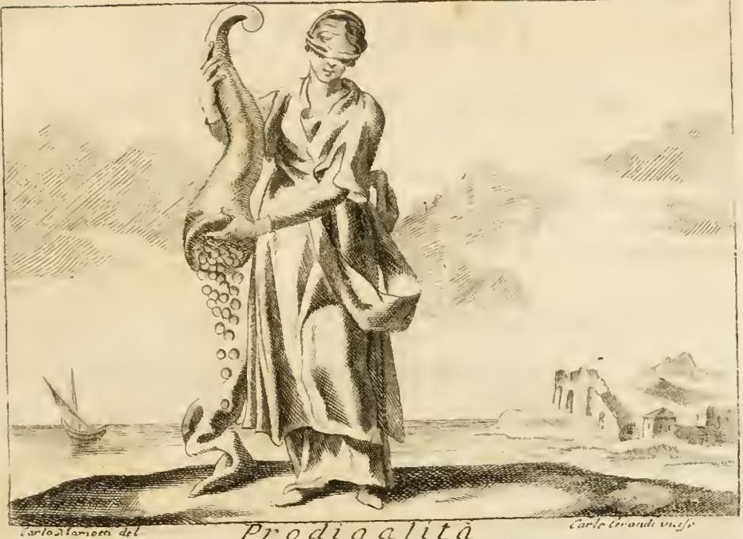

# 낭비(Prodigalità) — 하르피이아가 곁든 제2판본

## 카드 요점

리파의 『이코놀로지아』 "PRODIGALITÀ" 항목에는 **두 가지 도상**이 나란히 실려 있다. 카드가 묻는 것은 **두 번째(대안) 판본**, 즉 하르피이아 두 마리가 등장하는 쪽이다.

| | 제1판본 (Di Cesare Ripa) | **제2판본 (카드의 정답)** |
|---|---|---|
| 인물 | 눈을 가린(occhi velati) 웃는 얼굴의 여인 | 음탕한(lasciva) 여인, 값비싼 옷 |
| 머리 | — | 보석이 가득 박힌 아름다운 머리 장식, 부드럽게 풀어진 머리(crini molli) |
| 지물 | 두 손으로 코르누코피아를 들어 금과 값진 물건을 흩뿌림 | 옆에 찬 **두 개의 큰 돈주머니**에서 돈을 대부분 내던짐 |
| 수반물 | 없음 | **하르피이아 두 마리**가 그 돈을 **몰래**(nascostamente) 훔쳐 감 |
| 강조점 | 이성의 지도 없이 분별없이 주는 어리석음 | 낭비자 주변에 모여드는 기생 아첨꾼의 이중성 |

원문(제2판본):

> Donna lasciva, vestita riccamente, con bella acconciatura di testa piena di gioje, co' crini molli, come la descrive Dante, portando accanto due gran borse di danari, de' quali getti via gran parte. Si vedano ancora due Arpie, che le rubbino i danari nascostamente, per mostrare, che quelli, che stanno presso all' Uomo prodigo, mentre essi si occupa in gettar via le proprie facoltà, gli mostrano buona ciera, e gli fanno riverenza; il che nota la faccia femminile dell' Arpia, ma nell' intenzione lo sprezzano, come Uomo che avvilisce sè stesso, assomigliando la loro intenzione al resto del corpo di quello mostro, che è brutto, e puzzolente.

즉 리파 자신이 밝히는 해독은 **하르피이아의 신체가 둘로 쪼개져 두 가지 태도를 동시에 지시한다**는 것이다.

- **여자 얼굴(faccia femminile)** = 낭비자가 재산을 내던지는 동안 그 곁에 붙어 "좋은 낯빛을 보이고 절을 하는"(gli mostrano buona ciera, e gli fanno riverenza) 겉모습.
- **추하고 악취 나는 나머지 몸통(brutto, e puzzolente)** = 그 속내(intenzione). 그들은 낭비자를 "스스로를 비천하게 만드는 자"(Uomo che avvilisce sè stesso)로 경멸한다.
- **"몰래"(nascostamente) 훔친다** = 낭비자는 자기가 준다고 믿지만 실제로는 빼앗기고 있다. 폭력적 강탈이 아니라 눈치채지 못하게 낚아채는 것이 핵심이다.
- **두 개의 큰 돈주머니 / 두 마리 하르피이아**의 수 대응도 우연이 아니다. 던져지는 돈의 출처 하나하나에 기생자가 한 마리씩 붙어 있는 구도다.
- **음탕함 + 보석 장식 + 풀어진 머리**는 낭비를 사치·색욕과 한 계열로 묶는 표지다. 리파는 이 세부(특히 "crini molli")를 **단테**에게서 끌어왔다고 밝힌다.

## 판화는 어느 판본인가 — 제1판본이다

**중요: 이 항목에 붙은 유일한 삽화는 하르피이아 판본이 아니라 제1판본을 판각한 것이다.** 그림에서 실제로 관찰되는 요소는 다음과 같다.

- 여인의 **눈에 띠가 감겨 있다** → 제1판본의 "occhi velati / bendati gli occhi".
- 왼팔로 **거대한 코르누코피아**를 안고 있고, 그 입에서 **동전이 줄줄이 쏟아져 땅에 떨어진다** → 제1판본의 "tiene con ambe le mani un cornucopia, col quale sparge oro".
- **돈주머니도, 하르피이아도 화면에 없다.** 카드가 묻는 제2판본은 판각되지 않았고 텍스트로만 제시된 대안 도상이다.
- 배경 좌측 바다에 **작은 돛배**, 우측에 **허물어진 아치와 폐가**가 보인다. 각주의 P. 리치 판본이 "마른 나무는 재산을 흥청망청 쓴 자가 어떤 지경에 이르는지를 보여 준다"라고 말하는 것과 같은 방향의 파산·폐허 암시로 읽을 수 있다.
- 하단에 소묘가와 판각가의 서명, 그리고 표제 *Prodigalità*가 새겨져 있다.

그래서 이 카드는 "그림으로 확인할 수 없는, 글로만 남은 도상"에 해당한다. 하르피이아 두 마리를 머릿속에서 판화 좌우에 덧붙여 상상해야 한다.

## 하르피이아 신화 — 왜 '음식을 빼앗고 더럽히는' 괴물인가

리파는 별도로 「ARPIE」 항목(괴물 편)을 두고 신화를 정리한다. 원문 요지:

> 시인들은 하르피이아를 **더럽고 악취 나는 새(uccelli sporchi e fetidi)**의 형상으로 꾸며 냈고, 이들이 **피네우스 왕을 벌하기 위해** 세상에 보내졌다고 했다. 계모가 된 아내의 뜻에 따라 두 아들의 눈을 멀게 한 죄로 자신도 눈이 멀었는데, 이 새들이 그가 음식을 먹는 동안 **음식을 더럽히고 빼앗아 갔다**(l'imbrattavano, e toglievano le vivande). 뒤에 아르고나우타이가 그 왕을 도와 하르피이아를 이오니아 해의 **스트로파데스 제도**로 몰아냈다(아폴로니오스 로디오스).

- 어원 자체가 그리스어 **harpazein(빼앗다, 낚아채다)**이다. 헤시오도스 계열 전승에서 아엘로·오키페테 등 바람처럼 빠른 자매로 나온다.
- 리파의 텍스트는 피네우스를 "**아르카디아** 왕"이라 적지만, 통상 전승은 **트라키아** 왕이다(판본의 착오로 보아도 무리가 없다).
- **베르길리우스 『아이네이스』 3권**: 트로이인들이 스트로파데스에 상륙해 잔치를 벌이자 하르피이아가 덮쳐 음식을 오염시키고, 그중 하나(켈라이노)가 **굶주림의 불행한 예언**을 내린다. 리파도 "quella predicesse ai Trojani la venuta infelice, e i fastidj, che dovevano sopportare in pena di aver provato di ucciderle"라고 요약한다.
- **『아이네이스』 6권**에서 하르피이아는 "제우스의 개들(cani di Giove)", 지옥의 푸리아와 동일시된다("visaeque canes ululare per umbram").
- 리파는 **아리오스토 『광란의 오를란도』**(하르피이아가 세나포 왕의 식탁을 덮치는 대목)의 8행을 인용해 외형을 확정한다: 일곱 마리, **여자의 얼굴**이지만 창백하고 시들었으며, "긴 굶주림으로 야위었고", **크고 흉한 날개**, **탐욕스러운 손과 구부러진 갈고리 발톱**, **크고 악취 나는 배(grand'e fetido il ventre)**, **뱀처럼 감기는 긴 꼬리**. 리파가 낭비 항목에서 말하는 "brutto e puzzolente"는 바로 이 배·꼬리 쪽이다.
- 리파 「ARPIE」 항목의 마지막 문장이 결정적이다: **"이 새들은 영구한 굶주림을 지닌다고 하니, 탐욕가들과 같다(hanno perpetua fame, a similitudine degli Avari)."**

## '식탁 약탈자'에서 '기생 아첨꾼'으로의 전용 논리

하르피이아 신화가 왜 아첨꾼 알레고리로 정확히 갈아 끼워지는가 — 대응이 항목별로 맞물린다.

1. **남의 식탁에서 먹는 존재**: 하르피이아는 스스로 사냥해 먹지 않고 **피네우스·트로이인·세나포의 상에 차려진 것**을 덮친다. 이것이 그대로 기생자의 정의다(라틴어 *parasitus* < 그리스어 *parasitos*, "곁에서 먹는 자"). 낭비자의 열린 지갑은 곧 차려진 식탁이다.
2. **빼앗음의 방식이 '낚아채기'다**: harpazein은 강도의 정면 탈취가 아니라 순식간의 채감이다. 그래서 리파는 **nascostamente(몰래)**를 명시할 수 있다. 아첨꾼의 이득은 청구서가 아니라 알아채지 못한 유출로 발생한다.
3. **먹지 못한 것까지 오염시킨다**: 하르피이아는 빼앗는 데 그치지 않고 남은 음식을 배설물로 못 쓰게 만든다. 아첨꾼도 재산만 갉아먹는 것이 아니라 낭비자의 **판단과 명성까지 더럽힌다** — 같은 항목 각주가 "땅에 놓인 나팔은 낭비자의 **나쁜 평판**을 암시한다(la tromba per terra ombreggia la cattiva fama del Prodigo)"라고 못 박는 지점이다.
4. **굶주림이 끝나지 않는다**: "perpetua fame". 아첨꾼의 요구에는 포화점이 없으므로 낭비자의 재산은 반드시 바닥까지 간다.
5. **몸이 이미 둘로 쪼개진 기성 기호다**: 하르피이아는 **아름다운 여자 얼굴 + 혐오스러운 새 몸통**이라는, 겉과 속의 분열을 한 몸에 내장한 유일한 괴물류다. "겉으로 웃고 절하지만 속으로 경멸한다"는 아첨의 정의를 새 도상을 만들지 않고 그대로 실을 수 있는 그릇이었다. 리파는 이 분열을 **얼굴 = 겉의 예의, 몸통 = 진짜 의도(intenzione)**로 문자 그대로 배분한다.
6. **단테를 통한 낭비–하르피이아의 선행 결합**: 『지옥편』 13곡에서 하르피이아("ali late, e colli e visi umani, / piè con artigli, e pennuto il gran ventre")는 자살자의 숲에 둥지를 틀고 그 잎을 뜯어먹는데, 같은 원환(제7원 제2환)에 **자기 재산에 폭력을 행사한 자, 곧 낭비자(scialacquatori)**가 개들에게 찢기며 놓여 있다. 즉 "하르피이아 + 낭비"는 리파가 발명한 조합이 아니라 단테에게서 이미 구조적으로 붙어 있던 배치이며, 리파가 이 판본에서 굳이 "come la descrive Dante"라고 전거를 든 것도 그 계보 안에서 읽어야 한다.

## 리파 본편의 다른 하르피이아 용례

- **「ARPIE」(괴물 편)**: 위에서 본 신화 서술 항목. 리파 스스로 하르피이아를 **탐욕(Avari)**의 유비로 못 박고, 『아이네이스』 6권을 근거로 **푸리아/제우스의 개**와 동일시한다. 이 판본의 동물 색인에도 "Arpia"가 등재되어 있어, 하르피이아가 여러 항목에서 재사용되는 표준 지물임을 확인할 수 있다.
- **주의(자료 범위)**: 이 책의 asset은 알파벳 전체가 아니라 일부 구간(대략 P를 중심으로 한 권들과 괴물·무사이 편 등)만 수록한 발췌이므로, **Avarizia·Rapina 등 A·R 항목 본문은 이 자료 안에 없어 직접 대조가 불가능하다.** 하르피이아–탐욕의 연결은 위 「ARPIE」 항목 문장으로만 확인되며, "탐욕/강탈 계열에서 하르피이아가 쓰인다"는 진술은 그 근거 위에서만 안전하다.
- **낭비 항목 자체의 상호참조**: 리파는 낭비 항목 끝에 **"De' fatti, vedi Lusso"**(실례는 「사치」 항목을 보라)만 달아 두었다. 「LUSSO」는 왕관을 쓰고 관자놀이에 날개를 단 거인 남자로, 왼손의 코르누코피아로 초라한 오두막 위에 돈과 보석을 쏟으면서 오른손의 큰 망치로 화려한 궁전을 무너뜨리고, 발 앞에 꼬리를 펼친 공작을 둔다. 낭비를 사치·허영의 인접 개념으로 묶는 리파의 배치를 보여 준다.
- **P. 리치의 이설(같은 항목 각주)**: 한 손으로 머리의 장식을 모두 벗겨 남에게 주고, 다른 손으로 자기 옷을 벗기 시작하는 여인. 곁에 **마른 나무**와 마찬가지로 **말라 버린 고깃덩이**, 땅에는 **나팔**. 해독은 "자기에게 꼭 필요한 것을 벗어 남을 부유하게 하는 것이 낭비자의 광기", "마른 나무는 재산을 흥청망청 쓴 자의 결말", "땅의 나팔은 낭비자의 나쁜 평판".

## 암기용 압축

**"두 주머니 – 두 하르피이아 / 얼굴은 절, 몸통은 경멸."**
보석 머리 장식의 음탕한 여인이 두 개의 큰 돈주머니에서 돈을 내던지고, 하르피이아 두 마리가 몰래 그것을 훔친다. 여자 얼굴 = 곁에서 웃으며 절하는 낯, 추악하고 악취 나는 몸통 = "제 몸을 망치는 자"라 속으로 비웃는 속내.

## 참고

- 자료: `.fm/assets/17 Practice to Providence.md` (PRODIGALITÀ 항목 및 각주), `.fm/assets/08 Monsters and Muses.md` (ARPIE 항목), `.fm/assets/02 Letters to Lust.md` (LUSSO 항목)
- 판화: `fig-1.jpeg` = `.fm/assets/Iconologia (Cesare Ripa)/_page_424_Picture_3.jpeg` (제1판본 도상)
- 신화 전거: 베르길리우스 『아이네이스』 3권(스트로파데스, 켈라이노) · 6권, 아폴로니오스 로디오스 『아르고나우티카』 2권(피네우스), 아리오스토 『광란의 오를란도』(세나포 왕의 식탁), 단테 『지옥편』 13곡(자살자의 숲과 낭비자)
