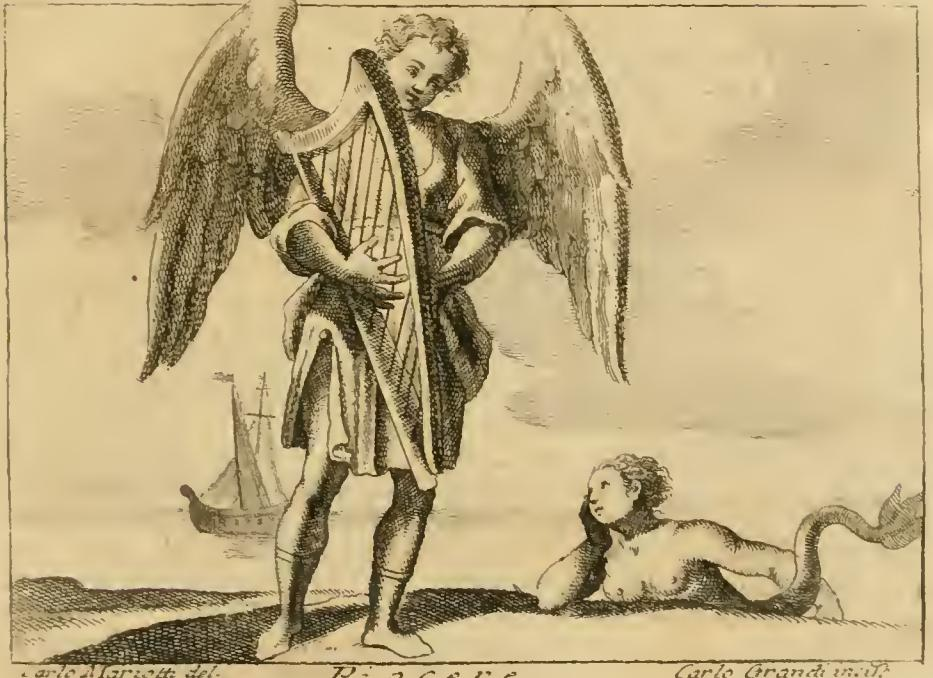

# 쾌락 (Piacere) — 체사레 리파의 의인화

## 카드 요약

**Q. 리파는 '쾌락(Piacere)'을 어떻게 의인화했는가?**

금빛 곱슬머리에 꽃과 진주를 꽂고 꽃핀 머틀(도금양) 화관을 쓴 **나체의 날개 달린 젊은이**. 날개는 여러 색이고, 손에는 **하프**를 들며, 발에는 **금 반장화**를 신는다.

위 판화(카를로 마리오티 그림, 카를로 그란디 판각)에서 실제로 확인되는 요소들:

- **커다란 두 날개**를 편 곱슬머리의 젊은이가 화면 중앙에 서 있다.
- 두 손으로 **하프(Arpa)** 를 안고 연주하고 있다.
- 오른쪽 아래 바다에는 **세이렌(Sirena)** 이 물고기 꼬리를 드러낸 채 그를 바라보고, 뒤편에는 **배 한 척**이 떠 있다 — 세이렌은 리파가 붙인 두 번째 '쾌락' 도상(초록 옷의 16세 소년)의 요소로, 판화가는 두 서술을 한 장면에 합쳐 놓았다. 세이렌이 노래로 뱃사람을 속이듯, 쾌락도 겉보기 달콤함으로 추종자를 파멸시킨다는 뜻이다.

## 각 속성의 의미 (리파 본문 근거)

원문은 이 장(章) 파일 "16 Perturbation to Poverty.md"의 PIACERE 항목(4권, Di Cesare Ripa)이다.

| 속성 | 의미 |
|---|---|
| **향내 나는 인공 곱슬머리** (chioma profumata e ricciuta con arte) | 유약함(delicatezza)·음탕함(lascivia)·여성적으로 유약한 풍속(effeminati costumi)의 표지. 시인들은 쾌락을 끊었음을 보이려고 일부러 머리를 손질하지 않고 내버려 둔다고 말했다 — 반대로 쾌락은 기교로 곱슬곱슬하게 말아 올린다. |
| **꽃과 진주(보석)** | 보석과 꽃은 쾌락의 "시종이자 자극제"(ministri e incitamenti al piacere). |
| **꽃핀 머틀 화관** (corona di mirto) | 머틀은 **베누스에게 봉헌된 나무**. 베누스가 파리스의 심판에 나설 때 머틀 관을 썼다고 전해진다. |
| **여러 색의 날개** | 쾌락은 **금세 끝나고 날아가 도망친다**는 뜻. 그래서 고대 라틴인들은 쾌락을 **볼룹타스(Voluptas)** 라 불렀다(라틴어 volare '날다'와 연결하는 어원 놀이). |
| **하프** | 소리의 감미로움 때문에 **베누스와 그라티아이(Grazie, 삼미신)** 에 어울린다고 함 — 하프가 그렇듯 이들도 영혼을 즐겁게 하고 정신을 되살린다. |
| **금 반장화** (stivaletti di oro) | 쾌락은 **금을 하찮게 여겨** 오직 욕구 충족의 도구로만 쓴다(금을 발에 밟고 다님). 또 시편 구절 "내 발이 거의 미끄러질 뻔하였다"(*Mei autem paene moti sunt pedes*)처럼, 부주의로 발을 헛디디듯 쾌락에 빠진 자는 늘 새것만 좇고 같은 것을 오래 귀히 여기지 않음을 드러낸다. |
| **나체** | (본문 서술) 벌거벗고 날개 달린 모습으로 그리라고 지시 — 감춤 없이 드러나는 관능을 나타낸다. |

## 암기 포인트

- 핵심 3요소로 압축: **날개(볼룹타스 = 금세 날아감) · 하프(베누스·그라티아이의 감미로움) · 머틀 화관(베누스의 나무)**.
- '볼룹타스(Voluptas)'라는 라틴어 이름의 유래 설명이 이 카드의 열쇠 — **날개 = 쾌락의 덧없음**.
- 혼동 주의: 리파는 같은 항목에서 여러 변형을 제시한다.
  - **Piacere(두 번째 도상)**: 초록 옷의 16세 소년, 세이렌 투구 장식, 초록 실에 묶인 낚싯바늘들 — 판화 속 세이렌은 여기서 온 것.
  - **Piacere vano(헛된 쾌락)**: 머리 위에 심장이 담긴 잔을 인 젊은이.
  - **Piacere onesto(정직한 쾌락)**: 검은 옷의 베누스가 금 허리띠를 두르고 재갈과 자(尺)를 든 모습 — 법과 절제 안의 쾌락.
- 이 카드가 묻는 것은 **첫 번째(대표) 도상**: 금발 곱슬 + 꽃·진주 + 머틀 화관 + 나체·날개 + 하프 + 금 반장화.

## 배경 지식

체사레 리파(Cesare Ripa, c.1555–1622)의 『이코놀로지아(Iconologia)』(초판 1593, 삽화판 1603)는 추상 개념을 의인상으로 그리는 규범집으로, 바로크 화가·조각가들의 표준 참고서였다. 각 속성(attributo)마다 고전 문헌 전거를 들어 "왜 이렇게 그려야 하는가"를 해설하는 방식이 특징이며, 이 카드의 답이 바로 그 해설 구조(속성 → 의미)를 따른다.
