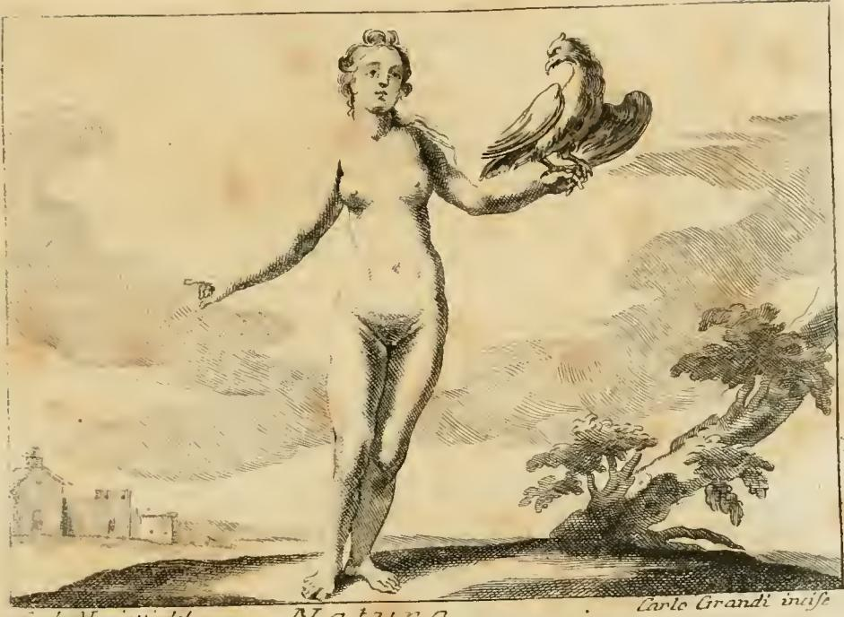

# 리파의 '자연(Natura)' 의인상

## 카드

**질문** — 리파는 '자연(Natura)'을 어떻게 의인화했는가?

**답** — 하드리아누스 메달을 따라 젖이 가득한 가슴을 드러낸 나체의 여인이 손에 독수리(아보이토요, 콘도르류)를 든 모습이다. 아리스토텔레스 『자연학』 2권의 정의대로 자연은 운동과 변화의 원리이며, 능동(형상)과 수동(질료)의 두 원리로 나뉜다.

---

## 1. 원전 텍스트

asset의 `09 Music to Nymphs.md` 69~89행이 이 카드의 출처다. 18세기 판본(Tomo Quarto, p. 204~205) OCR을 정리하면 다음과 같다.

> **NATURA. Di Cesare Ripa.**
> **D**onna ignuda, colle mammelle cariche di latte, e con un Avoltojo in mano, come si vede in una medaglia di Adriano Imperadore; essendo la Natura, come difinisce Aristotele nel 2. della Fisica, principio in quella cosa, ove ella si ritrova, del moto e della mutazione, per la quale si genera ogni cosa corruttibile.
>
> Si farà Donna, e ignuda, e dividendosi questo principio in **attivo** e **passivo**, l'attivo dimandarono con il nome di **forma**, e con nome di **materia** il passivo.
>
> L'**attivo** si nota con le mammelle piene di latte, perchè la forma è quella che nutrisce e sostenta tutte le cose create, come colle mammelle la donna nutrisce e sostenta li fanciulli.
>
> L'**Avoltojo**, uccello avidissimo di preda, dimostra particolarmente l'altro principio dimandato **materia**, la quale per l'appetito della forma, movendosi e alterandosi, distrugge appoco appoco tutte le cose corruttibili.

번역하면 — "젖이 가득 찬 가슴을 드러낸 나체의 여인, 손에는 독수리(썩은고기수리)를 들었다. 하드리아누스 황제의 메달에서 볼 수 있는 모습이다. 아리스토텔레스가 『자연학』 2권에서 정의한 대로, 자연이란 그것이 내재하는 사물 안에 있는 운동과 변화의 원리이며, 그 변화를 통해 모든 소멸하는 것이 생성된다."

즉 리파의 서술 구조는 **① 도상 처방(무엇을 그릴 것인가) → ② 고전 전거(왜 그렇게 그리는가) → ③ 지물(attributo) 하나하나의 알레고리 해독**이라는 『이코놀로지아』의 전형적 3단 구성이다.

## 2. 판화에서 실제로 보이는 것

판화(우측 하단에 판각자 서명 `Carlo Grandi incise`)를 보면 텍스트 처방이 거의 그대로 구현되어 있다.

- **완전한 나체, 정면 직립**: 옷·장식·왕관이 전혀 없다. 리파의 다른 의인상들이 대개 겹겹의 의복과 상징 문양으로 덮여 있는 것과 대조적이다. 나체는 두 가지를 동시에 말한다. (a) 자연은 인간의 기술(*ars*)이 덧붙인 것이 없는 상태, 즉 **꾸밈 없는 것 자체**다. (b) 아래에서 볼 '질료'와 '형상' 논의처럼, 자연은 옷(우연적 규정)이 아니라 **몸(본질적 원리)** 쪽에 있다.
- **오른팔을 든 손 위의 맹금**: 갈고리 부리, 목 뒤로 삐친 깃, 접힌 날개, 발톱으로 손가락을 감아 쥔 자세 — 매사냥에서 새를 손등에 앉히는 자세(*falconry pose*)로 그려져 있다. 텍스트가 요구한 것은 `Avoltojo`(독수리·썩은고기수리)인데, 판화의 새는 몸집과 깃 처리로 보면 오히려 매나 수리 쪽에 가깝다. 18세기 판각자들이 '맹금'이라는 범주만 살려 관습적으로 그린 결과다.
- **왼팔은 아래로 뻗어 벌린 손**: 무언가를 내어주는·펼쳐 보이는 제스처. 자연의 생산성·개방성을 시사한다.
- **가슴**: 판화에서는 텍스트가 강조한 '젖이 가득 찬(cariche di latte)' 부풀음이 뚜렷하게 표현되지 않았다. 오히려 매너리즘풍의 늘씬한 비너스형 누드에 가깝다. **텍스트 처방과 판화 구현 사이의 불일치**로, 리파를 읽을 때 흔히 만나는 현상이다(원 판본의 목판 도상 → 후대 판본의 재판각 과정에서 세부가 표준화됨).
- **배경**: 왼쪽 원경에 교회 종탑과 성채, 오른쪽에 참나무 가지. 자연(오른쪽 식물계)과 인공·문명(왼쪽 건축)이 여인을 사이에 두고 대칭 배치된 구도로, 여인이 그 둘의 원리적 근거임을 암시한다.

(md 77행이 참조하는 `_page_210_Picture_2.jpeg`는 도상이 아니라 본문 첫 글자 `D`의 장식 이니셜(*Donna*)이다. OCR이 이 이니셜을 놓쳐 본문이 "Onna ignuda"로 시작하는 것이다.)

## 3. "하드리아누스 메달" — 전거의 실체

리파는 `come si vede in una medaglia di Adriano Imperadore`라며 고대 화폐를 근거로 든다. 이 관행 자체가 중요하다.

- 16세기 후반 이탈리아에서 고대 주화·메달은 **도상학의 1차 사료**였다. 리파는 엔에아 비코(Enea Vico), 세바스티아노 에리초(Sebastiano Erizzo), 기욤 뒤 슈울(Guillaume du Choul), 후베르투스 골치우스(Hubertus Goltzius) 같은 고전 화폐학 도록에서 도상을 끌어왔고, 실물을 직접 본 경우는 드물었다. 즉 "메달에서 볼 수 있다"는 진술은 **문헌 인용에 가까운 2차 전거**다.
- 하드리아누스(재위 117~138)의 화폐에는 실제로 대지·풍요의 여신 도상이 다수 있다. 대표적으로 `TELLVS STABIL(ITA)` 명문의 텔루스(Tellus, 대지모신) 유형, 그리고 사자 수레를 탄 키벨레(Cybele) 대형 청동 메달리온이 있다. 다만 **리파가 묘사한 그대로 — 나체 + 젖 가득한 가슴 + 손 위의 독수리 — 인 하드리아누스 메달은 현대 화폐학 목록에서 확정되지 않는다.**
- 따라서 이 메달 인용은 (a) 텔루스/키벨레류 대지 여신 유형을 고전 도록의 판화·설명을 통해 간접적으로 읽은 뒤 자기 해석을 덧입힌 것이거나, (b) 르네상스기에 유통된 위작·복제 메달(이른바 *paduan*)을 본 것으로 보는 편이 안전하다. 시험 답안으로는 "**리파 자신이 하드리아누스 메달을 전거로 제시했다**"까지가 사실이고, "실제 그런 메달이 있다"까지 나가면 과장이다.
- 리파가 굳이 황제 메달을 든 이유는 **권위 부여**다. 자기가 발명한 도상이 아니라 고대에 이미 그렇게 그려졌다는 주장이 『이코놀로지아』를 화가·조각가·시인용 '공인된 도상 사전'으로 만들어 주었다.

## 4. 아리스토텔레스 『자연학』 2권 — physis의 정의

리파가 압축한 문장(`principio ... del moto e della mutazione`)은 『자연학』 2권 1장의 유명한 정의를 거의 축자 번역한 것이다.

> φύσις ἐστὶν ἀρχή τις καὶ αἰτία τοῦ κινεῖσθαι καὶ ἠρεμεῖν ἐν ᾧ ὑπάρχει πρώτως, καθ' αὑτὸ καὶ μὴ κατὰ συμβεβηκός.
> (자연이란, 그것이 일차적으로 내재하는 것 안에 있는, **운동과 정지의 어떤 원리(ἀρχή)이자 원인**이다. 그 자체로서 그러하며, 부수적으로 그러한 것이 아니다.) — *Physica* II.1, 192b21–23

여기서 짚어야 할 두 층위:

**(1) 자연 = 내적 원리.** 결정적 대비는 **자연물 vs. 인공물**이다. 나무가 자라고 돌이 떨어지는 것은 그 안에 변화의 원리가 **내재**하기 때문이다. 반면 침대나 옷은 변화의 원리가 자기 안에 없고 목수·재봉사라는 **외부**에 있다(그것이 *technē*). 그러니 리파가 자연을 **알몸으로** 그린 것은 이 구분의 시각적 번역으로 읽을 수 있다 — 옷이란 곧 기술의 산물이므로, 옷을 벗기면 남는 것이 자연이다.

**(2) 형상인가 질료인가.** 아리스토텔레스는 같은 장에서 "그렇다면 자연은 질료인가 형상인가"를 묻고, **형상(εἶδος/morphē)이 질료보다 더 자연이라고** 결론한다(193a30–193b8). 이유는 두 가지 — 형상은 그것이 무엇인지를 규정하는 현실태이고, 질료는 아직 가능태에 머물기 때문. 또 생성 과정의 **목적(telos)**은 완성된 형상이지 재료가 아니기 때문.

리파는 이 형상/질료 짝을 **능동(attivo)/수동(passivo)**으로 옮겨 각각에 지물을 배당한다. 이 능동·수동 표현 자체는 아리스토텔레스 원문이 아니라 **스콜라 주석 전통의 술어**(*principium activum / principium passivum*)다. 토마스 아퀴나스의 『자연학 주해』 2권이 표준 통로였다.

| 리파의 두 원리 | 아리스토텔레스 술어 | 지물 | 지물 해석 |
|---|---|---|---|
| 능동(attivo) | 형상(forma, εἶδος) | 젖이 가득한 가슴 | 형상은 창조된 모든 것을 **먹이고 지탱**한다 — 여인이 젖으로 아이를 기르듯 |
| 수동(passivo) | 질료(materia, ὕλη) | 손 위의 맹금 | 질료는 **형상을 향한 욕구(appetitus formae)** 때문에 움직이고 변질하며, 그리하여 소멸하는 것들을 조금씩 파괴한다 |

여기서 리파의 논리가 아름답다. 맹금이 왜 '수동' 원리인가? 표면적으로 맹금은 능동적 포식자다. 그런데 스콜라 형이상학에서 **질료는 형상을 갈망한다**(*materia appetit formam*, 아리스토텔레스 『자연학』 I.9, 192a22의 "질료는 형상을 욕구한다"를 스콜라가 정식화). 이 갈망은 채워지지 않기에 질료는 끊임없이 한 형상을 버리고 다른 형상을 취하며, 그 결과가 **부패와 소멸**이다. 그래서 '먹이를 탐하는 데 가장 탐욕스러운 새(*uccello avidissimo di preda*)'가 곧 굶주린 질료의 상징이 된다. 썩은고기수리가 사체를 먹어 없앤다는 자연사적 사실까지 겹쳐, 소멸(*corruptio*)의 이미지가 완성된다.

## 5. '아보이토요' 표기 문제 — 카드 답의 취약점

카드 답의 "독수리(아보이토요, 콘도르류)"는 두 겹으로 손봐야 한다.

- **철자·발음**: 원어는 이탈리아어 **`avvoltoio`**다. 18세기 판본이 `Avoltojo`로 표기했고(당시 이탈리아어는 `i` 자리에 `j`를 썼다), OCR은 이를 `Avoitojo`로 오독했다. 여기서 "아보이토요"라는 한글 표기가 나왔다. 정확히는 **아볼토요 / 아볼토이오(avvoltoio)**다. 스페인어 대응어는 `buitre`이고 `avoltoio`는 스페인어가 아니다 — 이 단어를 스페인어로 소개하는 설명은 오류다.
- **동물 지시**: `avvoltoio`는 구대륙(Old World)의 **썩은고기수리류(vulture)**, 즉 한국어로 정확히는 **독수리(禿鷲, Aegypius monachus 계열의 대머리 청소동물)**다. **콘도르(Andean/California condor)는 신대륙 종**이며, 1590년대 로마에서 집필한 리파의 어휘에 들어올 수 없다. "콘도르류"라는 괄호 설명은 삭제하는 것이 옳다.
- **한국어 함정**: 한국어 '독수리'는 일상어로 eagle을 뜻하는 오용이 굳어졌지만, 생물학적으로 독수리 = vulture, 검독수리·참수리 = eagle이다. 리파가 요구한 것은 **vulture 쪽**이다. 이 구분이 알레고리에 직결된다 — 사냥해 죽이는 새(eagle, 유피테르의 새, 제국·승리의 상징)가 아니라 **이미 죽은 것을 삼켜 없애는 새**여야 '소멸시키는 질료'라는 해석이 성립한다. 만약 판화의 새를 eagle로 읽으면 리파의 논리가 무너진다.

## 6. 젖가슴은 왜 다산·양육의 상투적 표상인가

리파가 '형상 = 양육'을 젖가슴에 배당한 것은 개인적 착상이 아니라 **수천 년 축적된 도상 관습**을 불러온 것이다.

- **다유방(polymastic) 대지모신 계열**: 에페소스의 아르테미스(*Artemis Ephesia*) 상은 가슴에 여러 개의 유방 모양 돌기를 달고 있고, 르네상스 고물학자들은 이를 "자연의 다산"으로 읽었다. 로마의 별장·분수 장식에 이 유형이 널리 복제되어(예: 티볼리 빌라 데스테의 '자연의 분수') **다유방 = 자연 그 자체**라는 등식이 유통되었다.
- **Caritas / Charitas 유형**: 젖먹이는 여인은 자애·자선의 표준 도상이었고, '아낌없이 내어주는 것'의 시각적 정의였다.
- **Terra Mater / Tellus, Ops, Cybele**: 로마 화폐의 대지 여신은 과일 바구니·코르누코피아와 함께 등장하며, 대지의 생산성을 신체적 풍요로 번역했다.
- **의학·자연철학적 근거**: 갈레노스 전통에서 젖(*lac*)은 정련된 피이며 생명을 직접 전달하는 물질이었다. 젖가슴은 단순 은유가 아니라 **생명을 실제로 공급하는 기관**으로 이해되었고, 그래서 '만물을 먹이고 지탱하는(nutrisce e sostenta) 원리'의 기호로 자연스러웠다.
- 그 결과 젖가슴은 **다산(생산) + 양육(유지)** 두 기능을 한 몸에 담는다. 리파에게 형상은 사물을 존재하게 하고(생성) 그 존재를 유지하는 것(보존)이므로, 이 두 기능이 필요한 자리에 정확히 들어맞는다.

**한 그림 안의 두 방향**: 결국 이 도상은 서로 반대되는 두 힘을 여인의 두 손·몸에 나눠 걸었다. 젖가슴(형상, 능동, 생성·양육) ↔ 맹금(질료, 수동, 변질·소멸). 자연은 낳는 힘과 없애는 힘의 **긴장 그 자체**다. 리파 문장의 마지막 말 `ogni cosa corruttibile`(모든 소멸하는 것)이 이 균형을 못 박는다 — 자연이 지배하는 영역은 **가멸적(sublunary) 세계**이며, 불변의 천상계는 그 밖에 있다.

## 7. natura naturans / natura naturata

리파의 능동/수동 구분은 스콜라의 유명한 짝개념과 이웃해 있으니 함께 익혀두면 좋다.

- **natura naturans** — '자연화하는 자연', 능동적·생성하는 자연. 원인으로서의 자연.
- **natura naturata** — '자연화된 자연', 산출된 결과로서의 자연. 개별 사물들의 총체.

- **유래**: 13세기 전반, 아베로에스(이븐 루시드)의 아리스토텔레스 주석을 라틴어로 옮기던 번역자들이 동사 `naturari`를 만들어 쓴 데서 나왔다. 미카엘 스코투스(Michael Scotus)가 능동형 `natura naturans`를 처음 만들어 신에게 적용했다고 전해지며, 뱅상 드 보베·보나벤투라가 뒤를 이었다.
- **전개**: 신비주의 전통과 스콜라 전통 양쪽으로 퍼졌다. 토마스 아퀴나스와 마이스터 에크하르트가 사용하고, 쿠사누스와 조르다노 브루노를 거쳐, **스피노자** 『에티카』 1부 정리 29 주석에서 유명한 재정의를 얻는다 — 스피노자에게 natura naturans는 자기 안에 있으며 스스로에 의해 파악되는 실체와 그 속성(즉 신), natura naturata는 그 속성의 양태들이다.
- **리파와의 관계**: 주의할 점은 리파의 능동/수동은 **자연 안의 두 구성 원리(형상/질료)** 구분이고, naturans/naturata는 **원인으로서의 자연 / 결과로서의 자연** 구분이라는 것이다. 층위가 다르다. 다만 둘 다 "자연은 하나가 아니라 두 얼굴을 갖는다"는 같은 스콜라적 감각에서 나왔고, 리파가 자연을 한 인물상으로 그리면서 두 지물로 쪼갠 것은 그 감각의 시각적 귀결이다.

## 8. 부록 — 부다르(Boudard)의 다른 Natura 상

md 103행의 편주는 18세기의 대안 도상을 소개한다. 리파의 처방이 유일한 표준이 아니었음을 보여준다.

> 파르마 왕립 아카데미 교수 조반니 바티스타 부다르(J.-B. Boudard)가 1759년 파르마에서 낸 『이코놀로지아』는 자연을 이렇게 재현한다 — **젊은 여인**, 하반신은 여러 종류의 육상 동물로 측면을 장식한 **일종의 신전(temine=tempietto) 안에 갇혀** 있다. **뻗은 두 팔에는 여러 종류의 새**를 안고 있으며, **가슴에는 젖이 가득한 여러 유방**이 보인다. **머리는 베일로 가려져** 있는데, 이집트인들의 견해에 따르면 자연의 가장 중요한 비밀은 오직 창조주에게만 남겨져 있음을 보이기 위함이다.

리파와의 비교가 학습에 유용하다.

| | 리파(1593~) | 부다르(1759) |
|---|---|---|
| 얼굴 | 드러남 | **베일로 가림** — 자연의 비밀은 신에게만 |
| 가슴 | 젖 가득한 두 가슴 | **다유방** (에페소스 아르테미스 계열 직계) |
| 새 | 맹금 **한 마리**(질료의 알레고리) | 여러 종류의 새 (동물계 전체의 표상) |
| 하반신 | 완전 나체, 직립 | 짐승으로 장식된 **신전 형태에 갇힘** |
| 강조점 | **형이상학적**(형상/질료) | **박물학적·신비적**(자연계의 다양성 + 불가지성) |

즉 리파에서 자연은 **아리스토텔레스 형이상학의 도해**였고, 부다르에서는 **자연사의 진열장 겸 신적 비밀의 봉인**으로 옮겨간다. 계몽기 자연관의 이동이 도상 처방에 그대로 찍혀 있다.

## 9. 암기 정리

- **모습**: 나체 여인 + 젖 가득한 가슴 + 손 위의 독수리(avvoltoio, vulture).
- **전거 1**: 하드리아누스 황제의 메달 (리파의 주장; 실물 확정 불가, 텔루스/키벨레 유형의 간접 수용으로 추정).
- **전거 2**: 아리스토텔레스 『자연학』 II.1, 192b21–23 — 자연 = 그것이 내재하는 사물 안의 **운동과 정지(변화)의 내적 원리**.
- **두 원리**: 능동 = **형상** = 젖 가득한 가슴(먹이고 지탱함) / 수동 = **질료** = 탐욕스러운 맹금(형상을 갈망해 움직이며 소멸하는 것을 파괴함).
- **적용 범위**: `ogni cosa corruttibile` — 소멸 가능한 지상계.
- **자주 틀리는 곳**: '아보이토요'는 OCR 오독(→ **아볼토요/avvoltoio**), 스페인어 아니고 **이탈리아어**, **콘도르가 아니라 구대륙 독수리(vulture)**.

---

### 출처

- 원전: `.fm/assets/09 Music to Nymphs.md` 69~89행, 103행 (`Iconologia`, Tomo Quarto, pp. 204~205)
- 도판: `.fm/assets/Iconologia (Cesare Ripa)/_page_210_Picture_1.jpeg` (판각 Carlo Grandi) → 본 폴더 `fig-1.jpeg`
- [Aristotle's Natural Philosophy (Stanford Encyclopedia of Philosophy)](https://plato.stanford.edu/entries/aristotle-natphil/)
- [Aristotle, *Physics* Book II (Loeb Classical Library)](https://www.loebclassics.com/view/aristotle-physics/1934/pb_LCL228.107.xml)
- [Thomas Aquinas, *Commentary on Aristotle's Physics*, Book II](https://isidore.co/aquinas/english/Physics2.htm)
- [Natura Naturans and Natura Naturata — The Cambridge Spinoza Lexicon](https://www.cambridge.org/core/books/abs/cambridge-spinoza-lexicon/natura-naturans-and-natura-naturata/9B546C0A60B79D3219945B23B2380B05)
- [Nature (in Philosophy) — Encyclopedia.com](https://www.encyclopedia.com/religion/encyclopedias-almanacs-transcripts-and-maps/nature-philosophy)
- [Cesare Ripa — Dictionary of Art Historians](https://arthistorians.info/ripacf/)
- [Denarius — Hadrian (TELLVS STABIL; Tellus), Numista](https://en.numista.com/catalogue/pieces256529.html)
- [NGC Ancients: Medallions of the Roman Empire](https://www.ngccoin.com/news/article/10142/)
