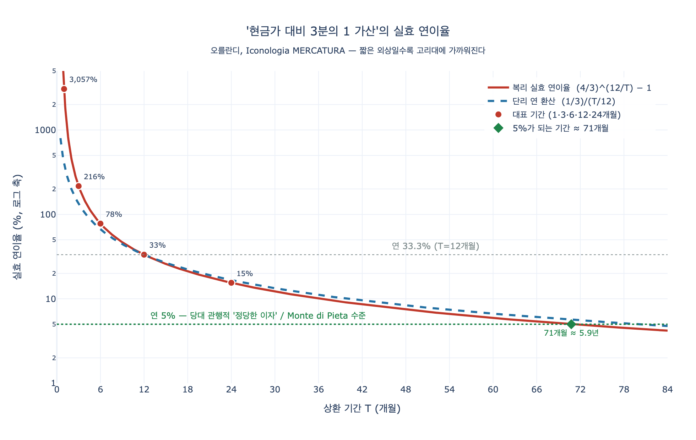

# 외상 판매(dare a credenza)에 대한 오를란디의 견해

> **Q.** 외상 판매(dare a credenza)에 대한 오를란디의 견해는?
>
> **A.** 외상은 관대함이 아니라 더 큰 이익에 대한 탐욕의 결과인 경우가 많다고 본다. 구매자의 절박함을 이용해 현금가보다 3분의 1이나 비싸게 다는 것은 고리대에 가까운 부정한 이익이며, 외상 값을 갚지 않으면서 호화롭게 사는 채무자들도 하나님 앞에 가증하고 세상에 수치스러운 죄를 짓는 것이라고 양쪽을 모두 훈계한다.

이 카드는 리파 『이코놀로지아』의 **MERCATURA(상업)** 항목에 오를란디(Cesare Orlandi, 1764–67년 페루자판 편찬자)가 붙인 **논설**에서 나온 것이다. 위 판화는 항목의 표제 도상(흰옷·풍요의 뿔·메르쿠리우스 상·수탉·항구)으로, 이 카드의 내용과 직접 대응하는 그림은 아니다. 항목 위치를 잡기 위한 참고용으로만 보면 된다.

---

## 1. 이 카드가 어디에 놓여 있는가

오를란디의 MERCATURA 논설은 대체로 이런 순서로 흘러간다.

1. 상업은 국가에 필요하고 유익하므로 예로부터 칭찬받을 직업이다(카스타네오·챔버스 인용, 루이 14세의 1669·1701년 선언 등).
2. 단 **도매(all'ingrosso)** 와 **소매(a ritaglio)**, 그리고 잡화 행상을 구별해야 한다. 귀족이 손상 없이 할 수 있는 것은 도매뿐이다.
3. 상인이 멀리해야 할 **악덕** — 나쁜 물건을 좋다고 속이는 간교(astuzia), 거짓말, 위증, 작은 고을에서 흔한 상인들의 **가격 담합(lega)**, 하자를 침묵으로 감추는 짓. 키케로 『의무론』 3권이 근거로 인용된다.
4. 상인이 처한 **위험** — 바다의 폭풍, 거래처의 갑작스러운 파산.
5. **파산(fallimento)의 원인** 열거. 여기서 문제의 표현이 처음 등장한다: 방만한 경영, 낭비, 자기보다 윗사람과 사치를 겨루는 짓, 부실한 점원, 그리고 *"기다려 주는 조건으로, 흔히 말하는 대로 **a credenza(외상)** 로, 물건을 눈감고 내주는 것"*.
6. **이 카드의 대목** — "외상 이야기가 나온 이상, 상인들에게도 받는 쪽에게도 내 생각을 분명히 말하게 해 달라"며 시작하는 양방 훈계.
7. 그다음 다시 도상 해설(풍요의 뿔, 메르쿠리우스, 수탉, 서둘러 걷는 자세)로 돌아간다.

즉 이 카드는 **논설의 '훈계' 부**에 속하고, 바로 앞 카드(상인의 악덕: 간교·거짓말·담합·하자 은폐)와 짝을 이룬다. 앞 카드가 **판매 행위 자체의 부정**을 다룬다면 이 카드는 **신용거래의 부정**을 다룬다.

---

## 2. 원문 서술 — 오를란디는 정확히 무엇을 말했나

### (1) 외상은 흔히 호의가 아니라 탐욕이다

> *Non è già sempre gentilezza di animo del Mercatante il dar la sua roba a respiro; anzicché io perloppiù la reputo un effetto di vera ingordigia di maggior guadagno, e mi si lasci dire, di un guadagno ancora innonesto.*
>
> "상인이 물건을 유예(a respiro)로 내주는 것이 언제나 마음씨의 고움(gentilezza di animo)인 것은 아니다. 오히려 나는 그것을 대개 **더 큰 이익에 대한 진짜 탐욕(ingordigia)** 의 결과, 게다가 **부정한(innonesto) 이익**의 결과라고 본다."

`gentilezza di animo`(관대함/호의) ↔ `ingordigia`(탐욕)의 대립이 이 카드의 뼈대다.

### (2) 3분의 1 가산 — 절박함의 착취

> *Poiché trovandosi il Compratore, per il desiderio che ha di conseguirla, obbligato a non ripetere sul prezzo che alla roba si assegna, il Mercatante non iscrupoleggia di notare alla partita del suo Debitore **il terzo forse di più** di quello che dovrebbe importare la data merce; e che in effetti non sarebbe stato restio a rilasciare a chi co' contanti alla mano gli si fosse presentato per l'acquisto di essa.*
>
> "구매자는 그 물건을 얻으려는 욕망 때문에 매겨진 값에 이의를 제기할 처지가 못 되고, 그래서 상인은 거리낌 없이 채무자의 계정에 그 물건이 마땅히 나가야 할 값보다 **아마 3분의 1을 더** 적어 넣는다. 실제로는 **현금을 손에 들고 사러 온 사람에게는** 선선히 내주었을 값인데도."

핵심 논증 구조: **같은 물건, 같은 시점, 두 가격.** 현금가와 외상가의 차액은 물건이 아니라 **시간**에 붙은 값이다. 그리고 그 차액이 정당한 시간의 대가가 아니라 구매자가 "값을 따질 처지가 못 된다"는 사정에서 나왔다는 것이 오를란디의 고발이다.

### (3) 그러나 예외는 인정한다 — 놀고 있지 않을 돈

오를란디는 무조건 반대하지 않는다. 이 유보가 카드 이해에 결정적이다.

> *Comprendo bene che il Mercatante non deve, e non suole tenere ozioso il denaro (…) Perciò accordo anch'io, che possa non ingiustamente il Mercatante conteggiare in suo prò **[coll'intesa però del Compratore]** quel tanto che utilizzar gli potrebbe il denaro, se a sé tratto subitamente lo avesse.*
>
> "상인이 돈을 **놀려 두어서는(ozioso)** 안 되고 또 그러지 않는다는 것을 나는 잘 안다. (…) 그러므로 나 역시 인정한다. 상인이 — **단 구매자의 합의 아래** — 만일 즉시 그 돈을 받았더라면 그 돈으로 벌 수 있었을 만큼을 자기 이익으로 계산해 넣는 것은 부당하지 않다."

그리고 곧바로 **비례성 조건**을 단다.

> *Deve pertanto il Mercatante, concordato il tempo dell'attendere, **a norma di quello** regolare il suo credito, e non già a norma del suo capriccio, della sua avidità, e non abusarsi della necessità in cui si trova il Compratore.*
>
> "따라서 상인은 기다릴 **기간을 합의한 뒤 그 기간에 비례하여** 가산을 정해야 하며, 자기 변덕과 탐욕에 따라 정해서는 안 되고, 구매자가 처한 절박함을 악용해서도 안 된다."

이것이 이 카드에서 가장 자주 놓치는 대목이다. 오를란디가 규탄하는 것은 **가산 자체가 아니라 기간과 무관한 정액 가산**, 그리고 **합의 없이 절박함에 편승한 가산**이다. → 그래서 "3분의 1"이라는 정액 가산이 기간에 따라 얼마나 터무니없는 이율이 되는지 계산해 보는 것이 이 카드의 자연스러운 검산이다(아래 [시각화](#시각화) 참조).

### (4) 그러면 그것은 '호의'가 아니라 '이자부 대출'이라 불러라

> *E questo facendo, non vanti il Mercatante di usar finezza; poiché altro non fa, che **rilasciar denaro a frutto**; ma torno a ripetere, questo frutto **non senta di usura**.*
>
> "그렇게 하면서 상인은 자기가 **호의(finezza)** 를 베푼다고 자랑하지 말라. 하는 일이란 **돈을 이자 받고 빌려주는 것(denaro a frutto)** 일 뿐이다. 다시 말하지만 그 이자에서 **고리대(usura) 냄새가 나서는 안 된다**."
>
> *Che quando poi si esprima di concedere la roba a respiro per mera finezza, pensi allora, che giustamente e onestamente non può esigere dal Compratore **un soldo di più** di quello che conseguir dovrebbe da chi effettivamente, nell'atto della consegna della roba, gli sborsasse il danaro.*
>
> "그러면서도 순전한 호의로 유예를 준다고 **말한다면**, 그때는 실제로 물건을 넘기는 순간 현금을 지불하는 사람에게 받을 값보다 **단 한 푼(un soldo)** 도 정당하게 더 받을 수 없음을 알아야 한다."

수사적으로 아주 깔끔한 이지선다다. **가산을 받겠다면 대출이라 인정하고 기간에 비례해 정해라. 호의라 부르겠다면 한 푼도 더 받지 마라.** 둘을 겹쳐 챙기는 것이 부정이다.

### (5) 현금 구매자에게 전가되는 비용 — 놀랍게 근대적인 논점

> *…non ne avverrebbe, come pur troppo avviene, che chi col danaro alla mano si porta a provvedersi di robe al loro negozio, dovesse, senza avvedersene, **pagare il di più per quelli che sono al pagamento restii**.*
>
> "…현금을 들고 물건을 사러 가는 사람이 자기도 모르는 채 **지급을 미루는 자들 몫까지 더 얹어 물어야 하는** 일도, 지금처럼 벌어지지는 않을 것이다."

외상 손실이 가격에 녹아 **현금 구매자에게 교차보조(cross-subsidy)** 된다는 지적이다. 이어서 현명한 상인은 정당한 값의 실제 지급 없이 물건을 내보내지 말아야 하며, 그렇게 하면 (상인들 자신의 고백으로도) **가격이 전반적으로 내려갈 것**이라고 말한다.

### (6) 상인들의 위선

> "많은 상인들은 매일 외상을 욕하며 떠들지만, 속으로는 **외상으로 사 갈 사람을 만나기만** 바란다. 그런 사람들은 값을 자기들 마음대로 정해도 어렵지 않게 동의한다는 것을 알기 때문이다. 물건이 좋든 나쁘든 쉽게 처분되고, 여기에 그들의 **최대 이익**이 있다."

즉 외상은 (ㄱ) 가격 저항 무력화, (ㄴ) 불량품 처리 통로 두 가지로 동시에 이용된다.

### (7) 불가피한 외상의 경우 — 신용조사 의무

상대의 신분이나 여러 사정 때문에 외상을 거절할 수 없는 경우가 많음을 오를란디도 인정한다. **바로 그런 상황에서** 상인의 정직·지혜·신중함이 더 필요하다고 하며, 계약 상대의 인적 신용을 **미리 확인해 안전을 확보(porsi prima in sicuro intorno la Persona)** 할 것, 그리고 상대의 궁핍을 이용하지 말 것을 요구한다.

### (8) 채무자 쪽 훈계 — 카드 후반부

받는 쪽으로 몸을 돌려("E qui rivolto a quelli, i quali a credenza ricevono") 세 갈래로 꾸짖는다.

1. 외상 구매는 **경제적이지 못하다**(non essere punto economico).
2. 일부 상인의 부정한 술책 때문에 결국 비싸게 산다.
3. 빚은 일반적으로 **가정에 불이익**을 가져온다.

여기에 **약정 기일을 지키지 않을 때**의 두 결과가 더해진다: **타인에게 극심한 손해(sommo danno altrui)** 와 **자신에게 큰 수치(grave disdoro)**.

**연쇄 파산 메커니즘**을 오를란디는 아주 구체적으로 짚는다.

- 상인은 정해진 시기에 거래처(Corrispondenti)로 송금(rimesse)을 해야 한다.
- 그 재원은 자기 채무자들의 지급에 기대어 잡아 둔 것이다.
- 회수가 안 되면 송금을 못 하고, 거래처에서 **신용(fede)** 을 잃는다.
- 거래처는 물건 보내기를 미루고, 상인은 빚진 만큼 차입해야 하지만 회수가 없어 그것도 못 한다.
- 결국 상인은 **파산(fallire)** 하거나 최소한 **영업 정지(far punto)** 를 해야 한다 — "상인이 당할 오욕 중 가장 덜 부끄러운 것".
- 그리하여 어느 정도 빛나고 공화국에 유익했던 한 가문이 비참한 상태로 전락한다. "이런 손해의 원인은 누구인가? 이토록 무거운 손해를 누가 메우는가?"

그다음이 답안에 인용된 문장이다.

> *Non si fanno taluni grande scrupolo di non soddisfare ne' fissati tempi a' debiti loro co' Mercanti; eppure, se ben riflettono, egli si è questo un notabil delitto, **odioso agli occhi di Dio, vergognoso a quelli del Mondo**.*
>
> "어떤 이들은 상인에게 진 빚을 정해진 기일에 갚지 않는 것을 크게 거리끼지 않는다. 그러나 잘 생각해 보면 그것은 **하나님의 눈에 가증하고 세상의 눈에 수치스러운** 뚜렷한 범죄다."

그리고 시각적 대조로 끝을 낸다.

> "어떤 자들이 값진 옷을 걸치고 광장을 으스대며 거닐고, 온종일 잔치하고, 흥청거리고, 낭비하는 것을, **그들의 채권자들은 근심 어린 생각과 궁핍 속에서 불행한 날을 보내는데** 바라보는 것은 도무지 견딜 수 없는 끔찍한 일이다!"

다만 그 죄가 완전히 벌 없이 지나가지는 않는다고 한다. 그런 자들은 늘 손가락질과 비난·조롱·공동의 경멸을 받으며, 운수가 뒤집혀도 **아무도 동정하지 않는다**. 여기서 로렌초 리피의 희극 서사시 『말만틸레 탈환(Malmantile racquistato)』 6가(歌)의 한 연이 인용되는데, 저주받을 한 푼도 갚은 적 없이 큰 자리를 차지하고 짐승 같은 씀씀이를 하던 인물을 조롱하는 대목이다. (해당 인용은 저본 OCR이 심하게 손상되어 자구를 신뢰할 수 없다.)

---

## 3. 배경 — 왜 '외상 가산금'이 고리대와 같은 것인가

### 3.1 스콜라 경제윤리의 usura 정의

스콜라 전통에서 **usura(고리대)** 는 오늘날의 '살인적 고금리'가 아니라 훨씬 넓은 개념이었다. **소비대차(*mutuum*)에서 원금 이상을 받는 것 자체**가 죄였다. 근거는 대체로 세 층이었다.

1. **성경** — 「출애굽기」 22:25, 「레위기」 25:36-37, 「누가복음」 6:35, 그리고 「시편」 15편의 "이자를 받지 않는 자".
2. **아리스토텔레스 계열 논변** — 돈은 교환의 도구로서 소비되어 사라지는 물건(*res fungibilis*)이므로, 사용과 소유를 분리해 '사용료'를 따로 받을 수 없다. 토마스 아퀴나스가 『신학대전』 II-II q.78에서 이 논변을 정식화했다.
3. **"시간을 팔 수 없다"** — 대출에서 대주(貸主)가 실제로 넘기는 것은 원금뿐이고, 추가로 받는 것의 근거는 **경과한 시간**밖에 없다. 그런데 시간은 만인에게 공통으로 주어진 하나님의 것이므로 팔 수 있는 상품이 아니다. 13세기 이래 널리 쓰인 정식이 *"usurarius vendit tempus"* (고리대금업자는 시간을 판다)였다.

이 세 번째 논변이 이 카드의 열쇠다. **현금가와 외상가의 차액에는 물건이 아무것도 더 얹히지 않았다.** 물건도 같고, 인도 시점도 같다. 달라진 것은 지급 시점 하나뿐이므로, 차액은 정의상 **시간의 값**이다.

### 3.2 은폐된 고리대 — usura palliata

그래서 스콜라 법학은 이런 이중가격 관행에 이름을 붙여 두었다. ***usura palliata*(외투 입은/은폐된 고리대)** — 형식적으로는 매매지만 실질적으로는 이자부 대출인 계약이다. 대표 유형이 이 카드에 나오는 것이다.

| 형식 | 실질 |
|---|---|
| 외상가 = 현금가 + 가산 | 현금가만큼의 대출 + 가산만큼의 이자 |
| "물건 값이 원래 그렇다" | 기간에 붙는 대가이므로 이자 |

오를란디는 이 판정을 **직접 내리지 않고 대신 상인에게 자기 행위의 정체를 인정하라고 요구한다**: "하는 일이란 돈을 이자 받고 빌려주는 것일 뿐(altro non fa, che rilasciar denaro a frutto)". 이 문장이 사실상 usura palliata 판정문이다. 그러면서도 "그 이자가 고리대 냄새가 나지 않게 하라"고 덧붙이는 데서, 아래 예외 법리를 전제하고 있음이 드러난다.

### 3.3 예외 법리(tituli extrinseci) — 근대적 이자가 자란 곳

usura 금지는 **원금 자체에 대한 대가**를 금했을 뿐이고, 대출에 **외적으로 부수하는(extrinsic)** 손실·위험에 대한 보상은 일찍부터 허용되었다. 주요 항목은 셋이다.

| 근거 | 내용 | 오를란디 원문의 대응 |
|---|---|---|
| ***damnum emergens*** (발생한 손실) | 대출 때문에 대주가 실제로 입은 손해의 배상 | (직접 언급 없음) |
| ***lucrum cessans*** (놓친 이익) | 그 돈을 자기 사업에 투입했다면 벌었을 이익 | **"돈을 놀려 두어서는 안 된다 (…) 즉시 받았더라면 그 돈으로 벌 수 있었을 만큼"** — 정확히 이것 |
| ***periculum sortis*** (원금 위험) | 회수 불능 위험에 대한 프리미엄 | **"상대의 인적 신용을 미리 확인해 안전을 확보할 것"**, 그리고 "회수 불능이 되는 채권이 거듭 생긴다"는 서술 |

여기에 지급 지체에 대한 **위약금(*poena conventionalis*)** 이 더해진다. 이런 명목들이 축적되면서 결국 '기회비용에 대한 대가'라는 근대적 이자 개념으로 자라났다.

**따라서 오를란디의 입장을 정확히 잡으면 이렇게 된다.**

- 그는 신용판매의 가산금을 **원칙적으로 금지하지 않는다.** *lucrum cessans* 를 명시적으로 인정한다.
- 그가 부정하다고 하는 것은 **예외 법리의 조건을 갖추지 못한 가산**, 즉
  - 기간에 비례하지 않고,
  - 구매자와 합의되지 않았고,
  - 구매자의 **절박함(necessità)** 에 편승해 정해진 가산이다.
- 게다가 그것을 **호의라고 포장하는 위선**을 따로 문제 삼는다.

이 구별을 못 하면 카드가 "오를란디는 외상에 반대했다" 정도로 뭉개진다. 정답의 초점은 **"관대함이 아니라 탐욕"** + **"절박함 이용 + 3분의 1"** + **"양방 훈계"** 세 축이다.

### 3.4 오를란디 당대의 정황

오를란디의 페루자판 『이코놀로지아』는 1764–1767년에 나왔다. 그 직전 배경으로 다음 정도는 안전하게 짚을 수 있다.

- **트리엔트 공의회 이후의 가톨릭 경제윤리** — 고백성사와 사목 지침을 통해 상거래 도덕이 매우 실무적으로 다루어졌고, 상인의 양심 문제를 사례별로 판정하는 결의론(casuistry) 문헌이 두터웠다. 오를란디가 "구매자에게 손해, 그리고 **판매자에게는 양심에** 더 큰 손해"라는 식으로 자꾸 양심(coscienza)을 끌어들이는 어법이 그 전통에 속한다.
- **몬테 디 피에타(Monte di Pietà)** — 15세기 후반 프란체스코회의 주도로 페루자(1462)를 비롯한 이탈리아 도시들에 세워진 공영 담보대출 기관. 빈민을 사설 고리대에서 빼내려는 목적이었고, 운영비 충당을 위한 낮은 수수료·이자를 받았다. 이 '운영비 명목의 낮은 이자'가 허용되는지가 격렬한 논쟁이 되었고, 1515년 제5차 라테란 공의회(교서 *Inter multiplices*)가 몬테 디 피에타의 적법성을 확인해 주었다. **오를란디의 고향 페루자가 몬테 디 피에타의 발상지 중 하나**라는 점은 기억해 둘 만하다.
- **베네딕토 14세의 회칙 *Vix pervenit*(1745년 11월 1일)** — 이탈리아에서 벌어진 고리대 논쟁에 답한 문서로, ① *mutuum* 에서 원금 이상을 취하는 것은 죄라는 원칙을 **재확인**하는 동시에 ② 대출에 부수하는 정당한 명목(위 3.3의 tituli)에 근거한 보상, 그리고 대출이 아닌 다른 계약 형태(동업·연금계약 등)에서의 이익은 금지 대상이 아니라고 정리했다. 즉 **원칙 유지 + 예외 인정**의 이중 구조다.

오를란디가 집필하기 약 20년 전에 교황이 이 주제를 다시 정리했다는 사실은, 이 대목의 어조 — 원칙적으로는 usura를 경계하면서도 *lucrum cessans* 를 선선히 인정하는 태도 — 를 잘 설명해 준다. (오를란디가 *Vix pervenit* 을 명시적으로 인용하지는 않으므로, 직접 영향이 아니라 **동시대 담론의 배경**으로만 이해하는 것이 안전하다.)

---

## 4. 양방 훈계 구조 — 항목의 도덕적 균형

MERCATURA 항목의 훈계부는 대칭적으로 설계되어 있다.

| | 상인(채권자) 쪽 | 구매자(채무자) 쪽 |
|---|---|---|
| **죄목** | 탐욕(ingordigia), 부정한 이익 | 불이행, 낭비, 위선적 사치 |
| **수법** | 절박함 이용, 3분의 1 가산, '호의'라는 포장 | 기일 무시, 채권자 궁핍 방치 |
| **재판정** | 양심(coscienza) / 고리대 판정 | 하나님의 눈(가증) + 세상의 눈(수치) |
| **현세의 벌** | 회수 불능 채권으로 인한 자기 파산 — "과도한 이익에 대한 탐욕에 걸맞은 벌(Pena ben degna)" | 손가락질·조롱·공동의 경멸, 몰락해도 동정 없음 |
| **사회적 파급** | 현금 구매자에게 비용 전가, 전반적 가격 상승 | 연쇄 지급불능 → 상인 가문의 몰락, 공화국의 손실 |

이 대칭이 항목의 논조를 단순한 반(反)상업 도덕론에서 구해 낸다. 오를란디는 상업 자체는 고귀하다고 옹호하면서(§1), 상업을 병들게 하는 **양쪽의 부정직**을 나란히 겨눈다. 앞 카드(상인의 악덕: 간교·거짓말·담합·하자 은폐)와 이 카드(신용거래의 부정)가 함께 그 '훈계' 부를 이룬다.

**암기 포인트 — 답안을 재구성하는 3단계**

1. **성격 규정**: 외상 = 호의(gentilezza)가 아니라 탐욕(ingordigia), 그리고 부정한 이익.
2. **수법과 판정**: 살 수밖에 없는 처지를 이용해 현금가보다 **3분의 1** 가산 → 그것은 결국 이자부 대출이며 **고리대에 가깝다**. (단 기간에 비례하고 합의된 가산은 인정.)
3. **반대쪽**: 갚지 않으면서 호화롭게 사는 채무자 → **하나님 앞에 가증, 세상 앞에 수치**인 뚜렷한 범죄.

---

## 5. 용어 정리

| 원어 | 뜻 |
|---|---|
| *dare a credenza* | 외상으로 주다 (credenza = 신용, 믿음) |
| *dare a respiro* | 유예하여 주다 (respiro = 숨 돌릴 틈, 지급 유예) |
| *gentilezza di animo* | 마음씨의 고움, 관대함 |
| *ingordigia* | 탐욕, 물욕 |
| *finezza* | 호의, 배려 (여기서는 상인이 자기 외상을 부르는 자칭) |
| *denaro a frutto* | 이자(frutto = 열매)를 받는 돈, 이자부 대출 |
| *usura* | 고리대 — 스콜라 정의로는 *mutuum* 에서 원금 초과분을 받는 것 자체 |
| *usura palliata* | 은폐된 고리대 (매매 등 다른 계약으로 위장한 이자) |
| *lucrum cessans* | 놓친 이익 (기회비용) |
| *damnum emergens* | 발생한 손실 |
| *periculum sortis* | 원금 위험 |
| *fallimento / far punto* | 파산 / 영업 정지 |
| *corrispondenti / rimesse* | 거래처(환거래 상대) / 송금 |
| *disdoro* | 수치, 불명예 |

---

## 시각화

"현금가 대비 3분의 1 가산"이 상환 기간에 따라 몇 %의 실효 연이율이 되는지를 `expy.py`에서 계산했다. 결론만 미리 적으면 이렇다.

- 3개월 상환이면 단리 기준 **연 133%**, 복리 기준 **연 216%**.
- 12개월을 온전히 기다려 주어도 **연 33.3%** — 당대 관행적 '정당한 이자' 수준(연 5% 내외)의 **6배 이상**.
- 그 3분의 1 가산이 연 5%로 정당화되려면 상환 기간이 **약 71개월(≈5.9년)** 이어야 한다.
- 부도 위험만으로 정당화하려 해도 **부도 확률 25%** 라는 값이 나온다 — 통상적인 상거래 신용에는 터무니없는 수치.

즉 오를란디의 "고리대에 가깝다(non senta di usura)"는 판단은 수사가 아니라 산수로 뒷받침된다. 그리고 그가 요구한 **"기간에 비례하여(a norma di quello)"** 라는 조건이 왜 결정적인지도 곡선의 모양이 그대로 보여 준다.

