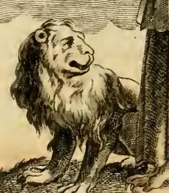

# 안드로도스(안드로클레스)와 사자

> **Q.** 안드로도스(안드로클레스)와 사자 이야기의 줄거리는?
>
> **A.** 주인의 매질을 피해 아프리카 동굴에 숨은 노예 안드로도스는 발에 가시가 박힌 사자를 치료해 주고 3년을 함께 살았다. 훗날 로마에서 맹수형에 처해졌을 때 바로 그 사자가 그를 알아보고 해치기는커녕 반겼고, 황제가 사연을 듣고 그를 사면했으며 사자는 그에게 선물로 주어져 함께 로마를 다녔다. '은혜를 기억하는 사자와 사자의 의사인 사람'으로 불렸다(겔리우스가 전한 아피온의 기록).

이 카드는 리파/오를란디 『이코놀로지아』의 **「감사의 기억 — 받은 은혜에 대하여」(MEMORIA GRATA de' benefici ricevuti, 조반니 차라티노 카스텔리니 안)** 항목에 붙은 서사 사례다. 이 항목의 의인상은 사자와 독수리 **사이에** 서는데, 사자에 배당된 이야기가 바로 안드로도스 이야기다.

---

## 1. 원문(『이코놀로지아』)의 서술

원문에서 사자·독수리를 배치하는 이유는 이렇게 시작한다.

> *Ponesi in mezzo al Leone, e all' Aquila, perchè questi animali, ancorchè privi di ragione, hanno mostrato di tener grata memoria de' benefizi ricevuti.*
> — "사자와 독수리 사이에 세우는 것은, 이 짐승들이 **이성이 없음에도** 받은 은혜에 대해 감사의 기억을 지킬 줄 안다는 것을 보여 주었기 때문이다."

이어지는 사자 이야기의 줄거리를 원문 순서대로 옮기면 다음과 같다.

1. **전거 제시.** 아울로 젤리오(아울루스 겔리우스)가 전하기를, 그리스 역사가 **아피오네(아피온)**가 글로 남긴 바, 자기는 이 일을 *"듣지 않고 자기 두 눈으로"* (*non udito, ma con gli occhi propri veduto*) 로마의 **대경기장(Cerchio massimo, Circus Maximus)**에서 맹수 사냥 공연이 열릴 때 보았다고 한다.
2. **처형장의 장면.** 안드로도(Androdo)라는 노예가 맹수들에게 던져졌다. 그중 무섭고 흉포한 사자 한 마리가 안드로도를 보자마자 **놀란 듯 멈춰 섰다가**, 다가와 *"정다운 개들이 하듯"* 꼬리를 흔들며 반기고 다리와 손을 가볍게 핥았다. 공포로 반쯤 죽어 있던 안드로도는 짐승의 애무에 정신을 되찾고 사자를 응시했고, "**서로 알아봄**(*scambievole ricognizione*)이 이루어진 듯" 사람과 짐승이 서로를 보고 기뻐하며 반가워하는 모습이었다. 관중은 경탄의 함성을 질렀다.
3. **황제 앞의 진술(회상).** 안드로도는 황제 앞으로 불려 나가 사연을 말한다. 아프리카에서 주인(그곳 프로콘술)의 **심한 매질**을 견디지 못해 도망쳐 인적 없는 들판에 숨었고, 뜨거운 햇볕을 피해 어느 **동굴**로 들어갔다. 곧 몹시 아파하며 신음하는 사자가 들어왔다. 안드로도는 겁을 냈으나, 사자는 마치 도움을 청하듯 겸손한 태도로 **한 발을 들어 그에게 내밀었다**. 피가 흐르는 발을 보고 그는 발을 잡아 **박힌 날카로운 가시(*acuto stecco*)를 뽑고 상처를 씻어 주었다.** 치료에 안심한 사자는 그를 어루만지고 그의 품에 기대 쉬었다.
4. **3년의 동거.** 그때부터 **3년 내내**(*per tre anni continui*) 둘은 같은 동굴에서 함께 살았다. 안드로도는 사자가 잡아 온 짐승을 먹었고, **불이 없었기 때문에** 그 고기의 좋은 부분을 그 지역에 끊임없이 내리쬐는 강한 **햇볕에 익혀** 먹었다.
5. **재수감과 판결.** 그런 야만적 생활에 진력이 나서, 사자가 먹이를 구하러 나간 사이 동굴을 떠나 사막을 벗어났다. 사흘을 걸은 끝에 병사 무리를 만나 신분이 드러나고, 아프리카에서 로마로 송환되어 주인 앞에 섰다. 주인은 그를 **도망 노예**로 사형에 처하기로 하고 맹수형을 명했다. 그 맹수들 가운데 **바로 그 사자**가 있었다 — 그 사자 역시 붙잡혀 로마로 끌려와 있었던 것이다.
6. **보답과 사면.** 사자는 *"받은 치료에 대한 은혜를 기억하여"*(*ricordevole del benefizio per il ricevuto medicamento*) 알아본 은인을 해치려 하지 않고 오히려 어루만졌다. 그래서 안드로도는 **형벌에서 사면**되고, **민중의 의결로 그 고맙고 정중한 사자를 선물로 받았다.** 이후 그는 가느다란 끈에 사자를 매어 로마 전역을 산책했고, 사람들이 달려 나와 외쳤다.

> ***Hic est leo hospes hominis, hic est homo medicus leonis.***
> "이것은 사람의 손님이 된 사자요, 이 사람은 사자의 의사다."

원문은 이 문장을 이야기의 종결부·명제로 삼는다. 카드 답의 "은혜를 기억하는 사자와 사자의 의사인 사람"이 바로 이 구절이다.

원문은 곧이어 **독수리** 사례 두 개(뱀에 감겨 죽어가던 독수리를 낫으로 구해 준 추수꾼이, 독을 마시려는 순간 독수리가 날아와 물그릇을 쳐서 목숨을 건진 이야기 / 세스토스의 처녀가 기른 독수리가 그녀의 화장 장작더미에 스스로 뛰어들어 함께 타 죽은 플리니우스의 이야기)를 붙이고, 사자는 지상 짐승의 왕, 독수리는 공중 짐승의 여왕이므로 **"사람이 고귀하고 도량이 크고 관대할수록 받은 은혜의 기억을 더 잘 지킨다"**로 결론을 맺는다.

---

## 2. 도상: 사자는 어떻게 그려졌나

판화(*Memoria grata de' Benefici ricevuti*, C. M. del.)에서 관찰되는 요소는 원문 설명과 정확히 대응한다.

- **머리의 관**: 열매(granella)가 촘촘히 달린 **노간주(ginepro)** 가지 관. 원문의 세 가지 이유 — ① 노간주는 벌레도 먹지 않고 늙지도 않는다(플리니우스) → 기억은 망각의 벌레를 타지 않는다, 그래서 **젊은 여인**으로 그린다, ② 노간주는 잎이 떨어지지 않는다 → 받은 은혜를 마음에서 떨어뜨리지 말라, ③ 노간주 열매·재는 실제로 기억에 좋다(카스토레 두란테).
- **오른손의 큰 못**: 격언 *Clavo trabali figere beneficium*("들보 못으로 은혜를 박아 두다") — 은혜를 **못 박아 고정하는** 집요한 기억.
- **양옆의 사자와 독수리**: 그림에서 사자는 화면 왼쪽, 독수리는 오른쪽에 배치되어 여인이 문자 그대로 *in mezzo*(가운데)에 선다.

사자의 자세를 자세히 보면 이렇다.

- **네 발을 모두 땅에 딛고 서 있다.** 포효하며 도약하는 문장(紋章)식 사자(rampant)가 아니고, 웅크린 복종 자세도 아니다. 즉 **위협도 굴복도 아닌 중립적 동반자**로 그려졌다.
- **머리를 들어 안쪽(여인 쪽)으로 돌리고 시선을 위로 향한다.** 입은 약간 벌어져 있지만 이빨을 드러낸 위협이 아니라, **올려다보며 반응하는** 얼굴이다. 오른쪽의 독수리 역시 고개를 젖혀 여인을 올려다본다 — 두 짐승이 모두 의인상을 **알아보고 응답하는** 구도다. 사자 이야기의 핵심 동작이 "알아봄"이라는 점을 도상이 자세로 번역한 셈이다.
- 흥미로운 점: **아픈 앞발을 들어 내미는 동작은 그려지지 않았다.** 이야기의 결정적 제스처(발 내밀기)를 생략하고 대신 "나란히 서서 올려다보는" 상태를 택했다. 리파식 의인상은 서사의 한 장면이 아니라 **덕의 항구적 상태**를 보여야 하므로, 치료의 순간이 아니라 **은혜가 기억으로 굳은 이후의 동반 상태**를 그린 것이다. 목줄이나 끈은 없는데, 이야기의 결말("가느다란 끈에 매어 로마를 산책했다")과 달리 여기서는 사자가 **자발적으로** 곁에 머무는 것으로 읽힌다.
- 갈기가 곱슬한 털뭉치처럼 처리되고 얼굴이 다소 사람 같은 표정을 띠는 것은, 실물 사자를 못 본 18세기 판화공의 관습적 사자 표현이다.

---

## 3. 전거 정리 — 누가 어디에 썼는가

| 전거 | 위치 | 성격 |
|---|---|---|
| **아울루스 겔리우스**, 『아티카 야화(Noctes Atticae)』 | **5권 14장** | 우리가 가진 **주된 전거**. 겔리우스는 자기 말이 아니라 아피온의 글을 **인용·발췌**한다고 명시한다. |
| **알렉산드리아의 아피온**, 『아이깁티아카(Aegyptiaca)』 5권 | 원본 소실 | 실제 저자. 1세기 그리스계 문법학자·논쟁가. |
| **아일리아누스**, 『동물 이야기(De Natura Animalium)』 | **7권 48장** | 그리스어 병행 전승. 이름을 **Ἀνδροκλῆς(안드로클레스)**로 쓴다. |
| **세네카**, 『은혜에 대하여(De Beneficiis)』 | — | 은혜·감사(beneficium–gratia) 주제의 **이론적 배경**. 은혜는 되돌려 주기 전에 먼저 **기억되어야** 한다는 로마 윤리의 기본 틀을 제공한다. |

### 아피온의 1인칭 목격담 형식

이 이야기의 형식적 특징은 **저자가 자신을 목격자로 내세운다는 점**이다. 겔리우스가 인용하는 아피온의 문장은 이렇게 시작한다.

> *In circo maximo venationis amplissimae pugna populo dabatur. Eius rei, Romae cum forte essem, spectator fui.*
> "대경기장에서 성대한 맹수 공연이 민중에게 열리고 있었다. **마침 로마에 있던 나는 그 일의 관객이었다.**"

이 때문에 리파/오를란디의 이탈리아어도 *"non udito, ma con gli occhi propri veduto"*("전해 들은 것이 아니라 자기 눈으로 본")라고 옮겨 놓았다. 겔리우스 자신은 아피온을 다른 곳에서 허풍쟁이로 평하기도 하므로, **"목격담이라고 주장한다"**까지가 정확한 서술이다. 겔리우스는 사면 대목도 *"accersitumque a Caesare Androclum"*("황제가 안드로클루스를 불러들였다")처럼 **황제를 익명의 '카이사르'로만** 언급한다 — 흔히 칼리굴라 시대로 추정하지만 원문에 이름은 없다.

### 이름 표기

- 겔리우스의 라틴어 전승: **Androdus / Androclus** (사본 계통에 따라 다르며, 리파 원문은 이탈리아어로 *Androdo*).
- 아일리아누스의 그리스어: **Ἀνδροκλῆς → Androcles**. 영어권에서 굳어진 형태가 이쪽이고, 근대 이후 "**Androcles and the Lion**"이 표준 제목이 되었다.
- 리파/오를란디 원문은 두 이름을 **한 문장에서 병기**한다: *"uno Schiavo, detto per nome Androdo, da Eliano ... chiamato Androcle"* — 즉 "겔리우스는 안드로도, 아일리아누스는 안드로클레"라고 명시한다. 카드 질문이 두 이름을 함께 쓰는 근거가 여기 있다.
- **전거 번호 주의**: 리파/오를란디 원문은 겔리우스를 *"nel 3. lib. cap. 24"*, 아일리아누스를 *"libro 8. cap. 48"*로 적었다. 오늘 통용되는 번호는 **겔리우스 5.14**, **아일리아누스 7.48**이다. 근세 판본에서 흔한 인용 번호 오류이므로, 원문을 그대로 인용할 때 이 점을 밝혀 두는 것이 안전하다.

### 아일리아누스판과의 차이

아일리아누스는 안드로클레스를 **로마 원로원 의원 집안의 노예**로 두고, 죄를 지어 리비아로 도망쳤다고 한다. 발에 박힌 것은 가시가 아니라 **날카로운 말뚝(stake)**이고, 3년 동거·생고기와 익힌 고기의 구분은 같다. 결말이 더 극적이어서, 경기장에서 **표범이 안드로클레스를 덮치자 사자가 나서서 막아 준다**. 그리고 아일리아누스는 이 일화를 **"기억은 짐승에게도 속하는 능력이다"**라는 명제의 증거로 제시한다 — 리파가 이 이야기를 「감사의 **기억**」 항목에 넣은 근거가 고전 전거 자체에 이미 있었던 셈이다.

---

## 4. 이야기의 4단 구조 — 왜 '감사의 기억'인가

| 단계 | 내용 | 장치 |
|---|---|---|
| ① **은혜(beneficium)** | 동굴에서 사자의 발에 박힌 가시를 뽑아 주고 상처를 씻어 준다 | 은혜의 **수여**. 받는 쪽이 짐승이라 계산이나 계약이 개입할 수 없다 |
| ② **시간의 간격** | 3년의 동거, 이후 이별, 사흘의 도보, 아프리카→로마 이송 | **공간과 시간의 완전한 단절**. 기억을 시험하는 공백 |
| ③ **재인(recognitio)** | 대경기장에서 사자가 멈춰 서고, 다가와 꼬리 치고 핥는다 | **핵심 계기**. 원문의 *scambievole ricognizione*(서로 알아봄) |
| ④ **보답(gratia)** | 해치지 않고 반김 → 사면 → 사자를 선물로 받음 → 함께 로마를 산책 | 은혜의 **회수**. 공개된 광장에서 인증된다 |

**이 항목의 사례로 완벽한 이유**는 무게중심이 ④가 아니라 **③에 있다는 점**이다. 만약 사자가 은인이 눈앞에 있는데도 즉시 보답했다면 그것은 '감사(Gratitudine)' 항목의 사례일 뿐이다. 그러나 이 이야기가 요구하는 것은 **3년 + 이송의 간격을 뛰어넘어 얼굴을 알아보는 능력**이다. 즉 보답이 가능하려면 먼저 **기억이 보존되어 있어야** 한다. 원문이 사자를 *ricordevole del benefizio*("은혜를 기억하는")라고 부르고, 결말 구호가 사자를 "사람의 **손님(hospes)**"이라 부르는 것도 — 손님 관계(hospitium)는 재회 시 상호 인지로 갱신되는 결속이기 때문 — 같은 초점이다.

그래서 리파의 도상 논리는 이렇게 정렬된다. **노간주** = 시간이 지나도 썩지 않고 잎을 떨구지 않는 기억, **못** = 은혜를 박아 고정하는 기억, **사자·독수리** = 이성이 없어도 기억이 작동한 증거. 세 요소 모두 "**은혜 → 시간 → 기억 → 보답**" 회로의 두 번째와 세 번째 항을 가리킨다. 원문에서 인용하는 키케로적 표현 *memoria beneficii sempiterna*("은혜에 대한 영구한 기억")가 이 항목의 표어다.

### 앞 카드 — 검은 개(아르고스)와의 대조

같은 챕터의 바로 앞 항목 **「기억(MEMORIA)」**은 중년 여인이 검은 옷을 입고, 오른손 두 손가락으로 오른쪽 귀 끝을 당기며, 왼손에 **검은 개**를 잡은 모습이다. 개를 두는 이유로 원문은 ① 개는 낯선 먼 땅에 끌려가도 혼자 길을 되찾는다, ② **"오디세우스가 20년 만에 고향에 돌아왔을 때, 떠날 때 남겨 둔 개 말고는 아무도 그를 알아보고 반기지 못했다"**를 든다(호메로스의 아르고스).

두 항목의 구조는 완전히 겹친다.

| | 개(아르고스) | 사자(안드로도스) |
|---|---|---|
| 간격 | **20년** | **3년 + 대륙 이동** |
| 계기 | 개만이 오디세우스를 **알아보고 반긴다** | 사자만이 안드로도스를 **알아보고 반긴다** |
| 표현 | *riconoscesse, ed accarezzasse* | *riconosciuto ... lo accarezzò* |
| 인간 측 | 아내·아들·하인 아무도 알아보지 못함 | 주인은 은혜는커녕 그를 **사형에 넘긴다** |
| 소속 항목 | 「기억」 = 기억 **일반**의 표상 | 「감사의 기억」 = 은혜에 특화된 기억 |

원문의 동사 선택(*riconoscere* + *accarezzare*)까지 같다. 차이는 **항목의 초점**이다. 개는 "기억력 자체"의 표상(길을 되찾는 능력이 나란히 인용된다)이고, 사자는 그 기억이 **은혜라는 대상**에 걸릴 때의 표상이다. 리파는 같은 우화 구조를 두 항목에 나누어 배치해, 「기억」에서 「감사의 기억」으로의 **종차(種差)**를 만든 것이다.

### exemplum으로서의 기능 — 인간에게 부끄러움을 주는 장치

원문이 반복하는 조건절이 결정적이다. *"ancorchè privi di ragione"*("이성이 없음에도"), *"ancorchè privi di ragione, hanno mostrato di tener grata memoria"*. 이것은 칭찬이 아니라 **비교급 수사**다.

- 짐승은 이성이 없다 → 기억과 감사는 이성의 산물이 아니다 → **이성을 가진 인간이 은혜를 잊는다면 짐승보다 못하다.**
- 두 이야기 모두에서 **인간 쪽이 배은망덕의 역할을 맡는다**. 안드로도스를 채찍질하고 끝내 맹수형에 넘긴 것은 주인이고, 추수꾼은 자기를 살려 준 독수리를 오히려 *ingratitudine*(배은망덕)으로 의심한다. 은혜를 갚는 쪽은 늘 짐승이다.
- 세네카가 『은혜에 대하여』에서 배은망덕(*ingratus*)을 가장 흔하고 가장 파괴적인 악덕으로 다루는 맥락과 정확히 맞물린다. 은혜는 되돌려 받기 위해 주는 것이 아니지만, 받은 쪽에는 **기억할 의무**가 있다는 것이 세네카식 논지이며, 짐승 *exemplum*은 그 의무의 최저 기준선을 짐승 높이에 그려 놓아 독자를 부끄럽게 만드는 장치다.
- 그래서 원문의 결론은 도덕적 상승으로 마무리된다. 사자는 땅의 왕, 독수리는 공중의 여왕이니 — **"사람이 고귀하고 도량이 크고 관대할수록 받은 은혜의 기억을 더 잘 지킨다."** 즉 감사의 기억은 하급자의 의무가 아니라 **고귀함의 표지**로 재정의된다.

---

## 5. 후대 수용

- **조지 버나드 쇼, 『안드로클레스와 사자(Androcles and the Lion)』(1912년 집필, 1913년 초연)**: 고전 우화를 초기 기독교 박해 희극으로 옮겨, 온순한 재봉사 안드로클레스가 로마 원형경기장에서 옛 사자와 재회하는 이야기로 만들었다. 이 희곡과 이후의 아동문학·애니메이션 각색 덕분에 **'Androcles'** 표기가 대중적 표준이 되었다.
- **동물우화·엠블럼 전통**: 이솝 전승에 편입되어 "감사(gratitude)" 우화로 유통되었고, 근세 엠블럼 북에서는 *gratitudo* / *memoria beneficii* 표제 아래 사자가 반복 등장한다. 리파 항목도 이 흐름 안에 있다.
- **혼동 주의 1 — 성 히에로니무스와 사자**: 사자를 곁에 둔 성인 도상은 **히에로니무스**(발의 가시를 뽑아 준 사자가 수도원에 머물렀다는 중세 전설)가 압도적으로 많다. 발의 상처를 치료해 준다는 모티프가 겹치지만, 히에로니무스 도상은 **기독교 성인전**이고 안드로도스는 **이교 고전 일화**로, 계통이 다르다. 참고로 히에로니무스 전설 자체가 사막 교부 전승(성 게라시무스와 사자)과의 이름 혼동에서 갈라져 나왔다는 지적이 있다. 리파의 사자는 성인의 사자가 **아니다** — 곁에 성인도 서재도 없고, 의인화된 추상 개념(감사의 기억)과 함께 서 있다.
- **혼동 주의 2 — 다니엘의 사자굴**: "사자가 사람을 해치지 않는다"는 결과만 보면 비슷하지만, 다니엘의 경우는 **신의 개입**이고 안드로도스의 경우는 **짐승 자신의 기억**이다. 이 차이가 「감사의 기억」 항목에서 이 이야기가 선택된 이유 자체이므로 섞으면 논지가 무너진다.

---

## 6. 한 줄 요약

**은혜(가시 뽑기) → 3년의 간격 → 재인(대경기장) → 보답(사면과 동행)**. 리파는 이 4단 구조에서 **③ 재인**을 부각시켜, 이성 없는 사자조차 은혜를 잊지 않는다는 *exemplum*으로 「감사의 기억」을 세운다. 전거는 **겔리우스 『아티카 야화』 5.14**가 인용한 **아피온의 1인칭 목격담**이며, **아일리아누스 7.48**이 병행 전승(이름 Androcles, 표범 에피소드)을 전한다. 판화의 사자는 발을 들지 않고 네 발로 서서 **의인상을 올려다보는** 자세로, 치료의 순간이 아니라 **기억이 굳은 뒤의 항구적 동반 상태**를 표현한다.
