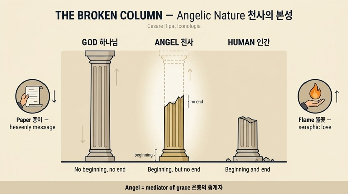

# 천사의 본성(Natura Angelica) 도상: 종이·불꽃·부러진 기둥

## 1. 도상 처방 원문

리파 『이코놀로지아』 제4권 「NATURA ANGELICA」 항목(집필: P. Fr. Vincenzio Ricci M. O.)의 처방은 다음과 같다.

> *Giovane vaga, e bella, con un raggio sulla faccia, che la ricopre. In una mano avrà una carta scritta, e nell'altra una fiamma di fuoco. Vicino le sarà un Oratorio, e sopra una colonna rotta per mezzo.*
>
> 곱고 아름다운 젊은 여인. 얼굴을 덮는 광선(raggio)이 있다. 한 손에는 **글이 적힌 종이(carta scritta)**, 다른 손에는 **불꽃(fiamma di fuoco)**을 들었다. 옆에는 **기도소(Oratorio)**가 있고, 그 위에 **가운데가 부러진 기둥(colonna rotta per mezzo)**이 있다.

즉 이 인격화의 지물(attributi)은 네 가지 + 얼굴을 가리는 광선이다. 카드가 묻는 것은 그중 세 가지, **종이 / 불꽃 / 부러진 기둥**의 뜻이다.

참고로 얼굴을 덮는 광선은 "천사가 보이지 않는 순수 영(natura invisibile, e puro spirito)이어서 우리는 그 본래 본성을 볼 수 없고, 공기로 형성한 몸을 취해 나타날 때만(quando apparisce col corpo assunto, formato di aria) 볼 수 있다"는 뜻이고, 기도소는 "천사는 창조주를 경배하고 흠숭하는 일 외에 아무것도 하지 않는다"는 뜻이다.

---

## 2. 종이(carta scritta) — 하늘의 신탁을 사람에게 전함

원문 해설:

> *Tiene in una mano una carta scritta, per segno, che vengono ad annunziare agli Uomini gli oracoli celesti, ed ispezialmente quelli, che fanno l'ultimo coro, e benché siano spiriti, pure prendono il nome di Angioli, dagli offizj, che fanno.*
>
> 한 손에 글이 적힌 종이를 든 것은, 그들이 **하늘의 신탁(oracoli celesti)을 사람들에게 알리러 온다**는 표지이며, 특히 **마지막 품계(l'ultimo coro)를 이루는 이들**이 그러하다. 그들은 (본성상) 영이지만, 자기가 수행하는 **직무(offizj)로부터** '천사(Angioli)'라는 이름을 얻는다.

포인트 세 가지.

1. **종이 = 문서화된 전언.** 구두 전언이 아니라 "글이 적힌" 종이인 것은 신탁이 위에서 이미 결정되어 내려온 것이며, 천사는 그 내용의 저자가 아니라 전달자라는 함의다. 리파는 성서 근거로 다니엘서 10:14를 붙인다 — *"Veni autem ut docerem te quae ventura sunt populo tuo in novissimis diebus"*(마지막 날에 네 백성에게 닥칠 일을 네게 알려 주려고 왔다). 가브리엘이 다니엘에게 온 장면, 즉 계시 전달의 전형이다.
2. **'천사'는 본성의 이름이 아니라 직무의 이름.** 리파가 인용하는 시편 103[104]:4 *"Qui facis Angelos tuos Spiritus, et ministros tuos ignem urentem"*(당신은 바람을 당신의 사자로, 타는 불을 당신의 종으로 삼으십니다)에 대한 아우구스티누스의 유명한 주석 — "*영(spiritus)*은 본성의 이름이고 *천사(angelus)*는 직무의 이름"(*nomen naturae spiritus est, nomen officii angelus*) — 이 그대로 반영되어 있다. 그리스어 ἄγγελος 자체가 '전령·사자'라는 뜻이다.
3. **왜 "특히 마지막 품계"인가.** 위디오니시오스 『천상 위계론』(*De caelesti hierarchia*)의 9품계 도식에서 셋째 삼조(三組)의 마지막, 즉 가장 낮은 품계의 고유 명칭이 바로 '천사(Angeli)'다. 위디오니시오스는 이 최하 품계가 인간과 가장 가까이 있어 인간에게 직접 파견되는 전령 직무를 맡는다고 설명한다(CH 9). 위계 전체는 위에서 받은 빛을 아래로 전달하는 계단이므로, 문서 전달의 마지막 구간을 담당하는 것이 최하 품계다. 히브리서 1:14도 같은 방향이다 — *"Nonne omnes sunt administratorii spiritus, in ministerium missi propter eos qui hereditatem capiunt salutis?"*(그들은 모두 시중드는 영으로서, 구원을 상속받을 이들을 위하여 봉사하도록 파견된 것이 아닙니까?).

## 3. 불꽃(fiamma di fuoco) — 세라핌은 온통 하나님 사랑의 불

원문 해설:

> *Ed i Supremi spiriti, che sono i Serafini, sono tutto fuoco, e sfavillano fiamme accese di amore inverso il loro Signore, perciò si dipinge colla fiamma in mano.*
>
> 그리고 **최상급 영들, 곧 세라핌은 온통 불(tutto fuoco)이며**, 자기 주님을 향한 **사랑으로 타오르는 불꽃을 뿜어낸다**. 그러므로 손에 불꽃을 들고 그려진다.

- **어원.** '세라핌(śərāp̄îm)'은 히브리어 어근 *śārap̄*(태우다)에서 온 말로 문자적으로 '태우는 자들'이다. 위디오니시오스는 『천상 위계론』 7장에서 세라핌의 이름을 "불태우는 자, 뜨겁게 하는 자"로 풀며, 이들이 신적 사랑에 의한 부단한 운동·열·정화의 능력을 표상한다고 한다. 이사야 6:2의 여섯 날개 세라핌이 그 성서적 원천이다.
- **불꽃은 인식이 아니라 사랑의 기호.** 스콜라 전통에서 최상급 세라핌은 *사랑(caritas)*으로, 그 아래 케루빔은 *지식(scientia)*으로 특징지어진다. 그래서 세라핌의 지물은 빛(光)이 아니라 **불꽃(火)**이다. 리파 항목의 다른 곳에서도 다마스쿠스의 요한을 인용해 "천사의 본성은 본래 가변적이지만 **영원한 사랑(la carità sempiterna)**이 그것을 썩지 않게 만들었다"고 하여, 사랑이 천사 존재의 안정 원리임을 명시한다.
- **종이와 불꽃의 짝.** 두 손의 지물은 우연한 병치가 아니라 **9품계의 양 끝**을 한 인물 안에 압축한 것이다. 왼손의 불꽃 = 위계의 정점(세라핌, 하나님을 향한 상승적 사랑), 오른손의 종이 = 위계의 최하단(천사, 인간을 향한 하강적 전달). 하나의 몸에 상·하 양극이 붙어 있으므로, 이 인물 자체가 "위와 아래를 잇는 존재"라는 다음 항목(부러진 기둥)의 논지를 미리 예고한다.

## 4. 가운데가 부러진 기둥(colonna rotta per mezzo) — 3단 존재론의 중간항

원문 해설이 핵심이다.

> *La colonna rotta per mezzo, che vi è di sopra, dinota, che quella creatura è mezzana infra noi, e Dio, qual è eterno, e senza principio, e fine, e noi temporali, che abbiamo l'uno, e l'altro; ma questi non hanno fine, ma solo principio, e perché sono mezzani, in far che riceviamo grazie dal comune Signore.*
>
> 위쪽에 있는 **가운데가 부러진 기둥**은, 이 피조물이 **우리와 하나님 사이의 중간자(mezzana)**임을 나타낸다. 하나님은 영원하시어 **시작도 끝도 없으시고**, 우리는 시간적 존재로서 **둘 다(시작과 끝) 가지는데**, 이들은 **끝이 없고 시작만 있다**. 그리고 그들이 중간자인 것은, 우리가 공통의 주님에게서 은총을 받도록 하는 일에서다.

### 4.1 세 등급의 표

| 존재 | 시작 | 끝 | 스콜라 용어 | 기둥의 형태 |
|---|---|---|---|---|
| 하나님 | 없음 | 없음 | *aeternitas* (영원) | 온전한 기둥 — 시작도 끝도 보이지 않음 |
| 천사 | **있음**(창조됨) | **없음** | *aevum / aeviternitas* (영대) | **가운데가 부러진 기둥** — 아래는 남고 위가 잘림 |
| 인간·물체 | 있음 | 있음 | *tempus* (시간) | 위아래가 다 끊긴 짧은 토막 |

이 3단 구분은 리파가 임의로 만든 것이 아니라 표준 스콜라 교설이다. 토마스 아퀴나스 『신학대전』 I, q.10, a.5는 *영원(aeternitas)* — 시작도 끝도 없고 변화의 계기 자체가 없는 신적 지속, *영대(aevum)* — 시작은 있으나 끝이 없고 본질적 변화 없이 지속하는 천사·천체의 지속, *시간(tempus)* — 시작과 끝이 있고 전후로 흐르는 지속을 구분한다. 부러진 기둥은 이 가운데 항 *aevum*의 그림 번역이다.

### 4.2 왜 "아래는 남고 위가 잘린" 형태가 '시작은 있고 끝은 없음'인가

기둥을 **아래에서 위로 읽는 수직 시간축**으로 보는 것이 열쇠다.

- **주초(基礎)·주좌가 땅에 남아 있다 → 시작이 있다.** 기둥이 바닥/대좌에 딱 붙어 서 있는 지점은 명확히 규정된 하단 경계, 즉 **기원의 순간**이다. 리파 항목은 이 시작점을 매우 구체적으로 못 박는다 — 아우구스티누스(*De Genesi ad litteram* I)를 따라 천사는 세계 창조의 시초, 곧 하나님이 *"fiat lux"*라고 말씀하신 그때 존재를 얻었다는 것이다(*Allora gli Angioli ebbero l'essere, essendo uniformi alla luce*). 하나님께는 이 하단 경계가 없다. 그러므로 천사의 기둥은 **밑동이 반드시 온전해야** 한다.
- **주두(柱頭)가 없고 축이 중동에서 끊겨 있다 → 끝이 없다.** 고전 오더에서 기둥을 '완결된 형태'로 닫아 주는 것은 위쪽의 **주두(capitello)**다. 주두는 시각적 종결부호다. 그것이 없이 축이 파단면(破斷面)으로 끝나면, 형태는 *닫히지 않고* 눈은 그 파단면 위로 계속 이어질 몸통을 상상하게 된다. 즉 **부러짐은 '종말'의 기호가 아니라 '종결의 부재'의 기호**다. 그림 안에서 끊긴 것은 기둥의 돌이지, 기둥의 관념이 아니다. 화면 위쪽으로 무한정 연장될 수 있는 미완결 축 — 이것이 "끝이 없음"의 조형적 표현이다.
- **왜 '가운데(per mezzo)'인가.** 부러진 위치가 하필 중동인 것은 이중 언어유희다. 이탈리아어 *mezzo*는 '가운데'이고, 같은 문장에서 천사를 가리키는 말이 *mezzana*(중간자)다. **기둥의 중간에서 부러졌다 = 천사가 존재의 중간항이다.** 부러진 지점 자체가 신과 인간 사이의 '중간 층'을 표시한다. 위쪽 절반(하나님께 속하는 무한)이 화면에서 소거되고 아래쪽 절반(시작을 가진 피조 부분)만 남은 형상이라고 읽어도 같은 결론이다.

주의: 흔히 부러진 기둥은 *바니타스(vanitas)*·요절·죽음(특히 19세기 묘비의 broken column)이나 굳건함의 상실을 뜻한다. 여기서는 **정반대의 독법**이다. 부러짐이 결핍이 아니라 *한계의 부재*를 표시하도록 방향이 뒤집혀 있다는 점이 이 도상의 재미이며, 시험에서 헷갈리기 쉬운 지점이다.

### 4.3 "끝이 없음"은 본성이 아니라 은총에 의한 것

리파 항목이 다마스쿠스의 요한(『정통신앙론』 II, 3)을 인용하는 대목이 이 논리를 정밀하게 만든다.

> *ricevendo l'immortalità per grazia, non per natura* — (천사는) **불사성을 본성이 아니라 은총으로 받는다.**

또 "본성상 가변적으로 창조되었으나 관상(contemplazione)에 의해 불변하게 되었다"고 한다. 즉 천사의 '끝 없음'은 하나님의 무한성과 **동종의 무한이 아니라 파생적·수여된 무한**이다. 그러므로 도상은 하나님을 온전한 기둥으로, 천사를 *부러진* 기둥으로 구별한다. 천사의 무종결성은 그 자체 안에 근거가 없고 위에서 유지되는 것이므로, 형태 역시 스스로 완결되지 못한 채 열려 있는 것이 옳다.

### 4.4 중간자 = 은총의 중개자

원문은 존재론적 중간성에서 곧바로 기능적 중간성으로 넘어간다 — *"perché sono mezzani, in far che riceviamo grazie dal comune Signore"*(그들이 중간자인 것은, 우리가 공통의 주님에게서 은총을 받도록 하는 일에서다). 성서 근거 절에서 리파는 시편 137[138]:1 *"In conspectu Angelorum psallam tibi, Deus meus"*를 들어 "다윗이 천사들 앞에서 기도하려 한 것은 그들이 은총을 중재해 주도록(acciò gl'intercedessero grazia)"이라고 덧붙인다. 히브리서 1:14의 "봉사하도록 파견된 영들"이 같은 교설의 근간이다.

여기서 세 지물이 하나의 회로로 닫힌다.

```
        하나님 (영원: 시작 없음·끝 없음)
              ↑ 불꽃 = 세라핌의 사랑, 상승
        천사 (영대: 시작 있음·끝 없음) ── 부러진 기둥 = 중간항·중개
              ↓ 종이 = 신탁 전달, 하강
        인간 (시간: 시작 있음·끝 있음)
```

부러진 기둥은 이 다이어그램의 **축**이고, 불꽃과 종이는 그 축 위를 오르내리는 **두 방향의 운동**이다. 옆의 기도소(oratorio)는 그 운동의 항구적 상태(끊임없는 흠숭)를, 얼굴을 덮는 광선은 이 모든 것이 육안에는 감춰져 있음을 표시한다.

---

## 5. 답안 압축 정리

- **종이(글이 적힌 종이)** = 천사가 하늘의 신탁을 사람에게 전하는 전령임. 특히 9품계 중 **마지막 품계**('천사')의 직무이며, '천사'라는 이름 자체가 본성이 아니라 직무에서 온 것(다니엘 10:14, 시편 103:4, 히브리서 1:14).
- **불꽃** = **최상급 세라핌**이 온통 불이며 주님을 향한 사랑으로 타오름(이사야 6:2, 위디오니시오스 『천상 위계론』 7 — '태우는 자들'). 손의 두 지물이 위계의 정점과 최하단을 함께 쥔 셈.
- **가운데가 부러진 기둥** = **시작도 끝도 없는 영원한 하나님**과 **시작과 끝을 다 가진 인간** 사이의 **중간 존재**(시작만 있고 끝은 없음, *aevum*). 밑동이 남아 있음 = 창조된 시작, 주두 없이 위가 끊겨 열려 있음 = 종결의 부재. 그 중간성 때문에 **은총의 중개자**(시편 137:1).

## 인포그래픽


