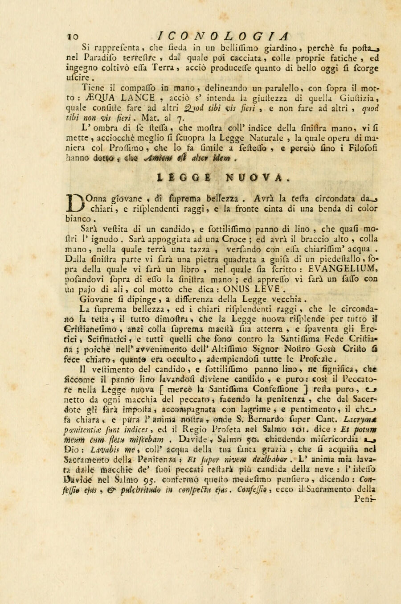

# LEGGE NUOVA (새 법 / 신약의 법)

## 카드 한 줄 정리

리파(정확히는 이 판본의 증보자 체사레 오를란디)는 **새 법**을 "빛나는 광선을 두른 지극히 아름다운 젊은 여인"으로 그렸다. 몸에 걸친 것과 손에 든 것 하나하나가 **신약의 성사(聖事)** 하나씩에 대응하며, 동시에 바로 뒤에 이어지는 **LEGGE VECCHIA(옛 법)** 항목과 항목별로 정확히 반대가 되도록 설계되어 있다.

---

## 원문 (Iconologia, Tomo Quarto, p.10 — "LEGGE NUOVA")

> DOnna giovane, di suprema bellezza. Avrà la testa circondata da chiari, e risplendenti raggi, e la fronte cinta di una benda di color bianco.
>
> Sarà vestita di un candido, e sottilissimo panno di lino, che quasi mostri l'ignudo. Sarà appoggiata ad una Croce; ed avrà il braccio alto, colla mano, nella quale terrà una tazza, versando con essa chiarissim'acqua. Dalla sinistra parte vi sarà una pietra quadrata a guisa di un piedestallo, sopra della quale vi sarà un libro, nel quale sia scritto: **EVANGELIUM**, posandovi sopra di esso la sinistra mano; ed appresso vi sarà un sasso con un pajo di ali, col motto che dica: **ONUS LEVE**.

번역: "젊은 여인, 지극한 아름다움을 지녔다. 머리는 맑고 빛나는 광선에 둘러싸이고, 이마는 흰색 띠로 감겨 있다. 속이 거의 비쳐 보일 만큼 희고 고운 아마포 옷을 입는다. 십자가에 기대어 있고, 팔을 높이 들어 손에 잔을 들고서 그 잔으로 지극히 맑은 물을 붓는다. 왼쪽에는 받침대 모양의 네모난 돌이 있고 그 위에 'EVANGELIUM(복음)'이라 쓰인 책이 놓여 있으며, 여인은 그 위에 왼손을 얹는다. 그 곁에는 한 쌍의 날개가 달린 돌이 'ONUS LEVE(가벼운 짐)'라는 표어와 함께 있다."

---

## 원문 자체가 붙여 놓은 성사적 독해

원문은 특이하게도 **"왜 이렇게 그리는가"를 요소별로 한 문단씩** 직접 해설한다. 그 해설을 표로 정리하면 다음과 같다.

| 도상 요소 | 원문이 부여한 의미 | 근거 성구 |
|---|---|---|
| **젊은 여인** | 노파로 그리는 옛 법과 구별하기 위해 (`a differenza della Legge vecchia`) | — |
| **지극한 아름다움 + 머리를 두른 빛나는 광선** | 새 법이 그리스도교 전역에 빛나며, 그 지고한 위엄으로 이단자·이교분열자를 압도하고 두렵게 함. 그리스도의 강림으로 감춰졌던 것이 밝혀지고 모든 예언이 성취됨 | — |
| **속이 비칠 만큼 고운 흰 아마포 옷** | **고해·보속(Penitenza)**. 아마포가 빨수록 희어지듯, 죄인은 고해성사와 사제가 부과한 보속을 눈물·뉘우침과 함께 수행하여 죄의 얼룩에서 정결해진다 | 성 베르나르두스 *super Cant.*: "Lacrymae poenitentiae sunt indices" / 시편 101(102):10 "Et potum meum cum fletu miscebam" / 시편 50(51):9 "Lavabis me… et super nivem dealbabor" / 시편 95(96):6 "Confessio ejus et pulchritudo in conspectu ejus" — 여기서 *confessio*는 고해성사, *pulchritudo*는 그 효과(하느님 앞에서 맑고 아름다워진 영혼) |
| **십자가에 기댐** | 옛 법은 **시나이 산**에서 주어졌으나, 새 법은 주님이 **십자가 위에서** 겪은 수난과 죽음으로 주어졌고 그것이 곧 참된 구원이자 인류의 구속(Redenzione)이다 | — |
| **잔에서 붓는 지극히 맑은 물** | **세례(Battesimo)**. 옛 법의 **할례**를 대신하는 것. 사람을 하느님의 자녀이자 천국의 상속자로 만들고, 원죄뿐 아니라 그 외 모든 죄를 지우며 영혼을 은총과 영적 선물로 채운다 | 요한 3:5 "nisi quis renatus fuerit ex aqua et Spiritu Sancto, non potest introire in Regnum Dei" |
| **이마를 두른 흰 띠(benda)** | **견진(Cresima)**. 세례의 확인(confermazione)이며, 은총과 덕을 증대시켜 사람을 굳세게 만들어 필요할 때 두려움 없이 예수 그리스도의 이름을 고백하게 하고 영적 전투에서 강하게 한다 | 사도행전 8장 (사마리아 신자들에게 안수하여 성령을 받게 한 대목) |
| **네모난 돌(받침대) 위의 EVANGELIUM 책 + 왼손을 얹음** | 이 법이 **그리스도와 그분의 지극히 거룩한 복음을 토대(fondamento)로 삼고 그 위에 놓여 있음**을 분명히 한다 | 성 바오로, 1코린 10:4 "Petra autem erat Christus" (원문 표기: `Chriſtus erat Petra`) |
| **날개 달린 돌 + ONUS LEVE** | 새 법의 **유쾌함·가벼움(piacevolezza / leggerezza)**. 그 계명이 불타는 사랑과 자애로 되어 있기 때문에 가볍고 감미롭다. 불은 가벼워 위로 날아오르며 아무리 무거운 것도 들어 올리듯, 사랑은 모든 무게를 덜고 모든 어려움을 쉽게 만들어 돌보다 무거운 마음도 날아오르게 한다 | 신명 33:2 "Veniet Dominus de Sinai, et in dextera ejus lex ignea" / 마태 11:30 "Jugum meum suave est, et onus meum leve" |

> 원문 각주 주의: 마지막 인용을 원문은 "S. Matt. cap. III"로 적었지만 이는 **마태 11:30**의 오식이다. 시편 번호도 불가타(그리스어 70인역) 번호이므로 현대 성경에서는 각각 102편·51편·96편이다.

---

## LEGGE VECCHIA(옛 법)와의 의도적 대구

새 법 항목 바로 다음에 옛 법 항목이 오며, **모든 항목이 일대일로 뒤집혀 있다.** 이 대조표가 카드 암기의 뼈대다.

| 항목 | LEGGE NUOVA (새 법) | LEGGE VECCHIA (옛 법) |
|---|---|---|
| 나이·복장 | **젊은** 여인, 흰 아마포(속이 비칠 만큼 얇음) | **노파**, 히브리식 복장, 맑게 빛나는 **청람색(turchino)** 옷 |
| 서 있는 곳 / 기댄 것 | **십자가**(갈바리아) | **아주 높은 산의 기슭**(시나이) |
| 손에 든 것 | 오른손: 맑은 물을 붓는 **잔** / 왼손: **EVANGELIUM** 책 | 왼손: **십계명 판** / 오른손: **쇠 회초리(verga di ferro)** |
| 곁의 표어 물체 | **날개 달린 돌 — ONUS LEVE**(가벼운 짐) | **큰 납덩이 공 — PONDUS GRAVE**(무거운 짐) |
| 머리 | 빛나는 광선 + 이마의 흰 띠 | (해당 없음) |
| 법의 성격 | 사랑과 자애의 계명 → 가볍고 감미로움 | 엄격·위협·공포의 계명, 두려움과 준엄한 정의의 법 |
| 대표 성구 | "Jugum meum suave est, et onus meum leve" (마태 11:30) | "Reges eos in virga ferrea" (시편 2:9) / "Deus ultionum Dominus" (시편 93[94]) / 사도행전 15:10 "Quam neque nos, neque Patres nostri portare potuimus" |

옛 법의 청람색 옷 설명도 재미있다. 모세가 시나이에서 내려와 히브리인들 앞에 나타났을 때, 어둡고 흐리던 대기가 순수하고 빛나는 하늘색으로 변했다는 데서 왔다.

---

## 도판에 관하여 (중요)

**이 항목에는 판화가 없다.** 확인 결과:

- asset의 판화 폴더에는 `_page_16` 다음이 `_page_21`로, 새 법·옛 법이 실린 페이지(원서 p.10~12) 구간의 도판 파일이 아예 존재하지 않는다.
- 원본 스캔(Internet Archive, Orlandi 증보판 *Iconologia del cavaliere Cesare Ripa, perugino*, Perugia 1764, v.4, `iconologiadelcav04ripa`)의 해당 낙장(leaf 17~20 = 원서 p.9~12)을 직접 대조해 보면, **LEGGE NATURALE에만 삽화가 있고 LEGGE NUOVA와 LEGGE VECCHIA는 삽화 없이 본문만** 이어진다. 즉 asset 추출 누락이 아니라 **원서 자체에 도판이 없다.**
- 방증: 삽화가 있는 `LEGGE NATURALE`과 `LEGGE`에는 제목 밑에 **"Di Cesare Ripa"** 부제가 붙어 있지만, `LEGGE NUOVA`·`LEGGE VECCHIA`에는 그 부제가 없다. 두 항목은 리파 원저가 아니라 **오를란디가 증보하며 추가한 항목**일 가능성이 높고, 그래서 대응 판화도 새로 새기지 않은 것으로 보인다. 그러므로 이 카드의 "리파는 …그렸는가"는 **판화가 아니라 문자로 지시한 화가용 처방(prescrizione)**을 묻는 것이다.

### fig-1 — 같은 삼부작의 유일한 판화: LEGGE NATURALE (출처: asset)

새 법의 바로 앞 항목이자 이 "법" 삼부작(자연법–새 법–옛 법) 중 **유일하게 판화가 남아 있는** 항목이다. 새 법 도상이 실제로 새겨졌다면 어떤 시각적 어법이었을지를 보여준다. 그림에서 관찰되는 것:

- **반나체의 아름다운 젊은 여인**, 기교 없이 자연스럽게 풀어 늘어뜨린 머리 — 자연법이 "지극히 단순하신 하느님이 만드셨기에 단순하다"는 뜻. 새 법이 "지극한 아름다움을 지닌 젊은 여인"인 것과 같은 미의 어법을 쓰되, 새 법은 여기에 **광선·흰 띠·흰 아마포**를 더해 초자연적 계시로 격상시킨다.
- 아래로 늘어뜨린 손에 든 **컴퍼스**와 지면에 그은 평행선, 그 곁에 새겨진 표어 **`ÆQVA LANCE`**(공평한 저울로) — 새 법 곁의 **`ONUS LEVE`**, 옛 법 곁의 **`PONDUS GRAVE`**와 똑같이, **표어를 그림 안 물체에 붙여 넣는 방식**이 이 삼부작 공통의 장치임을 보여준다.
- 정원(지상 낙원)과 나무를 배경으로 삼는 구도 — 새 법에서 배경 자리를 차지하는 것이 바로 **여인이 기대선 십자가**다.

### fig-2 — LEGGE NUOVA 본문이 실린 원서 페이지 (출처: 웹 / Internet Archive)

**출처 명시:** 이 이미지는 asset 폴더가 아니라 웹에서 가져온 것이다 — Internet Archive, `iconologiadelcav04ripa` (Cesare Ripa / Cesare Orlandi 증보, *Iconologia del cavaliere Cesare Ripa, perugino*, Tomo Quarto, Perugia: Piergiovanni Costantini, 1764), leaf 17 = 인쇄 페이지 10. asset에 해당 판화가 존재하지 않음을 확인시켜 주는 원본 지면이며, 페이지 중간 `LEGGE NUOVA.` 표제 아래에 **삽화 없이 곧바로 본문(`DOnna giovane, di suprema bellezza…`)이 시작**되고, 상단의 `ÆQUA LANCE`(자연법 마무리), 본문 중의 대문자 **`EVANGELIUM`**·**`ONUS LEVE`**를 육안으로 확인할 수 있다.

---

## 암기 팁

- **머리에서 발끝으로 성사 순서**: 광선(영광) → 이마의 흰 띠 = **견진** → 흰 아마포 옷 = **고해** → 잔의 물 = **세례**. 즉 옷차림 세 가지가 곧 성사 세 가지다.
- **양손 나누기**: 든 손(오른쪽) = **잔/세례**, 왼손 = **EVANGELIUM 책/토대**. 옛 법은 정확히 반대로 왼손 = 십계명 판, 오른손 = 쇠 회초리.
- **돌 두 개를 헷갈리지 말 것**: 새 법 쪽 돌은 두 종류다. ① 책을 받치는 **네모난 돌(pietra quadrata)** = 반석이신 그리스도, ② 곁에 놓인 **날개 달린 돌(sasso con un pajo di ali)** = ONUS LEVE. 옛 법 쪽에는 **납덩이 공** 하나뿐이고 표어는 PONDUS GRAVE.
- **표어 한 쌍**: `ONUS LEVE` ↔ `PONDUS GRAVE`. 둘 다 "짐"이지만 하나는 날개를 달았고 하나는 납이다.
- **장소 한 쌍**: 시나이(산) ↔ 갈바리아(십자가). "옛 법은 산에서, 새 법은 십자가에서 주어졌다."
