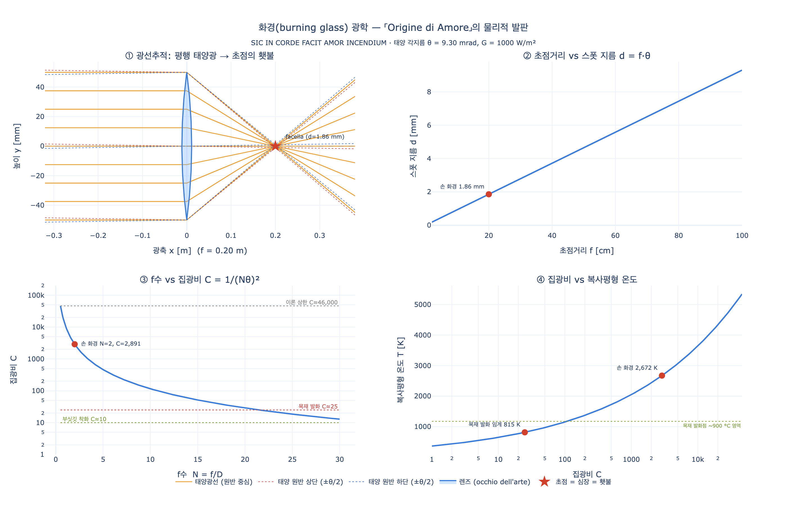

# 사랑의 기원(Origine di Amore) — 화경(火鏡) 비유 읽기

> **Q.** 사랑의 기원 도상의 비유는 무엇을 말하는가?
>
> **A.** 기술의 눈인 렌즈가 태양의 눈을 마주해 광선을 통과시켜 횃불을 붙이듯, 자연의 거울인 우리 눈이 아름다운 태양(연인의 눈)을 마주하면 그 빛의 광선이 지나가 심장에 사랑의 횃불이 켜진다는 것이다. 횃불이 심장 쪽인 왼손에 들린 것도 그 때문이다. 베스타 처녀들이 이런 거울로 하늘의 불을 받아 꺼진 성화를 다시 켰고, 아르키메데스가 이것으로 배들을 태웠다는 일화도 곁들여진다.

이 항목은 체사레 리파 『이코놀로지아』(18세기 페루자판) 제4권의 「ORIGINE DI AMORE」 절이며, 집필자는 리파 본인이 아니라 **조반니 차라티노 카스텔리니(Giovanni Zaratino Castellini)** 다. 17세기 판본부터 리파 사전에 대량 증보를 넣은 인물로, 이 항목은 그의 특징대로 도상 설명 한 문단 + 문헌 고증 대여섯 페이지 구조를 갖는다.

---

## 1. 도판에서 무엇이 보이는가


원문의 지시(descrizione)와 판화를 하나씩 맞춰 보면 다음과 같다.

| 원문 지시 | 판화에서 확인되는 것 | 의미 담당 |
|---|---|---|
| *incontro all'occhio del Sole* — "태양의 눈을 마주하여" | 화면 **우상단의 인격화된 태양**(얼굴이 그려진 원반 + 빗살 광선) | 광원 = 연인의 눈 |
| *specchio trasparente rotondo, grosso e corpulento* — "둥글고 두껍고 살집 있는 투명한 거울" | 여인이 **오른손을 들어** 태양 쪽으로 겨눈 **손잡이 달린 원반**. "투명하고 두껍다"는 것이 결정적이다 — 이건 반사경이 아니라 **볼록렌즈(화경, burning glass)** 다 | 기술의 눈 (*occhio dell'arte*) |
| *accenda una facella, portata nella mano sinistra* — "왼손에 든 횃불을 붙인다" | 여인의 **왼손**(몸 안쪽, 낮은 위치)에 든 **횃불/막대** | 심장에 붙는 사랑의 불 |
| *dal manico dello specchio penda una cartella* — "거울 손잡이에 리본이 매달려" | 손잡이에서 아래로 길게 늘어진 **뱀처럼 구불거리는 리본**, 새김: **SIC IN CORDE / AMOR INCENDIVM** | 모토 |
| — | 좌하단의 **건물과 지평선**, 좌하단 서명 **C.M. del.** | 페루자판 삽화가의 배경·서명 |

두 가지 세부가 특히 중요하다.

**(1) 왼손이라는 것.** 원문은 명시적으로 *"la facella posta nella mano sinistra, **dal lato manco del cuore**"* — 횃불이 왼손에 있는 이유는 왼쪽이 심장 쪽이기 때문이다. 즉 왼손은 해부학적 위치를 통해 "심장"을 대신 가리키는 지표다. 오른손(렌즈=눈)과 왼손(횃불=심장)이 한 사람 몸 안에서 **눈 → 심장**의 경로를 공간적으로 그려 놓은 셈이다.

**(2) 리본의 문구가 본문과 다르다.** 본문 모토는 **SIC IN CORDE FACIT AMOR INCENDIUM**("이렇게 사랑은 심장에 화재를 일으킨다")인데, 판각된 리본에는 동사 *FACIT*이 빠진 축약형이 들어가 있다. 리본 폭에 맞춘 판각상의 생략으로, 판본 대조 시 흔히 나오는 종류의 불일치다. 모토 자체는 카스텔리니가 밝히듯 **플라우투스**의 *"Ita mihi in pectore atque in corde facit amor incendium"*(『메르카토르』)에서 따온 것이다.

---

## 2. 비유의 문장 구조 — 원문 그대로

핵심은 딱 한 문장이다. 카스텔리니는 스스로 *"La presente figura è una **similitudine**"*("이 도상은 하나의 비유다")라고 못 박고 다음처럼 쓴다.

> siccome per lo specchio, **occhio dell'arte**, posto incontro all'occhio del Sole, passando i raggi solari si accende la facella, così per gli occhi nostri, **specchi della natura**, posti incontro all'occhio di un bel Sole, passando i raggi della sua luce, la facella di amore **nel cuor** si accende.

즉 완전한 4항 비례식이다.

```
        렌즈 : 태양      =      우리 눈 : 연인의 눈
   (occhio dell'arte)          (specchi della natura)
        ↓ 광선 통과                ↓ 광선 통과
      초점의 횃불          =        심장의 사랑
```

`기술(arte)`과 `자연(natura)`을 대립시켜 짝지은 것이 이 비유의 뼈대다. 렌즈는 인간이 만든 인공 눈이고, 눈은 자연이 만든 렌즈다 — 그러니 같은 광학 법칙이 양쪽에 다 적용된다는 논법이다.

### 왜 "심장"인가 — 태양 = 세계의 심장

카스텔리니는 켈리우스 로디기누스(Lodovico Ricchieri, *Lectiones antiquae* 8권 23장)를 끌어와 한 겹 더 쌓는다. **태양은 세계의 심장**이어서 순환하며 빛을 뿌리고 빛을 통해 힘을 땅에 퍼뜨린다. 마찬가지로 **우리 심장**은 끊임없이 움직여 피를 흔들고, 거기서 *spiriti*(정기)를 온몸으로 퍼뜨리며, 특히 **눈**을 통해 광선의 불꽃을 내보낸다 — 눈이 신체 부위 중 가장 투명하고 반짝이기 때문이다. 이 대응(태양:세계 = 심장:신체) 덕분에 "태양광선이 초점에 모인다"가 "연인의 시선이 심장에 도달한다"로 번역될 수 있다.

이 생리학은 **마르실리오 피치노**의 『향연 주해(De amore)』 제7강연에서 그대로 온 것이다. 카스텔리니는 장까지 인용한다.
- 7강 4장: 심장의 열이 가장 순수한 피에서 *spiriti*를 만들고, 피가 그렇듯 정기도 자기와 닮은 광선을 **"유리창 같은 눈(gli occhi, come finestre di vetro)"**으로 내보낸다.
- 7강 10장: **눈이 사랑병의 전(全) 원인**이다. 두 사람이 시선을 고정해 *"빛을 빛에 잇대면(congiungono i lumi con lumi)"* 그것으로 사랑을 마셔 버린다. 다른 신체 부위의 조화는 원인(cagione)이 아니라 **계기(occasione)** 일 뿐이며, *"오직 눈의 마주침만이 상처를 준다"*.

여기서 카스텔리니가 절의 앞부분(청각으로도 사랑에 빠지는가?)에 길게 매달렸던 논쟁이 정리된다. 보카치오·페트라르카·아테나이오스(자리아드레스와 오다테)·조프레 뤼델(트리폴리 백작부인) 사례들은 "소문만 듣고 사랑에 빠짐"의 증거로 보이지만, 카스텔리니의 결론은 **청각은 occasione, 시각만이 cagione**다. 들은 미모는 상상 속에 상(像)으로 새겨져 "보는 것 같은" 상태를 만들 뿐이고, 실제로 보아 확인되지 않으면 사랑은 뿌리내리지 않는다(*Minuit præsentia famam*). 광학 비유로 옮기면: **렌즈를 태양 쪽으로 정확히 "마주 세우지(incontro)" 않으면 불은 안 붙는다.**

---

## 3. 화경(burning glass) 광학의 실제 원리

이 부분은 비유가 아니라 실제로 작동하는 물리다.

### 3-1. 평행광 + 볼록렌즈 → 초점

얇은 렌즈 공식은

$$\frac{1}{f} = \frac{1}{s_o} + \frac{1}{s_i}$$

이고, 태양은 사실상 무한히 멀다($s_o \to \infty$)므로 $s_i = f$ — **상은 초점면에 생긴다.** 렌즈에 들어온 모든 평행광선이 초점면 위 한 점 근처로 모인다.

### 3-2. 초점의 스폿은 점이 아니다

여기가 흔히 빠지는 함정이다. 태양은 점광원이 아니라 지구에서 **각지름 약 0.53° ≈ 9.3 mrad**로 보이는 원반이다. 따라서 초점면에 생기는 것은 점이 아니라 태양의 **작은 실상(image)** 이고, 그 지름은 기하광학적으로

$$d = f \cdot \theta_{\odot}, \qquad \theta_{\odot} \approx 9.3 \times 10^{-3}\ \text{rad}$$

예: $f = 20\ \text{cm}$ 렌즈 → $d \approx 1.9\ \text{mm}$. 초점거리가 길어지면 스폿도 **비례해서** 커진다. 렌즈를 앞뒤로 움직이며 "가장 작은 점"을 찾는 행위가 바로 이 초점면을 찾는 것이다.

### 3-3. 집광비와 f수

지름 $D$의 렌즈가 받은 빛이 지름 $d$의 스폿에 모이면, 조도(irradiance) 증배율 = 면적비 =

$$C = \left(\frac{D}{d}\right)^2 = \left(\frac{D}{f\,\theta_{\odot}}\right)^2 = \frac{1}{(N\,\theta_{\odot})^2}, \qquad N \equiv \frac{f}{D}$$

**결론: 집광비는 렌즈의 절대 크기가 아니라 f수($N$)로 결정된다.** 큰 렌즈가 세지는 게 아니라 **"밝은"(f수 작은) 렌즈**가 센 것이다. 지름 10 cm·초점거리 20 cm($N=2$) 렌즈면

$$C = \frac{1}{(2 \times 0.0093)^2} \approx 2.9 \times 10^{3}$$

지표면 태양조도 $G \approx 1000\ \mathrm{W/m^2}$을 곱하면 스폿에서 **약 2.9 MW/m²**. 목재·종이의 자연발화에 필요한 열유속이 대략 $25\text{–}30\ \mathrm{kW/m^2}$이므로 **100배 여유**다. 그래서 실제로 손에 드는 렌즈로 부싯깃을 붙이는 데는 몇 초도 안 걸린다. 도판의 여인이 하는 일은 물리적으로 전혀 무리가 없다.

이론 상한은 $C_{\max} = 1/\sin^2(\theta_\odot/2) \approx 4.6 \times 10^4$ (공기 중, 굴절률 1). 복사평형 온도는 스테판–볼츠만으로

$$T = \left(\frac{C\,G}{\varepsilon\sigma}\right)^{1/4}$$

$C=2900$이면 $T \approx 2.6 \times 10^3\ \mathrm{K}$ 수준 — 나무는 물론이고 금속도 녹는 영역이다(실제로는 대류·전도 손실로 이보다 낮다).

---

## 4. 곁들여진 두 일화의 사료적 신빙성

카스텔리니는 화경의 권위를 세우기 위해 **네 개의 전거를 사슬처럼** 잇는다: 오론스 피네(이론) → 플루타르코스/베스타(종교) → 조나라스/프로클로스(전쟁) → 아르키메데스(원조). 각각을 따로 뜯어볼 필요가 있다.

### 4-1. 오론스 피네 『De speculo ustorio』(파리, 1551)

*"lo specchio è di quella sorte, de' quali ragiona Oronzio Fineo nel suo Trattato de speculis usoriis"* — 프랑수아 1세의 수학자 오론스 피네(Oronce Fine, 1494–1555)의 실제 저작이며, 프랑스에서 출판된 최초기 광학서 중 하나다. 다만 **제목이 이미 답을 말한다: *speculum ustorium*, "태우는 거울"** 이고, 내용은 **포물면 반사경**으로 태양의 빛과 열을 강화하는 이론이다.

### 4-2. 베스타 성화 재점화 (플루타르코스 『누마』 9)

전승 자체는 실재한다. 플루타르코스는 성화가 꺼졌을 때(아리스티온 시절 아테네, 메디아인의 델포이 신전 방화, 미트리다테스 전쟁과 로마 내전 등) **다른 불에서 옮겨 붙이는 것을 금하고 태양 광선에서 순수한 새 불을 받아야 한다**고 전한다. 그리고 그 도구를 구체적으로 묘사한다 — **직각이등변삼각형의 두 변이 만드는 곡면을 가진 금속 오목경**으로, 원주에서 중심의 한 점으로 광선을 수렴시켜, 그 점에 놓인 가볍고 마른 것이 즉시 타오른다는 것이다.

즉 플루타르코스의 기구는 **투명한 렌즈가 아니라 금속 오목거울**이다.

### 4-3. 아르키메데스 거울 — 사료적으로 매우 약하다

*"de' quali Archimede ne fu prima inventore contro i Romani, che assediavano Siracusa"* — 카스텔리니는 아르키메데스를 화경의 **최초 발명자**로 단정하지만, 사료 상황은 다음과 같다.

- 시라쿠사 공방전(기원전 213–212)에 대해 상세히 쓴 **폴리비오스, 리비우스, 플루타르코스**는 아르키메데스의 각종 방어 기계는 언급하면서 **불태우는 거울은 전혀 언급하지 않는다.**
- 아르키메데스의 현존 저작에도 없다.
- 루키아노스(2세기)가 로마 함선이 "기술적 수단(artificial means)"으로 불탔다고 막연히 적은 것이 가장 이른 암시이고, **거울로 특정한 최초 기록은 6세기 트랄레스의 안테미오스** — 사건 후 약 700년이다.
- 카스텔리니가 인용한 **요안네스 조나라스는 12세기** 비잔티움 사가이며, 그가 전하는 것도 사실은 **515년 아나스타시우스 황제에 대한 비탈리아누스의 반란 때 수학자 프로클로스가 콘스탄티노플에서 함선을 태웠다**는 이야기다. 아르키메데스 원조설은 그 이야기의 부록으로 붙어 있다.
- 근대 이후 데카르트를 비롯해 계속 의심받았고, MIT 실험(2005)과 *MythBusters*의 반복 재현에서도 **정지·건조 표적을 다수의 거울로 완벽한 조준·맑은 하늘 조건에서** 겨우 발화시킬 수 있었을 뿐, 전투 조건에서는 재현되지 않았다.

물리적으로 왜 어려운지도 §3-2의 식으로 바로 나온다. 표적이 50 m 떨어져 있으면 스폿 지름은 $d = 50 \times 0.0093 \approx 0.47\ \text{m}$로 커지고, 그 넓은 스폿에 발화 열유속을 채우려면 수 m² 이상의 거울 면적을 **전부 같은 점에 겹쳐 조준**해야 하며, 태양의 이동과 파도의 흔들림을 상대로 **수십 초~수 분 동안 조준을 유지**해야 한다. 게다가 그 정도 거리면 이미 화살·투석 사거리 안이다.

### 4-4. 그래서 이 인용 사슬의 문제

| 카스텔리니가 말한 것 | 실제 | 어긋남 |
|---|---|---|
| "이런 거울(*simili specchi*)"로 베스타 성화를 다시 켰다 | 플루타르코스의 기구는 **금속 오목경**(반사) | 도판의 물건은 두껍고 **투명한** 렌즈(굴절) |
| 오론스 피네가 논한 그 거울 | 피네의 책은 **포물면 반사경** 이론 | 같은 혼동 |
| 아르키메데스가 배를 태웠고 그가 원조 | 동시대 사료 전무, 최초 언급은 6세기 | 전승을 사실로 취급 |
| — | 조나라스의 실제 주인공은 **프로클로스(515년)** | 아르키메데스에 소급 |

핵심은 **굴절(렌즈)과 반사(오목거울)의 혼동**이다. 이탈리아어 *specchio*가 "거울"과 "렌즈/유리 원반"을 뭉뚱그려 쓸 수 있었다는 어휘 사정도 있지만, 결과적으로 카스텔리니는 성질이 다른 두 장치를 하나로 묶어 놓았다. 다만 **비유의 논리에는 이 혼동이 오히려 유리하다** — 도상은 "광선이 유리를 **통과해서(trapassando per mezzo dello specchio)**" 불을 붙여야 하고, 그래야 "광선이 눈을 **통과해** 심장에 닿는다"는 그림이 성립한다. 반사경이라면 광선이 되돌아 나오므로 "눈을 지나 안으로 들어간다"는 서사가 깨진다. **비유의 요구가 광학의 정확성을 눌렀다**고 보는 것이 온당하다.

---

## 5. 광학(자연학) → 연애 심리(도덕학)로의 전용 구조

이 항목이 흥미로운 진짜 이유는, 16–17세기 엠블럼 문화가 **자연학 지식을 도덕학의 증명으로 쓰는** 전형적 수법을 여기서 아주 노골적으로 보여 준다는 점이다. 전용은 대략 네 단계로 진행된다.

**(1) 자연학적 사실 확보.** 볼록렌즈는 실제로 불을 붙인다. 누구나 검증 가능한 물리 현상이고, 게다가 눈으로 볼 수 있다. 이것이 논증의 "관찰 가능한 발판"이다.

**(2) 권위로 격상.** 그 사실에 베스타 성화(신성)와 아르키메데스(고전 학문의 영웅)를 붙여, 단순한 도구를 **경외의 대상**으로 만든다. 사료적 검증은 목적이 아니다 — 엠블럼의 인용은 진위 판정이 아니라 **위엄 부여(auctoritas)** 를 위한 장치다.

**(3) 구조적 동형(isomorphism) 주장.** *occhio dell'arte* / *specchi della natura* 라는 짝을 세워, 렌즈와 눈이 같은 종류의 물건이라고 선언한다. 이 한 걸음이 전용의 핵심이며, 여기서 논리가 은유로 넘어간다. 뒷받침은 피치노의 *spiriti* 생리학과 "태양 = 세계의 심장" 우주론이다. 즉 **은유가 아니라 실제로 같은 메커니즘이라고 주장**하는 것이 르네상스 플라톤주의의 방식이다.

**(4) 도덕적 함의 추출.** 광학 법칙의 세부가 그대로 연애의 규범이 된다.

| 광학 | 도상 요소 | 연애 심리 | 도덕적 함의 |
|---|---|---|---|
| 태양(광원) | 우상단 인격 태양 | 연인의 눈 = *un bel Sole* | 미(美)가 원인이지 욕망이 원인이 아니다 |
| 평행 태양광선 | 빗살 광선 | 시각적 *spezie* / *spiriti* | 사랑은 실체가 전달되는 물리 과정 |
| 렌즈(굴절체) | 오른손의 투명 원반 | 우리 눈 | 눈은 통로가 아니라 **집광 장치**다 |
| 정확한 정렬 *incontro* | 태양을 향해 든 팔 | **시선의 마주침** *rincontro degli occhi* | 마주치지 않으면 불은 안 붙는다 → 소문(청각)은 계기일 뿐 |
| 초점 | 광선 수렴점 | 심장 | 사랑의 자리는 심장이며 거기서 갇힌다 |
| 착화된 횃불 | 왼손의 *facella* | *incendium*, 사랑의 화재 | 시작은 한순간, 결과는 지속되는 연소 |
| 초점거리·f수 | (도판엔 없음) | 응시의 집중·근접 | 강도는 거리와 집중에 달렸다 |

카스텔리니가 이 대응을 얼마나 문자적으로 밀고 나가는지는 뒷부분에서 드러난다. 그는 사랑이 눈에서 심장으로 가는지, 아니면 **눈 → 머리(생각) → 심장**으로 가는지를 진지하게 따진다. 이성과 정신은 머리에 있고(플루타르코스 『플라톤 문제』, 제논), 머리카락은 생각의 상형문자이며, 생각이 무거우면 고개가 숙여진다(아리오스토의 사크리판테, 호메로스의 오디세우스) — 그러나 결론은 **"격렬하고 폭력적인 사랑은 생각에게 시간을 주지 않고, 단 한 번의 눈길로 곧장 눈을 지나 심장으로 간다"**. 광학의 즉시성(빛은 순간에 도달한다)이 심리학의 즉시성(사랑은 첫눈에 온다)을 정당화하는 것이다. 마지막으로 영혼은 **거미가 거미줄 중앙에 앉아 있듯**(칼키디우스) 심장 중심에 앉아 있고, 그래서 눈은 창처럼 열려 있어 느끼지 못하지만 심장만이 느낀다.

### 다만 남는 균열

비유는 완전히 정합적이지 않다. **렌즈 모델은 빛이 들어오는 수용(intromission) 모델**인데, 피치노–플라톤 계열 생리학은 **눈이 광선을 쏘아 보내는 방출(extramission) 모델**이다. 카스텔리니 자신이 *"눈이 상대의 눈에 자기 광선의 화살을 쏜다(saetti … le frezze de' raggi suoi)"*, *"빛을 빛에 잇댄다"*고 쓴다. 즉 도상은 **단방향 집광**을, 본문은 **쌍방향 광선 교환**을 그린다. 이 균열이 오히려 이 항목의 성격을 잘 말해 준다 — 도상은 하나의 깔끔한 물리 장면을 요구하고, 텍스트는 계승한 문헌 전통 전체를 담아야 하므로, 둘이 완전히 맞물리지 않는다.

또 하나: 무세오스(무사이오스)의 헤로와 레안드로스 인용에서 원문이 이미 *"눈길의 광선 속에서 사랑의 횃불(Fax Amorum)이 자라났다"*, *"눈은 길이다(Oculus vero via est)"* 라고 말한다. 프로페르티우스의 *"Si nescis, oculi sunt in amore duces"*(모른다면 알려 주지: 사랑에서 안내자는 눈이다)도 같다. **카스텔리니의 발명은 "사랑은 눈에서 온다"는 진부한 명제가 아니라, 그것을 화경이라는 검증 가능한 장치 하나로 시각화한 것**이다. 그래서 도판이 필요했고, 두껍고 투명한 원반이 필요했다.

---

## 6. 한 줄 정리

렌즈가 태양을 마주해 광선을 초점에 모아 불을 붙이는 **실제 광학 현상**을, "눈(자연의 렌즈)이 연인의 눈(태양)을 마주해 광선을 심장(초점)에 모아 사랑의 불을 붙인다"는 **연애 심리의 증명**으로 전용한 도상이다. 왼손 횃불은 심장의 위치를, 모토 *SIC IN CORDE FACIT AMOR INCENDIUM*은 결론을, 베스타·아르키메데스 일화는 장치의 위엄을 담당한다. 다만 인용된 전거들은 실제로는 모두 **오목거울(반사)** 이야기이며 아르키메데스 일화는 동시대 사료가 없는 후대 전승이므로, 이 절은 **광학사의 자료로는 신뢰할 수 없고 엠블럼 논증술의 표본으로 읽어야** 한다.

---

## 7. 참고

- 원문: `.fm/assets/12 Honor to Origin of Love.md`, 「ORIGINE DI AMORE, Di Giovanni Zaratino Castellini」 절 / 도판 `_page_292_Picture_3.jpeg`
- 인용된 1차 문헌: 플라우투스 『메르카토르』 · 플루타르코스 『누마』 9 · 무사이오스 『헤로와 레안드로스』 · 프로페르티우스 · 오비디우스 · 헬리오도로스 『아이티오피카』 3권 · 칼키디우스 『티마이오스 주해』 · 아테나이오스 13권
- 인용된 근세 문헌: 마르실리오 피치노 『향연 주해(De amore)』 7강연 4·10장 · 켈리우스 로디기누스 『Lectiones antiquae』 8권 23장 · 오론스 피네 『De speculo ustorio』(1551) · 요안네스 조나라스 『역사 요약』 · 피에리오 발레리아노 『Hieroglyphica』
- [Plutarch, *Numa* 9 (Perseus)](http://www.perseus.tufts.edu/hopper/text?doc=Plut.+Num.+9&lang=original)
- [Oronce Fine, *De speculo ustorio* (Gallica)](https://gallica.bnf.fr/ark:/12148/bpt6k67997k.image)
- [Oronce Fine's *De speculo ustorio* — Historia Mathematica](https://www.sciencedirect.com/science/article/pii/0315086076900082)
- [Archimedes' heat ray (Wikipedia)](https://en.wikipedia.org/wiki/Archimedes%27_heat_ray)

## 시각화

`expy.py`를 실행하면 얇은 렌즈 광선추적, 초점거리에 따른 스폿 크기·집광비 변화, 발화 임계선을 함께 그린 그래프가 생성된다.


