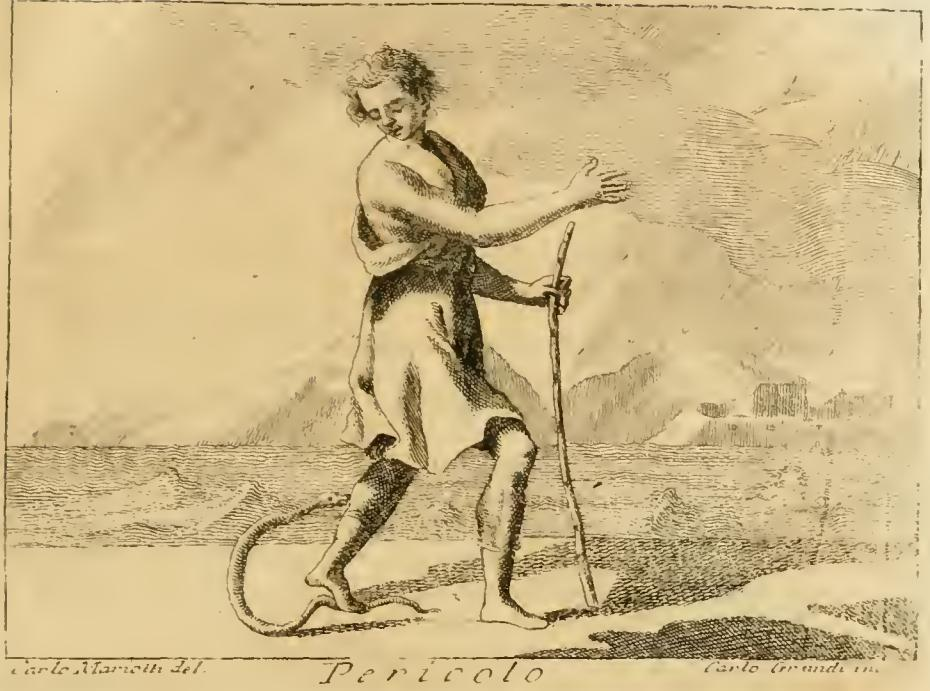
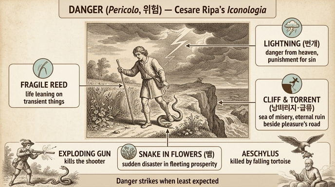

# 위험(Pericolo) 도상 — 각 요소가 가르치는 것

체사레 리파(Cesare Ripa)의 『이코놀로지아(Iconologia)』에 실린 **위험(Pericolo)** 의인상은, 꽃이 만발한 길을 걷다가 뱀을 밟은 **젊은이**의 모습으로 그려진다. 리파는 이 도상을 이렇게 지정한다:

> 풀과 꽃이 가득한 길을 걷다가 뱀을 밟은 젊은이. 뱀은 몸을 돌려 사납게 그의 다리를 물려는 자세다. 오른쪽에는 낭떠러지(precipizio), 왼쪽에는 급류(torrente)가 있고, 그는 연약한 갈대(debol canna)에 몸을 기대고 있으며, 하늘에서는 번개(folgore)가 떨어진다.

*판화(Carlo Marcotti 그림, Carlo Grandi 판각): 지팡이처럼 가는 갈대에 기댄 젊은이가 발밑의 뱀에게 물리려는 순간을 내려다보고 있다. 배경 왼쪽에 물결치는 급류(바다), 오른쪽에 험한 지형이 보인다 — 본문이 말하는 "물에서도 뭍에서도" 도사린 위험의 무대장치다.*

## 왜 하필 "젊은이"인가

젊은이든 노인이든 삶은 다 불확실하지만("너희는 그 날과 그 때를 알지 못하니 깨어 있으라"), 리파는 **젊은이가 노인보다 더 큰 위험에 놓여 있다**고 말한다. 대담함(audacia)·만용(ardire)·혈기(vigore) 때문에 무모하게 무수한 위험 속으로 뛰어들기 때문이다. 그래서 위험의 의인상은 젊은이다.

## 각 요소와 그 의미

| 도상 요소 | 가르침 |
|---|---|
| **꽃길의 뱀** | 이 세상의 덧없는 번영(caduche prosperità)이라는 꽃길을 걷는 인간은, 전혀 생각지 못한 순간에 갑작스러운 재난에 짓눌린다 |
| **낭떠러지와 급류** (꽃길 좌우) | 쾌락과 세속적 즐거움의 길로 이 비참한 인생을 지나는 동안, 물에서나 뭍에서나 똑같이 위험하다. 분별없이 걷다가는 **비참의 바다(mare delle miserie)** 에 빠지거나 **영원한 멸망의 벼랑(precipizio dell'eterna dannazione)** 에 떨어진다 |
| **연약한 갈대** (기대는 지팡이) | 인생의 연약함(fragilità). 우리 삶은 참된 칭송과 가치 있는 것이 아니라 **덧없는 것(cose caduche)에 자꾸 기대기** 때문에 끊임없이 위험 속에 있다 |
| **하늘에서 떨어지는 번개** | 위험은 땅과 물에서만 오지 않고 **하늘로부터도** 온다. 하느님은 때로 우리의 죄(demeriti)에 대한 징벌로 사고와 불운을 허락하신다 — 바울의 말대로 "죄가 장성한즉 사망을 낳느니라"(*Peccatum cum consummatum fuerit generat mortem*, 야고보서 1:15 인용). 인간의 힘으로는 만물에 법과 한계를 주신 분의 권능에 맞설 수 없다 |

핵심 구조는 **"안심하고 걷는 길(꽃·풀) 곳곳에 사방(발밑·좌우·기댈 곳·하늘)에서 위험이 도사린다"** 는 것이다.

## 곁들여진 두 일화 — "뜻하지 않은 위험"의 실례

1. **바냐카발로(Bagnacavallo)의 젊은이 실화**: 화창한 들판을 걷던 젊은이가 뱀을 발견하고 어깨의 화승총(archibugio)으로 조준해 쏘려 했는데, **총이 터져(crepatosi) 뱀 대신 자기가 죽고 뱀은 도망갔다**. 리파는 이를 "뜻하지 않은 위험(inopinato pericolo)의 생생한 본보기"라 부르며, 아카데미 회원 필로포노(Filopono)의 추모 에피그램(1615년 12월, 옥타비우스 토마시니우스를 기림)을 싣는다. 나아가 위험의 도상에 화승총을 덧붙여도 어울린다고 말한다 — 총만큼 위험한 도구가 없어서, 적뿐 아니라 쏘는 이의 뜻과 달리 친구·친척·주인 자신까지 죽이기 때문이다.

2. **시인 아이스킬로스(Eschilo)의 죽음**: 비극 시인 아이스킬로스는 죽음이 예언된 날 위험을 피하려고 **탁 트인 들판**으로 나갔지만, 독수리가 공중에서 발톱에 쥐고 가던 **거북**을 그의 벗어진 머리를 돌로 착각해 떨어뜨리는 바람에, 두려워하던 바로 그 날에 죽었다(플리니우스 『박물지』 10권 전거). — 번개 요소가 말하는 "하늘로부터 오는, 인간이 저항할 수 없는 위험"의 예다.

이 두 일화는 공통적으로, 위험을 **피하려는 행동 자체가 죽음의 통로**가 되었다는 점에서 도상의 교훈(위험은 예측·저항 불가)을 압축한다.

## 암기 포인트

- 뱀 = 꽃길(덧없는 번영)의 **불시의 재난**
- 급류/낭떠러지 = 쾌락의 길 좌우, **비참의 바다 / 영원한 멸망의 벼랑**
- 갈대 = 덧없는 것에 기대는 **인생의 연약함**
- 번개 = **하늘에서 오는 위험**, 죄에 대한 징벌
- 실화·일화 = 터진 총(뱀 대신 자기가 죽음), 아이스킬로스(독수리가 떨어뜨린 거북)

## 인포그래픽

