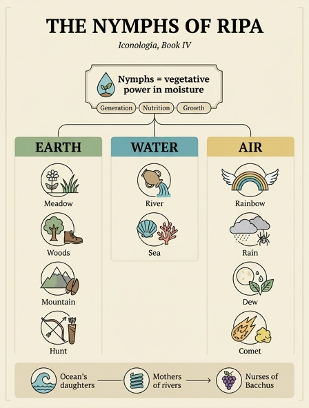

# 님프(Ninfe) — 우의(allegoria)로서의 뜻

## 카드

**Q.** 님프(Ninfe)들은 우의적으로 무엇을 뜻하는가?

**A.** 자연의 작용, 곧 준비된 수액(습기) 속에 있는 생장력(virtù vegetativa)을 뜻한다. 이 힘으로 생성·영양·성장이 이루어지므로, 님프들은 오케아노스의 딸, 강의 어머니, 바쿠스의 유모라 불리며 산·골짜기·풀밭·숲·나무를 돌보는 존재로 그려진다.

## 1. 리파의 원문 — 이 항목은 님프 전체의 '총론'이다

리파는 「NINFE IN COMUNE」(님프 총론)을 이렇게 시작한다.

> "고대인들의 허구(finzioni)에서 많고 다양한 유익을 거둘 수 있다. … 이제 특별히 **님프의 우의(allegoria delle Ninfe)로써 자연의 작용(l'opera della Natura)이 표시된다.** 곧 이 님프들로써 **생장력(la virtù vegetativa)**, 즉 **준비된 수액(umor preparato) 속에 있는** 힘이 뜻해지며, 이 힘으로 사물의 **생성·영양·성장(la generazione, nutrizione, e aumento)**이 이루어진다. 그래서 님프들을 **오케아노스의 딸들, 강의 어머니, 바쿠스의 유모들**이라 하고, 열매를 맺고 꽃을 좋아하며, 가축을 먹이고 죽을 자들의 생명을 유지하며, **산·골짜기·풀밭·숲·나무를 보호하고 돌본다**고 하는 것이다. 다른 이유가 아니라, 앞서 말한 **수액의 힘이 위의 모든 것에 흩어져 있어** 그러한 자연적 결과를 낳기 때문이다."

그리고 결정적인 한 문장이 이 항목의 성격을 못박는다.

> "이것들은 님프에 관하여 **공통으로(in comune)** 여기서 말해 둔 것이니, 뒤이어 나올 개별 도상들의 설명에서 같은 말을 되풀이하지 않기 위해서다."

즉 이 카드는 **뒤따라오는 모든 개별 님프 항목(나페에·드리아데스·오레아데스·나이아데스·테티·갈라테아·네레이데스·이리스·비·이슬·혜성 …)의 공통 해설**이다. 개별 항목들은 색·지물·머리장식 같은 **도상 규칙만** 말하고, "철학적 신비(il mistero Filosofico)는 위에서 님프를 공통으로 말할 때 이미 밝혔다"라며 이 총론을 되가리킨다(드리아데스 항목의 실제 문장). 그러므로 이 카드는 **9장 님프 파트 전체의 지도**다.

리파는 근거로 **오르페우스 찬가**를 라틴역으로 인용한다.

> *Nutrices Bacchi, quibus est occulta domus,*
> *Quae fructiferae, et laetae pratorum floribus estis.*
> *Pascitis et pecudes, et opem mortalibus ipsae*
> *Cum Cerere et Baccho vitam portastis alumnae.*
>
> (바쿠스의 유모들이여, 숨은 집에 사는 이들이여 / 열매를 내고 풀밭의 꽃으로 즐거운 이들이여 / 가축을 먹이고 죽을 자들에게 도움을 주며 / 케레스와 바쿠스와 함께 생명을 길러 낸 양육자들이여.)

케레스(곡물=마른 양식)와 바쿠스(포도주=습한 양식)와 **함께** 생명을 나른다는 대목이, 님프를 '영양의 힘'으로 읽는 리파 해석의 직접 전거다.

## 2. `virtù vegetativa`(생장력)의 정확한 개념

리파의 어휘는 시적 은유가 아니라 **당대 대학 교재의 전문 용어**다. 출처는 아리스토텔레스 『영혼론(De anima)』 2권.

### 영혼의 3단계 위계

아리스토텔레스는 영혼(psyche)을 능력의 층으로 나눈다. 위층은 아래층을 반드시 포함하고, 아래층은 위층 없이 존재할 수 있다.

| 층위 | 라틴어 | 담당 | 지닌 것 |
|---|---|---|---|
| 3 이성혼 | *anima rationalis* | 사유·의지 | 인간 |
| 2 감각혼 | *anima sensitiva* | 감각·욕구·운동 | 동물 + 인간 |
| **1 생장혼** | ***anima vegetativa*** (*vegetalis*, *nutritiva*) | **영양·성장·생식** | **식물 + 동물 + 인간** |

`vegetativa`는 라틴어 *vegetare*(활기를 주다, 살아 움직이게 하다)에서 왔다. 현대어 '식물성/채소'라는 뉘앙스는 나중의 축소된 뜻이고, 원뜻은 **"살아 있게 만드는"**이다. 즉 `virtù vegetativa`는 "식물의 힘"이 아니라 **모든 생명체의 최하층 공통 생명력**이다.

### 생장혼의 세 기능 — 카드의 '생성·영양·성장'과 정확히 일치

스콜라학은 생장혼을 세 능력(*potentiae*)으로 정식화했다.

| 스콜라 용어 | 그리스어 | 하는 일 | 리파의 이탈리아어 |
|---|---|---|---|
| *vis nutritiva* (영양력) | *threpsis* | 섭취한 것을 자기 몸으로 바꿔 실체를 유지 | *nutrizione* |
| *vis augmentativa* (증대력) | *auxēsis* | 고유한 크기·형태까지 양적으로 키움 | *aumento* |
| *vis generativa* (생식력) | *genesis* | 같은 종의 다른 개체를 산출 → 종의 영속 | *generazione* |

**카드 답의 "생성·영양·성장"이 바로 이 셋이다.** 아리스토텔레스에게 이 중 최고는 *생식*이다. 개체는 죽지만 생식을 통해 종은 "영원하고 신적인 것에 참여"하기 때문이다(『영혼론』 2.4). 님프가 '유모(nutrice)'이면서 동시에 '어머니(madre)'로 불리는 이중 호칭이 영양력과 생식력 두 갈래에 각각 대응한다.

## 3. 왜 "준비된 수액(umor preparato)" 속에 있다고 하는가

리파는 생장력이 **허공에 있는 힘이 아니라 특정 매질 안에 자리한다(consistente nell'umor preparato)**고 못박는다. 이 매질이 `umido`(습기·수액·체액)다. 배경은 고대·중세 자연학의 세 겹 확신이다.

### (1) 물이 곧 원리 — 탈레스
밀레토스의 탈레스는 만물의 근원(*archē*)을 물이라 했다. 아리스토텔레스가 『형이상학』 1권에서 전하는 그의 논거는 그대로 이 카드의 논리다. **모든 것의 양분은 습하고, 씨앗은 습하며, 열 자체도 습한 것에서 나온다.** 습기가 빠지면 생명은 즉시 멈춘다(마른 씨앗, 마른 나무, 시체의 건조).

### (2) 생명열은 습기 속에서만 작동한다 — 아리스토텔레스
『동물발생론』의 핵심 개념이 **생명열(*calidum innatum* / *thermon*)**이다. 열만으로는 태우고, 습기만으로는 흐르고 흩어진다. 생명은 **습한 것에 열이 스며든 상태**, 즉 온·습의 결합에서 나온다. 그래서 생장 작용은 언제나 "따뜻하고 축축한 무엇"을 필요로 한다. 중세 의학은 이를 **`humidum radicale`(근원 습기)**로 정식화했다. 태어날 때 받은 이 습기가 평생 서서히 소진되며, 다 마르면 자연사한다는 노화 이론이다.

### (3) 정액과 수액의 유비
남성 정액(*semen*), 식물의 수액(*sap*, *succus*), 젖(*lac*), 이슬(*ros*)이 모두 "**형태를 받아들일 준비가 된 하얗거나 맑은 습액**"이라는 하나의 계열로 묶였다. 봄에 나무를 자르면 물이 흐르고 곧 싹이 트는 관찰이 이 유비를 뒷받침했다.

### '준비된(preparato)'이라는 형용사가 하는 일
아리스토텔레스 질료·형상론에서 **습기는 질료(materia), 생장력은 그 질료에 작용하는 형상적 힘**이다. 아무 물이나 생명이 되지 않는다. **적절히 조리되고(coctus) 순화되어 형상을 받을 수 있게 된** 습기여야 한다. 그래서 `umor preparato`(준비된 수액)다. 리파는 이 표현을 님프 총론에만 쓰지 않는다. 같은 장의 **테티(Teti, 바다의 님프)** 항목에서 그대로 반복한다.

> "테티는 바다의 여신으로 상상되었는데, 그로써 이해되는 것은 저 물의 덩어리, 곧 **생성과 영양에 준비되고 알맞은 습기(umore apparecchiato)**다. 그가 *Thethis*, 곧 *Tithy* 즉 **유모(nutrice)**라 불리는 것은 **습기가 모든 것을 먹이기 때문(perché l'umore nutrisce ogni cosa)**이다."

같은 공식이 두 항목에 겹쳐 나온다는 사실이, 이것이 리파의 우연한 수사가 아니라 **작업 원리**임을 보여 준다.

## 4. 계보(genealogia)가 우의를 뒷받침하는 방식

리파가 든 세 호칭은 장식이 아니다. 각 호칭이 '습기 속 생장력'의 **다른 국면**을 담당한다.

### ① 오케아노스의 딸들 — 습기의 **보편적 원천**
오케아노스(Okeanos)와 테티스(Tethys)의 딸들이 **오케아니데스(Oceanides)**, 헤시오도스 『신통기』에 3000명이라 나오는 무리다. 오케아노스는 대지를 둘러 흐르는 원초의 담수 흐름이고, 모든 강·샘·우물이 그로부터 나온다. 님프가 그 딸이라는 말은 **개별 습기가 하나의 보편 원천에서 파생한 분신들**이라는 뜻이다. 리파의 "그 수액의 힘이 **위의 모든 것에 흩어져 있다(sparsa in tutte le suddette cose)**"가 이 계보의 번역이다. 하나의 힘, 수천 개의 국지적 담당자.

### ② 강의 어머니들 — 습기의 **분배와 흐름**
통상 신화에서는 강의 신이 님프의 아버지지만, 리파는 방향을 뒤집어 님프를 **강의 어머니**라 한다. 근거는 물리적 사실이다. **강은 샘(fonte)에서 발원하고, 샘을 지키는 것이 님프다.** 즉 님프는 습기를 저 밑에서 밀어 올려 지표로 내보내는 지점이다. 이것이 생장력의 **작용 개시** 국면이다. 잠재하던 습기가 실제로 흐르기 시작해 골짜기와 풀밭에 배분되는 계기. 리파가 나이아데스에게 **물이 흘러나오는 항아리(urna)**를 들리는 것이 이 관념의 도상적 표현이다.

### ③ 바쿠스의 유모들 — 습기의 **양육과 결실**
제우스는 갓난 디오니소스를 뉘사(Nysa)의 님프들(**뉘시아데스/휘아데스**)에게 맡겼고, 이들은 아기를 길러 낸 뒤 하늘에 올라 **히아데스 성단**이 되었다(히아데스는 비를 부르는 별자리로도 통한다). 이 호칭이 담당하는 국면은 **영양력과 결실**이다. 포도나무의 즙(*succus*)이 곧 습기가 열매로 조리되어 포도주가 되는 과정이고, 오르페우스 찬가가 님프를 "**Nutrices Bacchi**"라 부르며 "케레스와 바쿠스와 함께 생명을 길렀다"고 하는 것도 그래서다. 님프 = 수액, 바쿠스 = 그 수액이 도달한 완성된 결실.

### 정리

| 호칭 | 신화적 근거 | '습기 속 생장력'의 국면 | 생장혼 기능 |
|---|---|---|---|
| 오케아노스의 딸 | 오케아노스·테티스 → 오케아니데스 3000 | 습기의 **보편 원천**과 만물에의 분산 | (전체 토대) |
| 강의 어머니 | 샘의 님프가 강을 낳음 | 습기의 **발원·분배·흐름** | *generativa* |
| 바쿠스의 유모 | 뉘사의 님프들 = 디오니소스 양육 | 습기의 **양육·조리·결실** | *nutritiva* / *augmentativa* |

## 5. 어원 — 왜 젊은 여성인가

그리스어 **νύμφη(nymphē)**의 본뜻은 **신부, 혼기의 젊은 여인**이다(라틴 *nūbere* '베일을 쓰다·혼인하다'와 같은 계열). 신적 존재를 가리키는 것은 파생 용법이다.

이 어원이 우의를 완성한다. **신부는 아직 출산하지 않았으나 곧 출산할 상태, 곧 '준비된' 생식력 그 자체**다. 이는 앞의 `umor preparato`(준비된 수액)와 정확히 같은 구조다. 실현되지 않았으나 실현 직전인 잠재력. 자연의 생성력을 늙은 신이 아니라 **젊은 여성 무리**로 표상하는 관례가 여기서 나온다.

- 님프는 **불멸이 아니라 장수**하는 존재다. 리파가 전하듯 **하마드리아데스는 자기 나무와 함께 태어나고 나무와 함께 죽는다**. 생장력은 개별 자연물에 묶인 힘이므로 그 물체와 운명을 공유한다.
- 어휘의 잔향: 해부학의 *nymphae*(소음순), 곤충학의 **nymph/약충**(성체 전 단계 = 아직 날개를 펴지 않은 '신부'), 의학 용어 *lymph*(맑은 체액, *nympha*와 어원적으로 얽힘), 그리고 **nymphaea**(수련).
- 반대편 정서도 있다. 정오의 님프에게 사로잡히는 상태가 *nympholepsy*이고, 님프가 잠든 샘의 정적을 깨지 말라는 모티프가 리파의 인용에도 나온다. 이 장 끝에서 리파는 조반니 차라티노 카스텔리니가 고안한 **숲의 샘** 도안을 소개한다. 님프들이 물소리에 잠든 사이, 한 쿠피도는 횃불로 파우누스·사티로스를 몰아내고 다른 쿠피도는 사냥꾼들에게 뿔나팔을 불지 말라고 침묵을 명한다. "*Raptores Dryadum procul hinc discedite, Fauni …*"

## 6. 리파의 님프 분류 체계 전체 — 이 카드가 총론인 3존 구조

리파는 님프를 **땅 / 물 / 공기** 세 영역으로 나누어 배열한다. 4원소 중 불이 빠지는 것이 특징인데, 생장력이 자리하는 매질이 **습기**이므로 건조·연소의 원소는 님프의 영역이 아니다(다만 마지막 '혜성'이 유황질 불의 성격으로 이 계열의 끝을 이룬다).

### 땅의 님프 (terra)

| 이름 | 영역 | 리파의 도상 |
|---|---|---|
| **인네디 / 나페에** (Innedi / Napee) | 풀밭·꽃 | 우아한 처녀, **초록**의 짧은 '님프풍' 옷, 머리에 온갖 꽃, 무릎에 풀과 꽃을 가득 담아 뿌리는 자세. 보카치오는 *Innedi*, 나탈레 콘티는 *Napee*(그리스어 *napos* = 언덕·목초지) |
| **드리아데스 / 하마드리아데스** (Driadi / Amadriadi) | 숲·떡갈나무 | 투박한 여인, 머리 장식 없음, **머리카락 대신 나무이끼나 가지에 늘어진 솜털**, 짙은 초록 옷, **나무껍질 신발**, 손에 야생 나무 가지와 열매(향나무·떡갈나무·삼나무). 하마드리아데스는 떡갈나무와 **함께 태어나 함께 죽는다** |
| **디아나의 님프** (Ninfe di Diana) | 사냥·처녀성 | 짧은 옷, **처녀성의 표시로 흰색**, 팔과 어깨를 거의 드러냄, 손에 활, 옆구리에 화살통, 사냥꾼임을 보이는 짐승 가죽. 클라우디아누스 『스틸리코 찬가』 인용, 파르네세 추기경 궁의 실작 언급 |
| **오레아데스 / 오르카디** (Ninfe Orcadi) | 산 | 거의 나체, 나뭇잎만 걸침, **향나무 화관**, **암사슴의 발**, 지물은 노루 등 평지에서 보기 힘든 짐승들 (부아르 Boudard 전거) |

### 물의 님프 (acqua)

| 이름 | 영역 | 리파의 도상 |
|---|---|---|
| **나이아데스** (Najadi) | 강 | 어깨에 흩어진 **은·수정처럼 맑고 빛나는 머리카락**(= 흐르는 물), 갈대 화관, 왼팔 아래 **물이 흘러나오는 항아리**, 팔다리를 벗김(= 섞이지 않은 원소인 물의 단순성). 보카치오: '흐름'을 뜻하는 말에서 유래 |
| *(참고)* **바다** (Mare) | 바다 자체 | 님프가 아닌 노인 의인상. 긴 머리·덥수룩한 수염, 나체이며 무섭게, 발밑에 돌고래와 조개, 손에 배의 키. **대지의 어머니와 동년배로 지극히 오래되었기에 노인** |
| **테티** (Teti) | 바다 | 어두운 살빛, 조개·소라 화관, **청록 베일**, 손에 산호 가지. 해설: **생성과 영양에 준비된 습기**, *Tithy* = **유모** |
| **갈라테아** (Galatea) | 바다의 흰빛·거품 | 지극히 흰 젊은 여인, 은실 같은 머리, 진주 귀걸이와 목걸이, **젖처럼 흰 베일**, 손에 **해면(spugna)**, 아주 흰 조개를 밟음. *gala* = 젖. 보카치오: 파도가 공기를 품어 생기는 흰 거품, 거기서 해면이 생긴다 |
| **네레이데스** (Nereidi) | 바다 | 네레우스와 도리스의 딸 **50명**, 넵투누스·암피트리테·베누스의 수레를 수행. 상반신은 미녀, 하반신은 **물고기 꼬리**, 진주로 꾸민 긴 머리, 산호와 조개를 담은 조가비를 들고 서로 장난 |

### 공기의 님프 (aria)

| 이름 | 영역 | 리파의 도상 |
|---|---|---|
| **이리스** (Iride) | 무지개 | **반원으로 펼친 날개**, 자주·보라·하늘·초록 등 여러 띠, 얼굴 앞으로 흩어진 머리가 **안개와 잔물방울**, 무릎 아래는 구름에 덮임(**무지개는 결코 완전한 원이 아니므로**), 손에 **하늘빛 백합**. 유노의 전령 (베르길리우스 『아이네이스』 5권 인용) |
| **낮의 청명** (Serenità del giorno) | 맑은 낮 | 노란 님프 옷, 진주로 꾸민 금발 긴 머리, 머리 위에 **맑은 태양**, 그 아래 금빛 베일, 청록 옷, 금 샌들. 파르마판에서는 **은 구체**에 앉아 태양을 경탄하며 바라봄 |
| **밤의 청명** (Serenità della notte) | 맑은 밤 | 하늘색 님프 옷 전면에 **금별**, 어두운 살빛과 머리, 진주와 보라 베일, 머리에 **은빛 달**. 파르마판에서는 **지구 구체**에 앉아 달을 고요히 바라봄 |
| **비** (Pioggia) | 비 | **회색(bigio)** 옷(= 비 올 하늘빛), 머리에 **일곱 별 화관**(그중 하나는 어둡다 = **플레이아데스**), 가슴에 **열일곱 별**(일곱은 어둡고 열은 밝다 = **오리온**), 손에 **거미줄 치는 거미**. 근거: 비 올 때 거미가 더 서둘러 줄을 친다(플리니우스 『박물지』 11권), 스타티우스·베르길리우스·프로페르티우스 인용 |
| **이슬** (Rugiada) | 이슬 | 초록 옷(= 이슬이 머무는 풀밭), 머리에 **이슬 맺힌 관목과 나뭇가지** 장식, 온몸에 이슬, 그 위에 **보름달**. 근거: 아리스토텔레스 『기상학』 — 달빛과 열이 클수록 증기를 더 많이 끌어올려 공기 제3권역에 매달아 두고, 더 오르지 못한 증기가 떨어져 이슬이 된다 |
| **혜성** (Cometa) | 혜성 | 무서운 표정의 소녀, **붉은 살빛과 붉은 옷**, 불붙은 듯 흩어진 머리, 이마에 **별**, 한 손에 **월계수와 마편초 가지**, 다른 손에 **유황 조각**. 근거: 혜성은 유황질(아리스토텔레스 『기상학』 2권), 고대인은 흉조로 여겨 마편초·월계수·유황으로 **정화(purgazione)**를 행했다(플리니우스). 실리우스 이탈리쿠스 인용 |

### 왜 이 배열이 총론의 증명인가

리파가 개별 항목에서 반복하는 것은 **색·머리장식·지물** 같은 도상 규칙뿐이다. 각각의 *뜻*은 이미 총론이 처리했다.

- 초록 옷과 나무껍질 신발과 이끼 머리카락 → **땅에 스민 습기**
- 흐르는 물 같은 머리카락과 물 나오는 항아리 → **분배되는 습기**
- 안개·잔물방울·이슬·비·유황 → **공기 중에 오르내리는 습기**(그리고 그 습기가 말라 불로 기울 때가 혜성)

리파 자신이 드리아데스 항목에서 "이 허구들에 담긴 **철학적 신비는 위에서 님프를 공통으로 말할 때 이미 밝혔다**"고 명시적으로 되가리킨다. 따라서 이 카드를 붙들고 있으면 뒤따르는 십수 개 도상 카드를 **하나의 원리에서 파생된 변주**로 읽을 수 있다.

## 7. 한 줄 요약

님프 = **습기를 매질로 삼아 생성·영양·성장을 일으키는 자연의 생장력(anima vegetativa)의 의인화**. 계보(오케아노스의 딸 = 원천, 강의 어머니 = 분배, 바쿠스의 유모 = 결실)가 그 힘의 세 국면을 나누어 맡고, 땅·물·공기 세 영역의 개별 님프들은 그 하나의 힘이 각 장소에 흩어져 나타난 국지적 얼굴이다.

## 도판에 관한 메모

원문 이 대목(『이코놀로지아』 4권, 디아나의 님프 항목 끝, md 378행)에 삽입된 이미지 `_page_228_Picture_15.jpeg`를 직접 확인한 결과 **잎사귀 화관 문양이 네 개 반복되는 장식 띠(decorative band)**로, 님프 도상이 아니었다. 따라서 이 힌트 폴더에 복사하지 않았다.

## 인포그래픽

