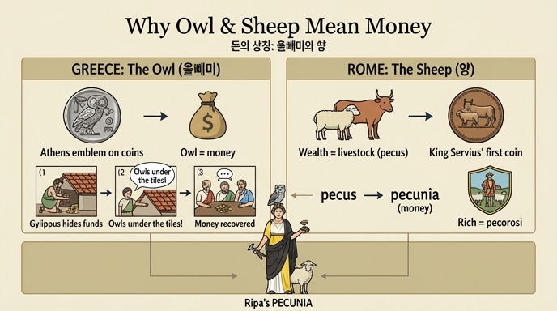

# 돈(PECUNIA) 도상에서 올빼미와 양의 유래

체사레 리파(Cesare Ripa)의 『이코놀로지아』 PECUNIA(돈) 항목은 돈을 이렇게 의인화한다: 노랑·하양·짙은 갈색(tanè) 옷을 입은 여인 — 세 색은 금화·은화·동화(금속 화폐)의 종류를 뜻한다 — 머리 장식 위에 **올빼미(civetta)** 가 앉아 있고, 손에는 주화를 찍는 도구인 토르셀리(torselli)와 필레(pile)를 들었으며, 발치에는 **양(pecora)** 이 있다. 이 항목에는 판화 도판이 실려 있지 않다.

## 1. 그리스 — 올빼미가 돈이 된 사연

### 아테네의 표장, 주화의 도안
올빼미는 아테나 여신과 아테네 도시의 표장(insegna)이었다. 리파는 플루타르코스의 『리산드로스전』을 인용하며, 그리스인들이 아테네인들의 환심을 사기 위해(per gratificare gli Ateniesi) 거의 모두 자기 주화에 올빼미를 새겼다고 전한다. 실제로 아테네의 은화 테트라드라크마는 앞면에 아테나, 뒷면에 올빼미를 새긴 것으로 유명해 고대 지중해 세계에서 "올빼미(glaukes)"라는 별명으로 불렸다. 주화에 늘 올빼미가 있으니, **올빼미 자체가 돈의 은어**가 된 것이다.

### 질리포스(Gylippus)의 하인 일화
같은 플루타르코스 대목에서 전하는 유명한 재치 이야기:

1. 질리포스는 큰 액수의 공금(pecunia)을 라케다이몬(스파르타)으로 운반하는 임무를 맡았다.
2. 그런데 그 상당 부분을 **자기 집 지붕 기와 밑에** 감추었다.
3. 이를 목격한 하인은 고발하고 싶었지만, 당시 법으로는 **하인이 제 주인에게 불리한 증언을 하면 믿어주지 않았다**.
4. 그래서 하인은 법정에서 이렇게 말했다: "주인집 지붕 기와 밑에 **올빼미(nottole)가 아주 많이** 있습니다."
5. 눈치 빠른 재판관들이 그 뜻(올빼미 = 올빼미가 새겨진 돈)을 알아듣고 그 돈을 국고로 환수했으며, 하인의 기지를 칭찬했다.
6. 이후로도 종종 돈을 "놋톨레(nottole, 올빼미)"라는 이름으로 부르게 되었다.

하인은 법을 어기지 않으면서도(주인을 직접 고발한 것이 아니라 '올빼미'가 있다고만 말함) 진실을 전달한 셈이다. 역사적으로 질리포스는 시칠리아 원정에서 활약한 스파르타 장군으로, 뤼산드로스가 아테네에서 스파르타로 보내는 전리품 은화를 운반하다 착복한 사건이며, 그 은화가 바로 아테네의 올빼미 주화였다.

## 2. 로마 — 양(가축)이 돈이 된 사연

### pecus → pecunia
로마인들에게 초기의 재산과 부는 온통 **가축(bestiame)** — 양과 소 — 의 수량이었다. 그래서:

| 라틴어 | 뜻 | 유래 |
|---|---|---|
| pecus | 온갖 종류의 가축 | — |
| **pecunia** | 돈 | 가축(pecus/pecora)에서 |
| peculium | 사유 재산 | pecude(가축)에서 파생 |
| peculatus | 공금 횡령(공적 절도) | 도둑질이 가축 훔치기에서 시작된 데서 |

### 벌금과 최초의 주화
- 로마에서 화폐를 주조하기 전에는 범죄를 **양 2마리, 소 30마리**를 물게 하여 처벌했는데, 당시로서는 매우 무거운 형벌로 여겨졌다(폼페이우스 페스투스 전언).
- 청동 조폐소에서 **처음 새겨 찍은 도안이 양**이었으며, 이는 **세르비우스 왕**(세르비우스 툴리우스)의 명에 따른 것이었다. 일부 전승으로는 은화에도 그러했다. 플리니우스(『박물지』 33권 3장)의 문구: *"Servius rex ovium boumque effigie primus aes signavit"* — 세르비우스 왕이 처음으로 **양과 소의 형상**으로 청동 화폐를 찍었다.

### '양 많은 자' = 부자
- 돈(pecunia)이 양(pecora)에서 왔으므로, 돈이 넘치는 부자를 **페코로시(Pecorosi, 양 많은 자)** 라 불렀다. 그리스어로도 같은 표현(polymēlos)이 있으며, 헤시오도스 『일과 날』에 "노고로부터 사람은 양 많고(pecorosi) 부유해진다"는 구절이 있다.
- 파생 표현들: 디오게네스(견유학파)는 학식 없는 부자를 "**황금 양**"이라 불렀고, "황금 소"는 무지한 부자를 뜻했다. 파피니아누스는 그런 자를 "황금의 노예"라 했다.

## 3. 요약 — 두 문화, 하나의 논리

| | 그리스 | 로마 |
|---|---|---|
| 돈의 상징 | 올빼미 | 양(과 소) |
| 유래 | 아테네 표장 → 주화 도안 | 재산 = 가축(pecus) → pecunia |
| 뒷받침 일화 | 질리포스 하인의 "기와 밑 올빼미" 고발 | 세르비우스 왕의 양·소 도안 동전, 부자 = pecorosi |
| 출전 | 플루타르코스 『리산드로스전』 | 페스투스, 플리니우스 33.3, 헤시오도스 |

두 경우 모두 논리는 같다: **돈을 대표하는 사물(주화의 도안, 부의 원천)이 곧 돈의 이름·상징이 되었다.** 그래서 리파의 PECUNIA 의인상은 머리에 올빼미(그리스 전통), 발치에 양(로마 전통)을 함께 둔다.

## 인포그래픽

