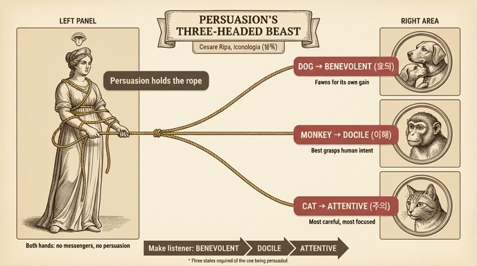

# 설득(Persuasione) 도상의 세 머리 짐승

체사레 리파(Cesare Ripa)의 『이코놀로지아(Iconologia)』에 실린 **설득(Persuasione)** 의인상에 대한 카드다. 소스: `15 Madness to Stubbornness.md`의 Persuasione 항목 (이 판본에는 해당 판화가 수록되어 있지 않다).

## 도상 전체 구성

리파는 설득을 다음과 같이 그리라고 지시한다.

- **정숙한 옷차림의 부인(Matrona)**: 아름다운 머리 장식 위에 **혀(lingua)** 가 있고, 그 혀 아래에 **눈(occhio)** 이 있다.
- 몸은 **여러 가닥의 금색 끈과 매듭**으로 묶여 있다.
- **두 손으로 밧줄 하나**를 쥐고 있는데, 그 밧줄에는 **머리가 셋 달린 짐승**이 묶여 있다 — 하나는 **개(Cane)**, 하나는 **고양이(Gatto)**, 하나는 **원숭이(Scimia)** 의 머리다.

## 세 머리의 의미 — 설득받는 사람에게 필요한 세 가지 상태

리파에 따르면 "세 얼굴의 짐승은, 설득에 자리를 내어주는 사람이 갖추어야 할 **세 가지 것의 필요성**"을 보여준다. 즉 세 머리는 설득하는 사람의 기술이 아니라 **청자(듣는 사람)가 놓여야 할 세 가지 상태**를 뜻한다.

| 머리 | 청자의 상태 | 근거가 되는 동물의 성질 |
|---|---|---|
| **개 (Cane)** | **호의적(benevolo)** 으로 만들어야 함 | 개는 **제 이익을 위해 아양을 떨며(accarezza per suo interesse)** 상대의 환심을 산다 |
| **원숭이 (Scimia)** | **알아듣게(docile)** 만들어야 함 — 무엇을 설득당하는지 이해하도록 | 원숭이는 모든 동물 가운데 **사람의 뜻(concetti degli Uomini)을 가장 잘 알아채는** 동물로 여겨진다 |
| **고양이 (Gatto)** | **주의 깊게(attento)** 만들어야 함 | 고양이는 행동이 **가장 세심하고(diligentissimo) 가장 집중하는(attentissimo)** 동물이다 |

이 셋(benevolus, docilis, attentus — 호의·이해·주의)은 고전 수사학에서 연설 서두(exordium)의 3대 목표로 꼽히던 정식이다. 키케로 계열 수사학 교본은 서두에서 청중을 "호의적이고, 배울 준비가 되고, 주의 깊게(benevolum, docilem, attentum)" 만들라고 가르쳤고, 리파는 이 수사학 공식을 세 동물 머리로 시각화한 것이다.

## 왜 두 손으로 밧줄을 쥐는가

부인이 짐승의 밧줄을 **두 손으로** 붙잡는 이유: "설득이 이 **전령들(messaggeri)** 을 갖지 못하면, **아예 생겨나지 않거나(non si genera), 약하게만 나아가기(debolmente cammina)** 때문"이다. 즉 호의·이해·주의라는 세 전제 조건을 단단히 붙들고 있어야 설득이 성립한다는 뜻이다.

## 나머지 요소의 의미 (참고)

- **머리 위의 혀**: 남을 설득하는 가장 주된 도구. 고대 이집트인들이 기술 없이 자연의 힘만으로 이루어지는 말·설득을 이렇게 표현했다고 한다.
- **핏발 선 눈**: 훈련과 큰 기술로 다듬어진 말하기를 뜻한다. 피가 영혼의 자리이듯 기술적 언변은 그 행위의 자리이며, 눈이 영혼이 내다보는 창이듯 말은 영혼이 남에게 보이는 창이다.
- **금색 끈으로 묶인 몸**: 설득이란 결국 **유창한 말의 능란함과 달콤함에 사로잡혀 묶이는 것**임을 나타낸다.

## 기억 포인트

- 개 → 아양 → **호의(benevolent)**
- 원숭이 → 눈치 → **이해/온순(docile)**
- 고양이 → 집중 → **주의(attentive)**
- 세 머리는 말하는 자의 무기가 아니라 **듣는 자를 데려다 놓아야 할 세 상태**, 두 손의 밧줄은 "이 셋 없이는 설득이 없다"는 강조.

## 인포그래픽

