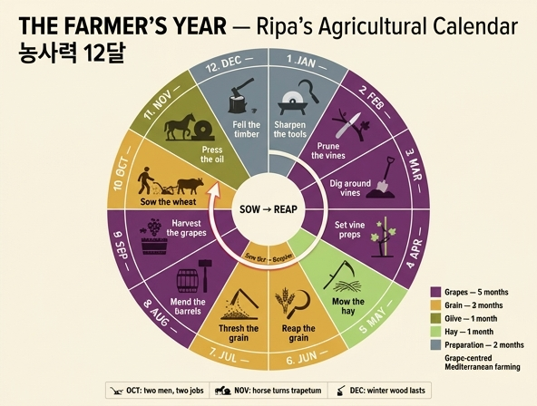

# 농사력(Mesi secondo l'Agricoltura)의 10월·11월·12월

> **Q.** 농사력에서 10월, 11월, 12월의 일은?
>
> **A.** 10월은 밀 파종으로, 씨 뿌리는 사람과 소가 끄는 쟁기로 씨를 덮는 사람을 그린다(헤시오도스는 11월 10일 파종을 권했으나 토양에 따라 달라진다). 11월은 기름 짜기로, 말이 돌리는 연자방아와 올리브 더미·압착기를 그린다. 12월은 도끼로 나무 베기로, 겨울에 나무의 기운이 속으로 모여 목재가 더 오래가기 때문이다.

이 카드는 체사레 리파 『이코놀로지아』 제4권의 **「농사에 따른 달들(MESI SECONDO L'AGRICOLTURA)」** 계열 마지막 세 대목이다. 리파는 같은 책에서 달의 알레고리를 세 계열로 나란히 제시한다 — ① 12궁(황도대) 계열, ② **농사력 계열**(이 카드), ③ 에우스타키오 계열. 세 계열의 같은 달이 서로 다른 그림이므로 계열을 섞지 않는 것이 이 카드의 핵심이다.

---

## 1. 세 달 대조표

| 달 | 도상 인물과 동작 | 도구·기계 | 동물 | 근거 저자 |
|---|---|---|---|---|
| **10월 OTTOBRE** 밀 파종 (semina del grano) | **두 사람.** ① 왼손에 밀이 담긴 바구니를 들고 오른손으로 그 밀을 집어 땅에 흩뿌리는 사람 ② 소를 몰아 쟁기로 그 씨를 **덮는** 사람 | 씨 바구니(*cesto*), **쟁기**(*aratro*), 몰이 막대 | **소 두 마리**(*buoi*) — 쟁기를 끈다 | **헤시오도스** (플리니우스 『박물지』 18권을 경유해 인용). 리파는 플리니우스의 말대로 "헤시오도스가 농업에 대해 최초로 쓴 사람"이라고 소개 |
| **11월 NOVEMBRE** 기름 짜기 (fare l'olio) | **한 사람.** 오른손에 채찍(*sferza*)을 들고 말 뒤를 따라 걸으며 방아를 돌린다 | **연자방아**(*ruota da molino*, 올리브 분쇄기), 삽(*pala*), **압착기**(*torchio*), 압착용 깔개·바구니(*fiscoli*) | **말**(*cavallo*) — 방아에 매여 돌린다 | **팔라디우스** 『농사론』 **12권**(=11월) |
| **12월 DICEMBRE** 벌목 (tagliare gli alberi) | **한 사람.** 건장한 남자가 **두 손으로** 도끼를 잡고 나무를 베는 자세 | **도끼**(*accetta*) | 없음 | **팔라디우스** 『농사론』 **13권**(=12월) |

> **팔라디우스 권수 = 달 번호 + 1.** 팔라디우스 『Opus Agriculturae』는 1권이 총론, **2권부터 13권까지가 1월~12월**의 월별 지침이다. 그래서 10월=11권, 11월=12권, 12월=13권. 리파의 인용(4월=5권, 5월=6권, 6월=7권, 8월=9권, 11월=12권, 12월=13권)이 모두 이 규칙과 정확히 맞는다 — 리파가 팔라디우스를 실제로 펼쳐 놓고 썼다는 증거다.

---

## 2. 10월 — 밀 파종: 왜 두 사람인가

### 원문 (긴 s가 f로 깨진 OCR을 복원)

> UOmo che tenga colla mano **sinistra** un **cesto** pieno di **grano**, e colla **destra** pigliando esso grano, mostri di **spargerlo in terra**, e che venga **coperto** da uno, che stimoli i **Buoi**, i quali tirano un **aratro**; ed ancorché, secondo **Esiodo**, il quale fu il primo che scrivesse dell'Agricoltura [come narra **Plinio lib. 18**], si deve seminare a' **dieci di Novembre**, che in tal giorno **tramontano le Vergilie**, sette giorni dopo sogliono per lo più seguir le **piogge**, ed esser favorevoli alle biade seminate; nondimeno per la **varietà de' terreni caldi, e freddi**, si semina più presto, o più tardi.
>
> — 왼손에 밀이 가득 든 바구니를 들고 오른손으로 그 밀을 집어 땅에 흩뿌리는 것을 보이는 사람, 그리고 소를 몰아 쟁기를 끌게 하여 그 씨를 덮는 또 한 사람. 농업에 관해 최초로 쓴 헤시오도스에 따르면(플리니우스 18권이 전하듯) **11월 10일**에 파종해야 하는데, 그날 **베르길리아이(플레이아데스)가 지고** 그로부터 **이레 뒤에 대개 비가 따라와** 뿌린 곡식에 유리하기 때문이다. 그렇지만 **따뜻한 땅과 찬 땅의 차이** 때문에 더 일찍 또는 더 늦게 뿌린다.

리파는 이어 "우리 그림을 혼란스럽게 하지 않고 각 달에 그 직무를 하나씩 배정하기 위해, 이 달에 **인간 생존의 으뜸이 되는** 밀을 뿌리는 것으로 한다"고 못 박는다. 즉 날짜상으로는 10월~11월에 걸친 일이지만, **한 달에 한 노동**이라는 도상 규칙을 지키기 위해 파종을 10월에 확정한 것이다.

### (1) 두 사람 = 두 공정: 흩뿌리기 + 복토(occatio)

도상이 **씨 뿌리는 사람**과 **쟁기로 덮는 사람**을 나란히 세운 것은 화면을 채우기 위한 장식이 아니다. 로마·지중해식 파종은 씨앗을 골에 하나씩 심는 것이 아니라

1. **살포(sementatio)** — 갈아 놓은 밭에 손으로 씨를 흩뿌리고
2. **복토(occatio / aratio)** — 쟁기(또는 써레·괭이)로 흙을 덮어 씨를 묻는다

두 공정으로 이루어졌다. 씨를 흙 속에 넣지 않으면 새·쥐에게 먹히고, 겨울비에 씻겨 나가고, 발아에 필요한 흙과의 접촉을 못 얻는다. 그래서 뿌리는 사람 뒤를 쟁기가 곧바로 따라붙는다. **리파의 도상은 시간적으로 이어지는 두 동작을 한 장면에 겹쳐 그린 것**이고, 이 겹침이 파종이 단일 동작이 아니라 공정임을 알려 준다. (9월 포도 카드가 "밟는 사람 + 통에서 흘러나오는 즙"으로 착즙 공정을 겹쳐 그린 것과 같은 문법이다.)

또 하나: **소**가 여기 있는 이유는 쟁기의 견인력이다. 3월 카드에는 봄에 발정하는 **말**이 곁에 있고(플리니우스 8권 42), 4월에는 새끼 딸린 **소**, 8월에는 병아리 딸린 **암탉**, 11월에는 방아를 돌리는 **말**이 있다. 리파의 농사력은 달마다 그 달의 노동에 실제로 쓰이거나 그 달을 특징 짓는 동물을 한 마리씩 배치한다.

### (2) 왜 가을 파종인가 — 지중해 농법의 근본

한국식 감각(봄에 심어 가을에 거둔다)과 정반대다. 지중해 기후는 **여름이 건기, 겨울이 우기**다. 따라서:

| 시기 | 기후 | 작물의 상태 |
|---|---|---|
| 10~11월 | 첫 가을비 | **파종** → 발아 |
| 12~2월 | 서늘·다우 | 뿌리 내리고 분얼(tillering) |
| 3~5월 | 온난·습기 남음 | 급성장, 이삭 형성, 결실 |
| **6월** | 건기 시작·혹서 | **수확** — 마르기 전에 |
| 7~9월 | 혹서·무우기 | 밭은 비고, 노동은 타작마당·포도밭으로 |

즉 **곡물이 여름 건기를 피해 겨울 강우기를 타고 자라는 구조**다. 이 때문에

- **10월 파종과 6월 수확은 한 쌍**이다. 리파의 농사력에서 6월은 "보리를 먼저, 다음에 밀을 벤다"(팔라디우스 7권)이고, 그 이유는 "여름 증기에 타 버리기 전에", "이삭이 마르면 낟알이 떨어지므로 서둘러 베라"(콜루멜라 2권)였다. 6월이 왜 급한지는 10월의 파종 시점이 정해 준 것이다.
- 그래서 **12월의 벌목으로 끝나는 이 열두 달은 실은 10월에서 6월로 이어지는 고리로 닫혀 있다.** 12월에서 1월로 넘어가는 것은 달력의 순환일 뿐이고, **작물의 순환은 10월 → (겨울) → 6월**로 닫힌다. 이 이중 순환이 농사력 도상을 이해하는 열쇠다.

### (3) 헤시오도스 — 리파가 인용한 것과 원문이 실제로 말한 것

리파는 "헤시오도스는 11월 10일 파종을 권했다"고 적었다. **하지만 헤시오도스 원문에는 날짜가 없다.** 『일과 날(Ἔργα καὶ Ἡμέραι, Erga kai Hemerai)』 383행 이후는 **별을 시계로 삼는다**:

> "플레이아데스, 아틀라스의 딸들이 **떠오르면** 수확을 시작하고, 그들이 **지려 할 때** 밭갈이를 시작하라. 마흔 낮과 마흔 밤을 그들은 숨어 있다가 해가 돌아 다시 나타나니, 그때 처음으로 낫을 벼려라."
> — 헤시오도스 『일과 날』 383–387

즉 헤시오도스의 신호는 **플레이아데스 성단의 새벽 짐(cosmical/morning setting)**이다. 성단이 새벽 동쪽 하늘에서 더 이상 보이지 않게 되는 순간이 밭갈이·파종의 개시 신호이고, 그 반대인 **새벽 뜸(heliacal rising)**이 수확 신호다. 하나의 성단이 파종과 수확을 동시에 지시하는, 문자 없는 농부를 위한 천문 달력이다.

그런데 **왜 리파에게는 '11월 10일'이라는 날짜가 되었는가?**

- 헤시오도스(기원전 700년경 보이오티아)의 관측을 **율리우스력 날짜로 환산한 것은 로마 저자들**이다. 리파가 밝힌 출처가 바로 그것 — **플리니우스 『박물지』 18권**이다. 플리니우스는 18권에서 여러 농학자의 파종 시기론을 정리하며 "농업 교육에서 인류의 선도자 헤시오도스는 파종 시기를 **단 하나만** 제시했다 — 플레이아데스가 질 때"라고 쓰고, 그 짐의 날짜를 로마 달력으로 환산해 준다.
- 그러니 **'11월 10일'은 헤시오도스의 말이 아니라 후대의 환산치**다. 게다가 세차운동(precession) 때문에 별의 짐 날짜는 세기마다 밀린다 — 헤시오도스 시대, 플리니우스 시대(1세기), 리파 시대(1600년경)의 실제 날짜가 모두 다르다. 리파가 옮긴 날짜는 **고대의 환산치를 그대로 전재한 문헌 지식**이다.
- 리파가 그 날짜를 적은 **직후에** "그렇지만 따뜻한 땅과 찬 땅의 차이 때문에 더 일찍 또는 더 늦게 뿌린다"고 단서를 붙인 것이 결정적이다. 즉 **고정 날짜(천문·문헌의 권위)보다 토양과 기후(현장의 조건)를 우선**하는 실용적 태도다. 리파는 도상학자이지만 이 대목에서는 농서의 논리를 그대로 승계한다.

리파가 덧붙인 "이레 뒤에 대개 비가 따라온다"는 관찰도 중요하다. 파종 시점을 **첫 가을비 직전**에 맞추는 것이 관건이기 때문이다. 너무 일찍 뿌리면 마른 땅에서 발아하지 못하고 새·개미의 밥이 되며, 너무 늦으면 겨울 추위 전에 뿌리를 충분히 내리지 못한다. 별의 짐은 "비가 곧 온다"의 대리 지표였다.

### (4) 같은 규칙을 말하는 다른 고대 저자들

- **베르길리우스 『농사시(Georgica)』 1.219–226** — 파종 규칙의 가장 유명한 시적 정식화:
  > *"at si triticeam in messem robustaque farra / exercebis humum solisque instabis aristis, / **ante tibi Eoae Atlantides abscondantur** / Cnosiaque ardentis decedat stella Coronae, / debita quam sulcis committas semina... / **multi ante occasum Maiae coepere; sed illos / exspectata seges vanis elusit avenis.**"*
  >
  > "밀과 튼튼한 스펠트를 거두려 흙을 다루고 이삭만을 노린다면, **먼저 아틀라스의 딸들(플레이아데스)이 새벽 하늘에서 숨고** 크노소스의 왕관좌 별이 물러나기를 기다린 다음에야 마땅한 씨를 골에 맡겨라. **많은 이가 마이아(플레이아데스의 한 별)가 지기 전에 시작했지만, 기다린 수확은 쭉정이로 그들을 속였다.**"
- **콜루멜라 『농업론』 2.8** — 베르길리우스를 그대로 인용해 규칙으로 굳힌다:
  > *"Placet nostro poetae adoreum atque etiam triticum non ante seminare quam **occiderint Vergiliae**."*
  > "우리 시인은 스펠트와 밀을 **베르길리아이(플레이아데스)가 지기 전에는** 뿌리지 말라고 한다."
- **팔라디우스 『농사론』 11권(=10월)** — 리파의 나머지 달들이 인용하는 그 월별 지침서의 10월 편. 리파는 10월 항목에서는 팔라디우스 대신 헤시오도스·플리니우스를 인용했지만, 계열 전체는 팔라디우스의 월별 구성을 골격으로 삼는다.

**요약:** 헤시오도스 → 베르길리우스 → 콜루멜라 → 플리니우스 → 팔라디우스 → **리파**. 하나의 규칙("플레이아데스가 진 뒤에 뿌려라")이 2천 년 넘게 계승되며 별의 신호에서 달력 날짜로 굳었고, 리파는 그 날짜를 옮기면서도 곧바로 토양 우선 원칙으로 되돌린다.

---

## 3. 11월 — 기름 짜기: 두 기계, 세 공정

### 원문

> Dunque dipingeremo un Uomo, che tenga colla destra mano una **sferza**, e vada dietro a un **Cavallo**, il quale sia attaccato ad una **ruota da molino**, ove si **macinano le olive**, e a lato di essa vi sia un **monte di olive**, ed una **pala**, un **torchio**, **fiscoli**, e quanto sarà bisogno a tale officio.
>
> — 그러므로 우리는 오른손에 채찍을 들고, 올리브를 가는 연자방아에 매인 말의 뒤를 따라가는 사람을 그리자. 그 방아 옆에는 **올리브 더미**와 **삽**, **압착기**, **압착용 깔개(fiscoli)**, 그 밖에 이 일에 필요한 것들이 있게 하자.

리파는 앞서 이유를 밝힌다: "기름은 인간에게 먹는 것뿐 아니라 다른 여러 편익에도 매우 필요하므로", 팔라디우스 12권이 말하듯 이 달에 기름을 짜게 한다. 기름의 용도로 **음식의 조미**와 **성직자 도유(consecrare i Ministri della Santa Chiesa)** 를 든다. (기름의 상징적 중요성 — 등불·의약·성유 — 은 별도 카드가 다루므로 여기서는 연결만 해 둔다.)

### (1) 착유는 세 공정이다

| 공정 | 라틴어 장비 | 도상에 있는가 |
|---|---|---|
| ① **분쇄** — 과육을 으깨 세포에서 기름을 풀어놓기 | **trapetum** / **mola olearia** | **예** — 말이 돌리는 연자방아 |
| ② **압착** — 으깬 반죽에서 액체를 뽑아내기 | **torcular** / **prelum** | **예** — *torchio*, *fiscoli* |
| ③ **분리** — 기름과 식물수(amurca)를 비중 차로 가르기 | 침전조(*lacus*) | 그림에 없음(암시) |

도상은 **앞 두 공정**을 나란히 세워 놓은 것이다. 즉 11월 그림은 "기름"이 아니라 **기름을 만드는 공정 라인**의 그림이다.

### (2) trapetum — 씨를 부수지 않는 설계

로마의 올리브 분쇄기 **trapetum**은 매우 영리한 기계다. 구조:

- **mortarium** — 반구형으로 파인 큰 돌확(그릇)
- **orbes** — 그 안에서 회전하는 두 개의 볼록한(반구형) 돌바퀴
- **cupa** — 두 돌바퀴를 꿴 나무 수평 축
- **columella / miliarium** — 확 중앙에 세운 기둥과 그 안의 철제 축핀

핵심은 **돌바퀴가 확 바닥에 닿지 않게 간격(쐐기로 조절)을 두는 것**이다. 카토는 『농업론』 20–22장에서 이 간격 조정법을 치수까지 명시한다 — 20장 "trapetum을 조립하는 법", 21장 *cupa* 만들기(길이 10푸스 등), 22장 "trapetum을 맞추는 법: 돌바퀴 높이를 나무 스페이서와 철 띠로 정밀 조정할 것".

왜 그렇게까지 하는가? **올리브 씨(핵)를 깨뜨리면 안 되기 때문**이다. 씨가 깨지면 그 안의 성분이 나와 기름에 쓴맛과 잡맛이 섞인다. 그래서 trapetum은 과육만 짓이기고 씨는 굴려 넘긴다. 리파의 도상이 그린 "말이 돌리는 방아"가 곡물 제분기와 겉모습이 비슷해도 **목적이 정반대**(곡물은 알을 부수려고, 올리브는 씨를 안 부수려고)라는 점이 이 기계의 정체다.

동력이 **말**인 것도 정확하다. 무거운 돌바퀴를 지속적으로 돌려야 하므로 사람 힘으로는 부족하고, 축에 매인 짐승이 원을 돌며 돌린다. 그래서 도상의 사람은 방아를 돌리지 않고 **채찍을 들고 말 뒤를 따라 걷는다** — 그는 기계공이 아니라 **동물 동력의 관리자**다.

### (3) torcular / prelum과 fiscoli

분쇄된 반죽은 **fiscoli**(라틴 *fiscina*, 에스파르토·삼으로 짠 둥근 깔개 자루)에 담아 여러 겹으로 쌓고, 그 위에 압력을 가한다. 압착기는

- **prelum** — 긴 나무 지렛대. 한쪽 끝을 고정하고 반대쪽에 **밧줄과 권양기(winch), 또는 매달린 돌추**로 힘을 주는 지렛대식 압착기
- 후대에 **나사식(screw press)** 으로 발전 — 나사 회전으로 압력을 균일·강력하게 걸 수 있다. 리파 시대(1600년경)의 *torchio*는 대개 이 나사식이다

여기서 12월과 연결되는 지점이 있다: *fiscoli* 같은 바구니·깔개는 **겨울에 벤 장대와 골풀로 짠다**. 베르길리우스도 겨울의 실내 노동으로 "*nunc facilis rubea texatur fiscina virga*"(이제 붉은 회초리로 손쉬운 바구니를 짜라, 『농사시』 1.266)를 든다. 11월의 압착 도구가 12월의 벌목·채취에서 나온다.

### (4) 왜 수확과 착유가 같은 달에 붙어 있는가

리파는 이유를 적지 않았지만, 실제 이유는 **화학**이다. 올리브를 따서 오래 두면

- 과육이 멍들고 그 안의 **리파아제(lipase)** 등 효소가 물의 존재 하에 중성지방을 분해해 **유리지방산(free fatty acid)** 을 만든다 → 산도(acidity)가 올라간다
- 더미로 쌓아 두면 발효하고 열이 나면서 이 과정이 급격히 빨라진다

측정치로도 뚜렷하다 — 수확 직후 약 0.20% 수준이던 유리산도가 18°C에서 닷새 저장하면 0.45% 수준으로 오른다는 보고가 있다. 오늘날 최고급 기름은 **수확 후 몇 시간 안에** 짠다. 즉 "올리브를 딴 달과 기름을 짠 달이 같다"는 것은 도상의 편의가 아니라 **품질이 강제하는 물리적 제약**이다. 리파의 농사력이 11월 한 칸에 수확·분쇄·압착을 다 몰아넣은 것은 이 제약을 반영한다.

---

## 4. 12월 — 벌목: 리파의 논거와 그 검증

### 원문

> UOmo **robusto**, che con **ambe le mani** tenga un'**accetta**, e con bella disposizione mostri di **tagliare un albero**.
>
> Secondo **Palladio lib. 13** de re rustica, essendo Dicembre **principio dell'Inverno**, e l'aria **fredda**, la **virtù degli alberi si concentra in essi**, e sono **più durabili i legnami** per le fabbriche, e per fare ogni altra opera; dove che in questo Mese si tagliano non solo le **Selve** per far legnami per le fabbriche, e per far qualunque opera, ma i **soverchi rami**, e le **siepi verdi** per far **fuoco**; si tagliano ancora le **pertiche**, i **giunchi per le Vigne**, e anche di essi se ne fanno le **ceste**, e molte altre cose, che sono opportune all'uso nostro.
>
> — 건장한 남자가 두 손으로 도끼를 들고 훌륭한 자세로 나무를 베는 것을 보인다. 팔라디우스 13권에 따르면, 12월은 **겨울의 시작**이고 공기가 **차가워** **나무의 기운(virtù)이 그 안으로 모이므로**, 건축과 그 밖의 모든 작업을 위한 **목재가 더 오래간다**. 그래서 이 달에는 건축용·작업용 목재를 얻기 위한 **숲**만이 아니라, 땔감을 위한 **잉여 가지와 산울타리**도 자른다. 또 **장대**와 **포도밭용 골풀**도 자르고, 그것으로 **바구니**와 우리에게 유용한 여러 물건을 만든다.

### (1) "나무의 기운이 속으로 모인다"는 말은 놀랍게도 상당히 정확하다

리파(와 팔라디우스)의 설명은 전근대적 생기론(*virtù* = 힘·덕성이 안으로 응축된다)의 언어로 되어 있다. 그러나 이 언어를 현대 목재학으로 옮겨 놓으면 **결론이 맞다**. 겨울 벌목재가 더 오래가는 실제 이유:

| 리파의 표현 | 현대적 설명 |
|---|---|
| 기운(수액)이 안으로 모인다 | 겨울은 **수목의 휴면기(dormancy)**. 증산과 생장이 멈추고, 수액 유동이 최소가 된다 |
| 목재가 더 오래간다 ① | **전분·당 등 저장 양분과 수액 함량이 낮다** → 목재 부후균과 목재 해충(천공충 등)의 먹이가 적어 감염·식해가 덜하다 |
| 목재가 더 오래간다 ② | **함수율이 낮다** → 건조 과정의 수축이 작아 갈라짐(check)과 변색(discoloration)이 적다 |
| 목재가 더 오래간다 ③ | **기온이 낮다** → 벌목 후 통나무가 야적되는 동안 균·곰팡이의 활성이 억제되어 부패 진행이 느리다 |
| — | 부수적 이점: 무게가 가벼워 운반비가 낮고, 땅이 얼어 있어 중장비·수레의 반출이 쉽다 |

그래서 **오늘날에도 제재용 벌목은 겨울에 한다.** 목재업계의 상식이며 "겨울에 벤 나무가 값을 더 받는다"는 실무적 근거까지 있다. 리파의 문장은 원인을 잘못 개념화했지만 **경험적 결론은 유효한, 좋은 전근대 지식의 표본**이다.

(다만 "달의 기울기에 맞춰 베라"는 계열의 주장 — 카토도 『농업론』 31장에서 "**기우는 달에, 정오 이후에, 남풍 없을 때** 목재를 베라"고 한다 — 는 이른바 *moon wood* 전승으로, 현대 연구에서는 계절 효과와 달리 재현되지 않아 회의적으로 다뤄진다. 즉 **계절 규칙은 살아남았고 달의 위상 규칙은 살아남지 못했다**.)

### (2) 고대의 근거들

- **카토 『농업론』 17장** — 목재의 제철을 못 박는다:
  > *"**Robus materies** item **ridica**, ubi solstitium fuerit **ad brumam** semper **tempestiva** est."*
  > "떡갈나무 목재와 포도 지지대(*ridica*)는 **하지부터 동지(bruma)까지** 늘 벨 때가 된 것이다."
  씨를 맺는 나무는 씨가 익었을 때, 씨 없는 나무는 껍질이 벗겨질 때가 제철이라는 규정도 따라 붙는다.
- **카토 『농업론』 31장** — 올리브 압착실 준비 항목에서 목재·지렛대·나무 쐐기를 갖추라 하고, **베는 조건**(기우는 달, 정오 이후, 남풍 없을 때)을 지정한다. 11월(압착)과 12월(벌목)이 카토에게서는 **한 장 안에 이미 붙어 있다.**
- **베르길리우스 『농사시』 1.259–267** — 겨울 노동의 목록:
  > *"Frigidus agricolam si quando continet imber, / multa, forent quae mox caelo properanda sereno, / maturare datur: durum procudit arator / **vomeris obtunsi dentem**, cavat arbore **lintres**, / ... / exacuunt alii **vallos furcasque bicornis** / atque Amerina parant lentae **retinacula viti**. / nunc facilis rubea texatur **fiscina** virga..."*
  > "찬 비가 농부를 붙잡아 둘 때면, 맑은 날 서둘러야 할 많은 일을 미리 익힐 수 있다. 쟁기꾼은 **무뎌진 쟁기날**을 두드려 벼리고, 통나무를 파 **함지**를 만들고 … 다른 이들은 **말뚝과 두 갈래 갈퀴**를 깎고 낭창한 포도를 **묶을 끈**을 준비한다. 이제 붉은 회초리로 손쉬운 **바구니**를 짜라…"
  리파의 1월(연장 손질)과 12월(장대·골풀·바구니)이 이 대목에서 함께 나온다.
- **플리니우스 『박물지』 16권** — 나무의 종류별 벌목 적기와 목재의 성질을 다룬다.
- **팔라디우스 『농사론』 13권(=12월)** — 리파가 직접 인용한 출처.

### (3) 12월의 구조적 의미 — 노동이 산으로 옮겨간다

12월은 **밭일이 불가능한 달**이다. 파종은 끝났고, 곡물은 땅속에서 겨울을 보내고, 포도밭은 잎을 떨어뜨렸고, 올리브도 짜냈다. 이때 리파의 농사력은 노동을 없애지 않고 **장소를 옮긴다** — 밭에서 **산·숲**으로.

이것이 농사력 계열 전체의 구성 원리다. 노동의 무대가 계절마다 이동한다:

**밭(1·10월) → 포도밭(2·3·4월) → 목초지(5월) → 밭(6월) → 타작마당 aia(7월) → 저장고·통 작업장(8월) → 압착통 tino(9월) → 밭(10월) → 올리브 착유실(11월) → 산·숲(12월)**

그리고 12월의 벌목은 그 자체로 끝나지 않고 **다음 순환의 재료를 만든다**: 건축 목재, 땔감, 그리고 **포도밭용 장대와 골풀** — 즉 4월에 포도에 세울 지지대(*canne alle viti*)와 11월 압착에 쓸 바구니(*fiscoli*)의 원료다. 12월은 종점이 아니라 **다음 해의 도구를 벌어들이는 달**이다. 1월(연장을 갈고 정비하는 달)과 짝을 이뤄 **준비의 두 달**이 열두 달의 양끝을 봉한다.

---

## 5. 열두 달 농사력 전체 (리파, MESI SECONDO L'AGRICOLTURA)

| 달 | 노동 | 도상의 요점 | 근거 |
|---|---|---|---|
| **1월** | **연장 정비** | 숫돌 바퀴 옆에 선 장년, 오른손에 낫(*roncio*), 왼손 검지로 땅에 놓인 여러 농기구를 가리킨다. 곁에 **수탉** — 부지런함의 상징 | 콜루멜라 3.24 *"Duris tenuissimisque ferramentis omne opus rusticum exequendum"*(단단하고 날 선 도구로 모든 농사일을 해야 한다); 카토 *"Omnia mature conficias"*(모든 일을 제때 마쳐라); 플리니우스 18.6(해방노예 크레시누스의 "내 마법은 이 도구들과 나의 땀"이라는 일화) |
| **2월** | **포도 가지치기** | 포도밭에 선 장년이 포도를 전정 | 마고(Mago) — 싹이 트기 전에 쳐야 한다. 수액이 오르면 상처가 커진다 |
| **3월** | **포도밭 흙 파헤치기** | 삽(*vanga*)을 든 젊은이가 포도 뿌리 주변 흙을 헤친다(*scalzare le viti*). 곁에 **말** | 힘든 일이라 젊은이로; 플리니우스 8.42 — 말이 춘분에 발정한다 |
| **4월** | **포도 지지대 세우기** | 팔 걷은 농부가 포도에 **대나무 지지대**를 세운다. 새끼 딸린 **소**(또는 양털 깎는 사람) | 팔라디우스 5권(=4월) — 송아지가 이 달에 태어나고, 풀이 풍부해 어미가 잘 젖을 낸다; 같은 권 — 이 달에 양털을 깎는다 |
| **5월** | **건초 베기** | 푸른 밭 가운데 젊은 농부가 두 손으로 **큰 낫(falce fienara)** 을 들고 풀을 베는 자세 | 팔라디우스 6권(=5월); 콜루멜라 — 마르기 전에 베어야 양이 많고 가축도 잘 먹는다(마르지도 푸르지도 않은 상태가 최적) |
| **6월** | **보리·밀 수확** | 팔 걷은 젊은 농부가 오른손 낫으로 이삭 다발을 베고 왼손으로 거둔다(또는 벤 곡물을 낟가리로 쌓는다) | 팔라디우스 7권(=6월) — 먼저 보리, 다음 밀; 콜루멜라 2권 — 개의별 뜰 무렵 증기에 타기 전에, 새·짐승 피해와 낟알 떨어짐 때문에 서둘러 베라 |
| **7월** | **타작** | 타작마당(*aia*)의 건장한 농부가 두 손으로 **도리깨(correggiato)** 를 들고 펼쳐 놓은 곡물을 두드린다. 곁에 삽·갈퀴 | 이 달의 가장 뚜렷한 일이 곡물의 수취(*raccolta de' grani*) |
| **8월** | **술통 손질** | 통(*botti*)·큰 통(*tini*)·물통(*bigonci*)·작은 통(*barili*)을 손질하는 자세, 필요한 도구들. 곁에 병아리 딸린 **암탉** | 팔라디우스 9권(=8월); 이 달에 부화한 닭이 다른 달 닭보다 알을 훨씬 많이 낳는다 |
| **9월** | **포도 수확·착즙** | 포도 바구니를 든 사람, **허벅지와 다리를 벗은** 채(포도를 밟으므로). 옆의 큰 통에는 밟힌 포도가 있고 즙(*mosto*)이 흘러 다른 그릇으로 들어간다. 곁에 **벌통 두세 개** | 이 달에 꿀도 딴다 |
| **10월** | **밀 파종** | **두 사람** — 흩뿌리는 사람 + **소가 끄는 쟁기**로 덮는 사람 | 헤시오도스(플리니우스 18권 경유); 팔라디우스 11권(=10월) |
| **11월** | **올리브 착유** | 채찍 든 사람이 **말**이 돌리는 **연자방아** 뒤를 따라간다. 올리브 더미·삽·**압착기**·압착 깔개 | 팔라디우스 12권(=11월) |
| **12월** | **벌목** | 건장한 남자가 두 손으로 **도끼**를 들고 나무를 벤다 | 팔라디우스 13권(=12월) — 추위에 나무의 기운이 안으로 모여 목재가 오래간다 |

---

## 6. 작물별로 다시 묶어 보면 — 리파의 농사력은 **포도 중심**이다

| 작물군 | 달 | 개수 | 노동 |
|---|---|---|---|
| **포도(vite)** | **2·3·4·8·9월** | **5개월** | 가지치기 → 흙 파헤치기 → 지지대 → 통 손질 → 수확·착즙 |
| **곡물(grano)** | 6·7·10월 | 3개월 | 수확 → 타작 → 파종 |
| **목초(fieno)** | 5월 | 1개월 | 베기 |
| **올리브(oliva)** | 11월 | 1개월 | 착유 |
| **준비·기타** | 1·12월 | 2개월 | 연장 정비 / 벌목 |

이 재배열이 드러내는 것:

1. **열두 달 중 5개월이 포도에 배정된다.** 2·3·4월 석 달 연속으로 포도밭 일이 이어지고, 8월의 술통 손질은 9월 착즙의 준비 노동이므로 실질적으로 포도 공정에 속한다. 리파의 농사력은 **포도(포도주) 중심의 지중해 농업**을 그린 것이다. 이는 고대 지중해 농업의 이른바 **'지중해 3종 세트'(곡물·포도·올리브)** 중 포도에 가장 많은 손이 가는 현실과 정확히 부합한다 — 포도는 다년생이라 매년 전정·흙 관리·유인·수확·양조라는 연중 노동 사이클을 요구하고, 곡물은 파종·수확·타작의 세 정점만 있으며, 올리브는 아예 한 달에 압축된다.
2. **곡물은 6·7·10월 세 달로 압축**되고, 그중 **10월(파종)과 6월(수확)이 순환의 고리를 닫는다.** 7월(타작)은 6월의 후속 공정이다.
3. **1월과 12월은 어떤 작물에도 속하지 않는 '준비의 달'** 로 열두 달의 양끝을 봉한다 — 1월은 도구를 갈고, 12월은 도구와 자재의 원재료(목재·장대·골풀)를 벌어들인다.
4. 노동의 **강도 분포**도 읽힌다. 5~7월(건초·수확·타작)이 노동 최성기이고, 리파는 이 달들에 굳이 "젊은", "건장한", "반쯤 벗은", "팔을 걷은" 같은 신체 표현을 붙인다. 반면 1·2월은 "장년(età virile)"으로, 판단과 계획의 달임을 나타낸다.

---

## 7. 혼동 주의 — 같은 책 다른 계열의 10~12월

같은 『이코놀로지아』 제4권에는 **에우스타키오(Eustachio) 철학자에 따른 달들**이라는 또 다른 계열이 실려 있는데, **거기서는 파종·밭갈이가 한 달 이상 뒤로 밀려 있다.** 카드를 풀 때 계열을 반드시 확인해야 한다.

| 달 | **농사력 계열(이 카드)** | 에우스타키오 계열 |
|---|---|---|
| 10월 | **밀 파종** (뿌리는 사람 + 쟁기) | **새 사냥** — 초원에 나뭇가지를 세우고 그물·올가미를 쳐 새를 잡는 젊은이 |
| 11월 | **기름 짜기** (말·연자방아·압착기) | **밭갈이** — 소를 몰아 쟁기를 끄는 사람. 플레이아데스의 계절이 밭갈이에 가장 알맞다 |
| 12월 | **벌목** (도끼) | **파종** — 왼손에 밀 씨 바구니, 오른손으로 흩뿌리고 일꾼들이 덮는다 |

즉 에우스타키오 계열은 **밭갈이 11월 → 파종 12월**로, 농사력 계열의 10월 한 칸에 겹쳐 있던 두 공정을 **두 달로 나눠 펼쳐 놓았다**. 리파가 농사력 계열에서 "각 달에 직무를 하나씩 배정하기 위해" 겹쳐 그렸다고 밝힌 그 압축이, 다른 계열에서는 풀려 있는 셈이다. 두 계열을 나란히 놓으면 **10월 도상의 두 사람이 사실 두 달치 노동임**이 확인된다.

---

## 8. 암기 포인트

- **10·11·12 = 뿌리고 · 짜고 · 벤다** (씨 → 기름 → 나무)
- **10월은 사람이 둘** — 뿌리는 사람 + **소·쟁기**로 덮는 사람 = 살포 + 복토
- **11월은 짐승이 말** — 소가 아니다. 말이 **연자방아(trapetum)** 를 돌린다. 사람은 **채찍**을 들고 뒤를 따를 뿐
- **12월은 짐승이 없다** — 사람과 **도끼**뿐. 유일하게 동물이 없는 달
- 근거 저자: **10월 = 헤시오도스(플리니우스 경유)**, **11·12월 = 팔라디우스(12권·13권)**
- 날짜의 함정: **'11월 10일'은 헤시오도스가 말한 날짜가 아니다.** 헤시오도스는 **플레이아데스가 질 때**라고만 했고, 날짜는 후대의 환산치다. 리파는 그 날짜를 옮긴 직후 **"토양에 따라 달라진다"** 로 물러선다
- 12월의 논거는 **"추위에 나무의 기운(virtù)이 안으로 모여 목재가 오래간다"** → 현대 목재학으로도 **결론은 맞다**(휴면기 = 저수액·저전분·저함수율·저온)
- 순환의 닫힘: 달력은 12→1로 돌지만, **곡물은 10월(파종) → 6월(수확)** 로 돈다
- 전체 성격: **포도 5개월**(2·3·4·8·9) / 곡물 3개월(6·7·10) / 올리브 1개월(11) / 목초 1개월(5) / 준비 2개월(1·12) → **포도 중심의 지중해 농업**

---

## 참고 자료

- Cesare Ripa, *Iconologia*, Tomo Quarto, 「MESI SECONDO L'AGRICOLTURA」 및 「MESI, come dipinti da Eustachio Filosofo」 — 이 카드의 원전
- [Hesiod, *Works and Days* (Theoi Classical Texts Library)](https://www.theoi.com/Text/HesiodWorksDays.html) — 383행 이후 플레이아데스의 뜸/짐과 수확·밭갈이
- [Hesiod, *Works and Days* (Perseus)](https://www.perseus.tufts.edu/hopper/text?doc=Perseus:text:1999.01.0132:card%3D405)
- [Vergil, *Georgica* 1 (The Latin Library)](https://www.thelatinlibrary.com/vergil/geo1.shtml) — 1.219–226(플레이아데스와 파종), 1.259–267(겨울의 실내·산림 노동)
- [Columella, *Res Rustica* 2.8 (Perseus)](https://www.perseus.tufts.edu/hopper/text?doc=Perseus%3Aabo%3Aphi%2C0845%2C001%3A2%3A8%3A1) — *"non ante seminare quam occiderint Vergiliae"*
- [Pliny, *Naturalis Historia* 18 (Perseus)](https://www.perseus.tufts.edu/hopper/text?doc=Perseus:text:1999.02.0137:book%3D18) — 파종 시기론, 헤시오도스를 농업 저술의 선도자로 소개
- [Cato, *De Agri Cultura* (The Latin Library)](https://www.thelatinlibrary.com/cato/cato.agri.html) — 17장(목재의 제철: 하지~동지), 20–22장(trapetum 조립·조정), 31장(압착실 자재와 벌목 조건)
- [Rutilius Taurus Aemilianus Palladius (Wikipedia)](https://en.wikipedia.org/wiki/Rutilius_Taurus_Aemilianus_Palladius) — 2~13권이 1~12월에 대응하는 구성
- [Trapetum: Roman Olive Press (World History Encyclopedia)](https://www.worldhistory.org/image/5645/trapetum-roman-olive-press/) 및 [Reconstruction of a Roman trapetum (Imperium Romanum)](https://imperiumromanum.pl/en/curiosities/reconstruction-of-roman-mill-for-production-of-olive-oil-trapetum/) — mortarium·orbes·cupa·miliarium 구조
- [Roman Olive Oil Production Guide (Big Horn Olive Oil)](https://bhooc.com/blogs/articles/roman-olive-oil-production-guide) — trapetum / mola olearia / torcular / prelum / tudicula
- [How Free Fatty Acidity Affects Olive Oil Quality](https://bhooc.com/blogs/articles/how-free-fatty-acidity-affects-olive-oil-quality) 및 [Olive Oil Acidity: Free Fatty Acids](https://www.aboutoliveoil.org/olive-oil-acidity-free-fatty-acids) — 수확·착유 지연과 산도 상승
- [What Is The Best Time Of Year To Cut Timber? (Church & Church Lumber)](https://churchandchurchlumber.com/blog/what-is-the-best-time-of-year-to-cut-timber) — 겨울 벌목의 저함수율·저변색·저해충 이점
- [Appropriate building materials: Timber (NZDL)](https://www.nzdl.org/cgi-bin/library?cl=CL1.1&d=HASH70c81f6386a2600bdfdd3f.3.14) — 수분·전분 함량이 가장 낮은 겨울 벌목 권고
- [Moon wood: cultural beliefs and scientific scepticism](https://www.ingentaconnect.com/contentone/cfa/ifr/2026/00000028/00000002/art00008?crawler=true&mimetype=application%2Fpdf) — 달의 위상에 따른 벌목 전승에 대한 현대적 평가

---

## 인포그래픽

