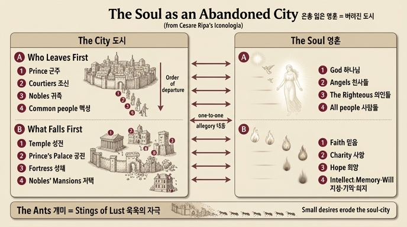

# 은총 잃은 영혼 = 버려진 도시 — 비유의 전개

체사레 리파의 『이코놀로지아』에 수록된 **「하나님 은총의 상실(Perdita della Grazia di Dio)」** 항목(빈첸치오 리치 수사 집필)은, 은총을 잃은 영혼을 **주민이 모두 떠나 황폐해져 가는 도시(Città depopolata e desolata)** 에 빗대어 알레고리를 전개한다. 이 항목의 도상은 "본래 아름다웠으나 온통 추해진 여인"이 찢어진 검은 옷을 입고, 머리에서 왕관이 떨어지며, 곁에는 개미 떼가 돌아다니는 파괴 중인 도시가 있고, 손에서 진홍 장미 가지가 떨어지는 모습이다. 이 카드는 그중 **도시 비유**의 두 단계 전개를 묻는다.

## 1단계: 떠남의 순서 — 위계에 따른 이탈

도시가 버려질 때는 신분의 위계 순서대로 떠난다. 영혼의 도시도 똑같은 순서로 비워진다.

| 도시에서 떠나는 자 | 영혼에서 떠나는 자 |
|---|---|
| 군주 (il Principe) | **하나님** — "위대한 군주이신 하나님이 등을 돌리고 떠나신다" |
| 조신들 (i Cortegiani) | **천사들의 영** — 영혼의 참된 조신(Spiriti Angelici, veri suoi Cortegiani) |
| 귀족들 (i Nobili) | **의인들과 택함받은 자들(i Giusti, ed Eletti)** — 영혼을 역병 걸린 자처럼 피해 달아난다 |
| 평민들 (gl'Ignobili) | **모든 사람들** — 그들 앞에서도 영혼은 가증하고 혐오스러운 존재가 된다 |

핵심 논리: 은총 안에 있을 때 하나님은 영혼 **안에 거주하시는(per grazia abitava)** 군주였다. 대죄(colpa mortale)로 은총을 잃으면 가장 높은 이부터 차례로 떠나, 영혼은 "사람 없는 도시"처럼 홀로 남는다. 원문은 예레미야애가를 인용한다: *"Quomodo sedet sola civitas plena populo"* (어찌하여 백성 많던 성읍이 홀로 앉았는고, 애 1:1).

## 2단계: 파괴의 순서 — 건물별 붕괴와 영혼 기능의 대응

도시가 함락되면 건물이 무너지는 순서에도 상징이 있다. 각 건물은 영혼의 신학적 덕과 능력에 대응한다.

| 무너지는 건물 | 영혼에서 무너지는 것 |
|---|---|
| **성전 (Sagro Tempio)** — 가장 먼저 | **믿음(Fede)** — 약해지고 식어 병들고 죽은 것이 되어, 이후 사탄의 화살의 과녁이 된다 |
| **군주의 궁전 (palagio del Principe)** | **사랑(carità)** — 하나님과 이웃을 향한 사랑이 완전히 꺼진다 |
| **성채 (Castelli)** — 도시를 적에게서 지키던 요새 | **희망(Speranza)** — 하늘에 대한 생생한 소망이 사라진다 |
| **귀족들의 저택 (palagi de' Nobili)** | **상위 능력들: 지성·기억·의지(intelletto, memoria, volontà)** — 온통 악에 넘어간다; 내적 감각과 하위 능력에서는 분노(irascibile)와 정욕(concupiscenza)이 자라난다 |
| **나머지 모든 것의 파괴** | **외적 감각들** — 곤두박질치듯 악에 몸을 던진다 |

즉 파괴의 순서는 **향주삼덕(믿음→사랑→희망) → 영혼의 3능력 → 감각**으로, 가장 거룩한 것부터 무너져 내려간다.

## 개미: 도시를 갉아 없애는 정욕의 자극들

도상에서 폐허 위를 돌아다니는 **개미 떼(Formiche)** 는 피에리오 발레리아노(Pierio Valeriano, 『Hieroglyphica』 8권)의 전거에 따른 것이다. 개미는 본래 "사람 사는 곳"의 히에로글리프이지만, 작고 무장하지 않은 동물임에도 도시를 파괴할 수 있고, 심지어 요람 속 아기의 얼굴을 갉아먹은 일까지 있었다고 한다. 리치는 이를 뒤집어 적용한다: **"잔인한 개미란 우리 정욕(concupiscenza)의 길들지 않은 자극들이니, 이것들이 우리 영혼의 도시를 파괴한다."** 큰 군대가 아니라 작고 하찮아 보이는 욕망의 자극들이 끊임없이 갉아먹어 영혼의 도시를 없앤다는 것이 이 비유의 마지막 층위다.

## 함께 기억할 주변 상징 (같은 항목의 도상)

- **찢어진 검은 옷**: 신랑이신 하나님을 잃은 **과부**의 상복이자, 지옥 용의 이빨에 물어뜯긴 상처 — *"Quasi vidua domina gentium"* (애 1:1)
- **떨어지는 왕관**: 지배권과 위대함의 상실 (땅에 쓰러진 **바퀴**도 같은 뜻 — 발레리아노에 따르면 군주들의 몰락의 상징)
- **손에서 떨어지는 진홍 장미 가지**: 은총 자체 — 흰색(무죄)과 붉은색(사랑)을 겸비한 장미가 떨어져 나감 (렘 40장 인용: 꽃이 시들었으니 주의 영이 그 위에 불었음이라)
- 본문 서두는 이 상실이 난파선, 포위된 요새, 대리석을 부수는 벼락, 예루살렘·트로이의 멸망보다 큰 파멸이라고 강조한다 — 그 모든 참상도 은총 상실에 비하면 "너른 바다에 물 한 방울"이다.

## 왜 이런 구조인가

이 알레고리의 힘은 **일대일 대응 매핑**에 있다: 도시의 사회적 위계(군주-조신-귀족-백성)는 영혼과 관계 맺는 존재들의 위계(하나님-천사-의인-사람들)로, 도시의 건축물 위계(성전-궁전-성채-저택)는 영혼의 내적 구조(믿음-사랑-희망-3능력)로 정확히 포개진다. 떠남은 "누가 영혼을 버리는가", 파괴는 "영혼 안에서 무엇이 무너지는가"를 각각 답하며, 마지막의 개미는 그 파괴의 **일상적이고 미시적인 동력**(작은 육욕의 자극들)을 지목한다.

> 참고: 리파 『이코놀로지아』의 이 항목(Perdita della Grazia di Dio)에는 판화 삽화가 없다.

## 인포그래픽

