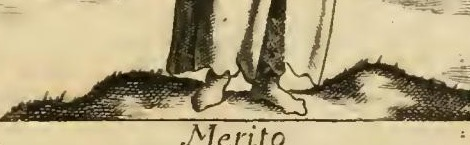
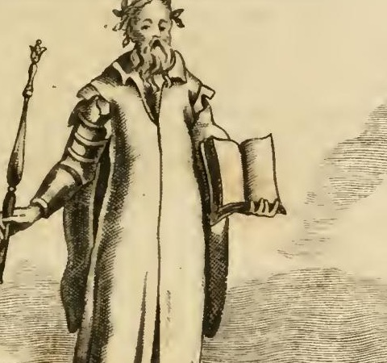
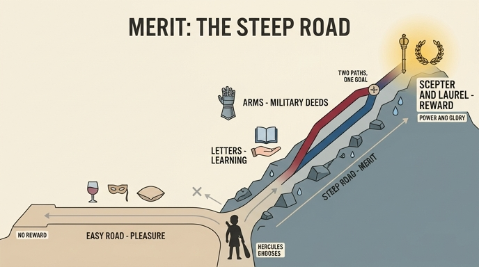

# '공로(MERITO)' 도상 — 험한 자리, 무장한 손, 그리고 책

> **Q.** '공로' 도상에서 험한 자리와 무장한 손·책은 무엇을 뜻하는가?
>
> **A.** 험한 곳은 공로에 이르는 어려움으로, 헤라클레스가 쾌락의 평탄한 길 대신 험한 덕의 산길을 택해 영웅이 된 이야기가 인용된다. 무장한 오른손(홀)과 책 든 왼손은 시민적 공로의 두 갈래인 전공(戰功)과 학문의 업적을 뜻하며, 둘 다 홀(지배권)과 월계관(영예)을 받을 자격이 있다.


*체사레 리파 『이코놀로지아』, 「MERITO(공로)」 판화. 좌하단에 `C.M.del.` 서명, 하단 표제 `Merito`.*

---

## 1. 리파 원문 그대로 읽기

리파의 「MERITO」 항목은 지물 목록(*descrizione*) → 정의 → 지물별 해설의 순서로 짜여 있다. 원문(이탈리아어 구판 활자, s/f 혼동 등 OCR 오식 보정)과 우리말 옮김을 나란히 둔다.

### 1-1. 지물 목록

> *UOmo sopra di un luogo erto, ed aspro. Il vestimento sarà sontuoso, e ricco, ed il capo ornato di una ghirlanda di alloro. Terrà colla destra mano, e braccio armato uno scettro; e colla mano sinistra nuda un libro.*

**험하고 거친(erto ed aspro) 자리 위에 선 남자.** 옷은 호화롭고 값지며, 머리에는 **월계관**을 썼다. **오른손과 오른팔은 무장한 채 홀(scettro)**을 들고, **왼손은 맨손으로 책**을 든다.

판화는 이 목록을 그대로 옮겼다. 발밑은 풀 한 포기 없이 해칭으로 거칠게 처리된 **울퉁불퉁한 암반 언덕**이고, 인물은 그 위에 **맨발**로 서 있다.



### 1-2. 정의 — "인정으로서 무언가가 마땅히 돌아가야 하는 덕의 행위"

> *Il Merito, secondo S. Tommaso nella terza parte della Somma, questione 45, art. 6, è azione virtuosa, alla quale si deve qualche cosa pregiata in ricognizione.*

공로란 **"어떤 값진 것이 그 인정(ricognizione)으로서 마땅히 돌아가야 하는 덕의 행위"**다. 즉 공로는 그 자체로 완결되지 않고 **반드시 보답(premio)을 향해 열려 있는** 개념이다. 이것이 뒤에 홀과 월계관이 붙는 논리적 근거다.

> **[출처 표기 교정]** 리파가 붙인 "『신학대전』 제3부 제45문 제6항"은 성립하지 않는 인용이다. 『신학대전』 III부 q.45는 **「그리스도의 변모(De transfiguratione Christi)」**이고 항(article)도 4개뿐이어서 "art. 6"이 존재하지 않는다. 공로(meritum) 자체를 다루는 대목은 **I-II부 q.114 「De merito」**이며, 행위의 공로성 일반은 I-II q.21 aa.3–4, 그리스도의 공로는 III q.19 a.3 및 III q.48 a.1이다. 구판 활자 조판에서 부(parte)·문(quaestio) 번호가 어긋난 오식으로 보아야 한다.

### 1-3. 지물별 해설

**(a) 험한 자리 = 공로에 이르는 어려움**

> *Si dipinge sopra il detto luogo aspro, per la difficoltà, per mezzo della quale l'Uomo perviene a meritare qualche cosa; perciò si dice ch'Ercole, figurato per l'Uomo studioso di fama e di gloria, lasciata la via piana e dilettevole, intesa per quella de' piaceri, si eleggesse l'altra difficile ed alpestre del Monte, cioè quella della virtù; onde per tante e sì celebri sue fatiche, meritò di esser numerato fra' più degni Eroi.*

거친 자리 위에 그리는 것은 **"사람이 무언가를 공로로 얻어내는 데 거쳐야 하는 어려움(difficoltà)"** 때문이다. 그래서 이렇게 말한다 — **헤라클레스**는 '명성과 영광에 열심인 사람'의 표상인데, **평탄하고 즐거운 길(= 쾌락의 길)을 버리고 험하고 산악인 다른 길(= 덕의 길)을 택했으며**, 그 수많은 이름난 고역(fatiche) 덕분에 **가장 값진 영웅들 사이에 헤아려질 자격을 얻었다(meritò)**.

여기서 어휘 선택이 중요하다. 쾌락의 길은 *piana*(평탄)·*dilettevole*(즐거운), 덕의 길은 *difficile*(어려운)·*alpestre*(산악의). 도상의 발밑 암반은 바로 이 *alpestre*의 압축이다.

**(b) 호화로운 옷 = 덕의 성향(habitus)**

> *Il ricco vestimento significa la disposizione e l'abito della virtù, mercè del quale l'Uomo fa le azioni degne di onore e di lode.*

값진 옷은 **덕의 소질(disposizione)과 습성(abito = habitus)**이다. 스콜라 용어 *habitus*를 '옷(abito)'의 동음이의로 시각화한 전형적인 리파식 언어유희다. 판화의 모피 안감을 덧댄 긴 관복은 곧 '몸에 입은 덕'이다.

**(c) 월계관과 홀 = 공로에 마땅한 보답**

> *Avendo il Merito relazione a qualche cosa, gli è data la corona e lo scettro, per farlo il più che si può spettabile; essendo quei premi segnalati, dovuti a gran merito. E però San Paolo della corona così dice: **Non coronabitur nisi qui legitime certaverit**.*

공로는 (1-2의 정의대로) **"무언가와의 관계(relazione)"**를 갖기에 관과 홀이 주어진다. 이것들은 큰 공로에 마땅한 뛰어난 상급이다. 성 바울의 말이 인용된다 — "**규정대로 싸운 자가 아니면 관을 받지 못한다.**"

> **[출처 표기 보충]** 「티모테오 2서」 2,5. 불가타 원문은 *"non coronatur nisi legitime certaverit"*(현재형, 관계대명사 *qui* 없음)이며, 리파가 적은 *non coronabitur nisi qui legitime certaverit*는 미래형·관계사가 들어간 유통 이문(異文)이다.

**(d) 무장한 오른팔 + 책 든 왼손 = 시민적 공로의 두 갈래**

> *La destra mano e braccio armato, e la sinistra col libro, dimostrano due generi di merito civile; l'uno dell'azione di guerra, e l'altro dello studio ed opere delle lettere, per ciascuno de' quali l'Uomo si può far meritevole dello scettro, significante la podestà di comandare agli altri Uomini, ed ancora della corona di alloro, premio non meno di eccellente nelle lettere, che d'invitti Capitani, la quale significa vero onore e perpetua gloria.*

무장한 오른손·오른팔과 책 든 왼손은 **시민적 공로(merito civile)의 두 종류**를 보인다 — 하나는 **전쟁의 행위**, 다른 하나는 **학문과 문필의 업적**. **각각으로써** 사람은 (i) 다른 사람들을 명령할 권한을 뜻하는 **홀**과, (ii) **참된 명예와 영원한 영광**을 뜻하는 **월계관**을 받을 자격이 있다. 월계관은 **불패의 장군에게 못지않게 문학에 뛰어난 이에게도** 주는 상이다.



판화에서 실제로 확인되는 것:

| 도상 요소 | 판화에서 보이는 모습 | 뜻 |
|---|---|---|
| 오른팔 | 관복 소매 밖으로 드러난 **판금 갑옷**(어깨 pauldron + 팔꿈치 couter + 팔 vambrace의 띠 모양 판) | 전공(戰功) |
| 오른손 | 아래로 기울여 쥔 **장식 머리의 홀** | 지배권(podestà di comandare) |
| 왼손 | **맨손**으로 받쳐 든 **펼쳐진 책** | 학문·문필의 업적 |
| 머리 | 잎이 갈라진 **월계관** | 참된 명예·영원한 영광 |
| 상체 전체 | 모피 안감의 **긴 호화 관복** | 덕의 habitus |
| 발밑 | 거칠게 해칭된 **암반 언덕**, 맨발 | 공로에 이르는 어려움 |

핵심 문법은 *per ciascuno de' quali*(**각각으로써**)다. 무와 문은 서로 다른 두 수단이지만 **똑같은 하나의 보답**(홀+월계관)에 도달한다. '두 갈래, 한 목표'라는 구성이다.

### 1-4. 참고: 같은 항목의 다른 이본

리파는 이어서 **로마 관방(Cancelleria) 홀에 그려진 공로**를 짧게 덧붙인다 — *"Uomo ignudo, con un manto reale. Terrà una corona in capo, e colla destra uno scettro."* 즉 **벌거벗은 몸 + 왕의 외투 + 관 + 홀**. 험한 자리도 갑옷도 책도 없이 관·홀만 남긴, **보답 쪽으로 압축된** 변형이다. 그 뒤 대괄호 안에 후대 편집자가 소개한 **P. 리치(Ricci)의 공로** 도상(붉은 옷·손 그림·NESCIO 두루마리)이 따라오는데, 이는 인간의 공로가 하느님 앞에서 불확실함을 강조하는 **신학적 계열**의 전혀 다른 도상이다. 이 카드가 다루는 판화와 혼동하면 안 된다.

---

## 2. 험한 자리의 뿌리 — 헤라클레스의 갈림길

### 2-1. 출처는 프로디코스, 전하는 이는 크세노폰

리파가 "그래서 이렇게 말한다(perciò si dice)"라며 짧게 인용한 이야기는 고대의 유명한 우화다.

- **원저자**: 케오스의 소피스트 **프로디코스(Prodicus of Ceos)**. 그의 연설/저작(전통적으로 『호라이(Ὧραι, 계절들)』에 속한 것으로 본다)에 담긴 우화였다.
- **전승 경로**: 원문은 소실되었고, **크세노폰 『소크라테스 회상(Memorabilia)』 2권 1장 21–34절**에서 소크라테스가 아리스티포스에게 절제를 권하며 **프로디코스의 것이라고 명시하고** 되풀어 말해주는 형태로 전한다. 즉 **"크세노폰이 기록한 프로디코스의 우화"**가 정확한 표기다.
- 통칭: **Hercules at the Crossroads / The Choice of Hercules**(헤라클레스의 갈림길, 헤라클레스의 선택), 이탈리아어로 *Ercole al bivio*.

### 2-2. 우화의 구조

소년기를 벗어나 **자기 삶의 길을 스스로 정할 나이**가 된 헤라클레스가 홀로 앉아 어느 길로 갈지 고민한다. 그 앞에 **두 여인**이 나타난다.

| | **Kakia (Κακία)** — 악덕/쾌락 | **Aretē (Ἀρετή)** — 덕/훌륭함 |
|---|---|---|
| 자칭 | (친구들은 '행복'이라 부른다고 자칭) *Eudaimonia* | 덕 그대로 |
| 외모 | 살집 있고 부드러운 몸, 화장으로 부풀린 혈색, 몸매가 드러나는 옷, 곁눈질로 주위를 살핌 | 단정한 몸, **흰 옷**, 정결함으로 꾸민 사지, 절제로 꾸민 눈, 흔들림 없는 자세 |
| 제안 | **가장 쉽고 즐거운 길**. 전쟁도 수고도 없이 먹고·마시고·즐긴다. 남의 노고의 열매를 취한다 | **길고 어려운 길**. 신들에게는 봉사와 경배로, 벗에게는 선행으로, 나라에는 수고로. 몸은 단련으로 다스려야 한다 |
| 결말 | 즐거움이 먼저, 그러나 끝이 없다 | **수고 뒤에 참된 행복과 영예** |

크세노폰이 이 우화를 배치한 문맥 자체가 **"통치할 자격은 안락이 아니라 훈련에서 온다"**는 논변이다. 리파가 이 이야기를 '험한 자리' 밑에 놓고 그 위에 **홀(통치권)**을 세운 것은 이 문맥과 정확히 겹친다.

### 2-3. 더 오래된 뿌리 — 헤시오도스

프로디코스의 우화보다 앞서, 이 '두 길' 심상의 원형은 **헤시오도스 『일과 날(Works and Days)』 287–292행**이다.

> **악덕(κακότης)은 무더기로, 손쉽게 얻을 수 있다. 그에게 이르는 길은 평탄하고(λείη ὁδός), 그는 아주 가까이 산다. 그러나 훌륭함(ἀρετή) 앞에는 불멸의 신들이 땀을 두었다. 그에게 이르는 길은 길고 험하며(μακρὸς καὶ ὄρθιος), 처음에는 거칠다(τρηχύς). 그러나 정상에 이르면, 그때는 쉬워진다 — 그전까지는 그토록 힘들었건만.**

리파 원문의 어휘와 대조해 보면 계보가 뚜렷하다.

| 헤시오도스 (WD 287–292) | 리파 「MERITO」 |
|---|---|
| λείη ὁδός (평탄한 길) | *la via **piana**, e dilettevole* |
| μακρὸς καὶ ὄρθιος (길고 곧추선) | *un luogo **erto*** (급경사의 자리) |
| τρηχύς (거친) | *ed **aspro*** / *l'altra difficile ed **alpestre*** |
| 정상에 이르면 쉬워진다 | 정점의 **홀·월계관** |

즉 리파의 지물 목록 첫 줄 *"luogo erto, ed aspro"* 자체가 헤시오도스의 *ὄρθιος + τρηχύς*를 이탈리아어로 옮긴 것에 가깝다. 판화의 암반 언덕은 2,300년쯤 된 은유의 조형화다.

### 2-4. 르네상스의 수용

이 우화는 15–17세기 유럽에서 **군주·귀족 교육의 표준 알레고리**로 다시 살아났다.

- **알레고리적 'Y'** — *littera Pythagorae*(피타고라스의 문자). 알파벳 Y는 하나의 줄기가 두 갈래로 벌어지는 형태여서, 사춘기에 갈라지는 인생의 두 길을 뜻하는 도상 기호로 쓰였다. 대개 왼쪽(넓은) 가지는 악덕, 오른쪽(좁은) 가지는 덕이며, 좁은 가지 끝에는 관·월계관이, 넓은 가지 끝에는 추락이 놓인다. 인쇄본 emblem book과 학교 교재에 널리 실렸다.
- **안니발레 카라치(Annibale Carracci), 「헤라클레스의 선택 / 갈림길의 헤라클레스」**(*Ercole al bivio*, 캔버스에 유채, 약 166×237cm, 1596년경). 로마 팔라초 파르네세의 오도아르도 파르네세 추기경 *camerino* 천장 중앙에 놓였던 그림으로, 현재 **나폴리 카포디몬테 미술관** 소장. 프로그램은 파르네세 가의 사서 **풀비오 오르시니(Fulvio Orsini)**가 짰다. 화면 왼쪽에 **험한 바위산 길로 이끄는 덕**, 오른쪽에 **가면·악기·부드러운 천을 둔 쾌락**이 앉은 헤라클레스를 사이에 두고 갈라진다. 리파 『이코놀로지아』 초판(1593)·도판판(1603)과 거의 같은 시기·같은 로마 인문주의 회로에서 나온 작품이다.
- 그 밖에 알브레히트 뒤러의 판화 「헤라클레스」(이른바 *Die Eifersucht*), 파올로 베로네세, 나중의 폼페오 바토니, 조지 프리드릭 헨델의 오라토리오 *The Choice of Hercules*(1750)까지 계보가 이어진다.

---

## 3. 무장한 손 vs 책 — arma et litterae

### 3-1. 대구 자체

리파가 *merito civile*를 **전쟁의 행위**와 **문필의 업적** 둘로 나눈 것은 르네상스의 가장 상투적인 대구 하나를 그대로 형상화한 것이다.

- 라틴어: **arma et litterae**
- 이탈리아어: **le armi e le lettere**
- 스페인어: *las armas y las letras* — 세르반테스 『돈키호테』 1부 37–38장의 유명한 '무와 문에 관한 연설(discurso de las armas y las letras)'이 이 주제를 정면으로 다룬다.
- 우리말로는 **무(武)와 문(文)**, 즉 **문무겸전(文武兼全)**과 정확히 대응하는 짝개념이다.

이 짝은 '두 개의 다른 미덕'이 아니라 **하나의 공적 탁월함이 드러나는 두 경로**로 이해되었다. 그래서 리파는 두 손을 좌우에 나란히 두고, 두 손 모두에게 **같은 상**을 약속한다.

### 3-2. 키케로 — 무기는 토가에 양보하라

> ***Cedant arma togae, concedat laurea laudi.***
> 무기는 토가에 양보하라, 월계관은 (문(文)의) 찬사에 자리를 내주라.

키케로가 자기 집정관 시절을 노래한 시 『나의 집정관직에 관하여(De consulatu suo)』의 한 행이며, 『의무론(De officiis)』 1권 77절에서 스스로 인용해 유명해졌다. 문맥은 "카틸리나 음모를 나는 군대가 아니라 시민적 지혜로 진압했다"는 자기변호이고, 그 앞뒤에서 키케로는 *"parvi enim sunt foris arma, nisi est consilium domi"*(집안에 지혜가 없으면 밖의 무기는 대수롭지 않다)고 말한다.

이 인용이 리파의 도상과 맞물리는 지점이 흥미롭다. 키케로는 **월계관(laurea)마저 문(文)에 양보하라**고 말했지만, 리파는 반대로 **월계관을 무와 문 양쪽에 똑같이 준다** — *"premio non meno di eccellente nelle lettere, che d'invitti Capitani"*(불패의 장군에게 못지않게 문학에 뛰어난 이에게도 주는 상). 즉 리파의 도상은 키케로식 **위계**를 **대등한 병렬**로 조정한 판본이다. 원래 로마의 개선식 월계관이 군사적 상징이었음을 생각하면, 이 병렬 자체가 인문주의의 주장이다.

### 3-3. 궁정 이상 — 카스틸리오네

발다사레 카스틸리오네 『궁정론(Il Libro del Cortegiano)』(1528)은 이 대구를 **한 사람 안에서 겸비해야 하는 것**으로 못박는다. 1권에서 이상적 궁정인의 *"prima e vera profession"*(첫째이자 참된 직분)은 **무기(arme)**라고 선언한 뒤, 곧이어 무예만으로는 부족하며 **litterae**, 특히 인문학(*humanae litterae*)·라틴어와 그리스어·시·역사·연설문 작성에 능해야 한다고 요구한다. 무예 없는 학식도, 학식 없는 무예도 반쪽이라는 것이다.

리파의 도상은 정확히 이 궁정 이상의 그림이다. **한 인물**이 **한 몸에** 갑옷 낀 팔과 책 든 손을 동시에 갖는다. 두 사람이 마주 선 대립 구도가 아니다.

### 3-4. 왜 오른손은 무장하고 왼손은 맨손인가

가장 손쉬운 독해는 **오른손=우위, 왼손=보조**의 위계다. 실제로 서양 도상에서 오른쪽(*dextra*)은 능동·우월·명예의 자리이고, 리파도 홀을 오른손에 준다. 그러나 이 도상에서 그 독해만으로는 부족하다. 리파 본문이 두 손에 **똑같은 보답**을 배정하며 *per ciascuno de' quali*라고 못박기 때문이다. 무가 문보다 위라는 말을 리파는 하지 않는다.

그래서 좌우의 차이는 **위계가 아니라 성질의 대비**로 읽는 편이 본문에 충실하다.

| | **무장한 오른손 (armato)** | **맨 왼손 (nuda)** |
|---|---|---|
| 표면 | 금속판으로 **덮임** | **드러남** |
| 작동 방식 | 보호·방어·**강제력(vis)** | 개방·노출·**설득(persuasio)** |
| 상대에게 하는 일 | 굴복시킨다 | 납득시킨다 |
| 취약성 | 스스로를 가린다 | 스스로를 내어놓는다 |
| 쥔 것 | 홀 — 단단하고 닫힌 물체 | 책 — **펼쳐진** 물체 |

판화가 이 대비를 시각적으로 강화한다. 오른팔의 갑옷은 짧은 금속 띠들이 겹친 **닫힌 표면**으로, 홀 역시 굳게 쥔 막대다. 반면 왼손의 책은 **활짝 펼쳐져 지면(紙面)을 관람자에게 향한다** — 갑옷이 감추는 것을 책은 내보인다. 손이 맨살인 것과 책이 열려 있는 것은 같은 몸짓이다.

부수적으로 실용적 근거도 있다. 리파의 도상은 대개 오른손에 주된 지물(여기서는 권력의 홀)을 주고, 책은 펼친 상태로 관람자에게 보여야 하므로 **손바닥으로 받쳐 드는 왼손**이 적합하다. 갑옷 낀 건틀릿으로는 얇은 책장을 펼쳐 받칠 수 없다.

---

## 4. 세 요소를 하나의 등반 서사로

리파의 「MERITO」는 서로 다른 지물의 목록이 아니라 **한 편의 등반 이야기**다.

```
                     ┌──────────────────────────────┐
   정점: 보답         │  월계관 (참된 명예·영원한 영광)   │
   (premio)          │  홀     (사람을 명령할 권한)      │
                     └──────────────┬───────────────┘
                                    │  같은 하나의 보답
                     ┌──────────────┴───────────────┐
   수단: 두 갈래      │  무장한 오른손        맨 왼손    │
   (merito civile)   │  전공(戰功)   ∥      학문·문필   │
                     │  arma        ∥      litterae   │
                     └──────────────┬───────────────┘
                                    │  per ciascuno de' quali
   차림: 덕의 habitus  ─────  호화로운 관복 (abito della virtù)
                                    │
   조건: 어려움        ─────  험하고 거친 자리 (luogo erto ed aspro)
                                    │
   ┌────────────────────────────────┴────────────────────────────────┐
   │  버려진 길: 평탄하고 즐거운 쾌락의 길 (via piana e dilettevole)      │
   │  — 헤라클레스가 택하지 않은 쪽                                     │
   └─────────────────────────────────────────────────────────────────┘
```

읽는 순서는 이렇다.

1. **아래 — 조건**: 공로에는 반드시 *difficoltà*가 앞선다. 평탄한 길을 버리는 선택(헤라클레스의 갈림길)이 출발점이다. 판화의 발밑 암반이 이 단계다.
2. **몸 — 성향**: 그 어려움을 감당하게 하는 것은 몸에 붙은 덕의 *habitus*, 곧 호화로운 옷이다. 조건과 수단 사이를 잇는 항이다.
3. **두 손 — 수단**: 오르는 길은 하나가 아니다. **무(전공)**와 **문(학문)**이 병렬로 올라간다. 강제력의 손과 설득의 손이다.
4. **머리 — 보답**: 두 길은 정점에서 하나로 합쳐진다. **홀**(권한)과 **월계관**(영예). "규정대로 싸운 자가 아니면 관을 받지 못한다."

**시험에 나올 요점 세 줄**

- **험한 자리** = 공로에 이르는 *difficoltà*. 근거로 **크세노폰 『회상』 2.1.21–34가 전하는 프로디코스의 우화**, 즉 헤라클레스가 평탄한 쾌락의 길을 버리고 험한 덕의 산길을 택한 이야기. 더 오래된 뿌리는 **헤시오도스 『일과 날』 287–292**.
- **무장한 오른손 + 책 든 왼손** = *merito civile*의 두 갈래 = **전공(arma)과 학문(litterae)**. 르네상스의 표준 대구이며 한 몸에 겸비하는 것(카스틸리오네)이 이상.
- **둘 다 같은 보답** = **홀**(지배권) + **월계관**(참된 명예·영원한 영광). 곧 **두 갈래, 한 목표**.

---

## 인포그래픽


