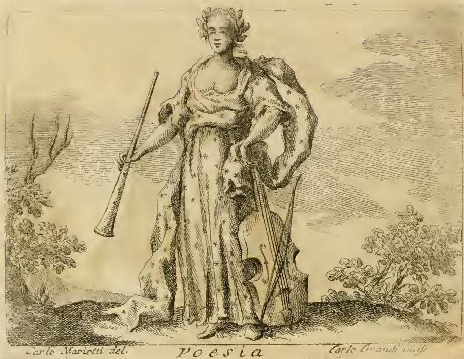

# 리파의 '회화(Pittura)' 의인화

## 핵심 정리

체사레 리파(Cesare Ripa)는 『이코놀로지아(Iconologia)』에서 회화(Pittura)를 다음과 같은 아름다운 여인으로 의인화했다.

- **검고 굵은 머리카락**이 여러 갈래로 흩어지고 꼬여 있다.
- **눈썹을 치켜올려**(ciglia inarcate) 공상적인 생각(pensieri fantastici)을 드러낸다.
- **입은 귀 뒤로 묶은 붕대(fascia)로 가려져** 있다.
- 목에는 **금 사슬**을 걸고, 거기에 **가면(maschera)**이 매달려 있다.
- 이마에는 **"Imitatio(모방)"**라는 글자가 쓰여 있다.
- 한 손에는 **붓(pennello)**, 다른 손에는 **팔레트(tavola)**를 든다.
- **무지개빛으로 변하는 천(drappo cangiante)** 옷을 입는데, 옷자락이 **발까지 덮는다**.
- 발치에는 회화의 여러 **도구들**을 놓아도 좋다.

## 각 요소의 상징적 의미 (리파 본문 해설)

리파는 도상의 각 요소에 상세한 의미를 부여했다. 원문(이 챕터의 P I T T U R A 절)의 설명을 요약하면:

| 요소 | 의미 |
|---|---|
| 아름다운 여인 | 육체의 아름다움과 정신의 아름다움은 둘 다 완전성이며 고귀함의 표지 — 회화의 고귀함 |
| 검고 굵은 헝클어진 머리 | 화가는 자연과 예술의 모방을 끊임없이 궁리하므로 근심과 우울(melanconia)에 빠진다. 머리카락이 머리 밖으로 솟아나듯, 머리 안에서는 사변과 작품의 매개가 되는 생각과 환상(fantasmi)이 솟아난다 |
| 치켜올린 눈썹 | 경이(maraviglia). 화가는 아주 미세한 것까지 정밀하게 탐구하므로 경탄과 우울을 함께 얻는다 |
| 가려진 입 | **침묵과 고독**만큼 회화에 이로운 것이 없다. 화가들이 은밀한 곳에 틀어박히는 것은 미완성작을 비난받을까 두려워서가 아니라 침묵을 위해서다. "회화는 말 없는 시(la Poesia tace nella Pittura)"라는 격언과도 통한다 |
| 금 사슬에 매달린 가면 | **모방(imitazione)은 회화와 분리 불가능하게 결합**되어 있다. 가면은 사람 얼굴의 초상이므로, 회화가 실재하는 것들의 모방을 필요로 함을 나타낸다 |
| 사슬의 고리들 | 사물 간의 유사성과 연결. 키케로가 말했듯 화가는 스승에게 모든 것을 배우는 게 아니라 하나에서 여럿을 유사성으로 사슬처럼 이어 배운다 |
| 금(金)이라는 재질 | 회화가 **고귀함(nobiltà)의 후원 없이는 쉽게 쇠퇴**함을 보여준다 |
| 이마의 "Imitatio" | 회화의 본질이 자연의 모방임을 명시 |
| 무지개빛(변화하는) 옷 | **다양성(varietà)이 특히 즐거움을 준다** |
| 발까지 덮는 옷자락 | 회화의 토대인 비례(proporzioni)와 밑그림(disegno)은 완성작에서는 **감추어져야** 한다. 웅변가가 기교 없이 말하는 척하는 것이 큰 기교이듯, 화가도 기교가 드러나지 않게 그리는 것이 참된 기교("예술은 예술을 감춘다") |
| 발치의 도구들 | 회화가 지성의 깊은 집중 없이는 불가능한 **고귀한 활동(esercizio nobile)**임을 보여준다 |

## 회화 vs 시 — "말 없는 시"

리파는 이 절에서 회화와 시(Poesia)를 대비시킨다. "시는 회화 속에서 침묵하고, 회화는 시 속에서 말한다"는 속담(호라티우스의 *ut pictura poesis* 전통)처럼, 시인은 지성으로 파악되는 것을 통해 눈에 보이는 듯 만들고, 화가는 눈에 보이는 것을 통해 지성이 이해하게 만든다 — 방향만 반대일 뿐 둘 다 '자연을 속이는' 모방 예술이다. Pittura의 **가려진 입**은 바로 이 "말 없는(muta)" 예술이라는 관념과 침묵·고독의 미덕을 함께 담고 있다.

## 미술사적 영향 — 아르테미시아 젠틸레스키

리파의 Pittura 도상은 이후 화가들의 자기 표상에 큰 영향을 주었다. 가장 유명한 예가 **아르테미시아 젠틸레스키(Artemisia Gentileschi)의 「회화의 알레고리로서의 자화상(Self-Portrait as the Allegory of Painting, La Pittura)」(1638–39년경, 영국 로열 컬렉션)**이다.

- 헝클어진 검은 머리, **목의 금 사슬에 매달린 가면 펜던트**, 무지개빛(변색하는) 옷, 한 손의 붓과 다른 손의 팔레트 — 리파의 처방을 충실히 따랐다.
- 다만 자화상이므로 **입을 가리는 붕대는 생략**했다. 여성 화가였던 젠틸레스키는 자신이 곧 '회화의 의인화(여성형 명사 Pittura)'가 될 수 있다는 점을 활용했는데, 이는 남성 화가들은 흉내 낼 수 없는 독보적 자기 선언이었다.

## 암기 포인트

"**모방(Imitatio)하는 말 없는 여인**"으로 압축해서 기억하자.
1. 머리(헝클어진 검은 머리) → 화가의 상념과 우울
2. 얼굴(치켜뜬 눈썹 + 붕대로 가린 입 + 이마의 Imitatio) → 경이, 침묵, 모방
3. 목(금 사슬 + 가면) → 고귀함과 불가분의 모방
4. 손(붓 + 팔레트) → 회화의 도구
5. 옷(발까지 덮는 무지개빛 옷) → 다양성의 즐거움, 기교의 은폐
