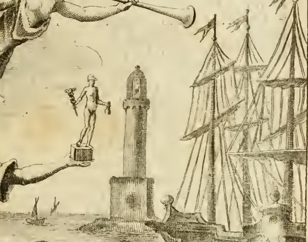

# '상업(Mercatura)' 도상의 항구와 바다 — 하나의 배경, 정반대 두 의미

> **Q.** '상업' 도상에서 항구와 바다는 무엇을 뜻하는가?
>
> **A.** 항구와 배들은 먼 나라에서 부족한 물자를 들여오고 남는 물자를 내보내는 참된 상업의 본질(항해의 필요)을 뜻한다. 동시에 바다는 위험·고난·상실의 상징(피에리오 38권)으로, 폭풍 한 번에 부자에서 극빈자가 되는 상인의 운명적 위험을 나타낸다.

이 카드의 핵심은 **한 개의 배경 요소가 서로 정반대인 두 의미를 동시에 지닌다**는 점이다. 같은 바다가 한쪽에서는 상업을 **정당화**하고, 다른 쪽에서는 상업을 **위태롭게** 만든다. 오를란디는 이 둘을 한 단락 안에서 잇달아 말한다.

---

## 1. 판화에서 실제로 확인되는 것

*Iconologia* 제4권(체사레 오를란디 편) 'MERCATURA' 항목의 판화다. 화면을 앞/뒤로 나눠 보면 도상 논리가 곧바로 드러난다.

**앞쪽(육지·계산의 층위)** — 희고 값비싼 옷을 입은 미녀가 **꾸러미(balle, 포장된 상품 더미) 위에 앉아** 있다. 오른손을 뻗어 **돈주머니를 든 메르쿠리우스 소상(小像)**을 받쳐 들고, 왼쪽 어깨 뒤로 **풍요의 뿔(cornucopia)**이 솟아 있다. 발치에는 **장부·상업 서적, 자·되(misure), 천칭과 분동(bilance, pesi), 낙인(marche)**이 흩어져 있고 왼쪽 아래에 **수탉(Gallo)**이 있다. 머리 위로는 **나팔을 부는 명성(Fama)**이 날아든다.

**뒤쪽(바다·위험의 층위)** — 인물 등 뒤 전체가 바다다.

확대해 보면 배경은 세 겹으로 그려져 있다.

1. **방파제(molo) 끝의 석조 등대** — 제노바 '라 란테르나'류의 높은 원통 탑. 항해의 위험을 *관리*하는 인공 장치다.
2. **방파제 안쪽에 정박한 대형 3본 마스트 범선** — 돛을 걷고 깃발을 올린 채 안전하게 계류돼 있다. 이것이 '항구'의 몫이다.
3. **왼쪽 먼 바다의 작은 배 두세 척** — 아무 보호 없이 열린 수면에 떠 있다. 이것이 '바다'의 몫이다.

즉 화가는 **항구(안전·이익)와 바다(노출·위험)를 한 장면 안에 나란히** 배치했다. 등대는 그 둘 사이를 매개하는 유일한 장치로 그려졌다.

**배치의 의미** — 의인상은 **바다를 등지고 육지 쪽(관람자 쪽)을 향해** 앉아 있다. 위험은 등 뒤 배경에 두고, 계량기·천칭·장부는 발치에 두는 구도다. 상인이 실제로 손에 쥐고 통제할 수 있는 것은 계량과 회계뿐이고, 사업의 성패를 좌우하는 바다는 통제 밖에 있다 — 그 통제 불능이 등 뒤에 있다는 점까지 구도가 말한다.

**원문과 그림의 어긋남(주의)** — 오를란디의 지시문은 "Si ponga **avanti** un Porto di mare"(그 **앞에** 바다 항구를 두라)이고 "**Sia in atto di camminare in fretta**"(서둘러 걷는 자세일 것)라고 적었다. 그러나 판화의 그녀는 **앉아** 있고 항구는 **등 뒤**에 있다. 판화가가 지시문을 문자대로 따르지 않은 사례로, *Iconologia* 계열에서 텍스트와 삽화가 늘 일치하지는 않는다는 점을 보여준다. 카드 답을 외울 때는 '항구가 앞이냐 뒤냐'가 아니라 **항구·배·바다가 무엇을 뜻하는가**가 핵심임을 기억할 것.

---

## 2. 오를란디 원문 — 항구·바다 단락 (직역)

해당 대목은 원문에서 다음과 같다(구철자 그대로, OCR 상태 반영).

> *La pongo avanti un Porto di mare con veduta di Navi, Vascelli ec. per significar la proprietà della vera Mercatura, che consiste nel far provvista da' remoti paesi di quelle cose, che o nel proprio mancano affatto, o di soverchio scarseggiano; oppure di far giungere ne' luoghi, dove mancano, quelle robe, che nel proprio abbondano; per il che eseguire è necessaria, quasicché sempre, la Navigazione. Oltre di ciò è simbolo il mare del pericolo, travagli, e perdimento, come si può vedere appresso il Valeriano lib. 38.; e quindi voglio per esso dimostrare i perigli, a' quali è pur troppo soggetto chi mercanteggia, e le angustie, che sovente produce nell'animo, o sul pensiero dello stesso pericolo, o sul effettivo perdimento di robe, che spesso accade.*

**직역**

> 나는 그녀 앞에 배와 선박 등이 보이는 바다 항구를 놓는다. 이는 **참된 상업의 고유한 성질**을 뜻하기 위한 것인데, 그 성질이란 자기 나라에 전혀 없거나 심히 부족한 물건을 **먼 나라에서 조달**하는 일, 또는 자기 나라에 넘치는 물자를 **그것이 부족한 곳으로 보내는** 일에 있다. 이를 실행하려면 거의 언제나 **항해**가 필요하다.
> 그 밖에도 **바다는 위험·고난·상실의 상징**인데, 발레리아노 38권에서 볼 수 있다. 그러므로 나는 바다로써 장사하는 자가 너무도 자주 노출되는 위험들, 그리고 그 위험을 생각하는 데서 오거나 실제로 물건을 잃는 일에서 오는 마음의 고통을 나타내려 한다.

이어지는 문장이 카드 답의 '폭풍 한 번에'에 해당한다.

> *Quante fiate all' instabilità delle onde dovendo affidare la somma de' loro negozj, è cagione una sola tempesta, che da ricchi, e felici, in un baleno si ritrovino in braccio alla più compassionevol miseria!*

> 자기 사업 전액을 **파도의 불안정성에 맡겨야** 하는 일이 얼마나 많은가. **단 한 번의 폭풍**이 원인이 되어, 부유하고 행복했던 이들이 **눈 깜박할 사이에** 가장 딱한 비참의 품에 안기고 만다!

그리고 오를란디는 프로페르티우스를 인용해 단락을 닫는다.

> *Ah pereat quicumque rates et vela paravit / primus, et invito gurgite fecit iter!*
> "아, 처음으로 배와 돛을 마련하고 원치 않는 심연에 길을 낸 자, 그 누구든 망하기를!"
> — 프로페르티우스 『비가』 1.17.13–14

오를란디는 여기서 멈추지 않고, 위험이 바다에만 있지 않다고 덧붙인다. **거래 상대(Corrispondente)의 갑작스러운 파산**도 상인을 단숨에 몰락시킨다는 것이다. 이어 그는 파산의 원인을 운(sorte)만이 아니라 **경영 부실·과소비·신분에 맞지 않는 사치 경쟁·부실한 사용인·무분별한 외상 판매**로 열거한다. 즉 바다는 '통제 불능 위험'의 대표 이미지이되, 상인의 위험 목록 전체는 아니다.

---

## 3. 긍정 층위 — 항구·배 = 결핍과 잉여의 교환

오를란디는 항구를 곧 **'참된 상업(vera Mercatura)'의 정의**로 쓴다. 이 정의는 그가 즉석에서 만든 것이 아니라, 같은 항목 앞부분에서 그가 인용하는 권위에서 온 것이다.

- **바르톨로메오 카사네오**(Barthélemy de Chasseneuz), 『Catalogus Gloriae Mundi』 제11부 고찰 45의 상인론:
  > *Sunt honorandi, cum nobis necessarii esse videantur, cum quae nobis supersunt devehant, & permutando ac vendendo ea advehant, quae necessaria sint.*
  > "그들은 존경받아야 한다. 우리에게 없어서는 안 될 자들로 보이니, **우리에게 남는 것을 실어 내가고, 교환하고 팔아서 필요한 것을 실어 들여오기** 때문이다."

  카사네오의 이 한 문장이 곧 판화 배경의 항구 장면 그 자체다. '남는 것을 내보내고 필요한 것을 들여온다'는 두 방향의 운동은 항구에서만 가능하고, 따라서 **항해(Navigazione)**가 상업의 필요조건이 된다.

- **아리스토텔레스 문제** — 주의할 지점이다. 흔히 '자연이 자원을 고르게 나누지 않았으므로 교환이 필요하다'는 논변을 아리스토텔레스에 돌리지만(그 근거는 『정치학』 I.9와 『니코마코스 윤리학』 V.5의 교환론), **오를란디는 아리스토텔레스를 오히려 반대 진영으로 인용한다**: *"Checché contradica Aristotele Politic. 7. cap. 4"* — "아리스토텔레스 『정치학』 7권 4장이 무엇을 반대하든." 이는 이상 국가에서 항구·교역항(emporion)이 시민에게 끼치는 해악을 논한 대목을 가리키는데, 현대 표준 편집에서는 **『정치학』 VII.6 (1327a–b)**에 해당한다(권·장 번호는 18세기 판본 관행에 따라 어긋난다 — 원문 인용의 번호 차이로 보아야 하며 오를란디의 착오라 단정할 필요는 없다). 함께 인용된 **발두스**(Baldo de Ubaldis, *l. Nobiliores, C. de Commerciis et Mercatoribus* 주해)도 귀족의 상업 종사에 부정적인 권위로 등장한다.
  → 즉 이 항목의 논쟁 구도는 "아리스토텔레스·발두스(상업 폄하) **대** 카사네오·챔버스·근세 국가 실무(상업 옹호)"이고, 오를란디는 후자 편에 선다.

- **에프라임 챔버스**(Ephraim Chambers) 『Cyclopaedia』 인용 — 프랑스 루이 14세의 1669년·1701년 선언으로 귀족의 해상·육상 교역이 신분 실추(dérogeance) 없이 허용되었고, 브르타뉴에서는 소매업조차 귀족을 훼손하지 않으며(교역 기간 중 귀족 특권을 '잠들게' 두었다가 교역을 그치면 별도 복권 문서 없이 되찾는다), 공화국에서는 상업이 더욱 존중되며 특히 영국에서 귀족의 차남·아우들이 상업 교육을 받는다는 대목이다. **항구의 긍정 의미는 이 실무적·정치경제적 옹호론과 한 덩어리다.**

- **키케로의 항구 비유** — 오를란디는 『의무론』 1권 §151을 두 토막으로 나눠 인용한다. 소매업에는 *"Mercatura si tenuis est, sordida putanda est"*(상업이 영세하면 천하다), 도매업에는 *"Si magna, & copiosa, multa undique apportans, multisque sine vanitate impertiens, non est admodum vituperanda"*(크고 풍부하여 사방에서 많은 것을 들여와 많은 이에게 허풍 없이 나눠 준다면 그리 비난할 것이 아니다). 그리고 결론부:
  > *atque etiam si satiata quaestu, vel contenta potius, ut saepe **ex alto in portum**, ex ipso portu se in agros possessionesque contulerit, videtur iure optimo posse laudari.*
  > "게다가 이익에 배부르거나 차라리 만족하여, 흔히 그러듯 **높은 바다에서 항구로**, 다시 항구에서 밭과 소유지로 물러난다면, 아주 정당하게 칭찬받을 만하다."

  키케로가 이미 **'외해 → 항구 → 육지'**라는 3단 이동을 상인의 이상적 생애로 썼다는 점이 중요하다. 판화의 구도(외해의 작은 배 → 방파제 안 정박한 큰 배 → 육지의 꾸러미 위에 앉은 인물)는 사실상 **키케로의 이 문장을 공간으로 번역한 것**으로 읽을 수 있다.

---

## 4. 부정 층위 — 바다 = 위험·고난·상실, 그리고 '피에리오'는 누구인가

### 4.1 피에리오 발레리아노와 『Hieroglyphica』

카드 답의 '피에리오'와 원문의 '발레리아노'는 **동일 인물**이다.

- 본명 **조반니 피에트로 달레 포세**(Giovanni Pietro dalle Fosse), 인문주의자 필명 **조반니 피에리오 발레리아노 볼차니**(Giovanni Pierio Valeriano Bolzani). **1477년 벨루노 출생, 1558년 사망**(일부 도서관 전거는 1560년으로 적는다).
- 대표작 **『Hieroglyphica, sive de sacris Aegyptiorum literis commentarii』**. 1520년대 후반에 거의 완성되었고 **1556년 바젤**에서 초판이 나왔다. **총 58권(libri LVIII)** 구성이며, 후대 판본에는 첼리오 아우구스티노 쿠리오네가 붙인 2권이 더해져 60권으로 인쇄된다.
- 각 권은 **하나의 부류(동물·식물·사물·신체 부위·자연 원소 등)**를 맡아, 그 대상이 어떤 관념의 상징이 되는지를 고대 그리스·라틴 저자 400여 명에서 끌어와 정리한다. 항목마다 후원자에게 헌정사가 붙어 있다.
- 호라폴로의 『Hieroglyphica』, 저자 본인의 이탈리아 고대 유물 답사, 숙부 프라 우르바노에게서 전수받은 지식이 세 기둥이다.
- 라틴어로 약 120년간 일곱 차례 재판되고 프랑스어(1576, 1615)·이탈리아어(1602)로 번역되었다. **르네상스 최초의 본격 상징 백과사전**이자 **리파 『Iconologia』가 가장 많이 의존한 원천**이다. 리파는 보통 "Pierio"라는 이름으로 인용하고, 오를란디는 "il Valeriano"로 인용한다 — 같은 책이다.

### 4.2 '38권'은 어느 권인가

- 『Hieroglyphica』가 58권이므로 **'lib. 38'은 실재하는 권 번호**이고, 이 인용 자체는 형식상 오식이 아니다.
- 그러나 **38권이 정확히 어떤 부류(물·바다·강 등)를 다루는지는 이번 조사로 확인하지 못했다.** 하이델베르크 대학 디지털판(1575·1604·1614년판) 색인 페이지는 접근이 차단되어 목차를 대조할 수 없었다. 뒤쪽 권들이 자연 원소·인공물로 내려가는 배열이므로 물/바다 항목이 30권대 후반에 놓이는 것은 개연성이 있으나, **여기서는 '미확인'으로 표시해 둔다.** 정확히 검증하려면 1556년 바젤판 또는 1614년 쾰른판의 *Index librorum*에서 LIBER XXXVIII의 표제를 직접 확인해야 한다.
- 시험 목적상 외울 것은 권 번호가 아니라 **"바다는 위험·고난·상실(pericolo, travagli, perdimento)의 상징이며, 그 근거로 오를란디가 발레리아노를 든다"**는 구조다.

---

## 5. 왜 이 양가성이 '상업' 항목에 필수적인가

항구와 바다가 한 배경에 겹쳐 있어야 하는 이유는 미학이 아니라 **윤리학**이다. 중세·근세 상업 윤리의 중심 논리가 **"이익은 위험 부담의 대가"**였기 때문이다.

### 5.1 위험(*periculum*)이 이익을 고리대와 구별한다

스콜라 학자들의 고리대(*usura*) 정죄의 핵심 근거는 **대주(貸主)가 아무 위험도 지지 않으면서 시간에 값을 매긴다**는 데 있었다. 따라서 이자·이익이 정당해지는 통로는 **위험과 손실의 실재**로 설정되었고, 이른바 외재적 정당화 사유(tituli extrinseci)가 발달한다.

| 사유 | 뜻 |
|---|---|
| *periculum sortis* | 원금 자체가 사라질 위험을 대주가 부담함 |
| *damnum emergens* | 대여로 실제 발생한 손해 |
| *lucrum cessans* | 그 돈으로 얻었을 이익의 상실 |

**상인의 이익이 정당한 것은 상인이 바다를 무릅쓰기 때문이다.** 오를란디의 판화에서 위험한 바다를 지우면, 남는 것은 위험 없이 저절로 불어나는 돈 — 곧 고리대의 그림이 된다. **바다는 상업의 도덕적 알리바이다.**

이 논리는 오를란디 본문 안에서도 곧바로 이어진다. 그는 외상 판매(*dare a credenza*)를 논하면서, 상인이 즉시 현금을 받았다면 그 돈으로 얻었을 이익만큼은 (구매자와 합의하여) 값에 얹어도 부당하지 않다고 인정한다 — 이는 *lucrum cessans* 논변 그 자체다. 그러나 곧 못을 박는다.

> *non fa altro, che rilasciar denaro a frutto; ma torno a ripetere, questo frutto non senta di usura.*
> "그는 돈을 이자 붙여 내주는 것과 다르지 않다. 다시 말하지만, **그 이자가 고리대 냄새를 풍겨서는 안 된다.**"

즉 같은 항목이 앞에서는 '바다의 위험'으로 이익을 정당화하고, 뒤에서는 '위험 없는 외상 이자'를 고리대 경계선에 세운다. **위험의 유무가 판단 기준이라는 구조가 텍스트 전체를 관통한다.**

### 5.2 위험을 분산하려는 제도들

바다의 위험이 실재했으므로, 상업사는 곧 **위험 분산 장치의 역사**다.

- ***commenda* / *societas maris*** — 앉아 있는 투자자(*stans*)가 자본을, 항해하는 동업자(*tractator*)가 노동과 신체적 위험을 낸다. 제노바형 *societas maris*의 전형은 stans가 자본 2/3, 여행 동업자가 1/3과 노동을 대고 **이익을 절반씩** 나누는 형태였다. 이자 계약이 아니라 **손익 공유(동업)** 형식이므로 고리대 금지를 우회하면서 위험을 나눌 수 있었다.
- **해상보험(marine insurance)** — 14세기 이탈리아에서 위험을 별개의 계약 대상으로 떼어낸다. 현존 최고(最古) 수준의 보험 계약 사례가 **1340년대 제노바**에서 나오고, 이후 **피렌체·피사(1379년 이후)**, **바르셀로나 보험 조례(1435)**로 제도화된다.
- **왜 별도 계약이 필요했는가** — 교황 그레고리우스 9세의 교령 **《Naviganti vel eunti ad nundinas》(1234, *Liber Extra*)**는 '해상 위험을 인수하는 대가'로 더 받는 돈을 고리대로 규정했다. 그 결과 고대·중세의 해상대차(*foenus nauticum*)는 정면으로 쓰기 어려워지고, 상인들은 **동업(commenda)**과 **보험(위험 인수를 매매 형식으로 재구성)**이라는 우회로를 발달시켰다. 즉 판화 배경의 바다는 그 자체로 **금융 제도사를 낳은 압력**이다.
- **분산 원칙** — 한 배에 전 재산을 싣지 않는다. 오를란디가 한탄한 *"자기 사업 전액을 파도의 불안정성에 맡겨야 하는"* 상황이 바로 이 원칙을 지키지 못한 상태다.

---

## 6. 문학적 반향 — 같은 양가성의 다른 판본들

이 도상은 고립된 발상이 아니다. 항해 = 이익과 파멸의 이중성은 서양 문학의 오래된 상투구다.

- **셰익스피어 『베니스의 상인』(1596–98)** — 안토니오는 위험 분산을 자신의 미덕으로 내세운다.
  > *My ventures are not in one bottom trusted, / Nor to one place.* (1막 1장)
  > "내 투자는 한 선체(船體)에만, 한 장소에만 맡겨져 있지 않소."

  그리고도 극의 파국은 **정확히 그 배들이 난파했다는 소문**에서 온다. 분산조차 바다를 이기지 못한다는 것 — 오를란디의 '단 한 번의 폭풍'과 같은 주제다. 이 극이 동시에 **위험 없는 이자(샤일록)와 위험을 무릅쓴 이익(안토니오)의 대립**을 다룬다는 점에서, 5.1절의 스콜라 논변과도 곧바로 맞물린다.

- **호라티우스 『송가』 1.1.15–18** — 상인의 자기모순을 네 줄로 압축한다.
  > *luctantem Icariis fluctibus Africum / mercator metuens otium et oppidi / laudat rura sui; mox reficit rates / quassas, indocilis pauperiem pati.*
  > "이카리아 파도와 씨름하는 아프리쿠스 바람을 두려워하며, 상인은 한가로움과 고향 마을의 들판을 칭송한다. 그러나 곧 **부서진 배를 고친다** — 가난을 견디는 법을 배우지 못한 자라서."

  폭풍을 두려워하면서도 다시 배를 띄우는 이 인물이야말로 판화가 그린 상업 그 자체다.

- **프로페르티우스 『비가』 1.17.13–14** — 오를란디가 직접 인용한 저주("항해를 처음 발명한 자, 망하기를"). 같은 모티프는 호라티우스 『송가』 1.3에서도 반복된다(신들이 갈라 놓은 바다를 배가 불경하게 건넌다).

- **시편 107:23–30** — 성서 쪽 판본이며 구조가 완전히 같다.
  > "배들을 바다에 띄우며 큰 물에서 일을 하는 자는 여호와의 행사와 그의 기이한 일을 바다에서 보나니 … 그가 광풍을 일으키사 바다 물결을 일으키시도다 … 이에 그들이 근심 중에 여호와께 부르짖으매 그가 그들의 고통에서 그들을 인도하여 내시고 광풍을 그치게 하시고 물결도 잔잔하게 하시는도다. **그들이 평온함으로 말미암아 기뻐하는 중에 여호와께서 그들이 바라는 항구로 인도하시는도다.**"

  '큰 물에서 일을 함(=상업)' → '광풍' → '**바라는 항구(desired haven)**'. **바다는 시련, 항구는 구원**이라는 이 배열이 판화의 배경 구성과 정확히 겹친다. 판화의 등대가 방파제 끝에 서 있는 이유도 여기서 읽을 수 있다 — 등대는 바다의 위험을 없애지 못하지만, 항구를 **찾을 수 있게** 만든다.

---

## 7. 한 문단 정리

'상업' 도상의 배경은 **경제학과 도덕신학이 겹쳐 그려진 자리**다. 항구와 배는 카사네오의 정식대로 '남는 것을 내보내고 없는 것을 들여오는' 지역 간 교환이며, 이것이 오를란디가 말하는 **참된 상업의 정의**이고 그래서 항해는 필수다(긍정 층위). 동시에 바다는 발레리아노를 근거로 **위험·고난·상실**의 상징이며, 단 한 번의 폭풍이 부자를 극빈자로 만든다(부정 층위). 이 두 층위는 분리되지 않는다. **위험이 있기에 이익이 고리대와 구별되고, 그 위험을 나누려는 노력에서 commenda와 해상보험이 나왔다.** 판화에서 그녀가 바다를 등지고 장부와 천칭을 발치에 두고 앉아 있는 것은, 통제할 수 있는 것(계량·회계)과 통제할 수 없는 것(바다)을 가른 뒤 그럼에도 그 위에서 사업을 하겠다는 태도의 그림이다.

---

## 부기 — 출처 관련 메모

- **'피에리오' = '발레리아노'** : 동일인(조반니 피에리오 발레리아노 볼차니). 리파는 "Pierio", 오를란디는 "il Valeriano"로 부른다. 카드 답의 '피에리오 38권'은 『Hieroglyphica』 38권을 뜻한다.
- **'38권'의 실제 표제** : **미확인**. 58권 구성이므로 번호 자체는 유효하나, 해당 권의 주제를 1차 자료(1556년 바젤판/1614년 쾰른판의 *Index librorum*)로 대조하지 못했다.
- **'Aristotele Politic. 7. cap. 4'** : 현대 표준 편집의 **『정치학』 VII.6 (1327a11–b15)**, 항구·교역항의 이해득실 논의에 해당한다. 18세기 인용 관행에 따른 장 번호 차이로 보인다.
- **'Cicerone nel primo de Officiis'** : 정확하다 — **『의무론』 1권 §151**. 오를란디가 나눠 인용한 세 토막 모두 이 절에 연속해 있다.
- **'Properzio'** : 정확하다 — **『비가』 1.17.13–14**.
- **발레리아노 사망 연도** : 위키백과 등은 **1558년**, 일부 도서관 전거는 **1560년**으로 적는다.

**원본 이미지 출처** : `assets/Iconologia (Cesare Ripa)/_page_104_Picture_1.jpeg`
(`fig-1.jpeg` = 원본 전체, `fig-2.jpeg` = 배경 항구 부분 확대 크롭)
