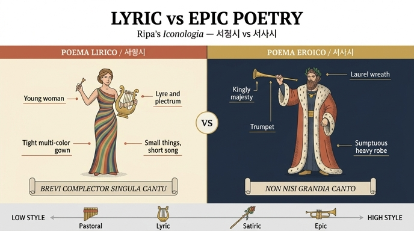

# 서정시(Poema Lirico)와 서사시(Poema Eroico)의 도상

## 한눈에 보기

| | **서정시 (POEMA LIRICO)** | **서사시 (POEMA EROICO)** |
|---|---|---|
| 인물 | 젊은 여인 (Donna giovane) | 왕 같은 위엄의 남자 (Uomo di reale maestà) |
| 손에 든 것 | 왼손에 리라, 오른손에 채(plettro) | 오른손에 나팔(tromba) |
| 머리 | (관 없음) | 월계관(ghirlanda di alloro) |
| 옷 | 여러 색이지만 우아하고 몸에 딱 붙는 옷 | 호화롭고 무게 있는 옷(sontuoso e grave) |
| 표어 | *Brevi complector singula cantu* | *Non nisi grandia canto* |
| 뜻 | 짧은 노래에 하나하나를 담는다 | 위대한 것이 아니면 노래하지 않는다 |

## 원문 (Ripa, 『이코놀로지아』 제4권, "POEMA")

> **POEMA LIRICO.** *Donna giovane, colla lira nella sinistra mano, e la destra tenga il plettro. Sarà vestita di abito di varj colori, ma grazioso, attillato, e stretto, per manifestare, che sotto una sola cosa più cose vi si contengono. Avrà una cartella col motto, che dica:* **Brevi complector singula cantu.**

> **POEMA EROICO.** *Uomo di reale maestà, vestito di abito sontuoso, e grave. In capo avrà una ghirlanda di alloro, e nella destra mano una tromba, con un motto che dica:* **Non nisi grandia canto.**

## 상징 하나하나 읽기

### 서정시 — 리라·채·꽉 끼는 옷

- **리라와 채(plettro)**: 리라는 서정시의 어원 그 자체다. Ripa는 앞선 「시(Poesia)」 항목에서 "옛날에 *낮은 것들(cose basse)*을 노래하던 이들이 이 악기를 썼고, 그래서 바로 그 리라에서 '리리치(Lirici)'라는 이름이 나왔다"고 밝힌다. 즉 리라는 개인적·일상적·작은 정서를 노래하는 장르 표지다.
- **젊은 여인**: 서정시의 가볍고 우아하며 감각적인 성격. 서사시의 '왕 같은 남자'와 성별·연령·위계 모두에서 대비된다.
- **여러 색(varj colori)**: 서정시가 다루는 소재와 운율, 정조의 다양함.
- **우아하지만 몸에 붙는 좁은 옷(grazioso, attillato, e stretto)**: Ripa가 직접 이유를 단다 — "하나의 것 아래에 여러 것이 담겨 있음을 드러내기 위함". 짧고 압축된 형식(단 하나의 짧은 시) 속에 다양한 내용이 응축된다는 뜻이다. 곧 표어 *Brevi ... complector singula cantu*(짧은 노래로 개별적인 것들을 하나하나 아우른다)의 시각적 번역이다.
- **카르텔라(cartella, 명패)**: 표어를 적은 두루마리 형태의 띠. 서정시 도상에는 관(冠)이 없고 이 명패가 그 자리를 대신한다.

### 서사시 — 왕의 위엄·월계관·나팔

- **왕 같은 위엄(reale maestà)**: 서사시가 다루는 대상이 왕·영웅·신적 인물이라는 점. 소재의 고귀함이 인물의 신분으로 표현된다.
- **호화롭고 무게 있는 옷**: 수사학의 문체 삼분법에서 서사시가 차지하는 **숭고 문체(genus grande / stilus gravis)**. '무겁다(grave)'는 단어 자체가 문체 용어다.
- **월계관**: 시적 영광과 불멸. Ripa는 「시」 항목에서 월계수가 "늘 푸르고 천둥에도 상하지 않으므로, 시가 사람을 불멸케 하고 시간의 타격에서 지켜줌"을 뜻한다고 설명한다.
- **나팔(tromba)**: 명성을 멀리 크게 울리는 악기. 뮤즈 도상에서도 나팔은 "위대한 인물들의 업적을 울려 퍼지게 하는" 클리오와, 영웅시(*carmina heroica*)를 관장하는 칼리오페의 지물이다. 리라의 '낮은 것'과 정확히 반대편에 놓여 표어 *Non nisi grandia canto*를 지지한다.

## 상위 도상 「시(Poesia)」와의 연결

서정시·서사시는 독립된 판화 없이 「시(Poesia)」 도상 안에 이미 예고돼 있다. Ripa는 시를 이렇게 그린다: 하늘색 옷에 **별**을 수놓고(시의 천상적 기원), **월계관**을 쓰며(불멸), 젖이 가득한 가슴을 드러내고(착상의 풍요), 얼굴은 상기되고 골똘하다(시적 광기 *furore*). 그 둘레를 **날개 달린 세 아이**가 날며 각각 악기를 건네는데,

- 리라와 채(lira, plettro) → **서정시(Lirico)**
- 목적(牧笛, fistola) → **목가시(Pastorale)**
- 나팔(tromba) → **서사시(Eroico)**

Ripa는 "자리가 비좁아 세 아이를 그리지 않으려면 그 악기들만 그녀 곁에 놓아두라"고 덧붙였고, 위 판화가 바로 그 축약본이다. 그림에서 인물은 머리에 **월계관**을 쓰고, 어깨에서 흘러내리는 망토와 치마 전체에 **별무늬**가 흩뿌려져 있으며, 오른손에는 **나팔**을 곧게 들고, 왼쪽 발치에는 활이 곁들여진 **현악기**가 기대어 세워져 있다. 즉 한 화면 안에서 나팔(서사시)과 현악기(서정시)가 좌우로 나뉘어 대비되는 구도다.

## 네 갈래로 확장하기 (같은 절의 나머지 두 항목)

Ripa는 「시」 항목에서 시 짓기의 주된 방식을 셋(목가·서정·서사)으로 들었지만, 「POEMA」 절에서는 풍자시까지 넷을 도상화한다. 표어의 동사(*complector / canto / ludo / figo*)가 장르의 태도를 그대로 드러낸다.

| 장르 | 도상 | 표어 |
|---|---|---|
| 서정시 Lirico | 젊은 여인, 리라와 채, 여러 색의 꽉 끼는 옷 | *Brevi complector singula cantu* |
| 서사시 Eroico | 왕 같은 남자, 월계관, 나팔 | *Non nisi grandia canto* |
| 목가시 Pastorale | 소박하고 자연스러운 아름다움의 젊은이, 시링크스(팬파이프), 맨발이 드러나는 반장화 | *Pastorum carmina ludo* (목자들의 노래를 유희한다) |
| 풍자시 Satirico | 벌거벗은 남자, 명랑하고 방자하고 대담한 얼굴, 날름거리는 혀, 튀르소스 지팡이 | *Irridens cuspide figo* (조롱하며 창끝으로 찌른다) |

이 배열은 이른바 **베르길리우스의 수레바퀴(rota Vergilii)**, 즉 목가(『목가』)–교훈/중간(『농경시』)–서사(『아이네이스』)로 이어지는 문체의 세 등급과 겹친다. 서정시가 리라와 몸에 붙는 옷으로 '작고 압축된 것'을, 서사시가 나팔과 무거운 옷으로 '크고 숭고한 것'을 표상하는 구도가 그 축의 양 끝이다.

## 암기 포인트

- **악기가 곧 장르다**: 리라(+채) = 서정, 나팔 = 서사, 목적 = 목가, 튀르소스 = 풍자.
- **옷이 곧 문체다**: 좁고 다채로운 옷 = 짧은 형식에 담긴 다양함, 호화롭고 무거운 옷 = 숭고 문체.
- **표어의 대비**: *brevi ... singula*(짧게, 하나하나) ↔ *non nisi grandia*(오직 위대한 것만).
- 월계관은 서사시 쪽에만 붙는다(서정시에는 표어 명패만).

## 인포그래픽

