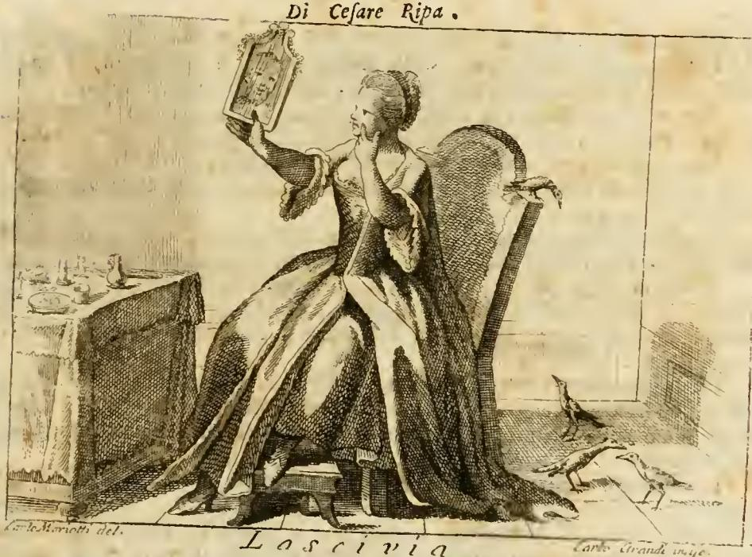

# 라시비아(Lascivia, 음탕함)의 두 가지 의인화

리파(Cesare Ripa)의 『이코놀로지아』 제4권(Tomo Quarto, 1766년 페루자 오를란디 증보판)은 **LASCIVIA** 항목으로 시작한다. 이 항목은 하나의 개념에 대해 **완전히 다른 두 개의 도상 처방**을 나란히 제시하는데, 이것이 이 카드의 핵심이다.

- **① 거울 앞 여인** — 화려한 옷차림, 거울, 화장, 참새들, 흰 담비(알치아토 인용)
- **② 머리를 긁는 여인** — 야만풍 장식, 손가락 하나로 머리를 가볍게 긁는 몸짓(피에리오 인용)

①은 **속성(attribute)을 쌓아 올린 알레고리**이고, ②는 **고대인이 실제로 썼다고 전해지는 단 하나의 몸짓 기호**다. 즉 하나는 상징물의 조합, 하나는 신체 언어라는 서로 다른 도상 전략이다.

---

## ① 거울 앞의 여인 — 상징물 조합형

*출처: 이 책의 자체 판화. 에셋 `Iconologia (Cesare Ripa)/_page_8_Picture_4.jpeg`(제4권 첫 페이지, 표제 `LASCIVIA.` 아래 실린 판화). 판 아래쪽에 소묘 `Carlo Mariotti del.`, 판각 `Carlo Grandi inc.`가 서명되어 있다.*

원문(OCR된 이탈리아어, 장음 s가 f로 읽힌 상태)은 이렇게 처방한다:

> "[D]onna giovane riccamente vestita. Terra uno specchio colla sinistra mano, nel quale con attenzione si specchi. Colla destra sia in atto di farsi bello il viso. Accanto vi saranno alcuni Passeri, uccelli lascivi, e lussuriosi, ed un Armellino, del quale dice l'Alciato: ..."
>
> (부유하게 차려입은 젊은 여인. 왼손에 거울을 들고 주의 깊게 자기를 비춰 본다. 오른손으로는 얼굴을 아름답게 꾸미는 동작을 한다. 곁에는 음탕하고 색을 좋아하는 새인 참새 몇 마리와 담비 한 마리가 있는데, 이에 대해 알치아토는 이렇게 말한다: ...)

### 판화에서 실제로 보이는 것

| 화면 요소 | 도상적 의미 |
|---|---|
| 왼손에 높이 든 **장식 액자형 거울** | 자기 응시 = 자기애·허영 |
| 오른손을 **얼굴에 갖다 댄 동작** | "얼굴을 아름답게 꾸미는 동작"(farsi bello il viso) 그 자체 |
| 풍성한 드레스, 정교하게 올린 머리 | riccamente vestita — 과시적 성장(盛裝) |
| 왼쪽 **화장대 위의 작은 단지·병들** | 판화가가 덧붙인 화장품 = 인공적 꾸밈의 도구 |
| 의자 등받이 위 새 1마리 + 바닥의 새 2마리 = **참새 세 마리** | 음탕한 새(uccelli lascivi) |
| 발치 스툴 앞을 지나는 **길쭉하고 낮은 짐승** | 담비(Armellino) |

### 거울과 화장 — 왜 음탕함인가

여기서 거울은 "진리를 비추는 거울"이 아니라 **자기 전시(self-display)의 도구**다. 화장·머리 손질·의복은 모두 남의 시선을 끌어 욕망을 유발하기 위한 장치이고, 따라서 이 여인의 음탕함은 *행위*로 그려지지 않고 **욕망을 초대하는 준비 상태**로 그려진다. 리파식 도상에서 음탕함이 성행위 장면 없이도 성립하는 이유가 이것이다. (참고로 거울은 리파의 다른 항목에서 Superbia(교만)·Vanità(허영)의 표지로도 쓰이며, 이 항목에서는 그 계열의 의미가 성적 함의로 기울어져 있다.)

### 참새 — 고대 자연사가 정한 색욕의 표준 엠블럼

리파는 참새를 굳이 설명하지 않고 **"uccelli lascivi, e lussuriosi"**라는 동격 어구로 처리한다. 당대 독자에게 자명한 상식이었기 때문이다. 그 배경은 고대 자연사·시문학에 있다.

- **플리니우스**(『자연사』 10권)는 참새의 교미 빈도가 지나쳐 수컷의 수명이 극히 짧다고 적었다. 즉 "색을 탐하다 스스로를 소진하는 새"라는 도덕적 교훈까지 딸려 있다.
- 참새는 **베누스(아프로디테)에게 바쳐진 새**였다. 사포의 아프로디테 찬가에서 여신의 수레를 끄는 새가 참새이며, 이 계보 덕분에 참새는 곧 에로스의 새가 된다.
- 카툴루스의 렛비아의 참새(passer) 이후 라틴 시에서 passer는 성적 암시를 짙게 띤 어휘가 되었다.

그래서 르네상스 도상학에서 참새는 별도 논증 없이 곧바로 **호색(lechery)의 기표**로 쓸 수 있는 몇 안 되는 동물이었다.

### 흰 담비와 알치아토

리파가 인용한 이탈리아어 3행연구:

> Dinota l'Armellin candido, e netto;
> Un uom, che per parer bello, e lascivo,
> Si coltiva la chioma, e 'l viso, e 'l petto.
>
> (희고 깨끗한 담비는, 아름답고 음탕하게 보이려고 머리와 얼굴과 가슴을 손질하는 사람을 뜻한다.)

핵심은 담비가 "짝짓기를 많이 한다"가 아니라 — **겉치장에 몰두하는 인간**을 뜻한다는 것이다. 담비의 흰 털이 곧 "티 없이 손질된 외양"이므로, 담비는 몸단장 자체를 죄로 지목하는 표지가 된다. 이 때문에 담비는 거울·화장이라는 나머지 속성과 논리적으로 정확히 맞물린다: 세 속성이 모두 **"보이기 위한 몸"**을 가리킨다.

**출전 확인 상태(중요):** 알치아토의 해당 엠블럼은 실제로 존재하며 표제가 바로 **`Lascivia`**다.

- 라틴어 원본 기준 번호는 판본마다 다르다. 글래스고 대학 Alciato 데이터베이스의 1621년판에서는 **Emblema LXXIX(79)**, 1551년 이탈리아어 운문 번역본(조반니 마르쿠알레)에서는 **70번**으로 배열되어 있다. 따라서 "몇 번 엠블럼인가"는 판본을 명시하지 않으면 단정할 수 없다.
- 라틴어 원문은 담비가 아니라 **흰 쥐(mus albus)**를 다룬다: "Delicias & mollitiem mus creditur albus / Arguere…"(흰 쥐는 사치와 무름을 뜻한다고 여겨진다…). 알치아토 본인도 "그 이유가 내게는 충분히 분명하지 않다(ratio non sat aperta mihi est)"며 ⓐ그 짐승의 색욕적 본성 때문인가 ⓑ그 가죽으로 로마 여인들이 몸을 꾸미기 때문인가를 자문하고, 이어 사르마티아의 쥐=검은담비(zibellum)와 아라비아 사향을 언급한다. **여기서 이미 "털가죽으로 몸을 꾸민다"는 논지가 나오며, 이것이 리파가 취한 갈래다.**
- 이탈리아어 번역 전통에서 이 흰 쥐가 **`armellino`(담비/어민)**으로 옮겨졌다. 1551년 마르쿠알레 역의 해당 3행연구는 "Dinota a l'huomo il candido Armellino / Lascivia, o che lascivo è da natura; / O chi se n'orna, a la lascivia è chino."(희고 깨끗한 담비는 사람에게 음탕함을 뜻한다 — 본성이 음탕하기 때문이거나, 그것으로 몸을 꾸미는 자가 음탕함에 기울어 있기 때문이거나)로, 리파가 인용한 판본과 **문구가 일치하지 않는다.** 리파가 옮긴 텍스트("si coltiva la chioma, e 'l viso, e 'l petto")는 마르쿠알레 역이 아닌 또 다른 이탈리아어 운문 역이거나 리파/편집자의 의역일 가능성이 높다. 이 점은 확인되지 않았으므로 단정하지 않는다.

즉 답안의 "알치아토 인용: 담비는 겉치장에 몰두하는 사람을 뜻함"은 **리파가 인용한 이탈리아어 판본에 대해서는 정확**하되, 알치아토 라틴어 원문은 짐승을 흰 쥐로 부르고 담비 해석은 이탈리아어 번역 계보에서 확립되었다는 층위 구분이 필요하다.

---

## ② 야만풍 장식을 하고 머리를 긁는 여인 — 몸짓 기호형

두 번째 처방은 극단적으로 짧다. 표제(OCR에서 `A S. C. IVIA`로 깨져 있으나 `LASCIVIA`)에 이어:

> "[D]onna con ornamento barbaro, e che mostri con un dito di fregarsi leggermente la testa. / … la dipingevano gli Antichi, come si vede appresso il Pierio."
>
> (야만풍 장식을 한 여인. 손가락 하나로 머리를 가볍게 긁는 모습을 보인다. … 고대인들은 그렇게 그렸는데, 피에리오에서 볼 수 있다.)

이 처방에는 **판화가 없다.** 첫 번째 도상만 판으로 새겨졌고, 두 번째는 텍스트로만 전한다.

### 손가락 하나로 머리 긁기 — 고대의 근거

이 몸짓은 리파의 창작이 아니라 **고대 로마에서 실제로 통용된, 남성성의 결여(mollitia)를 지목하는 표지**였다.

- 가장 유명한 예는 **리키니우스 칼부스**가 폼페이우스를 겨눈 에피그램이다: *"Magnus, quem metuunt omnes, digito caput uno / scalpit. Quid credas hunc sibi velle? Virum."* — "모두가 두려워하는 마그누스가 손가락 하나로 머리를 긁는다. 그가 원하는 게 뭐라고 생각하는가? 남자다." 이 2행시는 세네카(수사학자)를 통해 전하고, 플루타르코스의 『폼페이우스 전』에도 같은 조롱이 언급된다.
- **유베날리스** 9번 풍자시(130행대)도 같은 몸짓을 부드럽고 여성화된 남자들의 표지로 재사용한다.

논리는 이렇다. 머리를 세게 긁으면 공들여 만든 머리 모양이 망가진다. 그래서 **손가락 하나로 살살** 긁는 것은 "머리 모양을 아끼는 사람", 즉 외양에 지나치게 신경 쓰는 무른 성격의 증거로 읽혔다. 결국 ②의 몸짓은 ①의 거울·화장과 **같은 죄를 다른 문법으로 말한다**: 어느 쪽이든 자기 외양에 대한 과도한 배려가 음탕함의 실체다. 다만 ①은 소도구로, ②는 근육의 습관으로 그것을 드러낸다.

### 피에리오 발레리아노

**피에리오 발레리아노 볼차니**(Pierio Valeriano Bolzani, 1477–1560)의 『히에로글리피카(Hieroglyphica)』(초판 1556)는 동물·사물·몸짓을 이집트 상형문자식 표의 기호로 풀이한 방대한 사전으로, 리파가 가장 자주 의존한 원천 중 하나다. 리파가 "come si vede appresso il Pierio"라고만 쓰고 논증을 생략한 것은, 발레리아노를 **고대 도상 어휘의 권위 있는 색인**으로 취급했음을 보여준다.

### '야만풍 장식(ornamento barbaro)'이 하는 일

여기서 `barbaro`는 "야만적/난폭한"이 아니라 **그리스·로마가 아닌, 이국적인**이라는 뜻이다. 이 장식이 더하는 것은 두 가지다.

1. **연대 표시** — 이 도상이 로마 관습이 아니라 이집트·동방의 상형 기호 전통(=발레리아노의 영역)에서 왔음을 시각적으로 알린다.
2. **도덕적 함의** — 고대 도덕론에서 이국적 사치(luxuria)는 곧 무름(mollitia)과 성적 방종으로 이어지는 것으로 취급되었다. 따라서 이국풍 치장 자체가 이미 음탕함의 예비 진술이 된다.

---

## 항목의 위치와 사전 내부 참조 체계

- **권의 첫 항목**: `LASCIVIA`는 제4권 본문의 맨 첫 항목이고, 바로 다음이 **`LASSITUDINE, O LANGUIDEZZA ESTIVA`**(권태/여름의 무기력)다. `Las-`로 시작하는 알파벳 배열이 우연히 이 둘을 나란히 놓았을 뿐, 개념적 연관은 없다. 카드를 외울 때 두 항목을 혼동하지 않도록 주의할 것 — Lassitudine 쪽 처방은 "마른 여인, 얇은 옷, 드러난 가슴, 지팡이에 기댐, 부채질"로 완전히 다르다.
- **내부 상호참조**: 항목은 `De' Fatti, vedi Libidine.`(사례에 대해서는 Libidine 항목을 보라)로 끝난다. 오를란디 증보판은 각 개념에 ⓐ도상 처방 ⓑ주석(Annotazioni) ⓒ역사·신화의 실례(**Fatti**)를 붙이는 구조인데, 여기서는 Fatti를 쓰지 않고 **`Libidine`(정욕) 항목으로 넘긴다**. 즉 Lascivia와 Libidine을 사례 차원에서는 동일 사안으로 보고 중복 서술을 피한 것이다. 같은 장의 `Lealtà` 항목도 `De' Fatti, vedi Fedeltà, e Sincerità.`로 끝나며, 이 위임 방식이 책 전체의 표준 장치임을 보여준다.

---

## 요약표

| | ① 거울 앞 여인 | ② 머리를 긁는 여인 |
|---|---|---|
| 전략 | 상징물(attribute) 조합 | 몸짓(gesture) 기호 하나 |
| 인물 | 화려하게 차려입은 젊은 여인 | 야만풍(이국풍) 장식을 한 여인 |
| 동작 | 왼손에 거울, 오른손으로 얼굴 단장 | 손가락 하나로 머리를 가볍게 긁음 |
| 부속물 | 참새들(음탕한 새), 흰 담비 | 없음 |
| 출전 | 고대 자연사(참새) + 알치아토 엠블럼 `Lascivia`(담비) | 피에리오 발레리아노 『히에로글리피카』가 전하는 고대인의 표현 |
| 판화 | 있음(fig-1) | 없음 |

## 참고 자료

- Alciato at Glasgow, Emblem LXXIX `Lascivia`(1621년판): https://www.emblems.arts.gla.ac.uk/alciato/emblem.php?id=A21a079
- The Study and Digitisation of Italian Emblems (Alciato 1551, 마르쿠알레 이탈리아어 역 70번의 `candido Armellino` 3행연구): https://www.italianemblems.arts.gla.ac.uk/
- Pierio Valeriano, `Hieroglyphica`(1556 이후 여러 판) 원문 스캔: https://archive.org/details/hieroglyphicaseu00vale
