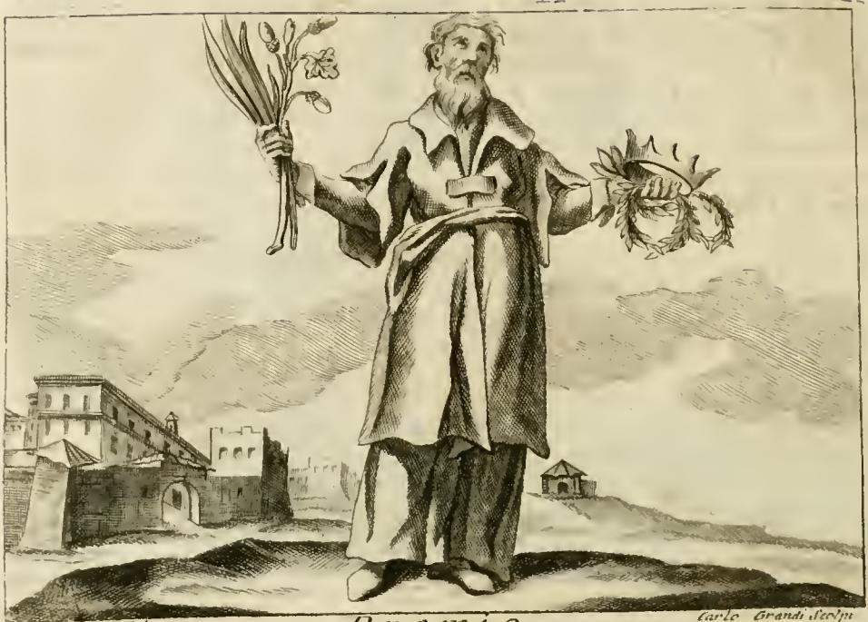

# 상급 (PREMIO) — 체사레 리파 『이코놀로지아』

## 1. 카드 한눈에 보기

| 지물 | 위치 | 의미 |
|---|---|---|
| 종려나무 가지 (palma) | 오른손 | **명예**(l'onore) |
| 떡갈나무 가지 (ramo di quercia) | 오른손 (종려와 함께) | **이익**(l'utile) |
| 왕관들과 화관들 (corone, e ghirlande) | 왼손 | 수여될 포상 자체 |
| 흰옷 (vestimento bianco) | 몸 | **진실**(verità) |
| 금빛 베일 띠 (cinto di un velo di oro) | 허리 | **덕**(virtù) — 진실을 동반함 |

핵심 명제: **공로(merito) 없는 자에게 주는 좋은 것은 상급이 아니다.**

## 2. 원문과 번역

리파 원문(에셋 `17 Practice to Providence.md`, 209~213행 부근):

> Omo vestito di bianco, cinto di un velo di oro, tenendo nella destra mano una palma, con un ramo di quercia, e nella sinistra corone, e ghirlande.
>
> Due sono le parti del Premio principali, cioè l'onore, e l'utile; però si dipinge in mano a questa figura il ramo della quercia, e della palma, significando quella l'utile, e questa l'onore.
>
> Il vestimento bianco cinto col velo dell'oro significa la verità accompagnata dalla virtù, perché non è Premio quel bene, che si dà alle persone senza merito.
>
> De' Fatti, vedi Rimunerazione.

번역: "흰옷을 입고 금빛 베일로 띠를 두른 남자가, 오른손에 종려나무 가지와 떡갈나무 가지를, 왼손에 왕관들과 화관들을 들고 있다. 상급의 주요한 두 부분은 곧 명예와 이익이다. 그래서 이 인물의 손에 떡갈나무 가지와 종려나무 가지를 그리는데, 앞의 것은 이익을, 뒤의 것은 명예를 뜻한다. 금빛 베일로 띠 두른 흰옷은 덕을 동반한 진실을 뜻하는데, 공로 없는 사람에게 주는 좋은 것은 상급이 아니기 때문이다. 사례(史例)는 '보상(Rimunerazione)' 항목을 보라."

주의할 문장 구조: `quella … questa`는 이탈리아어에서 각각 "앞에 언급된 것 / 뒤에 언급된 것"을 가리킨다. 나열 순서가 quercia → palma이므로 **quercia = utile, palma = onore**로 확정된다. 카드 답안의 배정(종려=명예, 떡갈나무=이익)과 일치한다.

## 3. 판화

에셋의 `Iconologia (Cesare Ripa)/_page_415_Picture_3.jpeg`가 PREMIO 표제 바로 아래에 삽입된 정본 판화다(하단 우측에 `Carlo Grandi sculp.` 서명). 그림에서 실제로 관찰되는 요소와 텍스트의 대응:

- **발목까지 내려오는 긴 흰 통옷**: `vestimento bianco`. 명암 처리로 옷 주름은 어둡게 새겨졌지만 바탕은 종이 흰색을 그대로 남긴 밝은 톤이다.
- **허리를 지나 앞으로 늘어뜨린 넓적한 띠**: `cinto di un velo di oro`. 금속제 벨트가 아니라 **베일(velo)** — 즉 얇은 천을 띠로 감은 형태로 그려져 있다. 금색을 흑백 판화에서 표현할 수 없으므로 옷과 같은 밝은 톤에 부드러운 주름으로만 처리했다.
- **인물의 오른손(보는 사람 기준 왼쪽)에 치켜든 가지 다발**: 길고 뾰족한 잎(종려 잎)과 그와 다른 형태의 잎·열매 달린 가지(떡갈나무 쪽)가 한 다발로 묶여 올라가 있다. 두 지물을 **한 손에 함께** 쥐게 한 것이 요점 — 명예와 이익은 상급의 갈라진 두 절반이지 별개의 두 상급이 아니다.
- **인물의 왼손(보는 사람 기준 오른쪽)에 든 관**: 뾰족한 살이 방사형으로 뻗은 관(corona) 하나와, 그 아래로 겹쳐 걸린 잎을 엮은 둥근 화관(ghirlanda)이 함께 보인다. 원문이 `corone, e ghirlande`로 **둘 다 복수**인 것에 대응한다 — 상급은 하나의 등급이 아니라 공로의 종류와 크기에 따라 여러 등급으로 나뉘어 분배된다.
- **수염 난 노년의 남자**: 성별을 여성 인격화로 두지 않은 것이 특징. 리파의 추상 개념은 대부분 여성(Donna)인데, Premio는 `Omo`(=Uomo, 남자)다. 상급은 수여받는 쪽이 아니라 **수여하는 권위**의 위치에 서기 때문이며, 노령은 판단의 성숙을 함축한다.
- **배경 좌측의 성채/요새와 우측 언덕의 작은 건물**: 리파 본문은 배경을 규정하지 않는다. 후대 판본 삽화가가 채운 요소로, 관(冠)의 군사적 맥락(성벽·요새 = 공성전에서의 무훈)을 시각적으로 암시한다.

## 4. 종려: 승리와 명예의 전통

- 그리스 경기(아곤)에서 승자에게 **종려 잎**을 쥐게 하는 관습이 있었다. 관(월계관·올리브관 등)은 머리에, 종려는 손에 — 리파의 도상이 관은 왼손, 종려는 오른손인 것도 이 손에 쥐는 전통과 맞물린다.
- 로마에서 `palma`는 아예 **"승리"의 환유(換喩)**로 쓰였다. `palmam ferre`(종려를 얻다) = 승리하다. 개선식 복장인 `tunica palmata`(종려 무늬 튜닉)와 `toga palmata`도 여기서 나온다.
- 인격화된 승리의 여신 **빅토리아(Victoria)**의 표준 지물이 종려 가지다. 법정에서 이긴 로마 변호사가 자기 집 문에 종려 잎을 걸었다는 일화도 전한다.
- 기독교로 넘어오면 종려는 **순교의 승리**를 뜻하는 지물이 된다(요한계시록 7:9의 종려 가지를 든 무리). 리파의 독자에게 종려는 이미 "치를 대가를 다 치른 뒤 얻은 인정"이라는 의미장을 가지고 있었다.
- 정리하면 종려는 **먹을 수도 팔 수도 없는, 순수하게 상징적·명예적 보상**이다. 이 실용성의 결여가 바로 `onore` 배정의 근거다.

## 5. 떡갈나무와 로마의 관(corona) 체계

떡갈나무가 `utile`(이익)로 배정되는 이유는 두 겹이다.

1. **물질적 유용성**: 떡갈나무는 유피테르의 나무이면서 도토리로 황금시대 인간을 먹였다는 전통이 있고(베르길리우스·오비디우스), 목재로서도 선박·건축의 실용 자재다. 즉 떡갈나무는 **먹이고 쓰이는** 나무다.
2. **공동체에 실효를 낸 공적**: 로마의 떡갈나무 관은 아래 체계에서 "시민을 실제로 살려낸" 공로에 주어진다.

로마 군사 관(冠) 체계 — 상급이 왜 **등급화된 복수의 관**인지 보여주는 배경 지식:

| 관 이름 | 재료 | 수여 사유 |
|---|---|---|
| corona obsidionalis (= graminea, 풀관) | 포위가 풀린 그 전장의 **풀·잡초·야생화** | 군단 또는 군대 전체를 구해낸 사령관. 최고·최희귀 등급. 플리니우스 『박물지』 22권이 상술하며, 극한의 절망적 위기에서만, 전군의 환호로만 의결되었다고 전한다 |
| **corona civica (시민관)** | **떡갈나무 잎** | 전투에서 **동료 로마 시민의 목숨을 구한** 자. 풀관 다음의 두 번째 등급 |
| corona triumphalis | 월계수 | 개선식을 거행하는 개선장군 |
| corona muralis | 금 (성벽 모양) | 적 성벽을 최초로 넘은 자 |
| corona vallaris / castrensis | 금 (방책 모양) | 적 진영 방책을 최초로 돌파한 자 |
| corona navalis / rostrata | 금 (뱃부리 모양) | 해전에서 적함에 최초로 올라탄 자 |

요점: 로마의 포상 문화에서 **관의 재료가 곧 공로의 종류이자 등급**이었다. 가장 값싼 재료(풀)가 가장 높은 등급이고 금관이 아래에 온다는 역설은, 상급의 가치가 재료값이 아니라 **인정된 공로**에서 온다는 것을 그 자체로 보여준다. 리파가 왼손에 관을 **여러 개** 들리게 한 것은 이 등급 체계를 압축한 것으로 읽을 수 있다.

## 6. 명예와 이익 = honestum과 utile

"상급의 두 주요 부분은 명예와 이익"이라는 리파의 분절은 즉흥적인 것이 아니라 고대 수사학·윤리학의 표준 이분법이다.

- 키케로 『의무론(De Officiis)』이 **honestum**(도덕적으로 훌륭한 것)과 **utile**(유익한 것), 그리고 이 둘의 외견상 충돌을 축으로 구성된다.
- 심의적 연설(genus deliberativum)의 논제 항목도 `honestas`와 `utilitas`다.
- 리파는 이 쌍을 **보상의 구조**에 적용한다: 온전한 상급은 받는 이의 이름을 높이는 부분(명예)과 실제로 그의 처지를 개선하는 부분(이익)을 함께 가진다. 명예만 주고 실익이 없으면 빈 칭찬이고, 실익만 주고 공적 인정이 없으면 뇌물이나 급여에 가까워진다.
- 그래서 두 가지가 **한 손에 함께 묶여** 있다.

## 7. 상급은 분배 정의(iustitia distributiva)의 문제다

리파의 결정적 한 줄 — `non è Premio quel bene, che si dà alle persone senza merito`("공로 없는 사람에게 주는 좋은 것은 상급이 아니다") — 은 정의론의 명제다.

- **아리스토텔레스** 『니코마코스 윤리학』 5권: 분배 정의는 **기하학적 비례**에 따라, 각자의 **자격/공로(κατ' ἀξίαν, kat' axian)**에 비례하여 몫을 나눈다. 산술적 동등(모두에게 같은 양)이 아니라 공로에 대한 비례가 정의다. 따라서 공로 없는 자에게 주는 몫은 관대함이 아니라 **부정의**다.
- **토마스 아퀴나스** 『신학대전』 II-II: 분배 정의를 다루며, 그 반대 악덕으로 **사람 차별(acceptio personarum)** — 공로가 아니라 인맥·연고·환심에 따라 나누는 것 — 을 지목한다.
- 그래서 상급의 인격화가 **흰옷(진실)에 금띠(덕)**를 두르는 것이 논리적으로 필연이 된다. 진실은 "이 사람이 실제로 무엇을 했는가"에 대한 사실 판정이고, 덕은 그 판정에 따라 실제로 집행하는 성향이다. 둘 중 하나가 빠지면 남는 것은 상급의 겉모습뿐이다.
- 리파 자신이 다른 항목에서 이 실패를 격렬하게 비판한다. **`Mal Governo`(악정)** 항목(에셋 `03 Machine of the World to Marriage.md`)은 "보상이 수고하고 마땅한 자에게 주어지지 않고 악인과 범법자, 나쁜 삶을 사는 자들에게 주어질 때 … 악정이 지배하면 세상이 무너진다"고 적는다. Premio의 흰옷과 금띠는 곧 Mal Governo의 거울상이다.

## 8. 함께 보면 좋은 리파 항목

- **`Rimunerazione`(보상)**: 리파가 Premio 항목 끝에서 직접 넘긴 곳. 역사적 사례(De' Fatti)를 여기서 다룬다.
- **`Merito`(공로)** (에셋 `04 Mechanics to the Month in General.md`): 무장한 오른팔과 책을 든 왼손으로 **두 종류의 시민적 공로**(전쟁의 행동 / 학문과 문필)를 나눈다. 각각에 대해 인간은 홀(scettro, 명령권)과 월계관에 값하게 되며, 월계관은 "참된 명예와 영원한 영광"을 뜻한다. 같은 항목이 인용하는 성구가 요점을 못박는다 — **`Non coronabitur nisi qui legitime certaverit`**(디모데후서 2:5, "규칙대로 경기하지 않은 자는 관을 받지 못한다"). 관은 참가에 주는 것이 아니라 정당한 분투에 주는 것이다.
- **`Merito di Cristo`(그리스도의 공로)** 항목의 정의도 참고할 만하다: "공로란 그 행위자에게 어떤 것을 주는 것이 정당하게 되는 행위이며, 그것으로 보수와 상급에 이르는 것이고, 수단이 목적에 앞서듯 언제나 (상급에) 선행한다." 즉 **공로 → 상급**의 순서는 뒤집을 수 없다.
- **`Prelatura`(고위 성직)**: 바로 앞 항목이며 인접한 판화 `_page_414_Picture_3.jpeg`가 이쪽 것이다. 혼동하지 말 것.

## 9. 암기 요령

- **오른손 = 가지 = 자라난 공적** / **왼손 = 관 = 수여되는 등급**.
- 가지 두 개 → **"종려는 이름, 떡갈나무는 살림"**: 종려는 먹을 수 없고(명예), 떡갈나무는 도토리와 목재를 준다(이익).
- 옷 두 겹 → **"흰옷은 사실, 금띠는 실행"**: 진실 + 덕.
- 마지막 한 문장으로 전체를 잠근다: **공로 없이 받은 것은 선물이거나 부정이거나, 어쨌든 상급은 아니다.**

## 참고

- [Civic Crown — Wikipedia](https://en.wikipedia.org/wiki/Civic_Crown)
- [Grass Crown (corona obsidionalis/graminea) — Wikipedia](https://en.wikipedia.org/wiki/Grass_Crown)
- [Roman military decorations and punishments — Wikipedia](https://en.wikipedia.org/wiki/Roman_military_decorations_and_punishments)
- [Palm branch (symbol) — Wikipedia](https://en.wikipedia.org/wiki/Palm_branch)
- [Roman triumphal honours — Wikipedia](https://en.wikipedia.org/wiki/Roman_triumphal_honours)
