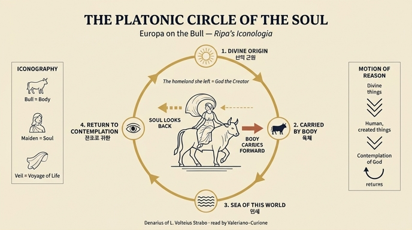

# 메달의 에우로파 — 우의적(플라톤적) 해석

## 질문

메달의 에우로파 도상에 대한 우의적(플라톤적) 해석은?

## 답

황소에 실려 가면서도 떠나온 곳을 돌아보는 에우로파는, 인생의 항해에서 **육체에 실려 가는 인간의 영혼**이 **떠나온 조국 곧 창조주 하나님**을 갈망의 눈으로 돌아보는 모습이다. 이는 인간 정신이 신적인 것에서 인간사로 향했다가 결국 하나님에 대한 관조로 되돌아가는 **플라톤적 영혼의 원환(圓環) 운동**이라고 풀이된다.

---

## 1. 어디에 나오는 이야기인가

리파 『이코놀로지아』의 「세계와 대륙」 편, **에우로파(Europa)** 항목에는 서로 성격이 다른 세 가지 도상이 연달아 실린다.

| # | 표제 | 출처·저자 | 성격 |
|---|---|---|---|
| 1 | EUROPA (대륙 의인화) | 체사레 리파 본인 | 왕관·풍요의 뿔·신전을 든 여왕 = 세계 제일의 대륙이라는 **정치·문화적 찬가** |
| 2 | **EUROPA DA MEDAGLIE**(메달에서 온 에우로파) | **조반니 자라티노 카스텔리니** 증보 | 루키우스 볼테이우스 스트라보 메달 → **우의적·플라톤적 해석** ← **이 카드** |
| 3 | EUROPA (루키우스 발레리우스 메달) | 〃 | 황소 = 흰 황소를 뱃머리 장식으로 단 **배**라는 합리화(에우헤메로스식) 해석 |

즉 같은 신화 장면(제우스가 황소로 변해 에우로파를 크레타로 납치)을 놓고, 2번은 **영혼론적 우의**로, 3번은 **역사적 사실의 은유**로 읽는다. 이 카드가 묻는 것은 **2번**이다.

> 참고: 리파의 이 항목에 실린 판화는 1번(왕관을 쓰고 신전을 든 대륙 의인화 에우로파)의 도판뿐이고, 메달형 에우로파(황소 위의 처녀)를 그린 삽화는 원문 자산에 들어 있지 않다. 그래서 여기서는 글과 아래의 인포그래픽으로 도상을 재구성한다.

## 2. 메달 도상의 구성 요소

원문(자라티노 카스텔리니)이 묘사하는 **루키우스 볼테이우스 스트라보 메달**(실제로는 기원전 81년경의 로마 공화정 은화 *denarius serratus*, 앞면 유피테르 두상 / 뒷면 황소를 탄 에우로파)의 세부:

- **땅 위를 달리는 황소**: 바다가 아니라 **뭍**을 달린다("per terra corrente, non per acqua").
- **처녀 에우로파**: 두 다리를 양쪽으로 걸쳐 타고 있으나 **몸은 옆으로 틀어 얼굴이 엉덩이 쪽을 향한다** — "comecché risguardi il luogo donde si parte"(**떠나오는 그 자리를 돌아보듯이**).
- **베일**: 오른손을 들어 베일을 잡아 머리 위로 돛처럼 부풀리고, 뒤로 허리 아래까지 두르며 왼손으로 다른 끝을 잡는다.
- **황소 다리 사이의 잎사귀**(줄기가 높이 솟은 참나무 잎): 에우로파의 품에 안긴 **이탈리아**의 표상(플리니우스가 이탈리아를 "너비보다 훨씬 긴 참나무 잎"에 비유), 높은 줄기는 **알프스**.

## 3. 핵심 원문과 번역

> **Ne' Geroglifici aggiunti da Celio Augusto, significa l'anima dell'Uomo, portata dal corpo nel corso di questa vita, o nel Mare di questo Mondo, e nondimeno essa la patria, che ha lasciato, cioè Dio Creatore, con avidi occhi risguarda. E questo è quel platonico circolo dell'anima, e quel moto della ragione, quando la mente nostra rivolta dalle cose Divine, al pensare alle umane, e create, finalmente alla contemplazione di Dio ritorna.**

번역:

> 첼리오 아우구스토가 증보한 『히에로글리피카』에서 이것은 **이 삶의 여정 곧 이 세상의 바다에서 육체에 실려 가는 인간의 영혼**을 뜻한다. 그러면서도 영혼은 자기가 떠나온 **조국, 곧 창조주 하나님**을 **갈망의 눈(avidi occhi)으로 되돌아본다**. 그리고 이것이 바로 저 **플라톤적 영혼의 원환**이며 **이성의 운동**이니, 우리의 정신이 신적인 것들로부터 돌이켜 인간적이고 피조된 것들을 생각하다가 **마침내 하나님에 대한 관조로 되돌아가는** 것이다.

여기서 "첼리오 아우구스토"는 **첼리오 아고스티노 쿠리오네**(Celio Augustino Curione, 1538–1567)로, 피에리오 발레리아노(Pierio Valeriano)의 『히에로글리피카』(*Hieroglyphica*, 1556)에 두 권을 증보한 인물이다. 즉 이 해석은 리파의 창작이 아니라 **르네상스 상징사전 전통에서 빌려 온 것**이며, 리파의 책이 고대 메달·이집트 상형문자·신플라톤주의 주석을 한데 엮는 방식의 전형적인 사례다.

## 4. 도상 → 의미 대응표

| 도상 요소 | 우의적 의미 |
|---|---|
| 에우로파(처녀) | 인간의 **영혼(anima)** |
| 황소(그녀를 태우고 가는 짐승) | **육체(corpo)**, 영혼을 싣고 가는 탈것 |
| 달려가는 길 / "이 세상의 바다" | **현세의 인생 항해**(corso di questa vita) |
| 떠나온 자리(페니키아 해안) | 영혼이 떠나온 **조국(patria)** = **창조주 하나님** |
| 뒤를 돌아보는 시선, "갈망의 눈" | 신적 근원을 향한 **그리움·회귀의 지향** |
| 돛처럼 부푼 베일 | 이 항해가 **되돌릴 수 없이 진행 중**임(전진하는 운동) |
| 돌아봄 + 전진의 동시성 | 하강과 상승이 하나의 **원환**을 이룸 |

## 5. 배경: 신플라톤주의 영혼의 원환

이 해석은 **exitus–reditus**(나감–돌아옴) 도식 위에 서 있다.

1. **플로티노스**: 일자(一者)로부터의 유출(proodos)과 그리로의 회귀(epistrophē). 영혼은 감각계로 하강하지만 본향을 기억하고 상승한다.
2. **마크로비우스** 『스키피오의 꿈 주해』: 영혼은 천구를 지나 지상의 육체로 하강하며 각 행성권에서 능력을 걸치고, 죽음과 관조를 통해 다시 상승한다 — 중세·르네상스 도상학이 "영혼의 여행"을 그릴 때 가장 널리 참조한 텍스트.
3. **마르실리오 피치노**: 『플라톤 신학』과 「정신에 관한 다섯 물음」에서 영혼을 "세계의 매듭"(nodus mundi)으로 규정하고, 영혼의 **원운동**(신 → 자기 → 세계 → 다시 신)을 논한다. 여기서 플라톤적 원환이 **기독교적 창조주와 관조(contemplatio)** 로 자연스럽게 접속된다.
4. **아우구스티누스적 변주**: "당신 안에 쉴 때까지 우리 마음은 안식하지 못한다"(『고백록』 1.1)의 정서가 "떠나온 조국을 갈망의 눈으로 돌아본다"는 표현에 겹쳐 있다.

리파(자라티노 카스텔리니)의 문장은 이 원환을 **이성의 3박자**로 압축한다.

```
신적인 것들(cose Divine)
        │  ① 돌이킴 (rivolta)
        ▼
인간적·피조적인 것들(cose umane e create)
        │  ② 되돌아감 (ritorna)
        ▼
하나님에 대한 관조(contemplazione di Dio)  ── 원점 복귀
```

주의할 점은 **여기서 육체가 악으로 단죄되지 않는다**는 것이다. 황소는 영혼을 파괴하는 것이 아니라 **실어 나르는 탈것**이고, 인간사로 향하는 정신의 하강 역시 원환의 정당한 한 국면이다. 문제는 하강 자체가 아니라 **돌아봄을 잃는 것**이다.

## 6. 왜 하필 "돌아보는" 에우로파인가

메달 조각가에게 얼굴을 뒤로 돌린 자세는 단지 납치의 극적 긴장(오비디우스 『변신 이야기』 2권의 "무서워 뒤를 보는 소녀")을 표현한 사실주의적 장치였다. 그러나 우의적 독법은 **그 자세 하나를 형이상학의 열쇠로 재해석**한다.

- 몸은 앞으로(육체가 끌고 가는 방향, 시간·세속)
- 얼굴은 뒤로(영혼이 지향하는 방향, 근원·신)

한 인물 안에서 **두 방향이 동시에 성립**하기 때문에, 이 도상은 "직선적 전진"이 아니라 **원환**의 시각적 표상이 될 수 있다. 르네상스 도상학이 고대 화폐를 읽는 전형적 방법 — 즉 형태의 우연을 필연적 의미로 승격시키는 독법 — 을 보여 주는 좋은 사례다.

## 7. 혼동하기 쉬운 지점 (시험 포인트)

- **어느 메달인가**: 우의적 해석이 붙는 것은 **루키우스 볼테이우스 스트라보** 메달이다. **루키우스 발레리우스** 메달의 에우로파는 얼굴이 **황소의 머리 쪽**을 향하고, 여기서 황소는 영혼의 탈것이 아니라 **흰 황소 선수상을 단 배**로 풀이된다(우의가 아니라 신화의 합리화).
- **황소 = 육체**이지 유혹자나 죄가 아니다. 제우스라는 신화적 정체성은 우의적 독법에서 배경으로 물러난다.
- **"조국(patria)"은 페니키아가 아니라 창조주 하나님**이다. 원문이 명시적으로 "cioè Dio Creatore"라고 못박는다.
- **황소 다리 사이의 잎사귀는 이 우의와 별개**의 주제다(이탈리아=참나무 잎, 높은 줄기=알프스). 영혼 우의와 섞어 외우지 말 것.
- 이 해석의 원 출처는 리파가 아니라 **발레리아노–쿠리오네의 『히에로글리피카』**이며, 리파 판에는 **자라티노 카스텔리니**가 옮겨 넣었다.

## 인포그래픽



(이미지 생성 모델 특성상 그림 안의 한국어 병기 일부가 미세하게 깨져 있다 — "신적 근원", "관조로 귀환"이 바른 표기다.)
