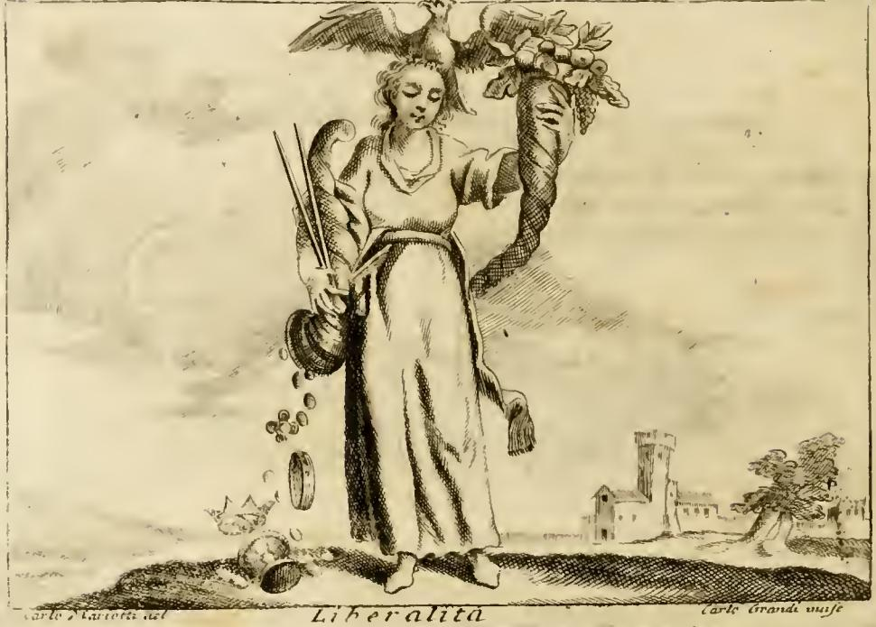

# 낭비 (Prodigalità)

> **Q.** 리파는 '낭비(Prodigalità)'를 어떻게 의인화했는가?
>
> **A.** 눈을 가리고 웃는 얼굴의 여인이 두 손의 풍요의 뿔로 금과 값진 것들을 흩뿌린다. 가린 눈은 이성의 인도 없이 자격 없는 자에게 분별없이 재산을 나눠주고 마땅한 이에게는 주지 않음을 뜻한다. 잘 살기 위한 도구가 될 수 있는 재산을 절제하지 못함이 비난받을 일이라는 것이다.

---

## 1. 리파 본문 (Tomo Quarto, "PRODIGALITÀ", Di Cesare Ripa)

원문 요약:

> **Donna con occhi velati, e di faccia ridente. Tiene con ambe le mani un cornucopia, col quale sparge oro, ed altre cose di gran prezzo.**
> — 눈이 가려지고 웃는 얼굴의 여인. 두 손으로 풍요의 뿔(cornucopia) 하나를 들고, 그것으로 금과 그 밖의 값진 것들을 흩뿌린다.
>
> **Prodighi sono quelli, che donano, e spendono senza guida della ragione le facoltà, e denari; però ha bendati gli occhi questa figura, dispensando i beni senza giudizio a chi non li merita, e lasciando di donare a più degni. Ed è biasimevole non sapersi temperare in dare la propria roba, e le proprie ricchezze, che possono esser finestra, e istromento di viver bene, e beatamente.**
> — 낭비하는 자란 **이성의 인도 없이(senza guida della ragione)** 자기 재산과 돈을 주고 써버리는 자다. 그래서 이 상은 눈이 **가려져(bendati)** 있는데, 판단 없이 재화를 **그것을 받을 자격이 없는 자에게** 나눠주고 **더 마땅한 이들에게는 주지 않기** 때문이다. 그리고 자기 물건과 재산 — 이는 **잘, 그리고 복되게 살기 위한 창(窓)이자 도구가 될 수 있는 것** — 을 주는 데 있어 절제할 줄 모르는 것은 비난받을 일이다.

### 판화에서 실제로 보이는 것 (fig-1)

- **눈을 가린 띠**: 머리를 살짝 기울인 여인의 눈 위로 천 띠가 가로질러 묶여 있다. 본문의 `occhi velati`(가려진 눈) / `bendati gli occhi`(눈을 붕대로 감은)와 일치한다.
- **웃는 얼굴(faccia ridente)**: 입가가 올라간 태평한 표정. 손실을 손실로 느끼지 못하는 무자각이 표정으로 표현된다.
- **하나의 큰 풍요의 뿔을 두 팔로 껴안듯 들고 있다**: 카드 답안의 "두 손의 풍요의 뿔"은 *뿔이 두 개*라는 뜻이 아니라 원문 `con ambe le mani un cornucopia`(**두 손으로 뿔 하나를**)를 옮긴 것이다. 뒤에 볼 Liberalità가 뿔을 **두 개** 드는 것과는 다르다.
- **아래로 쏟아져 내리는 동전 줄기**: 뿔 입구에서 원형 동전들이 끊기지 않고 땅으로 흘러내리고, 발밑에 이미 흩어져 있다. 받는 사람이 그림 안에 **아무도 없다** — 수취인 없이 그냥 땅에 버려지는 구도가 "자격 없는 자에게, 판단 없이"의 시각적 등가물이다.
- **배경**: 왼쪽에 바다와 작은 돛배, 오른쪽에 **무너진 폐허와 초라한 집**. 재산이 흘러나가 이르는 종착지(폐허)를 풍경으로 암시한다. 판화 하단 서명은 `Carlo Mariotti del. / Carlo Grandi inc.`(18세기 페루자판 계열 도판).

---

## 2. 아리스토텔레스 『니코마코스 윤리학』 4권의 중용 구조

리파의 설명은 사실상 아리스토텔레스 재화 윤리의 도상 번역이다. NE 4권 1장(1119b22–1122a17)은 **재물(chrēmata)의 주고받음**에 관한 삼항 구조를 세운다.

| 위치 | 그리스어 | 라틴/이탈리아어 | 성격 |
|---|---|---|---|
| **과잉** | **아소티아 asōtia** (ἀσωτία) | prodigalitas / **Prodigalità** | 주는 데 과도, 받는(취득) 데 부족 |
| **중용(덕)** | **엘레우테리오테스 eleutheriotēs** (ἐλευθεριότης) | liberalitas / **Liberalità** | 옳은 액수를, 옳은 사람에게, 옳은 때에 |
| **부족** | **아넬레우테리아 aneleutheria** (ἀνελευθερία) | illiberalitas / avaritia (인색·구두쇠) | 주는 데 부족, 취득에는 과도 |

핵심 논점들과 리파의 대응:

1. **중용은 "얼마"만이 아니라 "누구에게·언제·왜"의 문제다.** 아리스토텔레스의 후한 사람은 `옳은 대상에게(ᾧ δεῖ)` 준다. 낭비하는 자의 결정적 결함은 액수가 아니라 **대상 선별의 실패** — 아첨꾼(κόλακες)이나 주어선 안 될 자에게 준다는 점이다. 리파의 `a chi non li merita ... lasciando di donare a più degni`(자격 없는 자에게 주고 더 마땅한 이에게는 주지 않는다)가 정확히 이 항목이며, **눈가리개**는 이 "대상 식별 불능"의 도상이다.
2. **덕은 이성(logos)에 따른 중용이다.** 리파의 `senza guida della ragione`(이성의 인도 없이)는 아리스토텔레스의 `orthos logos`(바른 이치)에 따른 선택이 결여된 상태를 그대로 옮긴 표현이다. 눈은 전통적으로 판단·이성의 기관이므로, 눈을 덮는 것은 곧 이성의 차단이다.
3. **재산은 목적이 아니라 도구다.** 아리스토텔레스는 부(富)를 `유용한 것들(chrēmata)`, 즉 좋은 삶을 위한 수단으로 규정한다. 리파의 `istromento di viver bene, e beatamente`(잘, 복되게 살기 위한 도구)는 `eu zēn`/`eudaimonia`의 직역에 가깝다. 도구를 도구로 쓰지 못하고 흘려버리는 것이 `biasimevole`(비난받을 일)이 되는 근거다.
4. **아소티아의 어원**: `a-` + `sōzein`(구하다·보존하다) → "구제 불능인 자 / 자신을 지키지 못하는 자". 아리스토텔레스는 낭비자를 "자기 재산의 파괴를 통해 스스로를 망치는 자"로 부른다. 이것이 fig-1의 배경 **폐허**와 공명한다.
5. **경중 판단**: 아리스토텔레스는 낭비가 인색보다 **덜 나쁘다**고 본다. 낭비는 나이·경험·궁핍으로 교정될 수 있고 최소한 남을 이롭게 하지만, 인색은 고치기 어렵고 아무도 이롭게 하지 않는다. 그래서 리파도 낭비를 악덕으로 규탄하되 `biasimevole`(비난받을) 수준의 언어를 쓰며, 악마적 괴물이나 형벌 도구 없이 **웃는 얼굴**의 매력적 인물로 그린다.
6. (참고) 같은 4권 2장은 **큰 규모의 지출**에 대해 megaloprepeia(장대함) — banausia/apeirokalia(속물적 과시) — mikroprepeia(인색한 궁상)의 별도 삼항을 세운다. 리파의 **LUSSO(사치)** 항목 — 거대한 몸집, 왕관, 관자놀이의 날개, 돈을 쏟는 뿔과 궁전을 부수는 망치, 발밑의 공작 — 이 대략 이 과시 쪽 축에 해당한다. 낭비(Prodigalità)가 *분별 없는 분배*라면 사치는 *과시적 소비*로, 리파 본문도 Prodigalità 항 말미에 `De' fatti, vedi Lusso`(사례는 Lusso 항목을 보라)로 교차 참조한다.
7. (참고) 단테는 『신곡』 지옥편 7곡에서 **낭비자(prodighi)와 인색한 자(avari)** 를 같은 제4원에 넣어 서로 무거운 짐을 밀며 `Perché tieni?`(왜 쥐고 있느냐) / `Perché burli?`(왜 내던지느냐)로 맞부딪게 한다. 하나의 축의 두 극단이라는 아리스토텔레스 구조가 문학적으로 형상화된 대표 사례다.

---

## 3. 리파 본편 Liberalità(후함) 도상과의 대비

리파의 **LIBERALITÀ**(Tomo I) 본문은 정의부터 아리스토텔레스적이다.

> **La Liberalità è una mediocrità nello spendere per abito virtuoso, e moderato.**
> — 후함이란 덕스럽고 절제된 습성(abito = habitus/hexis)에 의한, **지출에서의 중용(mediocrità)** 이다.

도상 구성: 눈이 약간 들어가고 이마가 네모지며 매부리코인 여인, **흰 옷**, 머리 위의 **독수리**, 오른손에 **컴퍼스(compasso)** 와 약간 기울인 **풍요의 뿔**(보석·돈·목걸이를 쏟음), 왼손에 **과일과 꽃이 담긴 또 하나의 뿔**.

### 대비표

| 항목 | **Prodigalità (fig-1)** | **Liberalità (fig-2)** | 의미 |
|---|---|---|---|
| **눈** | 띠로 **가려짐** (`occhi velati / bendati`) | **뜨고 있음**; 게다가 `occhi un poco concavi`(약간 들어간 눈)·네모난 이마 = **사자**의 관상, 매부리코 = **독수리**의 관상 | 판단의 유무. 낭비는 대상을 못 보고, 후함은 대상을 *본다* |
| **측정 도구** | 없음 | **컴퍼스**: "가진 재산의 크기와 받는 사람의 공로(merito)에 맞춰 재야 한다" | 낭비의 결함이 곧 이 컴퍼스의 결여 |
| **풍요의 뿔** | **하나**를 두 손으로 껴안고 **쏟아버림** (동전이 줄줄이 땅으로) | **둘**(값진 것 / 과일·꽃), 하나만 `alquanto pendente`(**약간** 기울임) | 무제한 방류 vs 조절된 기울기 |
| **수취인** | 그림 안에 **없음** — 땅에 흩어짐 | 다른 판본(제3 버전)에서는 웃는 **동자들(Puttini)** 이 받아 몸에 걸치고 자랑함 | 수혜와 감사의 관계가 성립하는가 |
| **표정** | 웃음(`ridente`) — 무자각의 명랑 | `faccia allegra, e ridente` — "주는 자는 밝은 얼굴로 주어야 선물이 더 잘 받아들여진다" | 같은 미소가 한쪽에선 무분별, 한쪽에선 덕의 조건 |
| **의복** | 두툼하게 몸을 감싼 평범한 긴 옷 | **흰색** — 색이 단순하고 깨끗해 `artificio`가 없듯, 후함은 **비천한 이해타산(vile interesse)의 기대 없이** 준다 | 동기의 순수성 |
| **동물 상징** | 없음 | 머리 위 **독수리**: 플리니우스에 따르면 사냥한 먹이를 다른 새들에게 나눠 준다 → 후함은 **우연한 증여 행위가 아니라 습성과 의도(abito, intenzione della mente)** 에 있다 | 덕은 hexis, 낭비는 통제 불능의 행위 |
| **결과(배경)** | 오른쪽에 **폐허와 초라한 집** | 오른쪽에 **성탑과 온전한 집·나무들** | 파산 vs 유지되는 살림 |

### fig-2에서 확인되는 세부

- 머리 위 독수리가 날개를 펼치고 앉아 있다.
- 오른손이 컴퍼스(가늘고 긴 두 다리)와 기울인 뿔을 함께 쥐고, 뿔 입구에서 동전 몇 개가 **또르르 떨어지는 정도**로만 나온다 — fig-1의 굵은 동전 폭포와 비교하면 조절의 차이가 눈에 보인다.
- 왼쪽 어깨 위로 **과일·잎이 가득한 두 번째 뿔**을 들었다. 두 뿔은 "부의 풍요는 후함을 드러내는 알맞은 수단이지만, **관대한 영혼의 고귀함(nobiltà dell'animo generoso)이 동반될 때, 그리고 주는 이의 능력과 힘에 따라서**"라는 조건을 시각화한다.
- 발밑에 왕관·그릇·동전이 놓여 있어 수여 장면임을 알린다.

### 다른 Liberalità 판본 두 가지 (대비 보강)

- **주사위(dado) 판본**: 흰 옷의 여인이 오른손에 **주사위**, 왼손으로 보석과 돈을 뿌린다. 주사위는 어느 면으로 놓아도 **똑바로 선다** → 적게 가져 적게 주는 자와 많이 가져 많이 주는 자가 **동등하게 후하다**(단, 원금은 지키는 한에서). 이것이 낭비와 후함을 가르는 기준을 절대액이 아니라 **비율**로 못박는다.
- **접시(bacile) 판본**: 화려한 옷의 소녀가 보석과 금화가 담긴 접시를 옆구리에 받치고 한 움큼 쥐어 웃는 동자들에게 뿌린다. 피에리오 발레리아노의 고대 상형문자에서 접시 하나가 후함의 기호였다는 데서 왔다.

---

## 4. 리파의 다른 Prodigalità 판본들 (같은 항목 안)

리파는 같은 표제 아래 제2 버전과 각주 버전을 더 붙인다. 카드의 정답은 **첫 번째(Di Cesare Ripa)** 버전이므로 혼동하지 말 것.

- **제2 버전 (단테를 따른 것)**: `Donna lasciva`(음란한 여인), **호화로운 옷**, 보석이 가득한 아름다운 머리 장식, **부드럽게 풀어헤친 머리(crini molli) — 단테가 묘사한 대로**. 옆에 **큰 돈주머니 두 개**를 차고 그 돈을 **대부분 내던진다**. 그리고 **하르피아(Arpìe) 두 마리**가 몰래 그 돈을 훔친다. 하르피아의 **여자 얼굴**은 낭비하는 사람 곁에 붙어 그가 재산을 뿌리는 동안 좋은 낯을 하고 절을 하는 자들을, **추하고 악취 나는 나머지 몸통**은 그들이 속으로는 자기를 천하게 만드는 그를 **경멸한다**는 것을 뜻한다. → 아리스토텔레스가 낭비자의 전형적 수취인으로 든 **아첨꾼(kolakes)** 항목의 도상이다.
- **각주: P. 리치(Padre Ricci)의 Prodigalità**: 한 손으로 머리의 장식을 **모두 벗겨 남에게 주고**, 다른 손으로 **자기 옷을 벗기 시작하는** 여인. 옆에는 **말라 죽은 나무**, 땅에는 **나팔**이 놓여 있다. 해설 — 남을 부유하게 하려고 **자기에게 필요한 것까지 벗는 것**이 낭비자의 광기(pazzia)이고, 마른 나무는 재산을 흩뿌린 자가 이르는 상태이며, **땅에 떨어진 나팔**은 낭비자의 **나쁜 평판**을 암시한다. (후함의 리치 판본은 반대로 뿔을 기울이면서 **다른 손으로 심장을 가리키고**, 곁에 **열매가 가득한 나무**가 있다 — 마른 나무/열매 맺은 나무의 대칭.)

---

## 5. 눈가리개 도상에 대한 주의

르네상스·바로크 도상에서 눈가리개는 문맥에 따라 뜻이 정반대가 된다.

- **정의(Giustizia)**: 눈가리개 = **불편부당** — 신분·안면을 보지 않음 (긍정)
- **운명(Fortuna)·기회(Occasione)**: 눈가리개 = **무작위성** — 누구에게 갈지 모름
- **사랑(Amore)**: 눈가리개 = **맹목적 정념**
- **낭비(Prodigalità)**: 눈가리개 = **분별의 결여** — "자격(merito)을 보지 않음"이 **결함**으로 뒤집힘 (부정)

즉 낭비의 눈가리개는 정의의 눈가리개와 형태는 같고 가치 부호는 반대다. 차이를 만드는 것이 바로 Liberalità가 든 **컴퍼스**, 곧 "받는 이의 공로에 맞춘 측량"이다. 정의는 **당사자가 누구인지**를 보지 않아야 하고, 후함은 **당사자가 얼마나 마땅한지**를 반드시 보아야 한다.

---

## 6. 암기용 요약

- **몸**: 여인 / **눈가리개** + **웃는 얼굴**
- **손**: 두 손으로 **풍요의 뿔 하나**, 금·값진 것을 **흩뿌림** (받는 자 없음)
- **뜻 1**: `senza guida della ragione` — 이성의 인도 없는 증여
- **뜻 2**: **자격 없는 자에게** 주고 **마땅한 자에게는** 주지 않음 (눈가리개의 정확한 의미)
- **뜻 3**: 재산은 `잘, 복되게 살기 위한 도구` — 그 절제 실패가 `biasimevole`
- **좌표**: 아리스토텔레스 NE 4권 — **asōtia(낭비) ↔ eleutheriotēs(후함, 중용) ↔ aneleutheria(인색)**
- **짝 도상**: **Liberalità** = 눈을 뜬 여인 + **컴퍼스** + 뿔 **둘**(살짝 기울임) + 흰 옷 + 머리의 독수리 → *측정·의도·순수 동기*
- **한 문장**: **낭비는 후함에서 컴퍼스와 눈을 빼앗은 것이다.**

---

## 출처

- 리파 본문: `.fm/assets/17 Practice to Providence.md` — "PRODIGALITÀ" 항목 (도판 `_page_424_Picture_3.jpeg` → `fig-1.jpeg`)
- 리파 본문: `.fm/assets/02 Letters to Lust.md` — "LIBERALITÀ" 항목 (도판 `_page_31_Picture_3.jpeg` → `fig-2.jpeg`), "LUSSO" 항목
- 아리스토텔레스 『니코마코스 윤리학』 4권 1–2장 (1119b22–1122a17, 1122a18–1123a33)
  - [Nicomachean Ethics, Book IV (Standard Ebooks / F. H. Peters 역)](https://standardebooks.org/ebooks/aristotle/nicomachean-ethics/f-h-peters/text/book-4)
  - [Aristotle, Nicomachean Ethics Book IV (Loeb Classical Library)](https://www.loebclassics.com/view/aristotle-nicomachean_ethics/1926/pb_LCL073.189.xml)
  - [Nicomachean Ethics Book IV (Sacred Texts Archive)](https://sacred-texts.com/cla/ari/nico/nico035.htm)
