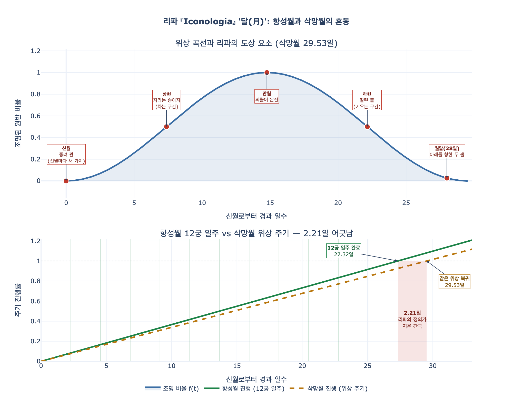

# '달(月)' — MESE IN GENERALE

> **Q.** '달(月)' 도상의 정의와 상징 요소들은?
>
> **A.** 달(月)은 달(Luna)이 황도 12궁을 도는 여정으로 정의되며, 그동안 달이 차고 기우는 것처럼 보인다. 잘린 뿔은 기욺을, 자라는 송아지는 참을, 머리의 두 뿔은 월말의 달 모양을 뜻하고, 종려나무는 새 달마다 새 가지를 내기에 등장한다.

이 카드는 리파의 「Mese in Generale」(달 일반) 항목이다. 앞 카드가 **달의 의인화 전체 모습**을 다뤘다면, 이 카드의 핵심은 **리파가 내린 "정의" 한 문장이 천문학적으로 정확히 무엇을 가리키는가**다. 결론부터 말하면 — 그 정의는 서로 다른 두 개의 주기를 하나로 붙여 놓았다.

## 원문 (Ripa, *Iconologia*, Tomo IV)

> Giovine vestito di bianco, con due cornetti bianchi, volti verso terra; e terrà la mano sopra un Vitello di un corno solo, e sarà coronato di palma.
>
> E' il Mese da Orfeo domandato **Vitello di un corno solo**, perché in questo modo si ha la **definizione del Mese, il quale non è altro, che il corso, che fa la Luna per i dodici segni del Zodiaco**, nel quale viaggio pare agli occhi nostri, che parte del tempo cresca, e parte scemi.

흰 옷을 입은 젊은이, **아래를 향한 흰 뿔 두 개**, 손은 **외뿔 송아지** 위에 얹고, 머리에는 **종려 관**을 썼다.

> 원본 이미지: 이 항목 앞뒤의 `_page_118_Picture_3.jpeg`와 `_page_119_Picture_10.jpeg`는 둘 다 **장식 컷(꽃무늬 띠 장식 / 인어와 리라가 든 헤드피스 문양)**이며 「Mese in Generale」의 인물 판화가 아니다. 따라서 이 hint 폴더에 이미지를 복사하지 않았다.

## 1. 리파의 정의가 섞어 놓은 두 개의 '달'

리파는 한 문장 안에서 두 가지를 등치시킨다.

| 리파의 문구 | 실제로 가리키는 주기 | 길이 |
|---|---|---|
| "달이 **황도 12궁을 도는** 여정" | **항성월** (sidereal month) — 달이 항성 배경(= 12궁) 기준으로 제자리에 돌아오는 시간 | **27.32166일** |
| "그동안 **차고 기우는** 것처럼 보인다" | **삭망월** (synodic month) — 신월에서 신월까지, 위상이 한 바퀴 도는 시간 | **29.53059일** |

두 값은 **약 2.21일** 차이가 난다. 즉 달이 12궁을 한 바퀴 다 돌아 원래 별자리로 돌아왔을 때, 위상은 아직 원래 위상으로 돌아오지 않았다. 리파의 정의를 문자 그대로 따르면 "12궁 일주가 끝나는 순간 = 위상 한 주기가 끝나는 순간"이 되어야 하지만, 실제로는 어긋난다.

### 왜 어긋나는가

위상은 **태양–지구–달의 상대 각도**로 결정된다. 달이 지구를 한 바퀴(항성월) 도는 27.32일 동안 **지구도 태양 주위를 약 27°만큼 이동**한다. 그래서 달이 원래 별자리 위치로 돌아왔을 때 태양의 방향은 이미 27° 옮겨 가 있고, 같은 위상이 되려면 달은 **그 27°를 더 따라가야** 한다. 달이 하루에 약 13.18° 움직이므로 27° / 13.18° ≈ 2.2일이 추가로 필요하다 — 이것이 29.53 − 27.32의 정체다.

수식으로는 회합주기(synodic period) 공식이다.

$$\frac{1}{T_{\text{syn}}} = \frac{1}{T_{\text{sid}}} - \frac{1}{T_{\text{yr}}}$$

$T_{\text{sid}} = 27.32166$일, $T_{\text{yr}} = 365.2564$일(항성년)을 넣으면 $T_{\text{syn}} \approx 29.5306$일이 나온다. (계산 검증은 `expy.py` 참조.)

### 그리고 세 번째 '달' — 역법상의 달

| 종류 | 길이 | 성격 |
|---|---|---|
| 항성월 | 27.32166일 | 12궁 일주 (리파의 "정의") |
| 삭망월 | 29.53059일 | 위상 주기 (리파의 "차고 기움") |
| **역월(calendar month)** | **28 / 29 / 30 / 31일** (그레고리력 평균 30.4369일) | 태양년 365.2422일을 12로 쪼갠 **행정적 단위** |

카이사르의 율리우스력 개혁 이후 서양의 '달'은 이미 천체 주기와 끊어져 있었다. 리파가 "달(月)"을 천문학적 주기로 정의하는 것은 어원(month ← moon, mese ← *mensis* ← *mensura*, '재는 것')에 충실한 고전적 태도지만, 그가 살던 16–17세기의 실제 달력과는 이미 무관했다. **한 낱말 안에 세 개의 다른 값이 겹쳐 있는 셈**이다.

## 2. 요소별 대응 — 위상 순서로 배열

리파의 네 요소는 무작위가 아니라 **삭망월 한 주기의 국면들**에 각각 대응한다.

| 위상 국면 | 도상 요소 | 원문 근거 | 논리 |
|---|---|---|---|
| **신월 (0일)** | **종려 관** (coronato di palma) | "La palma ogni nuova Luna manda fuori un nuovo ramo" | 새 달이 시작될 때마다 새 가지 → **주기의 갱신·시작** |
| **상현 → 만월 (차는 구간)** | **자라는 송아지** (crescere l'età del Vitello) | "col crescere l'età del Vitello ... si viene aumentando col crescere della Luna" | 송아지가 자라듯 밝은 부분이 **커짐** |
| **만월 (14.8일)** | (외뿔이 온전한 상태) | "Vitello di un corno solo" | 뿔 하나가 온전 = 한 주기 전체의 대표 |
| **하현 → 그믐 (기우는 구간)** | **잘린 뿔** (corno tronco/tagliato) | "Lo scemare si dimostra col corno tagliato" | 뿔이 **잘려 나감** = 밝은 부분의 감소 |
| **월말 (≈28일, 그믐 직전)** | **아래를 향한 두 뿔** (due cornetti bianchi, volti verso terra) | "quando la Luna ha ventotto giorni ... l'estreme parti della Luna riguardano all'ingiù" | 그믐 직전 낫 모양의 **뿔 끝이 아래를 향한** 실제 모습 |

여기서 놓치기 쉬운 정확한 관찰이 하나 있다. **뿔이 "아래를 향한다"(volti verso terra)** 는 것은 단순한 장식이 아니라 리파가 명시한 조건이다. 초승달과 그믐달은 밝은 쪽이 서로 반대이고, 지평선에 대한 기울기도 다르다. 상현 쪽 초승달은 저녁 서쪽 하늘에서 뿔이 위쪽/왼쪽을 향하고, 월말 그믐달은 새벽 동쪽 하늘에서 **뿔 끝이 아래를 향하는** 배치로 보인다. 즉 "머리의 두 뿔"은 **월말이라는 특정 시점**을 지목하는 표식이다. 같은 구별이 호라폴로의 『히에로글리피카』에도 "달을 뒤집어 그리면(moon inverted) 한 달을 뜻한다"로 남아 있다.

### 왜 '뿔'과 '송아지'인가 — 소 계열 전거

- **오르페우스(Orfeo)**: 달(月)을 "외뿔 송아지"라 불렀다 → 리파가 정의의 출발점으로 삼은 전거.
- **에우스타티오스(Eustachio)**: 『일리아스』 1권 주석에서 달(月)을 **소(Bue)**, 즉 "생성(generazione)의 원인"으로 불렀다.
- **아폴로도로스(Apollodoro)**: 달(Luna)을 **타우리오네(Taurione)**, 즉 '소 같은 것'이라 불렀다.

배경에는 초승달의 뿔 모양이라는 직관과, **달의 위상이 생물의 성장에 영향을 준다는 고대 신념**이 함께 깔려 있다. 리파 본문의 "송아지가 달의 차고 기욺에 따라 스스로 늘어난다"는 구절은 바로 이 신념(플리니우스가 조개·골수 등에 대해 반복한 통념)의 잔재다. 현대적으로는 근거 없는 유사 인과지만, 도상 논리로는 "달=성장의 눈금자"라는 유비를 완성시켜 준다.

## 3. 종려나무 통념의 출처와 사실 여부

**출처.** 리파가 든 "종려나무는 신월마다 새 가지를 낸다"는 주장의 계보는 이집트 상형문자 해석 전통, 구체적으로 **호라폴로(Horapollo) 『히에로글리피카』 I권**이다. 거기서
- **종려나무 전체 = 1년** (연중 열두 개의 가지를 내므로),
- **종려 가지 하나 = 한 달**, 또는 **뒤집힌 달**

로 풀이된다. 이 텍스트는 1419년 재발견되어 1505년 알두스판으로 인쇄된 뒤, 알치아토의 『엠블레마타』를 거쳐 리파에게까지 이어지는 르네상스 상징 사전 전통의 기둥이 되었다. 플리니우스 『자연사』 XIII권 6–9장이 종려나무의 성질을 상세히 다루기는 하지만, "매 신월마다 한 가지"라는 정식화 자체는 **플리니우스보다 호라폴로 계열의 상형문자 해석에서 오는 것으로 보는 편이 안전하다.**

**식물학적 사실.** 대추야자(*Phoenix dactylifera*)는 **연간 대략 10~26장**의 새 잎(frond)을 낸다. 성숙목은 100~125장의 잎을 달고 있고, 잎 하나의 수명은 3~7년이다. 즉

- 연 12장 전후는 이 범위 **안**에 들어가므로, 고대의 관찰이 아주 엉뚱한 것은 아니다.
- 그러나 실제 발생률은 **품종·기후·수령·관수 조건에 따라 두 배 이상 차이**가 나고, **달의 위상과 인과적으로 동기화되지 않는다.**
- 따라서 "신월마다 정확히 한 가지"는 **우연한 수치 근접을 인과로 오독한 것**이다. 열두 달 × 한 가지 = 1년이라는 도상학적 편의가 관찰을 앞질렀다.

**덧붙은 통념 하나.** 리파는 종려 열매 가운데 "달과 모양이 가장 비슷한 것"이 약재로 가장 값비싸다고 적는다. 이는 르네상스 의학의 **징표론(doctrine of signatures)** — 형태가 닮으면 효능이 통한다 — 의 전형적 사례다.

## 4. 정리 — 이 카드에서 배울 지점

1. 리파의 "달(月) = 달이 12궁을 도는 여정"은 **항성월**의 정의이고, 곧이어 말하는 "차고 기움"은 **삭망월**이다. 두 값(27.32 / 29.53일)이 다르다는 사실이 정의 안에서 지워져 있다.
2. 도상 요소 네 개는 **위상 한 주기의 국면 지도**로 읽으면 정확히 맞아떨어진다: 종려(신월) → 자라는 송아지(차는 구간) → 잘린 뿔(기우는 구간) → 아래를 향한 두 뿔(월말).
3. 상징 사전의 자연 지식은 **전거의 권위**로 유지되며, 종려나무 사례처럼 **검증 가능하지만 검증되지 않은 채** 수백 년 전승된다.

> **다음 카드 예고**: 리파는 이 항목 끝에서 달(月)을 **루나리아(Lunaria) 풀**로도 그릴 수 있다고 덧붙인다 — 달이 기울면 매일 잎 하나를 잃고, 차면 매일 하나를 되찾아 한 달에 전부 잃고 되찾는다는 풀이다.

## 시각화

