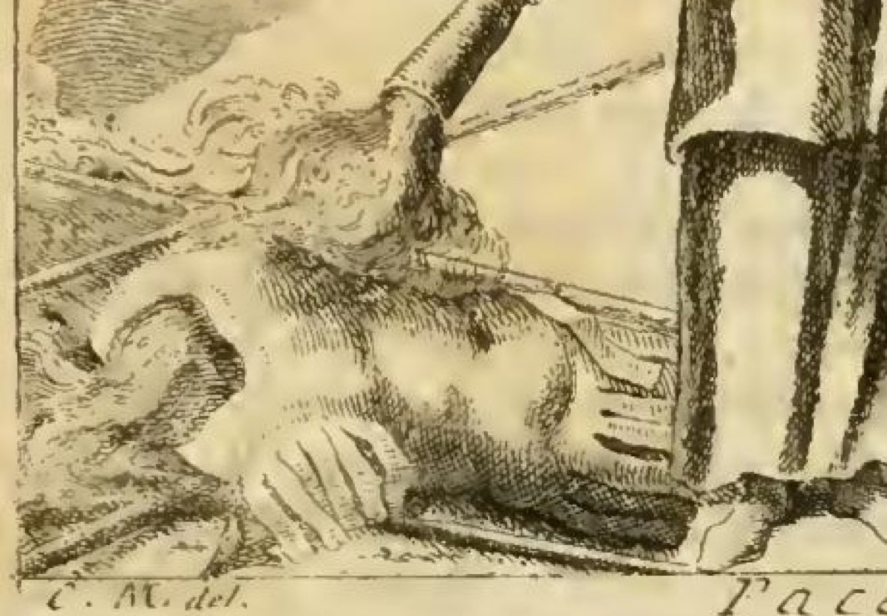

# 묶인 사자와 양 — 평화(PACE)의 금 사슬

## 카드 요약

리파의 『이코놀로지아』 PACE(평화) 항목 첫 번째 도상에서, 평화의 여신은 **왼손으로 사자와 양을 섬세한 금 사슬로 함께 묶어** 나란히 누워 있게 한다. 이는 평화가 **짐승 같은 사나움(furor bestiale)과 온순함(mansuetudine)을 사랑으로 하나 되게 묶어**, 서로 미워하던 민족들이 인간다운 교류(umano commercio)를 하게 만든다는 뜻이다.

---

## 도상 전체 (첫 번째 PACE 도상)

원문의 처방(리파, 1760년 페루자판 4권):

> Donna alata, di oliva, e di spighe incoronata. Nella destra mano tenga una face accesa rivolta in giù, che arda un monte d'armi postovi sotto. Colla sinistra mano tenga legati con delicato vincolo di oro un Leone, e una Pecora giacendo insieme. Si vesta di bianco.

| 지물 | 의미 |
|---|---|
| **날개** | 평화는 영원하지 않고 **날아가 버린다**. 클라우디우스 황제의 날개 달린 평화 메달 두 개가 근거 — 부지런히 지키고 붙들어야 한다는 경고. |
| **올리브 관** | 넵투누스(삼지창→말=전쟁)와 미네르바(창→올리브=평화)의 아테네 명명 경쟁 신화. 올리브가 더 유익하다고 판정됨. |
| **이삭 관** | 평화가 풍요를 유지함. 베스파시아누스 메달의 `PACIS EVENTUM`. |
| **아래로 기울인 횃불** | 무기 더미를 태워 없앰 = 전쟁의 소멸. 트라야누스·베스파시아누스 메달의 `PAX`. |
| **금 사슬로 묶인 사자와 양** | 사랑의 결속 — 이 카드의 초점. |
| **흰 옷** | 그리스·로마의 공적 축제 복색(기쁨). 동시에 평화는 **꾸밈 없이 진실해야** 함(candida = 흼 + 진실함). |

판화에서 실제로 확인되는 것: 여인은 오른손으로 횃불을 아래로 향해 왼쪽 아래 **무기 더미**(흉갑·방패·창대)에 불을 붙이고 있고, 왼팔에는 올리브 가지가 꽂힌 **풍요의 뿔**을 안고 있다. 즉 이 판본의 삽화는 텍스트의 여러 PACE 도상을 합성해 그린 것으로, **사자와 양은 그려 넣지 않았다**. 카드의 설명은 판화가 아니라 텍스트 처방에서 나온다.

---

## 사자와 양이 뜻하는 것

원문 핵심 대목:

> Tiene legati con vincolo di oro il Leone colla Pecora, perchè la Pace unisce, e lega in amore il furor bestiale con la mansuetudine, cangia la fierezza delle Genti nemiche in amorevolezza; una Nazione che abborriva l'altra, insieme tratta con umano commercio; attesocchè Pace si dice una **eguaglianza di molte volontà, mostrata con segni esteriori**.

세 층으로 읽으면 좋다.

1. **성정의 결합**: 사자 = 짐승 같은 격노, 양 = 온순함. 본성상 습성이 가장 다른(diversissimi di costume) 두 동물이 나란히 누워 있다는 것 자체가 대립의 해소를 보여준다.
2. **민족 간의 화해**: 적대하던 민족의 흉포함(fierezza)이 애정(amorevolezza)으로 바뀌어, 서로를 혐오했던 나라가 **인간다운 교류**를 하게 된다.
3. **평화의 정의**: 평화란 곧 **"여러 의지가 하나로 균등해진 것이 외적 표징으로 드러난 상태"**(una eguaglianza di molte volontà, mostrata con segni esteriori). 사자와 양이 함께 있는 모습이 바로 그 '외적 표징'이다.

### 문헌 근거

- **베르길리우스**, 『목가』 4권: `Nec magnos metuent armenta leones` — "가축 떼가 큰 사자들을 두려워하지 않으리라." 폴리오(Pollio)의 집정관 재임과 그 아들의 탄생에 평화와 안정을 기원하며 한 말. 리파가 이 도상의 직접 근거로 인용한다.
- **아일리아누스**, 『잡록(Varia Historia)』 1권 29장: 코스 사람들의 전언으로, 니키푸스(Nicippo)가 아직 사인(私人)이던 시절 그의 목장에서 **양이 새끼 양이 아니라 사자를 낳았다**(뒤에 그가 참주가 되었다). 리파는 이를 "평화롭고 화합하는 교제가 실제로 사자와 양을 함께 길들인" 사례로 끌어온다.

---

## 금 사슬(vincolo di oro)의 뜻

> Il vincolo di oro si pone per il nobile, e grato legame della Pace, essendo l'unione pacifica preziosa quanto l'oro, e dell'oro produttrice, e conservatrice.

- 평화의 결속은 **고귀하고 감사한 유대**이며, 평화로운 결합은 **금만큼 값지고, 금을 낳고, 금을 지킨다**(생산자이자 보존자).
- 그래서 굵은 쇠사슬이 아니라 "섬세한(delicato)" 금 사슬이다 — 강제가 아닌 사랑의 매듭.
- **폴리치아노**: `Majestas, sanctoque nitet pax aurea vultu` — 거룩한 얼굴로 빛나는 '황금 평화'.
- **칼푸르니우스**, 『목가』 1권: `Aurea secura cum pace renascitur aetas` — 평화와 더불어 **황금시대가 다시 태어난다**.
- **아우구스티누스**, 『주님의 말씀에 대하여』(파엔차의 잔안토니오 템피오니 신부의 설교에서 인용): `Pax est vinculum amoris, consortium caritatis, haec est quae bella compescit, simultates tollit, iras comprimit, discordes sedat, inimicos concordat` — "평화는 사랑의 끈이요 애덕의 동반이니, 전쟁을 억누르고 반목을 없애고 분노를 누르고 불화한 자를 진정시키고 원수를 화해시킨다."
- 리파는 이 문장을 도상에 그대로 배분한다: **횃불 = bella compescit / simultates tollit / iras comprimit**, **금 사슬로 묶인 사자와 양 = vinculum amoris / consortium caritatis / discordes sedat / inimicos concordat**.
- 붙잡는 손이 **왼손**인 이유도 명시된다 — "colla sinistra mano del cuore", 즉 **심장 쪽 손**. 사랑의 결속이므로 심장에 가까운 손으로 쥔다.

---

## 혼동 주의: 사자+양(금 사슬) vs 늑대+어린 양(멍에)

같은 PACE 항목 안에 비슷하지만 의미가 다른 도상이 하나 더 있다.

| | 첫 번째 도상 | 다른 도상 |
|---|---|---|
| 동물 | **사자 + 양** | **늑대 + 어린 양** |
| 결박 방식 | 섬세한 **금 사슬**(vincolo di oro) | 같은 **멍에**(un medesimo giogo) |
| 손 | 왼손(심장 쪽) | 오른손 |
| 자세 | 함께 누워 있음 | 앉은 여인, 왼손에 올리브 가지 |
| 의미 | 사랑에 의한 자발적 화합, 민족 간 교류 | **군주의 통치**가 오만한 자의 교만을 낮춰 겸손한 자와 같은 멍에 아래 살게 함 |

즉 사자·양의 금 사슬은 **사랑(카리타스)의 결속**, 늑대·어린 양의 멍에는 **정치적 권위에 의한 평정**이다. 후자에는 "우리 자신의 평화" 곧 몸의 감각과 영혼의 능력이 이성에 함께 순종하는 상태라는 내면적 해석도 덧붙는다.

---

## 암기용 한 줄

**사자(사나움) + 양(온순함)을 금 사슬(사랑의 값진 결속)로 왼손(심장)에 묶음 = 여러 의지의 일치가 밖으로 드러난 것 = 평화. 근거는 베르길리우스 "가축 떼가 큰 사자들을 두려워하지 않으리라".**

## 출처

- 원문: `.fm/assets/14 Idleness to Patience.md` — PACE 항목 첫 도상 및 그 해설 단락
- 도판: `.fm/assets/Iconologia (Cesare Ripa)/_page_332_Picture_3.jpeg`
