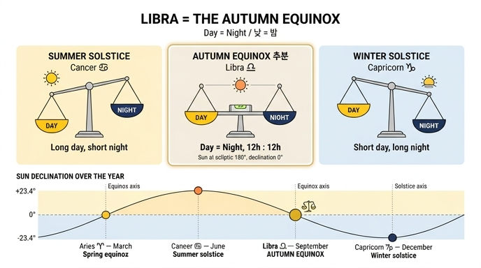

# 9월 도상의 천칭자리 — 추분(秋分)의 표지

## 0. 카드 요지

**질문**: 9월 도상에서 천칭자리는 무엇을 뜻하는가?

**답**: 태양이 이 별자리에 들어 **추분**이 되어 **밤과 낮의 길이가 같아짐**을 뜻한다. 근거로 베르길리우스의 「천칭이 낮과 잠(밤)의 시간을 같게 만들 때」가 인용된다.

---

## 1. 원전 확인 — Ripa의 「SETTEMBRE」

Cesare Ripa, *Iconologia*, 「MESI」(달들) 항목의 9월 도상은 다음과 같다. (OCR 원문은 긴 s가 f로 깨져 있어 정자로 복원했다.)

> Giovane alato, allegro, ridente, vestito di **porpora**. Avrà in capo una ghirlanda di **miglio, e di panico**. Nella destra mano **il segno della Libra**, e con l'altra mano il **cornucopia** pieno di uve bianche, e nere, persiche, fichi, pere, mele, lazzaruole, granati, e altri frutti, che si trovano in detto Mese.
>
> — 날개 달린 젊은이, 즐겁고 웃는 얼굴, **자주색(porpora)** 옷을 입었다. 머리에는 **기장과 조**의 화관을 썼다. 오른손에는 **천칭자리의 표지**를, 다른 손에는 흰 포도·검은 포도·복숭아·무화과·배·사과·서양산사·석류 등 이 달의 과일이 가득한 **풍요의 뿔**을 들었다.

그리고 결정적인 해설 대목:

> Tiene il segno della Libra, per dimostrare, che in questo tempo viene il Sole in questo, e **fassi l'Equinozio, agguagliandosi la notte col giorno**, come disse Virgilio.
>
> **Libra dies, somnique pares ubi fecerit horas**
>
> — 천칭의 표지를 든 것은, 이 시기에 태양이 그 안으로 들어와 **추분이 되고 밤이 낮과 같아짐**을 보이기 위함이다. 베르길리우스가 말한 대로.

곁가지 정보 두 가지가 해석에 도움이 된다.

- **자주색 옷**: Ripa는 자주색이 왕과 위인만 입는 색이므로, 9월을 "모든 달의 **왕이며 군주**(come Re, e Principe di tutti gli altri mesi)"로 표현했다고 밝힌다. 인간 생활에 필요한 것을 가장 풍성하게 주는 달이라는 뜻이다.
- **Ripa의 인용은 살짝 부정확하다**: 베르길리우스 원문은 `Libra **die** somnique...`(고형 여격 `die`)인데 Ripa는 `Libra **dies**,...`로 적었다. 근세 인용 관행에서 흔한 변형이다.

---

## 2. 추분(秋分, autumnal equinox)의 천문학

### 2.1 무엇이 일어나는가

태양은 1년 동안 천구상의 큰 원(**황도, ecliptic**)을 따라 움직인다. 황도는 천구 적도에 **23.4° 기울어져** 있으므로, 태양의 **적위(declination, 천구 적도에서의 남북 각거리)** 는 1년에 걸쳐 +23.4°(하지) ↔ −23.4°(동지) 사이를 오간다.

이 두 극단 사이에서 적위가 정확히 **0°** 가 되는 순간이 두 번 있다. 그중 태양이 북에서 남으로 천구 적도를 **가로지르는** 순간이 추분이다.

현행 공식 정의는 낮 길이가 아니라 **태양의 황경(ecliptic longitude)** 으로 내린다.

| | 황경 | 태양의 적위 | 시기 |
|---|---|---|---|
| **춘분** (vernal equinox) | **0°** | 0° (남→북) | 3월 20~21일경 |
| 하지 (summer solstice) | 90° | +23.4° (최대) | 6월 21일경 |
| **추분** (autumnal equinox) | **180°** | 0° (북→남) | 9월 22~23일경 |
| 동지 (winter solstice) | 270° | −23.4° (최소) | 12월 21~22일경 |

### 2.2 왜 지구 **전역**에서 낮과 밤이 같아지는가

핵심은 **천구 적도라는 대원(great circle)의 성질**이다.

1. 지구의 자전축은 천구 적도의 극(천구 북극·남극)을 향한다. 따라서 하루 동안 별(또는 태양)이 그리는 원은 항상 천구 적도에 평행하다.
2. 태양의 적위가 0°이면, 태양은 **천구 적도 자체를 따라** 하루를 돈다.
3. 그런데 천구 적도는 대원이고, 지구상 **어느 위치의 지평선도 대원**이다. **두 대원은 반드시 서로를 정확히 이등분한다.**
4. 그러므로 천구 적도의 절반은 지평선 위, 절반은 지평선 아래에 놓인다 → 태양이 지평선 위에 있는 시간과 아래에 있는 시간이 **정확히 반반** = 12시간 : 12시간.

이 논증에는 관측자의 위도가 **전혀 등장하지 않는다.** 그래서 추분에는 적도든 서울이든 오슬로든 남반구든, 지구 어디서나 낮과 밤이 같아진다. (극점은 태양이 지평선을 스치는 특이 경우.) 다른 날에는 태양의 일주 원이 적도에 평행하되 비껴 있으므로, 위도에 따라 지평선이 그 원을 불균등하게 잘라 낮·밤 길이가 달라진다.

미 해군 천문대(USNO)의 표현: "the geometric center of the Sun's disk crosses the equator, and this point is above the horizon for 12 hours everywhere on the Earth."

### 2.3 어원 — 이름 자체가 답이다

라틴어 **aequinoctium** = **aequus**(같은, equal) + **nox / noctis**(밤, night). 곧 "**밤이 (낮과) 같음**". 중세 라틴 *equinoxium*, 고대 프랑스어 *equinoce*를 거쳐 영어 **equinox**가 되었다. 고대 영어에도 같은 뜻의 토착어 *efnniht*("even-night")가 있었다.

한자어 **추분(秋分)** 역시 "가을을 **나눈다**"는 뜻으로, 낮과 밤을 반으로 가르는 절기라는 관념을 담는다.

### 2.4 춘분(양자리) ↔ 추분(천칭자리)의 대칭

황도상에서 두 분점은 **정확히 180° 반대편**에 있다. 그리고 회귀 황도대(tropical zodiac)에서 각 궁은 30°씩을 차지하므로:

- 황경 0° = **양자리 0도(0° Aries)** = 춘분점 → 3월
- 황경 180° = **천칭자리 0도(0° Libra)** = 추분점 → 9월

양자리와 천칭자리는 황도 12궁에서 **정반대(opposition) 관계**에 놓인 쌍이며, 둘 다 "낮과 밤이 같은 지점"이라는 같은 성질을 공유한다. 차이는 방향뿐이다 — 춘분은 낮이 길어지는 국면으로 **들어가는** 문, 추분은 밤이 길어지는 국면으로 **들어가는** 문이다. Ripa가 3월(양자리)과 9월(천칭자리)을 각각 "봄의 시작"과 "균형"으로 배치한 것은 이 대칭을 그대로 옮긴 것이다.

### 2.5 세차운동 — 오늘날 추분점은 실제로 **처녀자리**에 있다

여기가 근세 도상학과 현대 천문학이 갈라지는 대목이다.

지구 자전축은 약 **25,800년 주기로 원뿔을 그리며 흔들린다**(**세차운동, precession of the equinoxes**). 그 결과 분점(춘분점·추분점)이 황도 위를 매년 약 **50.3초각**씩 서쪽으로 이동한다. 약 **71.6년에 1°**, 2,000년에 약 **28°** 다.

| 시점 | 9월 분점이 놓인 별자리 |
|---|---|
| 기원전 2400년경 ~ 기원전 730년 | **천칭자리** (실제로 일치) |
| **기원전 730년(−729년) 이후 ~ 현재** | **처녀자리** |
| 서기 2439년경 이후 | 사자자리 |

즉 **추분점이 실제 천칭자리 별들 사이에 있었던 것은 기원전 730년까지**다. 바빌로니아인이 이 영역을 "하늘의 균형"이라 부른 기원전 1000년경에는 아직 일치했다. Ripa가 활동한 1600년경에는 이미 약 34°(2,300여 년 분량) 어긋나 있었다.

**그렇다면 Ripa가 틀렸는가? 아니다.** Ripa가 말하는 Libra는 **별자리(constellation)** 가 아니라 **회귀 황도대의 궁(sign)** 이다. 회귀 황도대는 춘분점을 원점(0°)으로 삼아 30°씩 열두 궁을 자르는 좌표계이므로, 궁 Libra는 정의상 **황경 180°~210°** 이고 그 시작점 `0° Libra`는 **영원히 추분점과 일치**한다. 프톨레마이오스 이래 서구 표준이며, 오늘날 천문학 교재도 추분점을 여전히 "**First Point of Libra**"라 부른다. 하늘의 별 배치와 좌표계의 이름이 갈라졌을 뿐, 좌표계 내부에서는 모순이 없다.

### 2.6 엄밀히는 실제 낮이 몇 분 더 길다

"추분에 낮과 밤이 같다"는 것은 **태양 원반의 기하학적 중심**을 기준으로 한 이야기다. 실제 일출·일몰 시각은 두 가지 이유로 낮 쪽으로 치우친다.

1. **대기 굴절 약 34′**: 지구 대기가 빛을 굴절시켜, 태양이 아직 지평선 **아래**에 있는데도 이미 보인다.
2. **태양의 시반경 약 16′**: 일출·일몰은 태양 **중심**이 아니라 **윗변(upper limb)** 이 지평선에 닿는 순간으로 정의한다.

합계 **약 50′**. USNO: "at the tabulated time the geometric center of the Sun is actually **50 minutes of arc below** a regular and unobstructed horizon."

그 결과 추분에도 **실제 낮은 12시간을 약 7~8분 초과**하며, 위도가 높아질수록 커진다(위도 50°에서 약 10분). 낮이 밤보다 긴 차이로 환산하면 그 두 배(적도에서 약 13~14분, 위도 50°에서 약 21분)다.

낮과 밤이 실제로 같아지는 날은 분점이 아니라 며칠 뒤(가을) 혹은 며칠 앞(봄)이며, 이를 **equilux**라 부른다. 위도 40°에서는 대략 9월 26일경·3월 17일경이다.

---

## 3. 인용된 베르길리우스 시행의 출처

### 3.1 정확한 출처 — *Georgica* 1권 208행

Publius Vergilius Maro, ***Georgica*(농경시) 1.208**.

> **Libra die somnique pares ubi fecerit horas**
>
> 천칭이 낮과 잠의 시간을 같게 만들었을 때

`die`는 `dies`의 고형 여격/속격, `somni`는 "잠"의 속격이다. **`somnus`(잠)를 `nox`(밤)의 환유로 쓴 것**이 이 시행의 시적 묘미다 — 시간을 "깨어 있는 시간"과 "잠자는 시간"으로 나누어 세는 농부의 감각이 그대로 배어 있다. 카드의 답이 "낮과 잠(밤)"이라 병기한 이유가 여기 있다.

### 3.2 앞뒤 문맥 — 이것은 **파종 지침**이다

이 시행이 놓인 자리(*Georgica* 1.204–224)를 보면, 베르길리우스는 **천문 신호와 작물을 짝지어 파종 달력을 제시**하고 있다.

```
204  Praeterea tam sunt Arcturi sidera nobis
205  Haedorumque dies servandi et lucidus Anguis,
206  quam quibus in patriam ventosa per aequora vectis
207  Pontus et ostriferi fauces temptantur Abydi.
208  Libra die somnique pares ubi fecerit horas
209  et medium luci atque umbris iam dividit orbem,
210  exercete, viri, tauros, serite hordea campis
211  usque sub extremum brumae intractabilis imbrem;
212  nec non et lini segetem et Cereale papaver
213  tempus humo tegere et iamdudum incumbere aratris,
214  dum sicca tellure licet, dum nubila pendent.
```

**직역(208–214)**:

> "천칭이 낮과 잠의 시간을 같게 만들고, 이제 천구를 빛과 그늘에 절반씩 나누어 줄 때 — **사람들아, 황소를 부려라, 들판에 보리를 뿌려라**, 다루기 힘든 겨울의 마지막 비가 내릴 때까지. 또한 **아마 밭과 케레스의 양귀비를 흙으로 덮을 때**이며, 진작에 쟁기에 몸을 실을 때다 — 땅이 마른 동안, 구름이 (아직 비를 뿌리지 않고) 매달려 있는 동안."

209행이 특히 중요하다. `et medium luci atque umbris iam dividit orbem` — "천구를 빛과 그늘에 **절반씩** 나눈다". 208행의 "낮 = 잠"과 209행의 "빛 = 그늘"이 **같은 사실을 두 번 말하는 대구(對句)** 로, 추분의 균등이 시행 구조 자체에 반영되어 있다.

베르길리우스가 짜 놓은 대응은 이렇다.

| 천문 신호 | 시기 | 파종 작물 |
|---|---|---|
| **Libra = 추분** (208–209) | 추분 ~ 한겨울 마지막 비 | **보리(hordea), 아마(linum), 양귀비(papaver)** |
| 황소자리가 해를 열고 개별(Canis)이 짐 (217–218) | 봄 | 콩(fabae), 자주개자리(medica), 조(milium) |
| 플레이아데스 새벽 짐 + 왕관자리 짐 (221–222) | 만추 | 밀(triticum), 스펠트(far) |

### 3.3 Ripa가 한 일 — 농사 지침의 **도상학적 전용**

여기서 짚어야 할 논점이 있다.

베르길리우스에게 "천칭 = 낮밤 균등"은 **목적이 아니라 수단**이었다. 시계도 달력도 신뢰할 수 없던 시대에, 농부가 파종 시기를 알아내는 **실용적 시간 지표**로서 하늘을 읽으라는 것이다. 208행은 "**언제** 보리를 뿌릴지"를 말하는 종속절이고, 주절은 210행의 명령형 `serite hordea`("보리를 뿌려라")다.

**Ripa는 이 종속절만 떼어 와 도상 해설의 전거로 삼았다.** 곧,

- 베르길리우스: 추분(천칭) → **그러니 파종하라** (농학적·실용적)
- Ripa: 천칭 표지 → **추분을 뜻한다** (도상학적·상징적)

인과의 방향이 뒤집히고, 문맥이 농사에서 알레고리 회화의 지침으로 옮겨졌다. 이는 Ripa의 방법론 전반의 특징이다. *Iconologia*는 고전 문헌·성서·자연사에서 **권위 있는 한 문장을 발췌해 도상의 근거로 배치**하는 방식으로 작동한다. 원문의 문맥은 종종 뒤로 물러나고, 화가에게 필요한 "이 지물이 무엇을 뜻하는가"만 남는다.

다만 이 전용이 자의적인 것은 아니다. Ripa의 9월 도상 자체가 **포도 수확(vendemmia)·기장과 조의 화관·풍요의 뿔**로 가득한 **농사 달력의 이미지**이기 때문에, 농경시에서 전거를 끌어온 것은 오히려 자연스럽다. 실제로 *Iconologia*의 「MESI」 항목은 세 계열로 병치되어 있다 — 리파 자신의 12궁 계열, 「Mesi secondo l'Agricoltura」(농사에 따른 달, 1월 시작), 「Mesi secondo Eustathio」(에우스타티오스에 따른 달). 9월은 세 계열 모두에서 **포도 수확과 포도즙 짜기(cavare il mosto dalle uve)** 로 표현된다.

---

## 4. 천칭자리는 왜 '저울'인가

12궁 중에서 천칭자리만이 유일하게 **생물이 아닌 무생물**이다. 왜 하필 저울인가에 대해 서로 얽힌 세 갈래 설명이 있다.

### 4.1 계절 현상 자체가 이름의 유래라는 설

가장 직접적인 설명이다. **이 별자리에 이름이 붙던 시대에 실제로 추분점이 그 별들 사이에 있었기 때문**이다. 낮과 밤이 저울처럼 평형을 이루는 하늘의 자리 → "저울".

로마 시인 **마닐리우스(Manilius)** 의 설명이 이를 명시한다. 천칭자리는 "**계절이 균형을 이루고, 밤과 낮의 시간이 서로 맞아떨어지는 궁**(the sign in which the seasons are balanced, and the hours of night and day match each other)"이다. 로마인은 천칭자리를 균형 잡힌 계절과 같은 길이의 밤낮과 연결된 **길한 별자리**로 여겼다.

즉 **카드의 답(추분 = 밤낮 균등)은 단순한 '해석'이 아니라 별자리 이름 자체의 어원**일 가능성이 크다. 순환이 아니라 근거다.

### 4.2 처녀자리(아스트라이아 = 정의의 여신)의 저울로 읽는 전통

두 번째 계보는 인접한 **처녀자리(Virgo)** 와 짝지어 읽는 방식이다.

처녀자리는 고대에 **디케(Dike)** 또는 **아스트라이아(Astraea)** — 정의의 여신 — 으로 동일시되었다. 황금시대에 인간과 함께 살았으나 인간이 타락하자 하늘로 올라갔다는 오비디우스의 이야기가 그것이다. 그렇다면 그 바로 옆 별자리는 자연히 **여신이 높이 들어 올린 정의의 천칭**이 된다. 로마의 여신 **유스티티아(Justitia)** 로 이어지고, 오늘날 법원 앞의 눈가리개를 한 정의의 여신상이 저울을 든 도상이 여기서 나온다.

이 독법은 천문학적 사실(추분)과 도덕적 알레고리(정의)를 하나의 지물에 겹쳐 놓는다. **"균형"이 자연 현상이면서 동시에 윤리적 덕목**이 되는 이 이중성이, Ripa 같은 도상학 편람이 천칭자리를 특별히 좋아한 이유다.

### 4.3 바빌로니아의 ZIB.BA.AN.NA — "하늘의 균형"

기원을 더 밀고 올라가면 **바빌로니아**에 닿는다.

바빌로니아인은 기원전 1000년경 이 영역을 **ZIB.BA.AN.NA**, 곧 "**하늘의 균형(the balance of heaven)**"이라 불렀다. 아카드어 음절 표기로는 `MUL Zi-ba-an-na`, 관련 어휘 **zibānītu**는 "한 벌의 저울(a set of weighing scales)"을 뜻한다. Ian Ridpath *Star Tales*의 서술이 핵심을 요약한다 — 바빌로니아인이 이 이름을 쓴 시대에 "**추분점이 실제로 그 별들 사이에 놓여 있었다**(when the autumnal equinox did lie among its stars)".

저울은 진리와 정의의 태양신 **샤마시(Shamash, 수메르 Utu)** 에게 봉헌된 것으로 전해진다. 즉 **"저울 = 균형 = 정의"의 연쇄는 그리스·로마보다 앞선 메소포타미아 기원**을 가진다. (아카드어 세부와 샤마시 연결은 2차 문헌 기반이므로 *MUL.APIN* 등 1차 문헌 확인이 바람직하다.)

### 4.4 중간 단계 — 그리스의 Chelae(전갈의 발톱)

흥미롭게도 **그리스 천문학은 이 영역을 독립된 별자리로 인정하지 않았다.** 이곳은 **Χηλαί (Chelae)**, 문자 그대로 "**발톱**"이었고, 전갈자리의 앞발로 취급되었다. 아라토스가 이를 되풀이해 헬레니즘 시대에 널리 퍼졌다.

그 화석이 오늘날 천칭자리의 두 밝은 별 이름에 남아 있다.

- **Zubenelgenubi** (α Lib) = 아랍어 "**남쪽 발톱**"
- **Zubeneschamali** (β Lib) = 아랍어 "**북쪽 발톱**"

저울이 독립 별자리로 확립된 것은 **기원전 1세기 로마**에서다. 정확히 누가 도입했는지는 알려지지 않았으나, **베르길리우스(*Georgica* 1.208)와 마닐리우스가 문헌으로 증언하는 가장 이른 증거**에 속한다. 다시 말해, **Ripa가 인용한 그 시행 자체가 "천칭자리 = 저울"이라는 관념의 초기 문헌 증거**다.

정리하면 계보는 이렇다.

```
바빌로니아 ZIB.BA.AN.NA (하늘의 균형, ~BC 1000)
        ↓  [추분점이 실제로 여기 있던 시대]
그리스 Χηλαί (전갈의 발톱) — 별자리 지위 상실
        ↓
로마 Libra (저울, BC 1세기 확립) — Vergil, Manilius
        ↓  + 처녀자리 = 아스트라이아 = 정의 전통 결합
Ripa Iconologia (1603) — 9월 = 천칭 = 추분 = 균형
```

---

## 5. Ripa의 12궁 독법 전체 구조 — 천칭자리는 '균형점'

### 5.1 왜 3월이 첫 달인가

Ripa의 「MESI」는 **3월(양자리)에서 시작**한다. 실수가 아니라 의도된 고전적 체계이며, Ripa 자신이 본문에서 근거를 든다.

- **Luglio(7월)**: 율리우스 카이사르를 기려 붙은 이름이지만, 이전에는 Quintile였다 — "**3월부터 세어 다섯째**(cominciando da Marzo, essendo quinto in ordine)"이므로.
- **Settembre(9월)**: "**일곱째**이므로 September라 부른다(Chiamasi Settembre, per essere il settimo)."
- **Novembre / Dicembre**: "**아홉째** … **열째**이므로."

**September(7), October(8), November(9), December(10)라는 이름 자체가 3월을 첫 달로 세는 로물루스의 역법에서 나왔다**는 사실이 Ripa의 논거다. 1월(Gennaio)과 2월(Febbraio)은 "로물루스의 해에 누마 폼필리우스가 **덧붙인**(furono aggiunti all'anno di Romolo da Numa Pompilio)" 달이라고 Ripa는 명시한다.

### 5.2 12궁 전체 표 — 태양의 힘의 곡선

| 순 | 달 | 12궁 | 태양의 국면 | Ripa의 해설 요지 |
|---:|---|---|---|---|
| 1 | **3월 Marzo** | ♈ 양자리 Ariete | **춘분 — 상승 시작** | "봄의 시작(i principi della Primavera)". 양은 뒤가 약하고 앞에 힘이 있듯, 태양도 이 궁 초에는 추위로 약하다가 여름을 향해 강해진다 |
| 2 | 4월 Aprile | ♉ 황소자리 Toro | 상승 | 땅이 열리고 부를 펼친다(*Aprile* ← *aperire*). 초록 옷 |
| 3 | 5월 Maggio | ♊ 쌍둥이자리 Gemini | 상승 | 태양의 힘이 **배가(si raddoppia)** 된다. 동물이 새끼를 낳아 수가 늘어난다 |
| 4 | **6월 Giugno** | ♋ 게자리 Granchio | **하지 — 반전점** | 태양이 이 궁에 이르면 게처럼 **뒤로 돌아가기 시작(comincia a tornare indietro)** 하며 우리에게서 멀어진다 |
| 5 | 7월 Luglio | ♌ 사자자리 Leone | 하강 초 — 폭염 | 사자는 뜨겁고 맹렬한 짐승. 이 궁에서 태양은 **과도한 더위와 큰 건조**를 낸다 |
| 6 | 8월 Agosto | ♍ 처녀자리 Vergine | 하강 — 완성 | 처녀가 불임이듯 태양은 **새로 만들지 않고 이미 난 것을 익혀 완성**시킨다(le prodotte matura, e perfeziona). 큰개자리(canicula)의 혹서 |
| **7** | **9월 Settembre** | **♎ 천칭자리 Libra** | **추분 — 균형** | **태양이 여기 들어와 추분이 되고 밤이 낮과 같아진다.** 자주색 = 모든 달의 왕. 풍요의 뿔 |
| 8 | 10월 Ottobre | ♏ 전갈자리 Scorpione | 쇠퇴 | 하지에서 기울어 잎이 물든다. 전갈의 독처럼 **불균등한 날씨가 위험한 병**을 낸다(히포크라테스 인용) |
| 9 | 11월 Novembre | ♐ 궁수자리 Sagittario | 쇠퇴 | 하늘에서 **우박·비·번개가 화살처럼** 쏟아진다. 마른 잎 색 옷 |
| 10 | **12월 Dicembre** | **♑ 염소자리 Capricorno** | **동지 — 최저점** | 산양이 절벽과 높은 산을 다니듯, 태양이 **남쪽으로 가장 낮은 위치**에 있다. 검은 옷, 화관 없음 |
| 11 | 1월 Gennaio | ♒ 물병자리 Acquario | 겨울 | 눈과 비가 넘친다. 흰 옷 (땅이 눈에 덮여) |
| 12 | 2월 Febbraio | ♓ 물고기자리 Pesce | 겨울 끝 | 물고기가 물의 것이듯 비가 많아 습한 시기. 회색(berrettino) 옷 |

### 5.3 사분(四分) 구조 — 두 개의 대칭축

이 12궁 배열의 뼈대는 **두 쌍의 대칭축이 직교하는 사분 구조**다.

```
                    ♋ 6월 게자리
                    하지 · 반전 (태양 최고 +23.4°)
                    "뒤로 돌아가기 시작"
                            │
                            │
    ♎ 9월 천칭 ─────────────┼───────────── ♈ 3월 양자리
    추분 · 균형              │              춘분 · 균형
    낮 = 밤, 하강 진입        │              낮 = 밤, 상승 진입
    (황경 180°)              │              (황경 0°)
                            │
                            │
                    ♑ 12월 염소자리
                    동지 · 반전 (태양 최저 −23.4°)
                    "가장 낮은 위치"
```

| 축 | 쌍 | 성질 | Ripa의 표현 |
|---|---|---|---|
| **분점 축** (equinoxes) | **양자리(3월) ↔ 천칭자리(9월)** | 낮 = 밤, **균형**. 상승/하강 국면으로 들어가는 문 | "봄의 시작" ↔ "추분, 밤이 낮과 같아짐" |
| **지점 축** (solstices) | **게자리(6월) ↔ 염소자리(12월)** | 낮·밤 길이의 **극단**. 방향이 **반전**되는 지점 | "게처럼 뒤로 돌아간다" ↔ "가장 낮은 위치" |

이 사분 구조에서 **천칭자리는 구조적으로 균형점**에 놓인다.

- **양적으로**: 낮 = 밤. 어느 쪽으로도 기울지 않은 유일한 지점(춘분과 함께).
- **위치적으로**: 하지의 정점과 동지의 저점 **정확히 중간**. 태양의 적위 곡선(사인파)이 **0을 통과하며 기울기가 가장 급한 지점**이다.
- **계절적으로**: 성장(3~8월)과 쇠퇴(10~2월)의 **경계**. 처녀자리에서 "완성된(perfeziona)" 것을 수확하고, 전갈자리부터 시작되는 쇠퇴로 넘어가는 문턱.
- **상징적으로**: 그래서 지물이 **저울**이고, 옷이 **자주색(왕의 색)** 이며, 손에 **풍요의 뿔**이 들려 있다. 1년의 결실이 다 모인 정점이면서, 동시에 이후의 하강을 예고하는 균형의 순간.

Ripa가 태양의 힘을 **"약함(양) → 배가(쌍둥이) → 반전(게) → 폭염(사자) → 완성(처녀) → 균형(천칭) → 쇠퇴(전갈·궁수) → 최저(염소)"** 로 서술한 것은, 결국 **태양 적위의 사인 곡선을 서사와 지물로 번역한 것**이다. 천칭자리는 그 곡선이 0을 지나는 순간의 알레고리다.

---

## 6. 한눈에 정리

- **9월 도상의 천칭자리 = 추분의 표지.** 태양이 이 궁(황경 180°)에 들어 적위가 0°가 되고, 천구 적도라는 대원이 어느 지평선에도 정확히 이등분되므로 **지구 전역에서** 낮과 밤이 같아진다.
- **어원이 곧 정의**: `equinox` = `aequus`(같은) + `nox`(밤). 추분(秋分)도 "가을을 나눔".
- **인용 출처는 *Georgica* 1.208**: `Libra die somnique pares ubi fecerit horas`. 원래는 **보리·아마·양귀비 파종 시기를 알리는 농사 지침**의 종속절이었고, Ripa가 이를 도상 해설의 전거로 전용했다.
- **천칭 = 저울인 이유**: 명명 당시 실제로 추분점이 그 별들 사이에 있었기 때문(바빌로니아 **ZIB.BA.AN.NA** = 하늘의 균형). 여기에 처녀자리 = 아스트라이아의 **정의의 천칭** 전통이 겹쳤다. 그리스에서는 전갈의 발톱(Chelae)이었고, 로마 기원전 1세기에 저울로 확립됐다.
- **오늘날의 어긋남**: 세차운동으로 **기원전 730년부터 추분점은 처녀자리에 있다.** 그래도 회귀 황도대의 `0° Libra`는 정의상 영원히 추분점이므로 Ripa는 틀리지 않았다. 또 대기 굴절(34′)과 태양 시반경(16′) 때문에 실제 낮은 12시간을 **7~8분 초과**한다.
- **구조적 위치**: 양자리(춘분) ↔ **천칭자리(추분)**, 게자리(하지) ↔ 염소자리(동지)의 두 대칭축이 만드는 사분 구조에서, 천칭자리는 **성장과 쇠퇴의 경계에 놓인 균형점**이다.

## 인포그래픽


