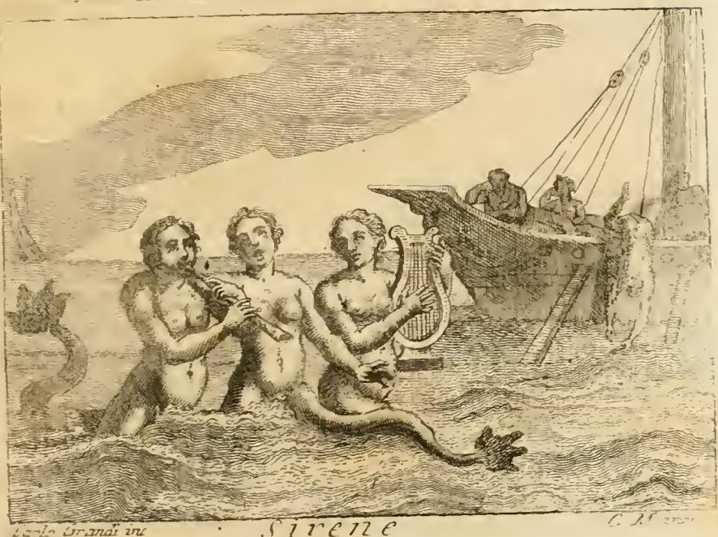

# 카리브디스(Cariddi) — 소용돌이 암초의 도상

## 질문

카리브디스(Cariddi)는 어떻게 묘사되는가?

## 답

물이 소용돌이치며 배들을 삼키고 때로는 산 위로 솟구쳐 항해자에게 큰 공포를 주는 극히 위험한 암초다. 시인들은 매우 추한 얼굴에 맹금의 손발을 지니고 입을 벌린 모습으로 그렸다.

---

## 1. 원문 근거

이 카드는 리파(Cesare Ripa) 『이코놀로지아』 제4권(Tomo Quarto) "MOSTRI(괴물들)" 항목 안의 독립 표제 **`CARIDDI`** 에서 나온다. 원문(asset: `08 Monsters and Muses.md`, 43~49행)은 다음과 같다.

> **C A R I D D I .**
> Cariddi è poi l'altro scoglio, anch'esso pericolosissimo, che l'acqua intorcendosi d'intorno assorbisce molte volte le navi, e talora s'innalza sopra i monti, dimanieracché grandissimo spavento rende a' Naviganti; però fu detto da' Poeti, che era di bruttissimo aspetto, colle mani, e piedi di uccello rapace, e colla bocca aperta.

직역하면 이렇다.

- `è poi l'altro scoglio` — "카리브디스는 (스킬라에 이어) **또 하나의 암초**다"
- `anch'esso pericolosissimo` — 그것 역시 **극히 위험하다**
- `l'acqua intorcendosi d'intorno assorbisce molte volte le navi` — 물이 그 주위를 **비틀며 감돌아(소용돌이쳐)** 여러 번 **배들을 삼킨다**
- `talora s'innalza sopra i monti` — 때로는 **산 위로 솟구친다**(물기둥이 산 높이까지 치솟는다)
- `grandissimo spavento rende a' Naviganti` — 그리하여 **항해자들에게 지극한 공포**를 준다
- `di bruttissimo aspetto` — **매우 추한 얼굴/외모**
- `colle mani, e piedi di uccello rapace` — **맹금(猛禽)의 손과 발**을 가지고
- `colla bocca aperta` — **입을 벌린** 채로

즉 답의 앞부분(소용돌이·배를 삼킴·산 위로 솟구침·공포)은 **자연현상으로서의 카리브디스**를, 뒷부분(추한 얼굴·맹금의 손발·벌린 입)은 **시인들이 인격화한 도상**을 가리킨다. 리파의 서술 순서 자체가 "실제 지형 → 시인의 의인화"라는 이 책 특유의 설명 구조를 보여준다.

## 2. 왜 암초가 괴물이 되는가 — 스킬라와의 한 쌍

카리브디스 항목 바로 앞에 리파는 두 대상을 한 문장으로 묶어 설명한다(29행).

> Scilla, e Cariddi sono due scogli posti nel Mare di Sicilia, e sono stati sempre pericolosissimi a' Naviganti: però i Poeti antichi gli diedero figura di Mostri marini, oppressori di tutti quelli, che passano vicino ad essi.
> — "스킬라와 카리브디스는 **시칠리아 바다에 놓인 두 암초**이며 항해자에게 언제나 극히 위험했다. 그래서 고대 시인들은 이들에게 **바다 괴물의 형상**을 주어, 그 근처를 지나는 모든 이를 짓누르는 존재로 삼았다."

이것이 이 카드의 핵심 논리다. **위험한 항로 지형 → 공포의 인격화 → 도상**이라는 변환이다. 리파는 두 암초의 위치까지 덧붙인다(47행).

> Scilla, e Cariddi sono vicini l'uno all'altro, ed ove sono posti, è pericoloso di navigare, per le onde di due contrari mari, che ivi incontrandosi insieme combattono.
> — "둘은 서로 가까이 있고, 그 자리는 **서로 반대되는 두 바다의 파도가 만나 싸우기** 때문에 항해가 위험하다."

지리적으로는 **메시나 해협**(시칠리아와 이탈리아 본토 사이)이다. 티레니아해와 이오니아해의 조류가 만나 실제로 강한 와류(이탈리아어로 `garofalo`/`galofaro`라 불리는 소용돌이)와 급류가 발생한다. 리파의 "두 반대되는 바다의 파도가 싸운다"는 표현은 이 조류 충돌을 정확히 묘사한 것이다.

### 스킬라와 카리브디스의 도상 차이

| | 스킬라(Scilla) | 카리브디스(Cariddi) |
|---|---|---|
| 위험의 성격 | **암초·이빨** — 배를 부수고 선원을 물어뜯음 | **소용돌이** — 배를 통째로 빨아들임 |
| 리파가 든 형상 | ① 호메로스: 발 12개, 목 6개, 머리 6개, 각 머리에 세 줄 이빨과 독액이 흐르는 큰 입 / ② 세스투스 폼페이우스 메달: 배꼽까지 나체인 여인, 두 손으로 **배의 방향타(timone)** 를 내리치려는 자세, 배꼽 아래는 물고기이며 꼬인 두 꼬리로 갈라지고 개 세 마리가 반신을 내밀고 짖음 | 추한 얼굴, **맹금의 손발**, **벌린 입** |
| 상징 해석 | 짖는 개들 = 암초에 파도가 부딪히는 **큰 소음**, 방향타 = 배를 부수고 선원을 죽임 | 벌린 입 = 배를 **삼키는** 흡입, 맹금의 발 = **낚아채는** 약탈성 |

스킬라 쪽은 리파가 호메로스(『오디세이아』)·오비디우스(『변신 이야기』 14권)·베르길리우스(『아이네이스』 3권, 『목가』 6번)를 줄줄이 인용해 길게 다루는 반면, 카리브디스는 단 한 문단으로 짧다. 이 **비대칭** 자체가 시험에 잘 나오는 포인트다. 카리브디스는 형태가 아니라 **작용(빨아들임)** 이 본질이기 때문에 시각화할 몸이 적었던 것이다.

### 맹금의 손발 — 하르피이아와의 친연성

"bruttissimo aspetto + mani e piedi di uccello rapace + bocca aperta"라는 조합은 사실 **하르피이아(Arpie)** 의 표준 도상과 거의 같다. 르네상스·바로크 신화서(나탈레 콘티 `Mythologiae`, 카르타리 `Imagini degli Dei`)에서 "탐욕스럽게 빼앗는 존재"는 관습적으로 맹금의 갈고리발톱으로 표현됐다. 카리브디스가 **문자 그대로 낚아채 삼키는** 위험이므로, 리파는 별도의 창작 대신 이 기성 어휘를 빌려 썼다고 볼 수 있다.

## 3. 같은 챕터의 판화가 보여주는 "위험한 바다" 도상

리파의 이 판본에는 카리브디스 전용 판화가 실려 있지 않다. 대신 같은 "MOSTRI" 절 안의 **세이렌(Sirene)** 판화가, 카리브디스 설명이 전제하는 장면 — 즉 *바다 괴물과 그 앞에서 파멸하는 배* — 를 그대로 보여준다.

그림에서 실제로 관찰되는 요소를 리파의 카리브디스 서술과 연결해 보면 이렇다.

- **화면 오른쪽의 배**: 돛대와 삭구가 기울어져 있고, 뱃전에 기댄 선원들은 이미 힘을 잃은 자세다. 리파가 세이렌 항목에서 설명한 "일부는 잠들고, 일부는 잠들어 가고, 일부는 배에서 물로 떨어지는" 상태다. 카리브디스 항목의 `assorbisce molte volte le navi`(배들을 여러 번 삼킨다)가 겨냥한 결말과 같다.
- **화면 왼쪽 아래에 반쯤 잠긴 물고기 꼬리**: 물속에 몸을 감춘 해양 괴물의 존재를 암시한다. 카리브디스가 "보이지 않는 물의 작용"으로 위험한 것과 같은 표현 방식이다.
- **인물들이 물결선 아래로 사라지는 하반신**: 이 판본 판화의 수면 처리는 촘촘한 평행 해칭으로 물의 회전과 흐름을 만든다. 카리브디스의 `l'acqua intorcendosi d'intorno`(물이 비틀며 감돌아)를 상상할 때 바로 이 선묘를 떠올리면 된다.
- **배경의 작은 돛배와 낮은 수평선**: 항로 전체가 위협 아래 있다는 서술적 장치. 리파가 "그 근처를 지나는 모든 이를 짓누르는(oppressori di tutti quelli, che passano vicino ad essi)"이라고 쓴 그 상황이다.

세이렌은 **소리로 유혹**하고 카리브디스는 **물로 빨아들인다**는 점에서 수단은 다르지만, 리파가 이들을 하나의 "MOSTRI" 절에 모아 놓은 이유는 같다. 셋 모두 *인간 삶의 항해(navigazione)* 를 위협하는 것들의 알레고리이기 때문이다. 리파 자신이 세이렌 항목에서 이렇게 못 박는다. "바다의 배는 신중과 지혜로 다스리지 않으면 중대한 위험에 노출된 인간의 삶을 뜻한다(Il Naviglio pertanto in mare dinota l'umana vita esposta a gravi pericoli)."

## 4. 문학 전통 — 이 묘사가 어디서 왔는가

- **호메로스 『오디세이아』 12권**: 카리브디스는 하루 세 번 검은 물을 삼키고 다시 토해 내며, 그때는 제우스라도 구할 수 없다. 오디세우스는 배 전체를 잃을 위험(카리브디스)보다 선원 몇 명을 잃는 위험(스킬라)을 택하라는 키르케의 조언을 따른다. → "**둘 중 어느 쪽도 안전하지 않다**"는 원형적 딜레마.
- **베르길리우스 『아이네이스』 3권**: 헬레누스가 아이네아스에게 메시나 해협을 피해 시칠리아를 크게 우회하라고 경고한다.
- **오비디우스 『변신 이야기』**: 카리브디스를 삼키는 심연으로, 스킬라를 키르케의 독으로 변형된 처녀로 다룬다.
- **페트라르카**: 리파가 이 항목의 마지막에 직접 인용한다(49행).
  > `Passa la Nave mia colma d'oblio, ... Intra Scilla, e Cariddi, &c.`
  『칸초니에레』 189번 소네트다. "망각으로 가득 찬 내 배가 … 스킬라와 카리브디스 사이를 지난다." 사랑의 고통에 시달리는 시인의 내면을 **두 위험 사이를 지나는 배**로 은유한 것으로, 신화적 지형이 완전히 심리적 알레고리로 전환된 대표적 예다. 리파가 이 시행을 인용해 항목을 닫는 것은 "카리브디스 = 피할 수 없는 양자택일의 위험"이라는 **도덕적 독법**을 정착시키기 위한 것이다.

여기서 나온 관용구가 영어 *between Scylla and Charybdis*, 이탈리아어 *tra Scilla e Cariddi* — 우리말의 "진퇴양난", "이쪽도 저쪽도 위험한 상황"이다.

## 5. 암기 포인트

핵심을 세 갈래로 나누어 잡으면 잊지 않는다.

1. **정체**: 시칠리아(메시나) 해협의 **암초/소용돌이**. 스킬라와 한 쌍이며 서로 가깝다.
2. **작용 3종**: 물이 ① **소용돌이쳐** ② **배를 삼키고** ③ 때로 **산 위로 솟구친다** → 항해자에게 극도의 공포.
3. **도상 3종**: ① **매우 추한 얼굴** ② **맹금의 손과 발** ③ **벌린 입**.

혼동 주의:
- **방향타(timone)를 든 반나체 여인 + 짖는 개 세 마리 = 스킬라**(세스투스 폼페이우스 메달), 카리브디스가 아니다.
- **머리 6개·발 12개·세 줄 이빨 = 스킬라**(호메로스판), 카리브디스가 아니다.
- 카리브디스에는 **개도 꼬리도 여러 머리도 없다**. 오직 추한 얼굴 + 맹금의 손발 + 벌린 입뿐이다.

## 6. 출처

- Cesare Ripa, *Iconologia*, Tomo Quarto — `MOSTRI` 절의 `SCILLA` / `CARIDDI` 항목 (asset: `08 Monsters and Muses.md`, 29~49행)
- 판화 `fig-1.jpeg` = asset `Iconologia (Cesare Ripa)/_page_192_Picture_3.jpeg` (`SIRENE` 항목 도판, 같은 절)
