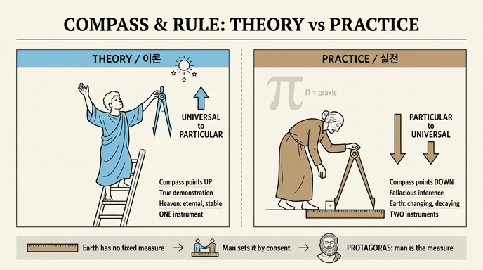

# 실천(Prattica) 도상 — 컴퍼스의 방향과 자(regolo)

**Q. 실천 도상에서 컴퍼스의 방향과 자(regolo)는 무엇을 뜻하는가?**

**A.** 이론의 컴퍼스는 위를 향하는데 보편에서 특수를 결론짓는 참된 논증이기 때문이고, 실천의 컴퍼스는 아래를 향하는데 특수에서 보편을 끌어내는 오류 많은 추론이기 때문이다. 자는 실천이 변하고 썩는 지상의 것들에 기초하므로 인간이 공적 합의로 세운 척도(규칙)를 필요로 함을 뜻하며, '인간은 만물의 척도'라 한 프로타고라스가 상기된다.

---

## 1. 도상 확인

리파 『이코놀로지아』 제4권의 **Prattica**(실천) 항목이며, 본문 집필자는 **풀비오 마리오텔리(Fulvio Mariottelli)** 다. 판화에서 실제로 관찰되는 요소:

- **노파**: 젊은 이론(Teorica)과 대비되는 늙음. 젊음이 민첩·신속·용기·장수·희망을 뜻한다면 늙음은 더딤·졸음·나태·허약·비열·단명·죽음·두려움·의심을 뜻한다. 실천은 "낡은 관습(uso invecchiato)의 추종자"라서 쉽게 속고, 원인에 대해서는 거의 보지 못하며, 자주 헛디디고, 자기 방식과 다른 앎을 찾는 자를 혹독하게 미워한다.
- **아래로 숙인 머리와 두 손**: 실천은 온 우주 가운데 **발로 밟는 부분만** 낮게 바라본다. 예속적인(servile) 의복과 황갈색(색 *tanè*)도 같은 뜻이다.
- **크게 벌어진 컴퍼스, 한쪽 다리(針)가 땅에 꽂혀 있음**: 한 손은 그 컴퍼스에, 다른 손은 **자(regolo)** 에 얹어 **머리와 몸의 무게 전체를 두 도구에 기대고** 있다.
- **컴퍼스의 한 끝이 자의 윗면에 직각으로 닿음**: 두 도구가 합쳐져 그리스 문자 **Π**(파이) 모양을 이룬다. 그리스인이 실천(πρᾶξις)을 표기하던 글자를 도구 배치로 재현한 것이다.
- 배경의 **폐허가 된 탑과 언덕**: 지상적·가변적·부패하는 것들이 실천의 터전임을 거든다.

대조되는 **이론(Teorica)** 의 도상은: 젊고, 하늘색(celeste) 옷을 고귀하게 입고, **머리와 두 손을 위로** 들고, **컴퍼스의 침들을 하늘 쪽으로** 향한 채 **사다리 정상**에 서 있다.

## 2. 컴퍼스의 방향 — 논리학적 근거

컴퍼스는 그 자체로 **이성(ragione)** 을 뜻하며, 인간사의 모든 일에 필수적이다. 방향만 반대다.

| | 이론(Teorica) | 실천(Prattica) |
|---|---|---|
| 컴퍼스 방향 | 위(하늘) | 아래(땅) |
| 추론 방향 | 보편 → 특수 | 특수 → 보편 |
| 추론의 성격 | **참된 논증적 결론**(conclusione vera dimostrativa) | **오류 많은 결론**(conclusione fallace) |
| 위치 | 사다리 위, 관조적 정지 | 땅 위, 능동적 정지 |

- **연역(위→아래로 내려오는 참)**: 보편 전제에서 특수를 결론짓는 것은 삼단논법 제1격의 완전한 논증으로, 결론이 필연적이다. 그래서 컴퍼스는 그 원천인 하늘을 향한다.
- **귀납(아래→위로 올라가는 위험)**: 특수 사례들을 모아 보편을 끌어내는 추론은 필연을 보장하지 못한다. 본문은 이것이 "대부분 **제2격과 제3격**에서, 긍정이든 부정이든" 일어난다고 못박는다(아리스토텔레스 『분석론 전서』에서 귀납이 제3격으로 환원되는 논의와 통한다). 제2격·제3격은 격의 완전성이 떨어져 잘못된 결론에 이르기 쉬운 자리다.
- 게다가 **땅은 그것을 감싸는 하늘에 대해 특수(particolare)** 다. 즉 아래를 향한 컴퍼스는 문자 그대로 특수를 향한 이성이다.

## 3. 자(regolo) — 인간이 세운 척도

컴퍼스의 한 끝이 **직각으로**(ad angolo retto) 자의 끝에 닿아 있는 배치가 뜻하는 것:

1. **이론은 하늘의 것들에 의해 규제된다.** 천체는 영원하고 안정되어 언제나 한결같은 방식으로 있으므로, 이론은 스스로 이미 주어진 척도를 갖는다.
2. **실천은 땅과 지상의 것들에 기초를 둔다.** 그것들은 **변하고(variandosi) 썩기(corrompendosi)** 때문에 그 자체로는 척도가 될 수 없다. 그래서 **인간이 어떤 형태로 안정화시켜 주어야** 한다.
3. 그렇게 만들어져 **보편적으로 받아들여지고 통용되는 형태**, 즉 측정의 규칙으로 쓰이는 것을 일상적으로 **regolo**(자·규준)라 부른다. 요컨대 자는 **자연이 준 척도가 아니라 인간이 합의로 제정한 척도**다.
4. 그러므로 마리오텔리는 **프로타고라스**를 떠올린다 — "**인간이 만물의 척도**(l'Uomo misura di tutte le cose)". 척도의 근거를 초월적 하늘이 아니라 인간에게 두는 상대주의적 명제가, 지상에 발 딛은 실천의 자에 정확히 대응한다.

> 핵심 대조: **컴퍼스 = 정해진 치수가 없는 도구**(대상의 양에 맞춰 스스로 조절) ↔ **자 = 치수가 확정된 도구**(공적 합의로 고정).

## 4. 도구가 둘인 이유 (연결 지식)

이론에는 도구가 **하나**만 주어진다 — 완전한 행복 안에서 하나이고 나뉠 수 없기 때문. 실천에는 **둘**(컴퍼스와 자)이 주어진다 — 실천이 **자유적(liberale)** 과 **기계적(mecanica)** 두 종류이기 때문.

| | 도구 | 담당 | 특성 |
|---|---|---|---|
| 자유적 실천 | 땅에 꽂힌 **컴퍼스** | 교제와 시민적 삶의 용도, 도덕적 덕 | 정해진 비율이 없고 **사물의 양에 스스로 맞춤** — 도덕적 덕의 기준도 결국 관습과 오래된·칭송받는 용례뿐 |
| 기계적 실천 | **자(regolo)** | 기술·수공, 매매 | **공적 합의로 확정된 치수**를 가짐 — 돈과 물건의 양을 정해진 척도로 사고팖 |

또한 이성의 사용이 정의(giustizia)의 완성을 목표로 하므로, 두 도구는 두 종류의 정의로도 읽힌다.

- **컴퍼스 → 분배적 정의, 기하학적 비례** (확정된 척도 없이 비례로 조정)
- **자 → 교환적 정의, 산술적 균등** (확정된 척도로 같은 양을 맞바꿈)

## 5. 암기 포인트

- 컴퍼스 = 이성. **위=연역=참**, **아래=귀납=오류**(제2·3격).
- 땅은 하늘에 대해 특수 → 아래를 향한 컴퍼스는 특수를 향한 이성.
- 자 = 지상은 변·부패 → 자연적 척도 없음 → **인간의 공적 합의로 제정한 척도** → **프로타고라스**.
- 컴퍼스+자가 직각으로 만나 그리스 문자 **Π** = πρᾶξις(실천).

## 인포그래픽

