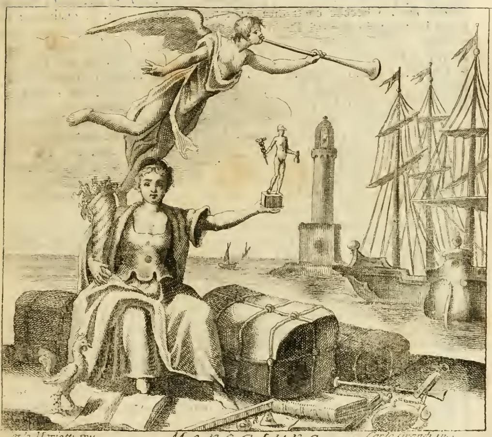

# 귀족과 상업 — 오를란디 「MERCATURA(상업)」 항목의 견해

**질문**: 귀족과 상업의 관계에 대해 이 항목은 어떤 견해를 소개하는가?

> 위 판화는 이 항목의 의인상(항구·배·풍요의 뿔·메르쿠리우스 상·수탉)이다. 이 카드는 도상 해설이 아니라 항목 서두의 **논설 부분**을 다루므로, 판화는 위치 확인용으로만 참고하면 된다.

---

## 1. 이 카드의 핵심 — 왜 "귀족 신분을 훼손하지 않는다"가 논점인가

이 카드는 오늘날의 상식으로 읽으면 왜 이런 이야기를 굳이 하는지 이해되지 않는다. 전제는 이것이다.

**구체제 유럽에는 "귀족이 상업에 종사하면 귀족 신분을 잃는다"는 법제가 실제로 존재했다.** 프랑스어로 **dérogeance(데로장스) / dérogation à la noblesse(귀족 신분 훼손)** 라 불린 제도다. 따라서 "귀족이 상업을 해도 된다"는 말은 도덕적 조언이 아니라 **법적 신분 문제에 대한 판정**이었다.

오를란디는 이 논점을 다음 순서로 처리한다.

1. 상업 자체는 국가에 유익하므로 예로부터 칭송받아 왔다 → 샤스뇌(Chasseneuz)의 권위 인용
2. 반대 견해도 있다(아리스토텔레스, 발두스) → 그러나 다수 견해는 상업을 명예로운 것으로 본다
3. **실증**: 프랑스·브르타뉴·영국·이탈리아 여러 나라의 실제 제도와 관행이 그것을 증명한다 → 체임버스 『백과사전』 인용
4. **단서**: 다만 도매(all'ingrosso)와 소매(a ritaglio)는 구별해야 한다 → 오를란디 자신의 판단

---

## 2. 원문(오를란디)의 서술을 정확히 옮기면

### (1) 상업은 명예롭다 — 권위 논증

- **바르톨로메오 카사네오(Bartolomeo Cassaneo)** = **바르텔레미 드 샤스뇌(Barthélemy de Chasseneuz, 1480–1541)**, 『세계 영광의 목록(*Catalogus Gloriae Mundi*, 1529)』 제11부 고찰 45. 상인들은 "존중받아야 한다(*sunt honorandi*)" — 우리에게 필요한 존재이고, 남는 것을 실어내고 부족한 것을 들여오기 때문이다.
- 반대 진영으로 오를란디가 명시적으로 든 두 권위:
  - **아리스토텔레스 『정치학』** (원문은 "Politic. 7. cap. 4"로 인용). 아리스토텔레스는 시민이 상업·수공업에 종사하는 것을 덕과 여가에 해롭다고 보았다. — **교정 표시**: 이 논지는 현대 판본 기준으로는 『정치학』 1권 9–11장(교환·이재술 비판)과 7권 9장(1328b–1329a, 시민은 장인·상인이어서는 안 된다)에 있다. 오를란디의 "7권 4장" 지시는 판본 차이에 따른 부정확한 인용으로 보인다.
  - **발두스(Baldo degli Ubaldi)**, "l. Nobiliores, C. de commerciis et mercatoribus" 주석. 여기서 가리키는 것은 **유스티니아누스 『칙법전』 4권 63장(De commerciis et mercatoribus)의 법문 "Nobiliores"** 로, "출생이 고귀한 자, 관직으로 빛나는 자, 재산이 넉넉한 자가 도시에 해로운 상업을 영위하는 것을 금한다"는 취지다. **즉 귀족의 상업 금지는 로마법에 근거를 둔 오랜 법리였고, dérogeance 제도의 학문적 뿌리가 바로 이 조문이다.**
- 오를란디의 결론: 그럼에도 "선량한 사상가 다수"는 상업을 명예롭게 보며, 귀족이 상업에 종사해도 **"자기 출생의 광휘에 조금도 훼손을 가하지 않는다(punto non deroghi allo splendore de' suoi Natali)"**. 여기서 이탈리아어 동사 *derogare*가 쓰인 점에 주목 — 프랑스 법률 용어 dérogeance의 직역이다.

### (2) 체임버스 인용 — 카드의 답이 되는 부분

오를란디는 이 부분 전체를 인용부호(,, )로 묶어 **"에프라이모 챔버스(Efraimo Chambers)가 그의 사전에서"** 라고 출처를 밝힌다. **에프라임 체임버스(Ephraim Chambers)의 『Cyclopaedia』(1728)** 의 'Merchant/Commerce' 항목이며, 오를란디는 베네치아에서 나온 이탈리아어 번역판(『Dizionario universale delle arti e delle scienze』, 1748–49)을 썼을 가능성이 크다. 즉 **이 대목은 오를란디의 독창적 주장이 아니라 영국 백과사전의 번역 소개**다.

| 사례 | 원문 서술 |
|---|---|
| **프랑스** | 루이 14세의 두 판결·선언(*due sentenze, o dichiarazioni*), **하나는 1669년, 다른 하나는 1701년** — 귀족에게 **해상과 육상의 교역(traffico e per mare, e per terra)** 을 **귀족 신분을 훼손하지 않고(senza derogare alla loro Nobiltà)** 허용했다. 게다가 상업의 유용성 덕분에, 또 공장·제조소를 세운 공로로 **귀족 작위를 받은 상인들의 예가 빈번하다**. |
| **브르타뉴** | **소매 교역(traffico a minuto)조차 귀족 신분을 훼손하지 않는다.** 그 지방 귀족이 상업에 나서면 자기 귀족 신분을 **"말하자면 잠들게 둔다(lasciano dormire, per dir così, la Nobiltà loro)"**. 즉 **신분을 잃는 것이 아니라**, 상업이 계속되는 동안 귀족의 **특권을 누리는 것만 중단**하고, 교역을 그만두면 **어떤 복권 증서(lettere o istrumenti di riabilitazione)도 없이 특권을 다시 켠다(la riassumono)**. |
| **공화국들** | 상업이 더욱 존중된다. |
| **영국** | 그중에서도 영국이 으뜸 — **귀족(Pari, Peers)의 아들 및 아우 중 젊은 이들이 흔히 상업 교육을 받는다(sono spesso allevati nella Mercatura)**. |
| **이탈리아** | 많은 이탈리아 군주가 자기 나라의 주요 상인이며, **자기 궁전을 창고로 쓰는 것을 조금도 부끄럽게 여기지 않는다**. |
| **아시아·아프리카** | 아시아의 많은 왕, 아프리카·기니 해안의 더 많은 왕들이 유럽인과 교역한다 — 때로는 신하를 통해, 때로는 **몸소**. |

### (3) 오를란디 자신의 단서 — 도매 vs 소매

> "그러나 내 소견으로는(*Per mio avviso però*), 참된 상업을 그것과 얼마간 상관이 있어 남용적으로 상업이라 불리는 자잘한 교역들과 구별해야 한다."

- **도매(Mercatura all'ingrosso)만이 귀족 신분에 저촉되지 않는다.** 이른바 **소매(a ritaglio)** 로 행하는 것은 **그것(귀족 신분)을 온전히 어둡게 만든다(onninamente l'oscura)**.
- 참된 도매 상업이란 ① 먼 나라에서 자국에 없는 물자를 들여오고 남는 것을 남에게 공급하는 일, ② 자국뿐 아니라 외국에도 이익이 되는 제조소(fabbriche di manifatture)를 세우는 일이다. 여기서 이익뿐 아니라 **명성·평판·품위(stima, riputazione, e decoro)** 가 생긴다.
- 결정적 구별은 **"감독하는가(soprastare/soprintendere)"** 대 **"몸소 하는가"** 다. 귀족은 감독·통솔자로서 사업을 **감시·관리**해야 하고, 좋은 거래망과 유능하고 충실한 대리인을 두어 부하가 자기 지시를 집행하게 해야 하지만, **"결코 몸소 사고 팔고 교환해서는 안 된다(non mai ... in persona comprare, vendere, o cambiare)"**.
- **몸소 계약하는 일**, 더욱이 **계산대에 서는 일(lo stare alla banca)** 은 그 자체가 **종속과 예속의 냄새(sente di soggezione, di servitù)** 가 난다. 몸소 계약하는 자는 스스로를 아무 계약자와 동등하게 만든다. 계산대에 서는 일은 "남에게 의존하는 자, 남에게 의존하려고 스스로를 낮추는 자"만이 할 수 있는 일이다.
- 반대로 상당한 액수를 상업 부문에 **투자하는 것**은 **훌륭한 살림(buona Economia)** 의 소산이므로 귀족에게 **칭찬받을 만하고**, 그 때문에 귀족의 품격은 조금도 흔들리지 않는다. (자본은 대되 손은 담그지 말라 — 근대적 '유한책임 투자자로서의 귀족'에 매우 가까운 구도다.)
- 단, 도상 해설로 들어갈 때는 소매 상업까지 포함해 다룬다고 예고한다. 소매는 도매보다 훨씬 못하지만 **"제2등급의 인물에게는 명예롭고 칭찬할 만하다"**. 다만 잡화·자잘한 물건 장사(chincaglierie ed varie minuzie)는 상업이라 부를 것도 못 되며 *merceria*(잡화상) 정도라고 잘라 낸다.

---

## 3. 배경 1 — dérogeance(데로장스) 제도

- **정의**: 프랑스 구체제에서 귀족이 신분에 어울리지 않는다고 규정된 직업에 종사하면 귀족 신분과 그에 딸린 **면세 특권(특히 타이유 면제)** 을 상실하는 법제. 대상 직업의 핵심은 **소매 상업과 수공업**, 그리고 손으로 하는 노동 일반이었다.
- **왜 있었는가**: 귀족의 존재 이유는 **군사적 봉사와 왕에 대한 봉사**라는 관념이 축이다. 여기에 ① 위 로마법 *Nobiliores* 조문(C. 4.63.3), ② 이득 추구를 저열하게 보는 아리스토텔레스적·스콜라적 직업 위계, ③ 실무적으로는 조세 문제(상업으로 부유해진 자가 귀족 면세 특권을 함께 누리면 과세 기반이 붕괴)가 겹쳐 있었다.
- **효과**: 이 제도는 프랑스 귀족의 자본을 상업에서 체계적으로 배제했다. 18세기 중상주의자들이 이를 국가 경쟁력의 결함으로 지적한 것이 뒤의 논쟁으로 이어진다.

## 4. 배경 2 — 루이 14세의 1669년·1701년 칙령

- **1669년(8월, 파리 고등법원 등기 8월 13일)**: **"귀족은 귀족 신분을 훼손하지 않고 해상 교역을 할 수 있다"** 는 칙령. **콜베르(Colbert)** 의 중상주의 정책의 일부다. 같은 해(6월) 북방 무역회사 설립 칙령에서도 회사에 참여하는 귀족이 "귀족 신분을 훼손한 것으로 간주되지 않는다"고 명시했다.
- **1701년(고등법원 등기 12월 30일)**: 범위를 크게 넓혀, **현직 사법관직을 가진 자를 제외한 모든 귀족**이 왕국 내외에서 **자기 계산으로든 위탁으로든 모든 종류의 도매 상업(commerce en gros)** 을 **귀족 신분 훼손 없이** 자유로이 할 수 있다고 선언했다. 즉 **해상 → 육상 도매까지 확장**된 것이다.
- **왜 이 시기였나**: 네덜란드와 영국이 해상·상업 자본으로 국력을 키우는 상황에서, 프랑스는 귀족이 보유한 대규모 자본을 무역·제조업으로 끌어와야 했다. 그런데 dérogeance가 그 자본에 법적 벌칙을 걸고 있었다. 두 칙령은 그 장애를 국가가 스스로 해제한 조치다.
- **주의할 점**: 1701년 칙령이 허용한 것은 **도매까지**였다. **소매와 수공업에는 여전히 dérogeance가 적용**되었다. 이 점이 곧 오를란디의 도매/소매 구별과 정확히 맞물린다 — 오를란디의 구별은 개인적 취향이 아니라 **당대 프랑스 실정법의 경계선을 반영한 것**이다.
- 원문 서술의 정밀도 점검: 오를란디(체임버스)는 두 칙령을 묶어 "해상과 육상"을 허용했다고 요약했는데, 이는 1669년(해상)과 1701년(육상 도매)의 **합산 효과**를 말한 것으로 보면 정확하다. 다만 1701년 조치도 **도매 한정**이라는 제한이 인용문에서는 드러나지 않는다.

## 5. 배경 3 — 브르타뉴의 특례: noblesse dormante(잠자는 귀족)

- 브르타뉴는 왕국 내에서 **거의 유일한 예외 지역**이었다. 1580년의 **『신관습법(Nouvelle Coutume de Bretagne)』** 이 이 법리를 명문화했다.
- 법리의 구조: 귀족이 dérogeance 해당 활동에 종사하는 동안 귀족은 **평민과 같은 조세 부담**을 지지만, **신분 자체를 상실하지는 않는다**. 그 활동을 끝내는 즉시 **자동으로** 특권을 회복한다. 왕의 복권 서장(lettres de réhabilitation)이 필요 없다는 점이 결정적이다.
- 이 상태를 부르는 이름이 **noblesse dormante(잠자는 귀족)** 다. 오를란디의 이탈리아어 *lasciano dormire ... la Nobiltà loro*("자기 귀족 신분을 잠들게 둔다")는 이 프랑스 법률 용어를 그대로 옮긴 표현이다. **정확히 말하면 잠드는 것은 신분이 아니라 특권의 행사**이고, 오를란디의 부연("신분을 잃는 것이 아니라 특권을 누리는 것만 중단한다")도 이 점을 옳게 짚고 있다.
- 브르타뉴가 이랬던 이유: 이 지방은 가난한 소귀족이 압도적으로 많았고(연구에 따라 3분의 2 수준), 생계를 위해 dérogeance 활동을 하지 않을 수 없었다. 신분을 영구 박탈하는 제도는 귀족 신분 자체를 대량 소멸시켰을 것이다. 게다가 항구를 가진 해양 지방이라 상업이 생업과 직결되어 있었다.

## 6. 배경 4 — 영국의 차남들: 제도가 애초에 달랐다

- 영국에는 **dérogeance에 해당하는 법제가 처음부터 없었다.** 이것이 결정적 차이다. 영국 귀족·젠트리가 상업에 참여해도 잃을 신분상 벌칙이 없었으므로, 프랑스처럼 칙령으로 예외를 만들 필요조차 없었다.
- 여기에 **장자상속제(primogeniture)** 가 겹친다. 영국의 귀족 작위(peerage)와 토지는 장남에게 일괄 승계되었고, **차남 이하는 아무것도 받지 못하는 법적 평민**이었다. 그러므로 차남들은 스스로 생계를 마련해야 했고, 관례적 진로는 **상업·성직·법률·군인(그리고 해군)** 이었다.
- 결과적으로 영국에서는 귀족 가문의 아들을 상인 밑에 견습(apprenticeship)으로 보내는 것이 정상적 교육 경로가 되었고 — 오를란디가 옮긴 "귀족의 아들과 아우들이 흔히 상업 교육을 받는다"가 바로 이것이다 — 귀족 계층과 상인 계층이 인적으로 뒤섞였다. 프랑스에서는 dérogeance가 그 혼합을 막았다.
- 즉 이 카드의 세 사례는 **동일한 문제(귀족 자본을 상업에 투입할 수 있는가)에 대한 세 가지 제도적 해법**이다: 프랑스=칙령으로 예외 창설, 브르타뉴=특권만 정지시키는 완충 장치, 영국=문제 자체가 없음.

## 7. 배경 5 — 도매/소매 구별의 출처: 키케로 『의무론』 1.150–151

오를란디의 도매/소매 구별은 **새로 만든 것이 아니라 키케로의 직업 위계를 그대로 계승한 것**이다. 오를란디는 같은 항목 안에서 이 대목을 실제로 인용한다(원문은 "nel primo de Officiis" = 『의무론』 1권, 정확한 지시).

- *Mercatura si tenuis est, sordida putanda est* — "상업이 영세하면 천한 것으로 보아야 한다." 오를란디는 이 구절이 **잡화·자잘한 물건 장사**를 가리킨다고 해석한다.
- *Si magna et copiosa, multa undique apportans multisque sine vanitate impertiens, non est admodum vituperanda* — "크고 풍부하여 여러 곳에서 많은 물건을 실어오고 많은 사람에게 허풍 없이 나누어 준다면, 그리 비난할 것이 아니다." 오를란디는 이것을 **소매 상업(단, 물량이 풍부하고 자본이 큰 소매)** 에 대응시킨다.
- *Atque etiam si satiata quaestu vel contenta potius, ut saepe, ex alto in portum, ex ipso portu se in agros possessionesque contulerit, videtur iure optimo posse laudari* — "이익에 만족한 뒤 바다에서 항구로, 항구에서 다시 토지와 소유지로 물러난다면, 지극히 정당하게 칭찬받을 수 있다." 오를란디는 이것을 **도매 상업**에 대응시킨다.

**다음 카드 예고**: 이 카드 바로 뒤에 오는 항목은 오를란디의 이 **키케로 인용 자체와 3단 대응 도식**을 다룬다. 즉 이 카드가 "도매는 괜찮고 소매는 품위를 해친다"는 **결론**이라면, 다음 카드는 그 **고전적 근거**다. 두 카드를 붙여서 기억하면 좋다.

## 8. 배경 6 — 18세기 '상업 귀족(noblesse commerçante)' 논쟁

오를란디가 이 항목을 쓴 시점(『Iconologia』 제4권, 1764–67년 페루자 간행)은 이 논쟁의 여파 안에 있다.

- **1756년, 아베 코이에(Abbé Gabriel-François Coyer)** 가 『**상업 귀족(La Noblesse commerçante)**』을 출간해, 프랑스 귀족이 상업에 종사해야 하며 dérogeance를 폐지해야 한다고 주장했다. 논거는 영국·네덜란드와의 국력 격차, 가난한 귀족의 구제, 유휴 자본의 동원이었다.
- 같은 해 **슈발리에 다르크(Chevalier d'Arcq)** 가 『**군사 귀족(La Noblesse militaire, ou le Patriote françois)**』으로 반박했다. 귀족의 본질은 무기와 봉사이며, 상업은 귀족의 기질을 부드럽게 만들어 국가의 군사적 근간을 허문다는 것이다.
- 이 논쟁은 수십 편의 팸플릿을 낳았고, 7년 전쟁 시기 프랑스의 자기 진단과 맞물려 크게 확산되었다.
- **오를란디의 위치**: 그는 어느 한쪽 극단에 서지 않는다. 상업 참여는 긍정하되(코이에 쪽), **직접 손을 담그는 것은 배제**하고 자본 투자와 감독으로 한정한다(다르크의 품위 논변을 수용). 즉 **타협적·절충적 입장**이며, 이는 1701년 칙령의 실제 경계선(도매만 허용)과도, 이탈리아 도시국가 귀족의 오랜 현실(궁전을 창고로 쓰는 군주들)과도 잘 맞는다.

---

## 9. 정리 — 한 문장으로

이 항목은 **"상업은 명예로우며 귀족이 종사해도 신분이 훼손되지 않는다"** 는 견해를 프랑스(1669·1701년 칙령), 브르타뉴(특권만 잠드는 noblesse dormante), 영국(차남들의 상업 교육), 이탈리아 군주들의 사례로 뒷받침하되, **오를란디 자신은 도매(all'ingrosso)까지만 귀족에 걸맞다고 선을 긋고, 소매(a ritaglio)와 몸소 계산대에 서는 일은 종속의 냄새가 나므로 품위를 해친다**고 구별한다. 이 구별은 당대 프랑스 실정법의 경계선과 키케로 『의무론』의 직업 위계를 동시에 반영한 것이다.

---

## 참고 자료

- [Édict... portant que les nobles pourront faire le commerce de mer sans déroger à la noblesse. Vérifié en Parlement le 13 aoust 1669 (Gallica)](https://gallica.bnf.fr/ark:/12148/bpt6k97392032.texteImage)
- [Édit du Roy... pourront faire librement toute sorte de commerce en gros... sans déroger à leur noblesse. Registré en Parlement le 30 décembre 1701 (Gallica)](https://gallica.bnf.fr/ark:/12148/btv1b86020821.image)
- [Dérogeance (Wikipedia)](https://en.wikipedia.org/wiki/D%C3%A9rogeance)
- [DÉROGEANCE (Encyclopædia Universalis)](https://www.universalis.fr/encyclopedie/derogeance/)
- [Dérogeance et commerce (Genèses, Cairn.info)](https://www.cairn.info/revue-geneses-2014-2-page-2.htm)
- [Noblesse pauvre — noblesse dormante en Bretagne (Wikipédia)](https://fr.wikipedia.org/wiki/Noblesse_pauvre)
- [Michel Nassiet, *Noblesse et pauvreté. La petite noblesse en Bretagne, XVe–XVIIIe siècles* (PUR)](https://books.openedition.org/pur/129387?lang=en)
- 원본 챕터: `04 Mechanics to the Month in General.md`, 'MERCATURA' 항목(265–281행)
