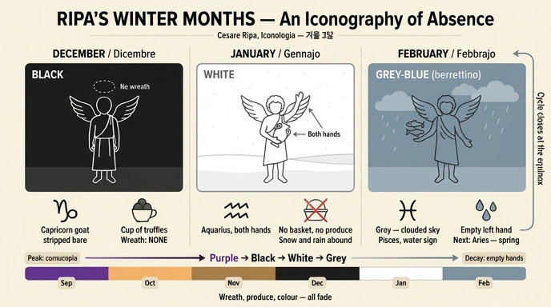

# 겨울 세 달: 12월(Dicembre)·1월(Gennajo)·2월(Febbrajo)의 도상

리파(Cesare Ripa) 『Iconologia』의 「MESI(달들)」 장은 열두 달을 각각 **날개 달린 젊은이(giovane alato)** 로 그리고, ① 옷 색 ② 머리의 화관 ③ 오른손의 황도 12궁 표지 ④ 왼손의 바구니·잔(그 달의 산물)이라는 **네 칸의 고정 서식**으로 채운다. 이 카드는 그 서식이 겨울에 접어들면서 **하나씩 비어 가는** 세 달을 한 세트로 묶어 묻는다.

리파는 12월 항목에서 아예 못을 박아 둔다 — "Giovine di aspetto **orrido**, come anche saranno **gli altri due Mesi seguenti**"(무서운 모습의 젊은이, **뒤따르는 두 달도 마찬가지다**). 즉 12·1·2월은 표정부터 하나의 묶음으로 지정된 삼중주다.

---

## 1. 세 달 비교표

| 항목 | **12월 Dicembre** | **1월 Gennajo** | **2월 Febbrajo** |
|---|---|---|---|
| **옷 색** | 검정 `nero` | 흰색 `bianco` | 회갈색 `berrettino` (흐린 회색빛) |
| **색의 근거** | "땅이 모든 장식을 잃었기 때문" (la terra è spogliata di ogni suo adornamento) | "이 달에는 보통 땅이 눈으로 덮여 들판이 온통 한 색이 되기 때문" (la terra è coperta di neve, le campagne tutte di un colore) | "비가 많아 하늘이 구름에 덮이고, 그 구름이 이 색을 나타내기 때문" (il Cielo è coperto di nuvoli, li quali rappresentano il detto colore) |
| **별자리 표지** | 염소자리 `Capricorno` — 오른손 | 물병자리 `Acquario` — **두 손으로** | 물고기자리 `Pesce` — 오른손 |
| **지물·산물** | 왼손에 **송로버섯(tartufoli) 가득한 잔(tazza)** | **없음** (두 손 모두 별자리에 씀) | **없음** (오른손 별자리뿐) |
| **표정·화관** | 무서운 모습(`orrido`) / **화관 없음(senza ghirlanda)** | `orrido` (12월 항목이 "뒤 두 달도 같다"고 지정) / 화관 지정 없음 | `orrido` / 화관 지정 없음 |
| **공통** | 젊은이 + 날개(alato) — 달들이 끊임없이 달려감을 뜻함 | 같음 | 같음 |

---

## 2. 12월 — 검정과 '화관의 부재'

원문: *"Giovine di aspetto orrido … vestito di nero, ed alato. Colla destra mano terrà il Capricorno e colla sinistra una tazza piena di tartufoli."*

**검정의 논리.** 리파의 색 근거는 언제나 "그 달에 자연이 실제로 띠는 색"이다. 4월은 땅이 초록 옷을 입으므로 초록, 7월은 곡식이 익어 누레지므로 주황(`ranciato`), 10월은 수분이 잎에서 빠져 잎이 그 색이 되므로 살구색(`incarnato`). 12월의 검정도 같은 문법을 따르는데, 다만 **가리킬 색이 남아 있지 않다는 사실 자체가 색이 된다**. "땅이 자기의 모든 장식을 벗겨졌기 때문에(spogliata di ogni suo adornamento)" 검정 — 즉 검정은 어떤 사물의 색이 아니라 **색의 소멸**을 표시하는 기호다.

**화관 없음 — 결여가 의미를 갖는 유일한 자리.** 이어지는 문장이 결정적이다: *"che perciò ancora si rappresenta **senza ghirlanda**"*(그래서 화관도 없이 나타낸다). 리파의 열두 달 체계에서 머리는 언제나 채워져 있다.

- 3월: 투구(elmo, 마르스에게 바쳐진 달)
- 4월: 도금양(mortella, 베누스의 나무) 화관
- 5월: 갖가지 꽃 화관
- 6월: 아직 안 익은 밀 이삭 화관
- 7월: 밀 이삭 관
- 8월: 다마스쿠스 장미·자스민·인도 카네이션 화관
- 9월: 기장(miglio)과 조(panico) 화관
- 10월: 도토리 달린 떡갈나무 가지 화관
- 11월: 열매 달린 올리브 화관
- **12월: 없음**
- 1월·2월: 지정 없음(12월의 부재를 이어받음)

머리를 장식할 식물이 땅에 없으므로 화관도 없다 — **부재(不在)가 곧 도상**이다. 리파는 보통 "무엇을 들었다"로 뜻을 만드는데, 여기서는 예외적으로 "무엇이 없다"로 뜻을 만든다. 도상학적으로 이것은 알레고리가 결여를 직접 그리는 드문 사례이고, 이 카드가 12월에서 반드시 짚어야 하는 지점이다.

**무서운 표정(orrido).** 리파는 표정도 계절의 성격에 맞춘다. 3월은 `fiero`(마르스의 달이므로 사나움), 8월은 `fiero`(개의 별 시리우스가 미친개처럼 사람을 해치므로), 9월은 `allegro, ridente`(수확의 절정이므로 즐겁고 웃음), 그리고 겨울 3달은 `orrido`. 즉 표정 축에서도 9월의 웃음 → 12·1·2월의 공포로 낙하한다.

**염소자리와 송로버섯.** 두 지물의 *해석*(염소가 절벽·최고봉에서 풀을 뜯는 습성 ↔ 태양의 남중 최저·최남단, 송로버섯이 12월에 가장 많고 완전하다는 점)은 별도 카드가 다룬다. 이 카드에서는 **외형 식별**만 기억하면 된다 — 오른손에 염소자리, 왼손에 송로버섯 잔.

---

## 3. 1월 — 흰 옷, 그리고 '두 손으로' 드는 이유

원문: *"Giovane alato, e vestito di bianco, il quale terrà **con ambe le mani** il Segno di Acquario."*

**흰 옷.** 눈 덮인 대지. 리파의 표현이 정확하다 — 들판이 "온통 한 색(tutte di un colore)"이 된다. 즉 흰색은 밝음이나 순결이 아니라 **차이의 소멸**, 지형과 작물의 구별이 사라진 균질한 백색이다. 12월의 검정이 '색의 소멸'이라면 1월의 흰색은 '형태의 소멸'로, 둘은 반대 극의 색이면서 같은 결여를 말한다.

**왜 두 손인가.** 리파의 서식은 원래 **오른손 = 별자리, 왼손 = 그 달의 산물**로 두 손이 분업한다. 1월은 열두 달 중 유일하게 이 분업이 깨져 별자리 하나를 두 손으로 받든다. 문헌은 이유를 설명하지 않지만 도상 논리는 명백하다 — **왼손에 담을 것이 없다.** 눈 밑의 땅은 아무것도 내지 않으므로 바구니도 잔도 성립하지 않고, 빈손을 늘어뜨려 어색하게 두는 대신 두 손을 모아 유일하게 남은 표지, 즉 하늘의 별자리를 받들게 한 것이다. 12월의 '화관 없음'이 머리에서의 결여였다면, 1월의 '두 손'은 **손에서의 결여를 구도로 흡수한 처리**다. 12월까지는 송로버섯이라도 잔에 담을 수 있었으나(땅속에서 캐는 것이니 지상의 헐벗음과 무관하다는 점이 절묘하다), 1월에는 그것조차 없다.

**물병자리와 우수(雨水).** 근거는 기상학적이다 — *"perché abbondano le nevi, e piogge in questo tempo"*(이 시기에 눈과 비가 넘치기 때문). 물병자리는 물을 쏟는 인물 형상이라 고대부터 강우기와 결부되었고, 동아시아 절기 이름 **우수(雨水)** 가 태양이 물병자리 구간을 지나는 2월 중순 무렵에 놓이는 것도 같은 관측 전통의 결과다. 리파는 별자리 이름의 어원(Aqua-)과 실제 강수량을 그대로 겹쳐 놓는다.

**로마 달력 각주.** 1·2월은 로물루스의 10개월 달력에 없었고 누마 폼필리우스가 추가했으며, 1월은 두 얼굴의 야누스(Janus)에서 이름을 얻어 한 얼굴로 지난해를, 다른 얼굴로 올 해의 시작을 본다 — 이 대목은 **별도 카드**가 다루므로 여기서는 "겨울 두 달은 달력상 나중에 끼워 넣어진, 체계의 끝자리"라는 사실만 기억하고 넘어가면 된다.

---

## 4. 2월 — 회갈색과 닫히는 원

원문: *"Giovane, il quale abbia le ali, e sarà vestito di colore **berrettino**, portando con bella grazia colla destra mano il segno del Pesce."*

**berrettino.** 챙 없는 모자(berretta)를 짓는 천의 색에서 온 이름으로, **흐린 회색빛(회청색·재색)** 을 뜻한다. 근거는 다시 기상: 2월엔 비가 많아 하늘이 구름에 덮이고, **그 구름의 색이 곧 옷의 색**이다. 12월의 검정이 '땅'에서, 1월의 흰색이 '눈 덮인 땅'에서 왔다면, 2월의 회색은 마침내 **하늘**에서 온다. 시선이 땅에서 하늘로 옮겨가는 순간이 봄으로의 전환점이기도 하다.

**물고기자리.** *"siccome il Pesce è acquatile, così questo tempo per le molte piogge è assai umido"* — 물고기는 물에 사는 것이니 이 시기 역시 비로 몹시 습하다. 리파는 두 번째 이유도 덧붙인다: *"ovvero perché essendosi risolute le acque, è tempo di pescagione"* — 얼음이 풀려 물이 열렸으므로 **낚시의 계절**. 즉 물고기자리는 습기(정적 상태)와 해빙(변화의 조짐)을 동시에 지시한다.

**한 바퀴가 닫힌다.** 2월 하순 태양이 물고기자리를 벗어나면 곧 **양자리(Ariete)**, 즉 춘분이다. 리파의 「MESI」는 3월(양자리)에서 시작해 2월(물고기자리)로 끝나므로 — 로마 달력의 옛 순서가 그대로 남은 배열 — 열두 도상은 **닫힌 원**을 이룬다. 2월의 물고기자리 다음 칸은 다시 첫 항목 3월의 "아몬드 꽃으로 장식된 양자리"이며, 3월 옷 색은 검정 쪽으로 기운 `tanè`(검정 2 + 붉음 1)로 **12월의 검정에서 붉은 생기가 되돌아오기 시작한 색**이다. 결여의 곡선이 여기서 반전한다.

---

## 5. 관통하는 구조 — '결여의 도상학'과 감쇠 곡선

### 5-1. 리파 열두 달 스펙트럼표

| 달 | 별자리 | 옷 색 | 머리 | 그릇/지물 | 산물 |
|---|---|---|---|---|---|
| 3월 | 양자리 | tanè(검정2+붉음1) | **투구** | 잔 | 자두싹·아스파라거스·홉 |
| 4월 | 황소자리 | 초록 | 도금양 화관 | 바구니 | 아티초크·아몬드 |
| 5월 | 쌍둥이자리 | 꽃수 놓은 초록 | 꽃 화관 | 바구니 | 체리·완두·산딸기 |
| 6월 | 게자리 | 연초록/황록 | 풋밀 이삭 | 바구니/잔 | 살구·배·오이 |
| 7월 | 사자자리 | 주황 `ranciato` | 밀 이삭 관 | 바구니 | 멜론·무화과 |
| 8월 | 처녀자리 | 불꽃색 `fiammeggiante` | 장미·자스민 화관 | 바구니 | 배·자두·호두 |
| **9월** | 천칭자리 | **자주 `porpora`** | 기장·조 화관 | **풍요의 뿔** | 흰·검은 포도, 석류 … |
| 10월 | 전갈자리 | 살구색 `incarnato` | 떡갈나무+도토리 | 바구니 | 마가목·모과·버섯·밤 |
| 11월 | 궁수자리 | 마르는 낙엽색 | 올리브+열매 | 잔 | 순무·뿌리채소·양배추 |
| **12월** | 염소자리 | **검정 `nero`** | **없음** | 잔 | 송로버섯 |
| **1월** | 물병자리 | **흰색 `bianco`** | 없음 | **없음(두 손)** | **없음** |
| **2월** | 물고기자리 | **회갈색 `berrettino`** | 없음 | **없음** | **없음** |

### 5-2. 감쇠 곡선

**9월이 정점이다.** 자주(porpora)는 왕의 옷 색이므로, 리파는 9월을 "모든 달의 왕이요 군주(come Re, e Principe di tutti gli altri mesi)"라 부르고 유일하게 **풍요의 뿔(cornucopia)** 을 들려 준다. 표정도 `allegro, ridente`. 여기서부터 세 축이 동시에 내려간다.

```
[색]     자주 → 살구색 → 낙엽색 → 검정 → 흰색 → 회색
[그릇]   풍요의 뿔 → 바구니 → 잔 → 잔 → (없음) → (없음)
[머리]   화관 → 화관 → 화관 → (없음) → (없음) → (없음)
          9월    10월    11월   12월    1월     2월
```

- **그릇의 축소**: 넘쳐흐르는 뿔 → 바구니 → 작은 잔 → 아무것도 없음.
- **화관의 소실**: 11월까지는 올리브 열매라도 있어 화관이 성립하지만 12월에 끊긴다.
- **색의 탈색**: 유채색(자주·살구·낙색)이 무채색(검정 → 흰색 → 회색)으로 넘어간다. 검정과 흰색은 정반대 극이지만 **둘 다 색이 아니고**, 회색은 그 둘의 중간이다. 12월의 캄캄함에서 1월의 눈부신 백색으로 튀었다가 2월에 회색으로 수렴하는 이 진행은 무채색 안에서만 벌어지는 운동이며, 3월의 `tanè`에서 붉은 성분이 되살아나야 비로소 색이 돌아온다.

**따라서 리파의 겨울 3달은 '무엇을 갖고 있는가'가 아니라 '무엇을 잃었는가'로 읽어야 한다.** 12월은 화관을 잃고, 1월은 산물(과 왼손의 기능)을 잃고, 2월은 색을 잃는다. 남는 것은 하늘의 별자리 하나뿐 — 땅이 아무것도 내지 않는 계절에 정체성을 담보하는 것은 오직 태양의 위치라는 뜻이기도 하다.

### 5-3. 나란히 놓인 두 물의 궁

물병자리(1월)와 물고기자리(2월)는 점성술 전통의 **물의 궁(water sign)** 이며, 연속한 두 달이 모두 물의 궁이라는 사실이 리파에게는 그대로 논거가 된다 — 1월은 "눈과 비가 넘치므로", 2월은 "물고기는 물의 것이니 습하고, 물이 풀려 낚시의 때". 두 달의 설명이 사실상 같은 말(습기·강수)의 변주이고, 물의 궁 셋 가운데 게자리(6월)만 여름 쪽에 떨어져 있어 **겨울 끝의 습기 구간**이 별자리 배열 자체로 표시된다.

### 5-4. 방법상의 차이 — 유사논법에서 기상 관찰로

봄·여름·가을 달에서 리파의 논증은 대개 **짐승의 기질에 빗대는 유사논법**이다.

- 양자리: 양은 뒤가 약하고 앞에 힘이 있듯, 태양도 이 궁 초입엔 추위로 힘이 약하고 뒤로 갈수록 강해진다.
- 황소자리: 황소가 양보다 강하듯 태양의 힘이 커진다.
- 게자리: 게가 뒤로 걷듯 태양이 (하지 이후) 되돌아 물러난다.
- 사자자리: 사자는 본성이 뜨겁고 흉포하니 극심한 더위와 가뭄.
- 처녀자리: 처녀가 불임이듯 태양이 새로 낳지는 않고 이미 난 것을 익힌다.
- 전갈자리: 전갈의 독침이 곧 죽음이듯, 이 달의 불균한 기온이 위험한 병을 낳는다.
- 궁수자리: 하늘이 우박·비·번개를 **쏘아 대고**, 사냥꾼(궁수)의 계절이다.

그런데 겨울 3달에 오면 이 비유의 회로가 거의 멈춘다. **1월과 2월의 색 설명에는 짐승이 등장하지 않고, 눈·구름·비라는 기상 현상이 곧바로 근거가 된다.** 물병자리는 "이름이 물이고 실제로 비가 많다"로, 물고기자리는 "물고기는 물에 살고 실제로 습하다"로 처리되어 유사논법이라기보다 **동어 반복에 가까운 직결**이다. 12월의 염소자리 하나만 예외적으로 비유(절벽을 오르는 염소 ↔ 태양의 남중 극단)를 쓴다. 겨울에는 관찰할 생물학적 활동이 없고 남는 것이 날씨뿐이라는 사정이, 리파의 논증 방식 자체를 바꿔 놓은 것이다.

---

## 6. 암기 정리

| | 12월 | 1월 | 2월 |
|---|---|---|---|
| 색 한 단어 | **검정** = 벗겨진 땅 | **흰색** = 눈 덮인 땅 | **회색** = 구름 낀 하늘 |
| 손 | 오른손 염소자리 / 왼손 송로버섯 잔 | **두 손** 물병자리 | 오른손 물고기자리 |
| 잃은 것 | 화관 | 산물(왼손) | 색 |

- 세 달 모두 **무서운 모습(orrido)** — 12월 항목에 "뒤따르는 두 달도 그러하다"고 명시.
- 세 달 모두 날개 달린 젊은이.
- 시선의 이동: **땅(12월) → 눈 덮인 땅(1월) → 하늘(2월)**.
- 2월 물고기자리 다음은 양자리 = 춘분 → 열두 도상이 원으로 닫힌다.

> 원문 대조용 OCR 주의: 이 판본은 긴 s(ſ)가 f로 깨져 있다. `moftra`=mostra, `quefto`=questo, `Mefe`=mese, `vefte/veftito`=veste/vestito, `finiftra`=sinistra, `fegno`=segno, `fpogliata`=spogliata로 읽는다. 또 `tartufoli`(12월 항목)와 `tartuffi`(해설부)는 같은 송로버섯을 가리키는 표기 변이다.

## 인포그래픽


