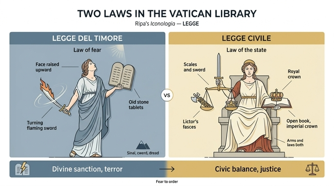

# 바티칸 도서관의 '두려움의 법(Legge del Timore)'과 '시민법(Legge Civile)'의 도상은?

## 인포그래픽

두 법 의인상을 좌우로 대비시킨 그림이다. 왼쪽 '두려움의 법'은 신적 제재와 공포(치켜든 얼굴, 옛 율법 판, 회전하는 칼), 오른쪽 '시민법'은 시민적 균형과 정의(저울과 칼, 파스케스 대 왕관, 펼친 책)를 나타낸다.

