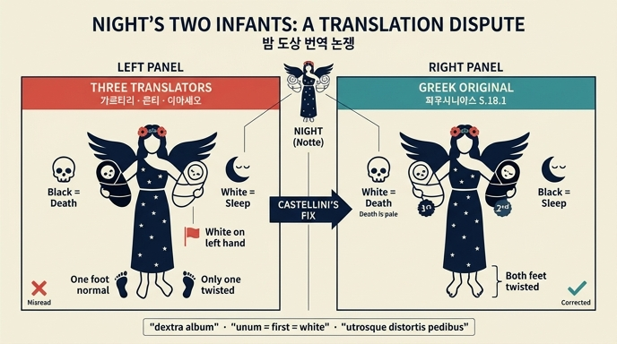

# 카스텔리니가 지적한 「밤(Notte)」 도상 번역의 오류

## 0. 한눈에 보기

리파 『이코놀로지아』의 「밤」 항목에는 **양팔에 두 아기를 안은 여인**이 등장한다. 이 도상의 원전은 파우사니아스가 올림피아에서 본 **키프셀로스의 궤(Arca di Cipselo)** 부조다. 그런데 "흰 아기와 검은 아기 중 어느 쪽이 죽음이고 어느 쪽이 잠인가", "발이 뒤틀린 것은 한 아기인가 둘 다인가"를 두고 16세기 신화 편람 저자들의 서술이 엇갈렸다. 리파의 증보 필자 **조반니 차라티노 카스텔리니(Giovanni Zaratino Castellini)** 가 이 불일치를 정면으로 문제 삼고, 그리스 원문으로 돌아가 교정본을 제시한 것이 이 카드의 내용이다.

출처 텍스트의 시작 문장이 이 논쟁을 그대로 선언한다.

> *I due fanciulli tenuti in braccio dalla Notte hanno fatto variare tre Uomini eruditissimi.*
> (밤이 팔에 안은 두 아기가 지극히 박학한 세 사람의 말을 서로 다르게 만들었다.)
> — 「Nobility to Obligation」 273행

---

## 1. 문제의 출처: 파우사니아스 5.18.1 (키프셀로스의 궤)

### 1-1. 그리스 원문

페르세우스 디지털 도서관의 그리스어 교정본(`tlg0525.tlg001.perseus-grc2`) 본문은 다음과 같다.

> πεποίηται δὲ **γυνὴ παῖδα λευκὸν καθεύδοντα ἀνέχουσα τῇ δεξιᾷ χειρί**, **τῇ δὲ ἑτέρᾳ μέλανα ἔχει παῖδα καθεύδοντι ἐοικότα**, **ἀμφοτέρους διεστραμμένους τοὺς πόδας**. δηλοῖ μὲν δὴ καὶ τὰ ἐπιγράμματα, συνεῖναι δὲ καὶ ἄνευ τῶν ἐπιγραμμάτων ἔστι **Θάνατόν τε εἶναι σφᾶς καὶ Ὕπνον** καὶ ἀμφοτέροις **Νύκτα** αὐτοῖς **τροφόν**.

표준 영역(Loeb, W. H. S. Jones)은 이를 "a woman holding on her right arm a white child asleep, and on her left … a black child like one who is asleep, both with feet turned different ways … the figures are Death and Sleep, with Night the nurse of both"로 옮긴다.

### 1-2. 구문상의 쟁점 두 가지

**(가) 좌우 배치 — 이건 원문이 명확하다.**
`παῖδα λευκὸν … τῇ δεξιᾷ χειρί` = **흰 아기는 오른손**. `τῇ δὲ ἑτέρᾳ … μέλανα παῖδα` = **검은 아기는 다른 쪽(왼손)**. 그리스어에 모호함이 없다. 따라서 흰 아기를 왼손에 놓는 번역은 단순 오역이다.

**(나) 발이 뒤틀렸다는 표현이 누구에게 걸리는가.**
`ἀμφοτέρους διεστραμμένους τοὺς πόδας`에서 `ἀμφοτέρους`는 **남성 대격 복수**로 두 아기(`παῖδας`)를 받는다. `τοὺς πόδας`는 그 자체로 복수(발 둘)이지만, 이를 한정하는 `ἀμφοτέρους`가 별도로 놓여 있으므로 "**두 아기 모두** 발이 뒤틀려 있다"가 자연스러운 독법이다. 즉 뒤틀린 발은 한 아기의 전유물이 아니다. 카스텔리니가 요구한 라틴어 `utrosque distortis pedibus`(둘 모두 발이 뒤틀린)가 여기에 대응한다.

**(다) '첫째'는 무엇에 근거하는가 — 여기서는 신중해야 한다.**
그리스 원문에는 `πρότερος`(첫째/앞의) 같은 서수·비교급 표현이 **없다**. 카스텔리니가 인용한 교정 라틴역이 `eorum puerum **unum** Mortem esse, **alterum** Somnum`(그 아기들 중 **하나**는 죽음, **다른 하나**는 잠)로 옮겼고, 카스텔리니는 이 `unum`을 "이 대목에서 **먼저 언급된** 아기, 곧 흰 아기"로 읽어야 한다고 못 박는다.

> *Vnum, vuol dire il primo in questo luogo, cioè il primo fanciullo nominato, che è il bianco, per la morte pallida, bianca…*
> (「Unum」은 이 자리에서 '첫째'를 뜻하니, 곧 먼저 이름 불린 아기 — 흰 아기 — 이며, 창백하고 흰 죽음에 해당한다.)

논리는 이렇다. 원문은 아기를 **흰 것 → 검은 것** 순서로 소개하고, 곧이어 정체를 **Θάνατον(죽음) → Ὕπνον(잠)** 순서로 밝힌다. 두 열거의 순서가 대응한다고 보면 **흰 = 죽음, 검은 = 잠**이 된다. 이것이 카스텔리니(및 그가 의뢰한 라틴역)의 주장이다.

> **주의**: 이는 **어순 대응(word-order correspondence)에 근거한 해석**이며, 원문이 명시적으로 못 박은 사실이 아니다. 원문 자체가 반대 방향의 실마리도 품고 있다. 흰 아기는 `καθεύδοντα`(**실제로 자고 있는**), 검은 아기는 `καθεύδοντι ἐοικότα`(**자는 자와 닮은**)로 비대칭 서술된다. "잠든 것처럼 보이는 쪽"을 죽음으로 읽으면 검은 = 죽음이 되어 카스텔리니와 정반대 결론이 나온다. 후대 미술의 관례(죽음=어두움, 잠=밝음)도 이쪽에 가깝고, 현대 연구자들은 파우사니아스의 색 배정 자체가 후대 도상 관례와 어긋난다는 점을 지적해 왔다. 요약하면 **좌우 배치와 '둘 다 뒤틀린 발'은 원문으로 확정되지만, 색↔정체 대응은 여전히 논쟁적**이다.

### 1-3. 카스텔리니가 제시한 교정 라틴역

카스텔리니는 그리스어를 직접 다루지 않고, "우리 시대의 뛰어난 문인 **I. P.**"에게 자기가 청하여(`a mia requisizione`) 그리스어 본문을 정밀 검토(`sottilmente da lui esaminato`)하게 한 뒤 그 결과를 실었다.

> *Feminam efficta est puerum album dormientem sustinens **in manu dextra**, in altera nigrum habet puerum, **utrosque distortis pedibus**; indicant inscriptiones, quod facile tamen, ut nihil scriptum sit, coniicere possis, eorum puerum **unum Mortem** esse, **alterum Somnum**, & utrisque Noctem ipsis nutricem.*

즉 교정의 세 축은 (1) 흰 아기 = **오른손**, (2) **둘 다** 발이 뒤틀림, (3) 먼저 언급된 흰 아기 = **죽음**이다.

---

## 2. 세 판독의 대조

| | 저자·저작 | 흰 아기 | 검은 아기 | 좌우 배치 | 뒤틀린 발 |
|---|---|---|---|---|---|
| 1 | **빈첸초 카르타리**, 『Imagini de i Dei』 | 잠 | **죽음** | 흰 아기를 **왼손**에 (`mette il bianco nella sinistra`) | — |
| 2 | **나탈레 콘티**, 『Mythologiae』 | 잠 | **죽음** | (동일 오류에 가담: `concorre nell'istesso errore`) | — |
| 3 | **로무올로 아마세오**, 파우사니아스 라틴역 | — | — | `laeva album` → 카스텔리니: `dextra album`이어야 함 | `distortis utrinque pedibus` → **검은 아기 하나만** 뒤틀림 |
| ✔ | **카스텔리니(+I. P.)의 교정** | **죽음** (= `unum`, 먼저 언급된 쪽) | **잠** (= `alterum`) | 흰 = **오른손**, 검은 = **왼손** | `utrosque distortis pedibus` — **둘 다** |

### 아마세오의 오역이 왜 오역인가

라틴어 두 표현의 차이가 핵심이다.

- `distortis **utrinque** pedibus` — `utrinque`는 부사 "양쪽에서". **한 아기의 두 발**이 양쪽으로 뒤틀렸다는 뜻이 되어, 문장 구조상 바로 앞의 검은 아기에게만 붙는다.
- `**utrosque** distortis pedibus` — `utrosque`는 형용사 대격 복수로 **두 아기 모두**를 받는다. 그리스어 `ἀμφοτέρους`의 정확한 대응어.

카스텔리니의 지적을 원문 그대로 옮기면:

> *Di più Romolo Amaseo traduce in maniera, che il nero solo abbia i piedi storti: "distortis utrinque pedibus", dice egli, che "utrosque distortis pedibus" dir doveva.*

### 리파 본인의 서술도 교정 대상이었다

주목할 점은, 「밤」 항목의 리파 본문 자체가 이미 흔들린다는 것이다.

> *Nel braccio destro terrà un fanciullo bianco, e nel sinistro un altro fanciullo nero, **ed avrà i piedi storti**, e ambedue i detti fanciulli dormiranno.*
> (오른팔에 흰 아기, 왼팔에 검은 아기를 안고, **발이 뒤틀려 있으며**, 두 아기는 모두 자고 있다.)

좌우 배치는 원문대로 맞지만 "발이 뒤틀려 있다"가 어느 아기에 걸리는지 모호하다. 이어지는 해설은 더 분명하다.

> *[il sonno] è notato più particolarmente nel fanciullo tenuto dalla sinistra mano dormendo, come **l'altro mal fatto e distorto è posto per la morte**.*
> (잠은 왼손에 안겨 자는 아기로 표시되고, **몸이 상하고 뒤틀린 다른 아기가 죽음으로 놓인다**.)

여기서 리파는 **잠 = 왼손/검은, 죽음 = 오른손/흰**으로 카스텔리니와 같은 결론에 서 있지만, "뒤틀림"을 죽음 쪽에만 귀속시킨다. 카스텔리니의 교정은 카르타리·콘티·아마세오뿐 아니라 **리파 자신의 이 단서까지** 함께 바로잡는 셈이다.

---

## 3. 카스텔리니의 논거: 죽음은 창백하고 희다

색↔정체 대응을 흰=죽음으로 밀어붙이기 위해 카스텔리니는 고전 전거를 줄줄이 동원한다. 요지는 **시인들에게 `albus`(흰)와 `pallor`(창백)는 같은 것으로 통했다**는 것이다(`attesocché il colore albo, e il pallore, appresso i Poeti, si ha per il medesimo`).

| 전거 | 인용 | 논점 |
|---|---|---|
| 호라티우스, 『에포디』 | *Ora pallor albus inficit* | 공포·양심·분노가 얼굴을 **흰 창백함**으로 물들인다 — `albus` = `pallor` |
| 호라티우스 | **pallida Mors** | 죽음 자체가 "창백한"으로 불린다 |
| 베르길리우스, 『아이네이스』 4권 | *Animas ille evocat Orco pallentes* | 저승의 영혼들이 **창백하게** 그려진다 |
| 스타티우스, 『실바이』 4권 | *…longeque decus virtutis, & **alba Atropos**…* | 운명의 여신 아트로포스(생명의 실을 끊는 자) = **흰** |

보강 논거: 죽은 자는 피가 빠져 희어진다(`restando i morti senza sangue`).

### 뒤틀린 발도 각각 이유가 있다

- **죽음(흰)의 뒤틀린 발** — 죽음은 빨라 보이지만 실은 절뚝이며 느린 걸음으로 온다. 태어난 그날부터 뒤에서 천천히 따라온다. 세네카: *Non repente in mortem incidimus, sed minutatim procedimus; quotidie morimur, quotidie enim dimittitur aliqua pars vitae.* 또 죽음은 산 자의 계획과 생각을 **절단낸다**(`stroppia`). 비문 인용 *Felices annos tot tulit hora brevis*(짧은 한 시간이 그 많은 행복한 해를 가져가 버렸다)가 이를 받는다.
- **잠(검은)의 뒤틀린 발** — 잠은 **운동의 결여**이고, 운동과 삶의 지탱은 발에 기초한다. 또 잠은 우리가 사는 삶의 절반을 끊어 절게 만들며, 잘 때 감각은 마비되고 지성의 작동은 절뚝인다. 색이 검은 이유는 잠 속에서 정신이 어둠에 매장되기 때문. 스타티우스: *arma silent, erratque **niger** per nubila Somnus.*

### 곁가지: 밤은 어머니인가 유모인가

파우사니아스(엘리스 지방 도상)에서 밤은 둘의 **유모(τροφός, nutrice)** 이지만, 헤시오도스 『신통기』에서는 잠과 죽음의 **어머니**다(*Nox peperit … et mortem; peperit etiam somnum*). 카스텔리니는 두 계보를 나란히 두고, 밤이 잠을 **낳기만 하는 게 아니라 밤의 어둠 속에서 기르기도 하므로** 엘리스인들이 유모로 삼은 것이라 정리한다(밤의 습기가 위의 증기를 늘려 잠을 만든다는 자연학적 설명까지 덧붙인다). 잠과 죽음이 **형제**라는 점은 호메로스 『일리아스』 14권(헤라가 렘노스에서 "죽음의 형제인 잠"을 만난다)과 오르페우스 찬가(*Frater enim genitus es oblivionis, mortisque*)로 뒷받침되며, 오비디우스 *Stulte, quid est somnus, gelidae nisi mortis imago?* 와 카툴루스 *Nox est perpetua una dormienda*가 잠↔죽음 유사성을 봉인한다.

---

## 4. 왜 이 논쟁이 중요한가

이 다툼은 각주 수준의 문헌학 트집이 아니다. **판화가와 화가가 어느 판독을 집어 드는지에 따라 실제 작품의 도상이 갈린다.**

1. **화가는 원전을 읽지 않고 편람을 읽는다.** 16~17세기 작업장에서 「밤」을 그려야 하는 화가는 파우사니아스의 그리스어 본문이 아니라 카르타리 『Imagini』나 리파 『이코놀로지아』를 펼친다. 따라서 편람 단계에서 좌우가 뒤집히면 **그림에서도 그대로 뒤집힌다**.
2. **결정해야 하는 항목이 구체적이다.** 화가는 (a) 어느 팔에 어느 색 아기를 놓을지, (b) 어느 아기에게 죽음의 표지(창백·무기력)를 줄지, (c) 발을 뒤틀 아기가 하나인지 둘인지를 붓을 대기 전에 골라야 한다. 아마세오를 따르면 **한 아기만** 기형이 되고, 카스텔리니를 따르면 **두 아기 모두** 기형이 된다 — 완전히 다른 화면이다.
3. **의미가 뒤집힌다.** 흰 = 죽음이면 "창백한 죽음(pallida Mors)"이라는 고전적 은유가 화면에서 작동하고, 흰 = 잠이면 "밝음·평온으로서의 잠 / 어둠으로서의 죽음"이라는 정반대 알레고리가 작동한다. 관람자가 그림에서 읽어내는 도덕적 함의 자체가 달라진다.
4. **오른쪽/왼쪽에는 위계가 있다.** 르네상스 도상학에서 오른쪽(dextra)은 우위·명예의 자리다. 죽음을 오른팔에 두는 배치와 잠을 오른팔에 두는 배치는 같은 알레고리가 아니다.
5. **그래서 카스텔리니의 절차가 교훈이다.** 그는 권위 있는 근대 편람 셋이 일치하지 않을 때 **번역본 사이에서 다수결을 취하지 않고, 그리스어 원문으로 되돌아가 검증**했다(직접 못 하니 그리스어 전문가에게 의뢰했다). 이것이 도상 편람이 "권위의 사슬"에서 "원전 검증"으로 옮겨 가는 순간이다.

> 다만 4-3의 방향성 자체는 아직 열려 있다. 카스텔리니는 어순 대응과 `pallida Mors` 전거로 흰=죽음을 확정했다고 보았지만, 원문의 `καθεύδοντι ἐοικότα` 비대칭과 후대 미술 관례는 반대 배정을 지지할 여지를 남긴다. **확정적으로 정리된 것은 "흰 아기는 오른손"과 "두 아기 모두 발이 뒤틀림"의 두 항목**이다.

---

## 5. 시험 대비 핵 요약

- **누가**: 조반니 차라티노 카스텔리니 (리파 『이코놀로지아』 증보 필자)
- **무엇을**: 파우사니아스 5.18.1 「키프셀로스의 궤」 밤의 두 아기 도상 번역
- **틀린 사람 셋**: 카르타리·콘티(검은 = 죽음), 아마세오(흰 아기를 왼손 `laeva album`, 검은 아기만 뒤틀린 발 `distortis utrinque pedibus`)
- **교정 셋**: 흰 = **오른손**(`τῇ δεξιᾷ χειρί` / `dextra album`), 흰 = **죽음**(먼저 언급된 `unum`, 죽음은 창백·흼: `pallida Mors`, `alba Atropos`), 발은 **둘 다** 뒤틀림(`ἀμφοτέρους` / `utrosque`)
- **키워드 암기**: `dextra album` · `unum = 첫째 = 흰 = 죽음` · `utrosque distortis pedibus`

## 인포그래픽

