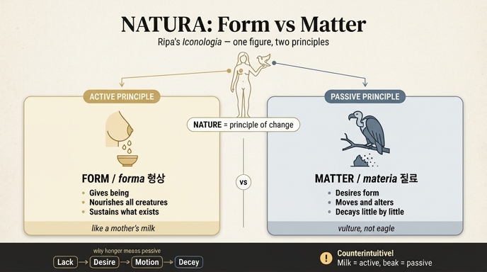

# 자연(Natura) 도상: 젖가슴 = 형상(forma), 맹금 = 질료(materia)

## 1. 카드 한 줄 정리

리파의 「자연」 도상은 **아리스토텔레스의 형상/질료 이원론을 인체 + 새 한 마리로 압축한 그림**이다.

| 그림 요소 | 대응 원리 | 근거가 되는 작용 |
|---|---|---|
| 젖이 가득 찬 가슴 (mammelle cariche di latte) | **능동 원리 = 형상 (forma)** | 젖으로 아이를 기르듯, 형상이 모든 피조물을 **기르고 지탱한다** |
| 먹이에 탐욕스러운 맹금 (Avoltojo) | **수동 원리 = 질료 (materia)** | 형상을 **욕구**하기에 움직이고 변질되며, 썩는 것들을 **조금씩 부수어 간다** |

## 2. 원전 확인

자료: `09 Music to Nymphs.md` (자산 폴더), NATURA 항목 (79–89행).

> **D**onna ignuda, colle mammelle cariche di latte, e con un Avoltojo in mano, come si vede in una medaglia di Adriano Imperadore; essendo la Natura, come definisce Aristotele nel 2. della Fisica, principio in quella cosa, ove ella si ritrova del moto, e della mutazione, per la quale si genera ogni cosa corruttibile.
>
> Si farà Donna, e ignuda, e dividendosi questo principio in **attivo**, e **passivo**; l'attivo dimandarono con il nome di **forma**, e con nome di **materia** il passivo.
>
> L'attivo si nota con le mammelle piene di latte, perché la forma è quella che **nutrisce, e sostenta** tutte le cose create, come colle mammelle la donna nutrisce, e sostenta li fanciulli.
>
> L'Avoltojo, uccello **avidissimo di preda**, dimostra particolarmente l'altro principio dimandato materia, la quale **per l'appetito della forma** movendosi, e alterandosi, **strugge appoco appoco** tutte le cose corruttibili.

문장 구조 자체가 카드의 답이다. "젖 → nutrisce e sostenta(기르고 지탱)", "맹금 → per l'appetito della forma ... strugge appoco appoco(형상을 향한 욕구로 조금씩 부순다)".

리파는 이 도상이 자기 발명이 아니라 **하드리아누스 황제의 메달(medaglia di Adriano)**에서 보이는 형태라고 출처를 밝힌다. 즉 고대 화폐/메달 도상 + 아리스토텔레스 자연학 주석이 결합된 이미지다.

## 3. 판화에서 실제로 보이는 것


- **벌거벗은 여인(Donna ignuda)**: 옷·속성물이 거의 없다. 자연은 인위(artificium)의 반대이자 덧붙임 없는 원리 자체이므로 나체다. 리파의 설명 순서도 "Si farà Donna, e ignuda" — 우선 나체로 그린 다음, 그 몸에 능동/수동을 나누어 배치한다.
- **한 손에 얹힌 큰 새**: 오른팔을 들어 손 위에 굽은 부리·짧고 굵은 목의 큰 새를 앉혔다. 매사냥의 매처럼 얹혀 있지만 실루엣은 사냥용 맹금이 아니라 **썩은고기수리(vulture)** 계열이다. 이 새가 화면에서 유일하게 '무게'를 가진 속성물이며, 시선이 여인의 얼굴 → 들어올린 팔 → 새로 흐른다.
- **반대쪽으로 뻗은 빈 손**: 아래로 가리키듯 뻗어 있다. 위(새/질료)와 아래(대지·풍경)를 잇는 축을 만든다.
- **배경**: 오른쪽에 나무, 왼쪽 멀리 건물. 생성과 소멸이 일어나는 '지상의 무대'.
- **주의할 관찰**: 정작 "젖이 가득한 가슴"은 판화에서 강조되지 않았다 — 가슴은 작고 평범하게 새겨졌다. 리파의 **텍스트가 지시한 도상학적 의미**와 **판화가(Carlo Grandi)의 실제 조형**이 어긋나는 흔한 사례다. 그림만 보면 이 카드의 답을 복원할 수 없고, 반드시 텍스트를 읽어야 한다.

## 4. 배경 이론: 왜 하필 이 둘인가

### (1) 출발점 — 아리스토텔레스 『자연학』 2권

리파가 직접 인용하는 정의: 자연은 "그것이 들어 있는 사물 안에서 **운동과 변화의 원리**(principio del moto e della mutazione)"이며, 그 원리에 의해 **모든 소멸 가능한 것(ogni cosa corruttibile)이 생성된다**. (『자연학』 II.1, 192b21 이하)

핵심은 자연이 '만들어진 결과물의 총합(산·바다·동물)'이 아니라 **변화가 일어나게 하는 내적 원리**라는 것. 그래서 도상도 풍경화가 아니라 **원리를 나누어 든 인물상**이 된다.

### (2) 원리를 둘로 나누기 — 질료형상론(hylomorphism)

생성되는 모든 것은 두 원리의 합성이다.

- **형상(forma / εἶδος)**: 무엇**임**을 규정하는 것. 능동(attivo). 존재와 규정성을 **주는** 쪽.
- **질료(materia / ὕλη)**: 그 규정을 **받는** 바탕. 수동(passivo). 그 자체로는 무규정·결핍.

리파는 이 표준 분류를 그대로 문장에 넣는다: "questo principio in attivo, e passivo; l'attivo ... forma, ... materia il passivo."

### (3) 젖가슴 = 형상: "기르고 지탱한다"

스콜라 정식으로 **forma dat esse** — 형상이 존재를 준다. 형상은 사물을 한 번 만들고 떠나는 게 아니라, 있는 동안 계속 그것을 그것으로 **유지**한다(sostenta). 형상이 떠나면 그 사물은 그 사물이기를 그친다.

이 '계속 흘려보내 유지시킴'에 가장 잘 맞는 신체 이미지가 **수유**다. 젖은
1. 자기 실체에서 나와(형상이 존재를 줌),
2. 끊이지 않고 공급되며(지속적 유지),
3. 받는 쪽(아이)을 살아 있게 한다(nutrisce e sostenta).

즉 젖가슴은 '여성성/모성'의 기호로 쓰인 게 아니라 **"자기 것을 내주어 타자를 존속시키는 인과"의 기호**로 쓰였다.

### (4) 맹금 = 질료: appetitus formae

스콜라 정식 **materia appetit formam**(질료가 형상을 욕구한다). 출처는 『자연학』 I.9, 192a22–23 — 질료가 형상을 욕구하는 것은 "여성이 남성을, 추한 것이 아름다운 것을 욕구하듯"이다. 르네상스 주석가들이 집중적으로 다룬 유명한 구절이다.

논리 사슬은 이렇다.

```
질료는 그 자체로 결핍(privatio)이다
      ↓
결핍은 채움을 향한 욕구(appetitus)를 낳는다
      ↓
욕구는 운동·변질(moto, alterazione)을 낳는다
      ↓
한 형상을 얻으려면 이전 형상은 버려져야 한다
      ↓
그래서 생성의 이면은 항상 소멸(corruzione)이다
      ↓
질료는 썩는 것들을 "조금씩 부수어 간다"(strugge appoco appoco)
```

여기서 **탐욕스러운 맹금**이 정확히 들어맞는다.
- **avidissimo di preda(먹이에 지극히 탐욕스러움)** = 채워지지 않는 결핍/욕구.
- **삼켜서 없앰** = 형상을 얻는 과정이 곧 앞선 형상을 해체하는 과정.
- **'조금씩(appoco appoco)'** = 부패·노화처럼 눈에 보이지 않는 속도로 진행되는 소멸.

## 5. ⚠️ 새의 정체: vulture(썩은고기수리), 콘도르가 아니다

원어는 이탈리아어 **`avvoltoio`**(리파 구판 표기 `Avoltojo`) = **구대륙 썩은고기수리(vulture)**. 카드 답이나 옮긴 글에 보이는 "아보이토요/콘도르류" 같은 표현은 **OCR 오독에서 나온 것**이며, 신대륙 콘도르가 아니다.

이 구분은 장식이 아니라 **우의의 성립 조건**이다.

| | 사냥하는 독수리(aquila) | 썩은고기수리(avvoltoio) |
|---|---|---|
| 하는 일 | 살아 있는 먹이를 **덮쳐 죽인다** | 이미 죽은 것을 **삼켜 없앤다** |
| 함의 | 능동적 힘, 지배, 제왕 — 오히려 형상 쪽 | 소멸의 완성, 부패의 처리 |
| 리파 어휘와의 정합 | ✗ | ✓ `strugge appoco appoco`(조금씩 삭게 함) |

즉 "**사체를 삼켜 소멸시키는 새**"여야 비로소 '질료 = 썩는 것들을 조금씩 부수어 가는 원리'가 성립한다. 사냥꾼 독수리로 읽으면 능동/수동 배분이 뒤집혀 우의가 무너진다.

(참고: 이집트-호라폴로 전통에서 vulture는 "모든 독수리는 암컷이며 수컷 없이 번식한다"는 통념 때문에 **자연의 다산·모성**을 뜻했다. 리파의 새 자체는 그 전통에서 왔을 가능성이 크지만, **의미 배분은 완전히 다르게** — 모성이 아니라 질료로 — 되어 있다.)

## 6. 직관과 반대로 보이는 지점 (시험에 나오는 함정)

이 카드가 어려운 이유는 **일상 직관이 정확히 반대 방향을 가리키기 때문**이다.

1. **모성 = 바탕 = 질료라는 직관**
   보통 우리는 '기르는 어머니 = 만물을 받아 안는 대지 = 질료'로 연상한다(Terra Mater, 대지의 여신). 그러나 리파는 젖가슴을 **형상**에 배정한다. 근거는 '품어 받아줌'이 아니라 **'존재를 내주어 지탱함(dat esse, sostenta)'** 쪽을 잡았기 때문.

2. **맹금 = 공격 = 능동이라는 직관**
   맹금은 덮치고 찢는, 가장 '능동적'으로 보이는 동물이다. 그런데 여기서는 **수동 원리**다. 반전의 열쇠: 형이상학에서 **욕구는 결핍의 표현**이다. 탐욕스럽다는 것은 곧 **자기에게 없다**는 것이고, 없어서 움직인다는 것은 곧 **스스로 완결되지 못한다**는 뜻이다. 겉으로 격렬한 활동성이 논리적으로는 결핍 = 수동성의 증거가 된다.

3. **아리스토텔레스 자신의 젠더 비유와 정반대**
   『자연학』 I.9의 비유는 "**질료**가 형상을 욕구함은 **여성**이 남성을 욕구함과 같다"였다 — 즉 전통 도식은 **여성 = 질료 / 남성 = 형상**. 그런데 리파의 도상은 여성 신체(젖가슴)를 **형상**에, 새를 **질료**에 붙인다. 전통 젠더 도식으로 외우면 반드시 틀린다. 여성 인물상이 쓰인 이유는 '자연은 여성 명사이자 의인상 관습'이라는 별개 이유이고, 능동/수동 배분은 **몸에 붙은 속성물(젖 vs 새)** 로만 읽어야 한다.

4. **인물 하나가 두 원리를 동시에 든다**
   흔한 우의화는 인물 = 개념 하나다. 여기서는 인물이 '자연 = 운동과 변화의 원리'라는 **상위 개념**이고, 그 안의 하위 구분(능동/수동)이 **한 몸의 두 부위**로 나뉘어 있다. 그래서 "여인 = 형상"이 아니라 "**여인 = 자연, 가슴 = 형상, 새 = 질료**"가 정확한 독해다.

## 7. 기억 장치

> **"젖은 주고, 부리는 뺏는다."**
>
> - 젖(가슴) → 자기 것을 **내준다** → 주는 쪽 = 능동 = **형상**, 기르고 지탱(nutrisce e sostenta).
> - 부리(맹금) → 남의 것을 **원한다** → 원하는 쪽 = 결핍 = 수동 = **질료**, 욕구로 움직이며 조금씩 부숨(strugge appoco appoco).

## 8. 곁가지: 같은 항목의 다른 「자연」상

리파 책의 편집자 주(자료 103행)는 부아르(G. B. Boudard, 『Iconologia』, 파르마 1759)의 다른 자연상을 소개한다: 하반신이 일종의 틀에 갇힌 젊은 여인, 양옆에는 여러 육상동물, 뻗은 팔에는 온갖 새, **가슴에는 젖이 가득한 여러 개의 유방(varie poppe sul petto piene di latte)**, 그리고 **베일로 덮은 머리** — 이집트인의 견해에 따라 "자연의 가장 중요한 비밀은 창조주에게만 유보되어 있음"을 뜻한다(에페소스의 아르테미스 = Diana multimammia 계열).

즉 **'젖이 가득한 가슴 = 만물을 먹이는 자연'** 모티프는 도상 전통에서 계속 반복되지만, **그것을 아리스토텔레스의 '능동 원리 = 형상'으로 정밀하게 못 박은 것은 리파의 독해**라는 점이 이 카드의 핵심이다.

## 인포그래픽



---

### 출처
- 1차: `09 Music to Nymphs.md`, NATURA 항목 (79–89행), 편집자 주 (103행), 판화 `_page_210_Picture_1.jpeg`
- Aristotle, *Physics* I.9 (192a22–23), II.1 (192b21) — [SEP: Form vs. Matter](https://plato.stanford.edu/entries/form-matter/)
- [Appetites, Matter and Metaphors: Aristotle, Physics I, 9 (192a22–23), and Its Renaissance Commentators](https://link.springer.com/chapter/10.1007/978-3-319-27641-0_2)
- [Matter and Form (New Catholic Encyclopedia)](https://www.encyclopedia.com/religion/encyclopedias-almanacs-transcripts-and-maps/matter-and-form)
