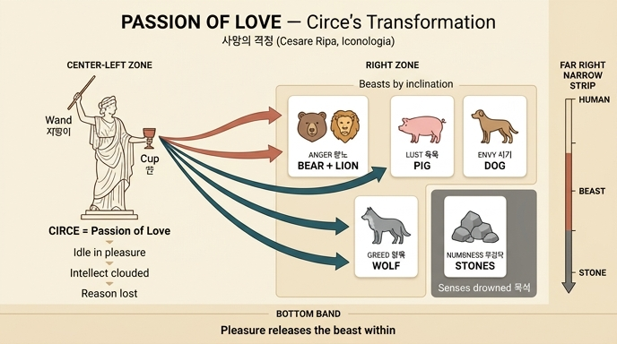

# 사랑의 격정(PASSIONE DI AMORE) — 짐승들과 바위가 가르치는 것

> **Q.** 사랑의 격정 도상에서 짐승들과 바위는 무엇을 가르치는가?
>
> **A.** 감각을 즐겁게 하는 것에 한가로이 빠진 사람은 지성이 흐려지고 이성을 잃어 제 성향대로 짐승이 된다는 것이다. 성 잘 내는 자는 곰과 사자가, 육욕적인 자는 돼지가, 시기하는 자는 개가, 탐욕스러운 자는 늑대가 되며, 바위는 감각에 빠져 목석이 된 이들을 뜻한다.

---

## 1. 도상 전체 구성

체사레 리파(Cesare Ripa) 『이코놀로지아』 제4권 **PASSIONE DI AMORE**(사랑의 격정) 항목의 지시는 이렇게 시작한다.

> "한 손에는 지팡이(*verga*)를, 다른 손에는 잔(*tazza*)을 든 여인. 그 곁 **한쪽에는 사자·곰·늑대·멧돼지·개** 등이 있고, **다른 쪽에는 많은 바위(*molti sassi*)** 가 있다."

즉 이 인물상은 좌우 비대칭 구성이다.

| 위치 | 요소 | 정체 |
|---|---|---|
| 중앙 | 지팡이 든 여인 + 잔 | **키르케**(Circe) — 사랑의 격정 그 자체 |
| 한쪽 | 사자·곰·늑대·멧돼지·개 | 성향별로 짐승이 된 사람들 |
| 다른 쪽 | 무더기로 쌓인 바위 | 감각에 빠져 목석이 된 사람들 |

리파는 "오비디우스가 전하듯 **사랑의 격정을 나타내는 데 키르케를 취한다**"고 명시한다. 고대인들은 키르케를 "사람을 제 뜻대로 변신시키던 가장 강력한 마녀"로 보았고, 리파는 그 변신 능력을 **사랑의 격정이 인간에게 하는 일**의 알레고리로 재해석한다.

## 2. 지팡이와 잔 — 변신의 두 도구

- **지팡이(verga)**: 호메로스 『오디세이아』 10권에서 키르케가 오디세우스의 동료들에게 자기 약물을 마시게 한 뒤 **지팡이로 머리를 건드려** 짐승(*Fiere*)으로 바꾸었다는 대목에서 왔다.
- **잔(tazza)**: 사람을 "제정신 밖으로 나가게 만든" 약초 즙과 음료를 뜻한다. 리파의 표현대로 그것은 사람을 "**바위와 추한 동물처럼(a guisa di sassi, e brutti animali)**" 만들어 버린다. — 바위와 짐승이 나란히 등장하는 근거가 바로 이 한 구절이다.

리파가 근거로 인용하는 고전 두 대목:

- **오비디우스 『변신 이야기』 14권**: 볶은 보리에 꿀·포도주·응유를 섞고 "그 달콤함 아래 몰래 숨을 즙(*Quique sub hac lateant furtim dulcedine succos*)"을 더해 잔을 건넨다. → 쾌락은 **달콤함 속에 독을 숨긴다**는 점이 핵심.
- **베르길리우스 『아이네이스』 7권**: 키르케의 집에서 들려오는 소리 — "사슬을 거부하는 **사자들**의 신음, 밤중에 울부짖는 **털 난 돼지들**, 우리 속의 **곰들**, 거대한 **늑대들**의 울음… 잔혹한 여신 키르케가 강력한 약초로 **사람의 얼굴을 짐승의 얼굴과 등가죽으로 바꿔 입혀 놓은** 것들."

## 3. 짐승들과 바위의 뜻 (카드의 정답 부분)

리파는 도상 해설의 결론으로 이렇게 적는다. 이 문장이 답의 원문이다.

> "이 여러 동물들과 무수한 바위가 뜻하는 바는… 사랑의 격정은 **감각에 즐겁고 유쾌한 것들의 맛에 한가로이(oziosamente) 사로잡히도록 자신을 내버려 두는** 사람들을 지배한다는 것이다. 그것은 **지성을 흐리게 하고(offusca l'intelletto) 이성을 완전히 앗아가(toglie in tutto la ragione)**, 그들을 **자신의 타고난 성향(naturale inclinazione)에 따라** 이런저런 종류의 추한 동물로 만들어 버린다. 그리하여 **성 잘 내는 자(iracondi)는 곰과 사자가, 육욕적인 자(carnali)는 돼지가, 시기하는 자(invidiosi)는 개가, 탐욕스러운 자(golosi)는 늑대가** 된다고 하는 것이다."

### 성향 → 짐승 매핑

| 성향 (원문) | 변신할 짐승 | 선택 논리 |
|---|---|---|
| 분노 *iracondi* | **곰, 사자** | 맹수의 격노 — 사자는 분노의 전통적 상징 |
| 육욕 *carnali* | **돼지** (멧돼지 *cignali*) | 진창에 뒹구는 짐승 = 육체적 오염 |
| 시기 *invidiosi* | **개** | 남의 것에 짖고 물어뜯는 성질 |
| 탐욕·식탐 *golosi* | **늑대** | 채워지지 않는 굶주림 = 끝없는 탐욕 |
| 감각 몰입 (극단) | **바위** | 감각에 익사해 감정·이성 모두 잃은 무감각 |

**바위**가 별도로 한쪽을 채우는 이유가 요점이다. 짐승은 "성향은 남았으나 이성을 잃은" 단계이고, **바위는 아예 반응조차 없어진 최종 단계** — 잔의 약물이 사람을 "바위처럼(a guisa di sassi)" 만든다는 대목이 그것이다. 즉 이 도상은 **인간 → 짐승 → 목석**의 하강 계단을 좌우로 펼쳐 보여준다.

### 왜 하필 "제 성향대로"인가

핵심은 격정이 **새로운 악을 심는 것이 아니라 이미 있던 성향을 폭로한다**는 점이다. 이성이 잡고 있던 고삐가 풀리면 각자 안에 있던 짐승이 그대로 튀어나온다. 이 발상은 보에티우스 『철학의 위안』 4권(탐욕→늑대, 다투는 자→개, 성난 자→사자, 음란한 자→암돼지)과 플루타르코스의 「그릴로스」 등 고대·중세의 오랜 전통이며, 리파는 그 계보를 키르케 신화에 얹어 하나의 그림으로 압축했다.

## 4. 같은 책 안의 대응점 — 오디세우스의 해독제

리파는 다른 항목(제6권, 메달 해설 부분)에서 이 알레고리의 반대편을 명시한다. 메르쿠리우스가 오디세우스에게 준 약초 **몰리(Moli)** 는 캐내기 어려운 풀인데, 이는 "사람이 어렵게 얻는 **지혜와 웅변의 상형문자**"이고, 오디세우스는 그것으로 "키르케의 마법, **즉 쾌락과 감각성(a' piaceri, ed alle sensualità)**"에 저항할 수 있었다고 한다.

→ 정리하면: **키르케의 잔 = 감각적 쾌락 / 몰리 = 지혜와 이성.** 짐승과 바위가 되지 않는 길은 이성을 놓지 않는 것이다.

또한 리파는 항목 끝에 "**사실 예화는 '무례한 사랑(Amore impudico)' 항목을 보라**"는 상호 참조를 남긴다.

## 5. 암기 훅

- **왼쪽은 짐승 우리, 오른쪽은 돌무덤, 가운데는 잔과 지팡이.**
- **분노 = 곰·사자 / 육욕 = 돼지 / 시기 = 개 / 탐욕 = 늑대 / 무감각 = 바위.**
- 결정적 세 동사: **한가로이 빠진다(oziosamente) → 지성이 흐려진다(offusca) → 이성을 잃는다(toglie la ragione).**
- 한 줄 요약: "**쾌락은 사람을 바꾸지 않는다. 원래 있던 짐승을 풀어놓을 뿐이다.**"

## 6. 자료 메모

- 원문: `.fm/assets/14 Idleness to Patience.md`, `### PASSIONE DI AMORE.` 항목 (Parzialità 다음, Pazienza 앞).
- 이 항목의 삽화 동판(도서 346~348쪽 구간)은 asset의 이미지 149장에 추출되어 있지 않아, 원본 도판은 첨부하지 않았다. 인접 도판(`_page_345_...` = Parsimonia, `_page_349_...` = Pazienza)은 이 카드와 무관하다.

## 인포그래픽

