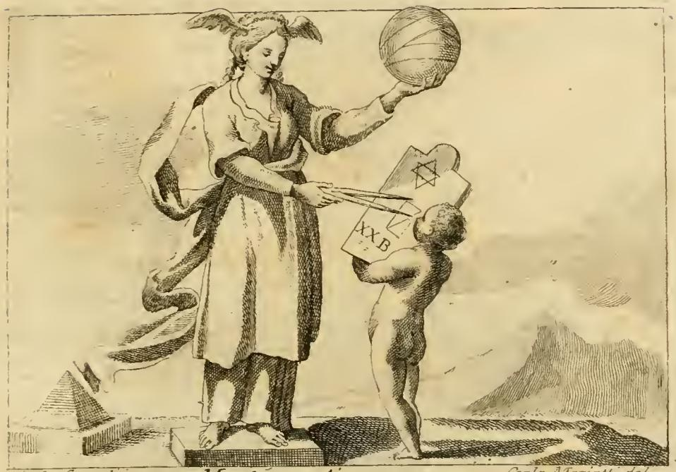

# '수학'(MATEMATICA) 도상 — 투명한 옷·머리 날개·맨발

## 질문

'수학' 도상에서 투명한 옷·머리 날개·맨발은 각각 무엇을 뜻하는가?

## 답

- **투명한 옷(veste trasparente)**: 수학의 논증이 다른 학문보다 명료하고 투명함
- **머리의 날개(ali alla testa)**: 추상적인 것을 관조하러 지성이 날아오름
- **땅을 굳게 딛은 맨발(piedi nudi e stabili in terra)**: 수학의 명증성(evidenza)과 확고함(stabilità)

---

## 1. 도상 전체 처방(리파의 원문)

> **DOnna di mezza età, vestita di velo bianco, e trasparente, colle ali alla testa.** Le treccie siano distese giù per le spalle. Con un compasso nella destra mano, mostri di misurare una tavola segnata di alcune figure; mostri di parlare insegnandole. Coll'altra mano terrà una palla grande figurata per la terra, col disegno dell'ore, e circoli celesti: e nel lembo della veste sia un fregio intessuto di figure Matematiche. **Siano i piedi ignudi sopra una base.**

> 중년의 여인. 흰빛의 **투명한 베일(옷)**을 입고, **머리에 날개**를 달았다. 머리채는 어깨 아래로 풀어 늘어뜨렸다. 오른손에는 컴퍼스를 들고 몇몇 도형이 그려진 판(tavola)을 재는 자세를 취하며, 그것을 가르치며 말하는 모습이다. 다른 손으로는 지구를 나타내는 큰 구(球)를 드는데, 그 위에는 시간의 구획과 천구의 원들이 그려져 있다. 옷의 옷단에는 수학적 도형들이 짜인 장식띠가 있다. **두 발은 맨발로 대(base) 위에 놓인다.**

## 2. 세 상징 각각의 원문 해설

### (1) 투명한 옷 — 논증의 명료성

> Il vestimento trasparente dimostra, che ella sia di aperte, e chiare dimostrazioni, nel che avanza facilmente le altre scienze.

> 투명한 의복은 그녀가 **열려 있고 분명한 논증(aperte e chiare dimostrazioni)**의 학문임을 보여 준다. 이 점에서 그녀는 **다른 학문들을 손쉽게 능가한다(avanza facilmente le altre scienze)**.

핵심은 단순히 "쉽다"가 아니다. 옷은 원래 몸을 **가리는** 것인데, 수학의 옷은 가리지 않는다. 즉 논증 과정에 은폐된 전제나 감춰진 권위가 없다는 뜻이다. 그래서 이 문장은 곧바로 학문의 **서열 주장**("다른 학문을 능가한다")으로 이어진다.

### (2) 머리의 날개 — 추상으로의 상승

> Le ali alla testa insegnano, che ella coll'ingegno s'innalzi al volo della contemplazione delle cose astratte.

> 머리의 날개는 그녀가 **재능(ingegno)으로써 추상적인 것들을 관조하는 비상(volo della contemplazione delle cose astratte)에로 스스로를 들어올림**을 가르쳐 준다.

날개가 발이 아니라 **머리(지성)**에 달렸다는 점이 결정적이다. 이동하는 것은 신체가 아니라 지성이며, 상승의 목적지는 하늘이라는 장소가 아니라 **추상**이다.

### (3) 맨발 — 명증성과 확고함

> I piedi nudi, e stabili in terra, sono per dimostrazione della sua evidenza, e stabilità, a confermazione di quel che si è detto.

> 맨발로 땅에 **굳게 선 발**은 그녀의 **명증성(evidenza)과 확고함(stabilità)**을 드러내기 위한 것이며, 앞서 말한 것을 **재확인(a confermazione)**하는 것이다.

"a confermazione di quel che si è detto"(앞서 말한 것의 확증)라는 마지막 구절이 중요하다. 리파 자신이 맨발을 **독립된 별개의 의미가 아니라, 투명한 옷이 말한 '명료함'을 되받아 마무리하는 항목**으로 배치했다.

또한 맨발이 "발가벗음 = 투명함"의 반복이라는 점도 놓치지 말 것. 옷의 투명함(상체)과 발의 벌거벗음(하체)이 도상 위아래에서 같은 말을 두 번 한다.

## 3. 하나의 논증 구조로 읽기 — 상승과 정초의 긴장

세 상징은 나란한 세 개의 속성이 아니라, **하나의 논증(demonstratio) 자체를 신체로 그린 것**이다.

```
투명한 옷   →   머리의 날개   →   맨발
논증의 명료성    추상으로의 상승    흔들리지 않는 기초
(무엇으로)       (어디로)          (그럼에도 어디에 서서)
```

1. **투명함(전제의 공개)** — 감출 것이 없으므로 누구나 검증할 수 있다.
2. **날개(추상으로의 도약)** — 그 투명한 전제로부터 지성은 감각적 개별자를 떠나 보편·추상으로 날아오른다.
3. **맨발(정초)** — 그런데 이 상승은 근거를 잃는 상승이 아니다. 발은 여전히 땅을 딛고, 게다가 `base`(대) 위에 놓여 있다.

즉 **"위로 날아오르지만 발은 땅에 굳게 딛는다"**가 이 도상의 논점이다. 다른 사변적 학문은 높이 올라갈수록 지반이 흔들리지만(억측·의견 대립), 수학은 가장 추상적인 데까지 올라가면서도 그 결론이 **처음의 명료한 전제로 언제든 되짚어 내려올 수 있기 때문에** 흔들리지 않는다. 날개가 있는 자에게 맨발이 굳이 강조되는 것은 모순이 아니라, 이 학문의 **상승 자체가 정초되어 있음**을 말하는 장치다.

옷단의 장식띠 해설이 이 독법을 뒷받침한다.

> ...come sono nel lembo i fregi di ornamento, e di fortezza, così nelle prove Matematiche quelle stesse sono principi, e fondamenti.

> 옷단의 장식띠가 **장식이면서 동시에 (옷을) 튼튼하게 하는 것**이듯, 수학의 증명에서도 그 도형들은 **원리이자 토대(principi e fondamenti)**다.

리파는 여기서 이미 "아름다움 = 견고함", "장식 = 토대"라는 같은 겹침을 말한다. 맨발은 그 겹침을 발끝에서 한 번 더 반복한다.

## 4. 판화에서 실제로 확인되는 것



세 속성을 판화에서 대조하면 이렇다.

| 처방된 속성 | 판화에서의 확인 | 비고 |
|---|---|---|
| **머리의 날개** | **명확히 보인다.** 관자놀이 양쪽에 작은 날개가 머리카락 사이로 뻗어 있다 | 세 속성 중 가장 뚜렷함. 도상 최상단에 위치 |
| **맨발** | **명확히 보인다.** 두 발 모두 신발이 없고, 직사각형 대(臺, `base`) 위에 나란히 딛고 서 있다 | 처방의 `sopra una base`가 그대로 새겨짐. 도상 최하단 |
| **투명한 흰 옷** | **부분적으로만 보인다.** 어깨에서 흘러내려 좌우로 크게 나부끼는 얇은 겉옷/베일이 몸의 윤곽을 가리지 않고 흐르지만, 판화의 해칭 기법상 '투명함'은 재현되지 않았다 | 흑백 선각(線刻)의 한계. 색·투명도는 텍스트만이 전달 |

여기서 도상학 독해의 일반 원칙이 드러난다. **판화는 처방의 전부를 담지 못하고, 색·투명도·재질 같은 성질은 원문 텍스트에서만 회수된다.** 이 카드가 묻는 세 속성 중 하나(투명함)가 바로 그런 항목이다.

그 밖에 판화에서 보이는 요소들:

- **왼손에 든 큰 구(球)**: 경선·위선이 그려진 지구의. 원문의 "지구를 나타내는 큰 구 + 천구의 원들"
- **오른손의 컴퍼스**: 원문의 `compasso`. "만물의 비례·규칙·척도를 준다(dà la proporzione, la regola, e la misura)"
- **판을 든 벌거벗은 소년(putto)**: 육각 별(헥사그램)과 삼각형, 문자가 그려진 판을 받쳐 들고 논증에 주목하고 있다. 원문은 이 아이를 **수학은 유년기(età puerile)에 가르쳐야 한다**는 논점으로 해설한다 — 어린 지성은 `carta bianca`(백지)·`tavola rasa`(밀랍판을 긁어낸 상태)와 같아서, 이때 수학을 배우면 이후 모든 배움이 새겨질 도구가 마련된다는 것
- **왼쪽 아래의 각뿔(피라미드)과 기하 입체**: 옷단 장식띠와 같은 역할, 즉 '원리이자 토대'인 기하 도형
- **어깨로 늘어뜨린 풀어헤친 머리채**: 원문에서 `treccie sparse senza arte`(꾸밈 없이 흩어진 머리채)로, "스스로 자신을 장식한다"— 수학의 무기교(無技巧)한 품위

주의: 판화의 여인은 처방대로 **중년(mezza età)의 위엄 있는 부인**으로 그려졌다. 리파는 이를 명시적으로 대조한다 — 젊고 방자한 얼굴은 **시(詩)**에 어울리고(`La faccia di giovane lasciva, conviene alla Poesia`), 수학에는 `aspetto di Donna grave, e di Matrona nobile`(중후한 부인, 고귀한 기품의 여인)의 모습이 어울린다.

## 5. 왜 수학이 '가장 확실한 학문'이었나

리파의 "다른 학문들을 손쉽게 능가한다"는 문장은 개인 취향이 아니라, 16–17세기 이탈리아 학계의 뜨거운 논쟁 지형 위에 놓인 주장이다.

### 유클리드 공리 체계 — 명료성의 표준

『원론』의 방식(뒤에 `mos geometricus`라 불림)은 정의·공준·공리를 **먼저 남김없이 드러내 놓고**, 이후 모든 정리를 그것만으로부터 도출한다. 어떤 결론도 출처를 되짚어 원리까지 환원할 수 있다. 이것이 "열려 있고 분명한 논증(aperte e chiare dimostrazioni)"의 실질이며, **투명한 옷의 인식론적 내용**이다. 동시에 이 환원 가능성이 곧 **맨발의 확고함**이기도 하다 — 즉 투명함과 확고함은 같은 사실의 두 얼굴이다.

### quaestio de certitudine mathematicarum

- **알레산드로 피콜로미니(Alessandro Piccolomini), 『De certitudine mathematicarum』(1547)**: 수학 논증이 아리스토텔레스적 의미의 `demonstratio potissima`(최강의 논증, 즉 원인을 통한 논증)가 아니라고 주장하며 수학의 학문적 지위를 문제 삼았다. 이 저작이 수십 년에 걸친 대논쟁의 방아쇠가 되었다.
- 이후 페레이라(Pererius/Perera), **클라비우스**, 보카디페로 등이 이 문제를 두고 대립했다.
- 이 논쟁의 쟁점은 정확히 리파가 옷과 발에 새겨 넣은 것이다: 수학은 **논증의 확실성**에서 최고인가, 아니면 다루는 **대상의 위계**에서 형이상학·자연철학에 밀리는가.

### 클라비우스 — 리파가 직접 이름을 부른 인물

이 카드에서 가장 짜릿한 대목이다. 리파는 MATEMATICA 항목 본문에서 당대의 위대한 수학자들을 열거하며 **`Cristoforo Clavio`(크리스토프 클라비우스)를 첫 번째로 호명한다.**

> ...fra i quali hanno luogo **Cristoforo Clavio**, Giovanni Paolo Vernalione, Gio. Battista Raimondo, Luca Valerio...

클라비우스(1538–1612)는 자신의 유클리드 『원론』 주해 **『Prolegomena』**에서 이렇게 논했다:

- 학문의 품격을 그 **논증의 확실성**으로 잰다면, 수학이 가장 품격 높은 학문이다.
- **형이상학에는 아리스토텔레스 해석을 둘러싼 수많은 의문과 불일치가 있으나**, 수학의 증명은 그런 흔들림이 없다.
- 자연철학과 형이상학은 의견이 너무 많고 서로 어긋나므로 학문(scientia)이라기보다 **추측(conjectura)**이라 불러야 한다.
- 그는 예수회 교육과정 **『Ratio Studiorum』(1599)**에 수학을 정규 교과로 못박는 데 결정적 역할을 했고, 한 달에 한 번씩 유클리드 정리의 논증을 함께 듣는 훈련을 권했다.

즉 리파가 클라비우스를 이름으로 부른 것과, "투명한 옷 = 다른 학문을 능가하는 명료한 논증"이라는 해설은 **같은 시대의 같은 주장**이다. 도상의 옷은 클라비우스의 테제를 옷감으로 바꿔 놓은 것이라고 읽어도 지나치지 않다.

## 6. 인접 항목 METAFISICA와의 대조 — 위계의 차이

리파는 같은 책에 **METAFISICA(형이상학)** 항목도 두었고, 그 처방은 MATEMATICA와 결정적인 지점에서 갈린다.

> DOnna con un globo, e un orologio sotto de' piedi. Avrà gli occhi bendati, e in capo una corona... **e sprezzando le cose soggette alla mutazione, ed al tempo** considera le cose superiori, **colla sola forza dell'intelletto, non curando del senso**.

> 지구의와 시계를 **발밑에 밟고 있는** 여인. **두 눈은 가려져 있고(occhi bendati)**, 머리에는 왕관을 썼다... 그녀는 **변화와 시간에 종속된 것들을 경멸하며(sprezzando)**, 오직 **지성의 힘만으로, 감각에는 아무 관심 없이(colla sola forza dell'intelletto, non curando del senso)** 더 높은 것들을 고찰한다.

또 다른 처방에서도 `sotto al piede sinistro tenga un globo`(왼발 아래 지구를 밟는다)이며, "이 학문은 오직 천상적·신적인 것으로 상승한다(s'innalza solo alle cose celesti e divine)"고 한다.

| | **MATEMATICA (수학)** | **METAFISICA (형이상학)** |
|---|---|---|
| **눈** | 뜨고 있다. 도형이 그려진 판을 보며 컴퍼스로 잰다 | **가려져 있다(occhi bendati)** — 감각의 차단 |
| **지구의** | **손에 들어 올린다** — 측정·연구의 **대상** | **발로 밟는다** — 경멸하고 초월할 **대상** |
| **감각과의 관계** | 감각적 도형(figure, tavola)을 **경유해** 추상에 이른다 | 감각을 **버리고** 지성만으로 간다(`non curando del senso`) |
| **상승의 방식** | 머리의 날개로 오르되 **발은 땅을 딛는다** | 땅(지구·시계)을 짓밟고 위로만 향한다 |
| **왕관·홀** | 없다. 대신 컴퍼스(도구)와 옷단의 도형(토대) | **왕관과 홀** — "모든 학문의 여왕(Regina di tutte le altre scienze)" |
| **주장하는 우위** | **논증의 확실성**(evidenza, chiare dimostrazioni) | **대상의 고귀함**(천상적·신적인 것) |
| **시간** | 구 위에 시간의 구획(`disegno dell'ore`)을 담아 다룬다 | 시계를 발밑에 밟아 시간을 벗어난다 |

### 이 대조가 말하는 것

두 도상은 르네상스 학문 위계의 **두 가지 서로 다른 척도**를 각각 인격화한 것이다.

- **형이상학**은 **대상의 위계**로 최고를 주장한다. 그러므로 왕관을 쓰고, 감각을 눈가리개로 차단하고, 지구와 시계를 발로 밟는다. 대가는 지반의 상실이다 — 클라비우스가 지적한 대로, 해석의 불일치가 끝없이 쌓여 "학문이라기보다 추측"이 된다.
- **수학**은 **논증의 확실성**으로 최고를 주장한다. 그러므로 왕관 대신 컴퍼스를 들고, 눈을 뜨고 도형을 보며, 지구를 손에 들어 **재고**, 그러면서 발은 맨발로 땅을 딛는다.

핵심 차이는 **감각을 어떻게 쓰는가**다. 형이상학은 감각을 **버려서** 추상에 이르고, 수학은 감각적 도형을 **디딤돌로 삼아** 추상에 이른다. 그래서 수학에게는 날개(상승)와 맨발(접지)이 동시에 필요하고, 형이상학에게는 밟아 누를 지구의만 필요하다.

이 구도에서 보면 카드의 세 상징은 하나의 문장으로 압축된다: **수학은 감각적 도형이라는 확실한 땅을 딛은 채로 추상까지 날아오르며, 그 전 과정이 감춰진 데 없이 투명하다.**

## 7. 암기 정리

| 속성 | 이탈리아어 | 뜻 | 논증 구조에서의 자리 |
|---|---|---|---|
| 투명한 흰 옷 | `veste di velo bianco e trasparente` | 열려 있고 분명한 논증 → 타 학문을 능가 | **전제의 공개** (명료성) |
| 머리의 날개 | `ali alla testa` | 지성이 추상적인 것의 관조로 날아오름 | **상승** (추상화) |
| 맨발 (대 위에) | `piedi nudi e stabili in terra / sopra una base` | 명증성(evidenza)과 확고함(stabilità) | **정초** (기초의 견고함) |

한 줄 기억법: **"투명하게 열고 → 날개로 오르고 → 맨발로 버틴다."**
