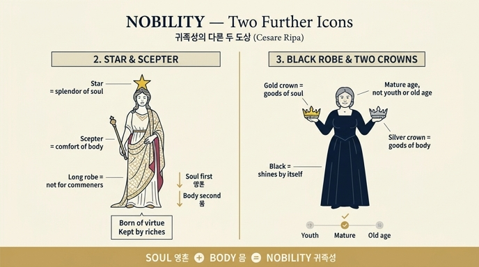

# '귀족성'(Nobiltà)의 다른 두 도상

체사레 리파의 『이코놀로지아』 "Nobiltà(귀족성)" 항목에는 도상이 **세 가지** 실려 있다. 이 카드는 그중 판화로 그려진 첫 번째를 뺀 **두 번째와 세 번째** 기술을 묻는다.

## 먼저: 판화로 남은 첫 번째 도상 (비교 기준)

- **묵직한 옷(abito grave)** 을 입은 여인 → 귀족에게 요구되는 무게 있는 **몸가짐과 습속**.
- **오른손의 창(asta)**, **왼손에 받쳐 든 미네르바 소상(simulacro)** → 귀족성은 **학문(scienze)** 또는 **무예(armi)** 의 명성으로 획득된다. 미네르바가 시인들의 믿음에 따라 학문과 무예 **양쪽 모두의 수호자**이기 때문이며, 그가 유피테르의 **머리**에서 태어난 것 자체가 이 둘의 원천이 곧 **이성(discorso)과 지성(intelletto)** 임을 뜻한다.
- 리파는 이 형상을 **게타(Geta) 황제의 메달**에서 본 대로라고 밝힌다.
- 그림 아래쪽 땅에 **관 두 개**가 놓여 있는 것을 눈여겨볼 만하다. 이것은 세 번째 도상의 핵심 지물(금관·은관)이 같은 판화 안에 함께 배치된 것으로, 세 도상이 한 항목의 변주임을 보여준다.

> 이 카드의 정답에 해당하는 두 번째·세 번째 도상은 별도의 판화 없이 **글로만** 기술되어 있다.

## 두 번째 도상 — 화려한 토가 + 머리의 별 + 손의 홀

원문: *"Donna togata riccamente, con una stella in capo, e uno scettro in mano."*

| 요소 | 의미 |
|---|---|
| 화려한 **긴 옷(토가)** | 로마에서 **긴 옷은 천민(ignobili)이 입는 것이 허락되지 않았다** → 옷 자체가 신분의 표식 |
| 머리에 얹은 **별(stella)** | **영혼의 광채(splendori dell'animo)** |
| 손에 든 **홀(scettro)** | **몸의 안락·편의(comodi del corpo)** |

핵심은 **순서**다. 리파는 "고귀한 마음의 행위란 **먼저** 영혼의 광채(별)로 기울고, **그다음** 몸의 편의(홀)로 향하는 것"이라고 말한다. 즉 별이 머리(위)에, 홀이 손(아래)에 있는 배치가 우선순위를 그대로 시각화한다.

결론 문장: **귀족성은 밝고 빛나는 영혼의 덕(virtù di un animo chiaro e splendente)에서 태어나고, 세속의 재물(ricchezze mondane)에 의해 쉽게 유지된다.**
→ **기원 = 덕 / 보존 = 재물**의 이원 구조.

## 세 번째 도상 — 검은 옷의 중년 여인 + 금관·은관

원문: *"Donna di matura età … vestita di nero onestamente. Porterà in mano due corone, l'una di oro, l'altra di argento."*

| 요소 | 의미 |
|---|---|
| **중년(matura età)**, 다소 튼튼한 얼굴과 잘 갖춰진 몸 | 귀족성의 **시작(유년)** 도, **끝(노년)** 도 참된 귀족성이 아니다 |
| 정숙한 **검은 옷** | 옷의 화려함(splendore de' vestimenti) 없이도 **스스로 밝고 빛나는(chiaro ed illustre per sé medesimo)** 존재 |
| **금관 + 은관** | **영혼의 재산(beni dell'anima)** 과 **몸의 재산(beni del corpo)** — 이 둘이 **함께** 귀족성을 이룬다 |

- 왜 노년이 아닌가: 리파는 노년으로 표시될 것이 "이름만 남은 **카이사르들의 오래된 혈통(antichità de' Cesari)**"이라며, 이름만 물려받은 가문의 오래됨은 참된 귀족성이 아니라고 한다. 출전으로 **아르니지오(Bartolomeo Arnigio)의 『Veglie(야화)』** 를 든다.
- 두 번째 도상과 대조하면 흥미롭다. 두 번째는 **옷의 화려함**으로 신분을 말하고, 세 번째는 **검은 옷**으로 옷에 의지하지 않는 귀족성을 말한다. 겉치레(외적 표식) → 자체적 빛(내적 실질)로 강조점이 옮겨간 셈이다.

## 세 도상 한눈에 정리

| | 옷 | 지물 | 초점 |
|---|---|---|---|
| ① (판화) | 묵직한 옷 | 창 + 미네르바 소상 | 귀족성의 **획득**: 학문·무예의 명성 |
| ② | 화려한 긴 토가 | 머리의 별 + 손의 홀 | 귀족성의 **기원(덕)과 유지(재물)** |
| ③ | 정숙한 검은 옷 | 금관 + 은관 | 귀족성의 **구성**: 영혼의 재산 + 몸의 재산 |

## 암기 포인트

- ②는 **별(위)–홀(아래)**: 영혼이 먼저, 몸이 나중. 로마의 긴 옷 = 천민 금지.
- ③은 **검은 옷 + 관 두 개**: 화려함 없이 스스로 빛남, 영혼+몸의 두 재산.
- ②·③ 모두 "영혼 / 몸"의 **한 쌍**으로 귀족성을 설명한다는 점이 공통 골격이다(별·홀 ↔ 금관·은관).

## 인포그래픽

