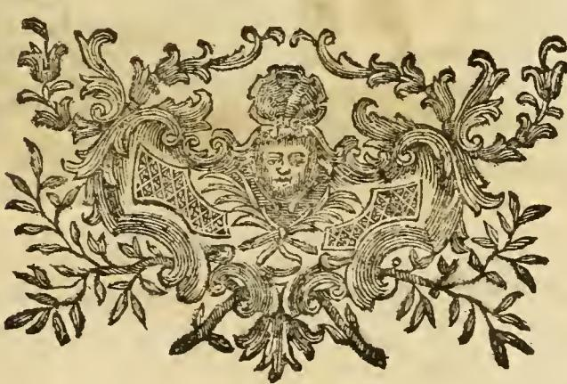

# 리파의 '결혼(Matrimonio)' 의인화

> **Q.** 리파는 '결혼(Matrimonio)'을 어떻게 의인화했는가?
>
> **A.** 화려하게 차려입은 젊은 남자가 목에 멍에를 지고 발에 차꼬를 차고, 손가락에 금반지(fede)를 끼고 같은 손에 마르멜로(cotogno)를 들었으며 발밑에 독사(Vipera)를 밟고 있다.

---

## 1. 원문과 번역

체사레 리파(Cesare Ripa) 『이코놀로지아(Iconologia)』, "MATRIMONIO — Di Cesare Ripa" 항목의 정의문:

> *Un Giovane pomposamente vestito, con un giogo sopra il collo, e co' ceppi a' piedi, con un anello, ovvero una fede di oro in dito; tenendo nella medesima mano un cotogno, e sotto a' piedi avrà una Vipera.*
>
> — "**화려하게(pomposamente) 차려입은 젊은 남자**, 목 위에는 **멍에(giogo)**를, 두 발에는 **차꼬(ceppi)**를 차고, 손가락에는 **반지, 즉 금으로 된 페데(fede)**를 끼고, 같은 손에 **마르멜로(cotogno, 마르멜로 열매)** 하나를 들었으며, 발밑에는 **독사(Vipera)** 한 마리를 두고 있다."

### 도상 원판 — 리파 자신의 MATRIMONIO

판화(Carlo Mariotti 그림 / Carlo Grandi 판각, 캡션 *MATRIMONIO*)에서 실제로 관찰되는 요소들:

- **긴 겉옷을 걸친 수염 없는 젊은 남자** — 텍스트의 *Giovane pomposamente vestito*. 옷자락이 발목까지 내려오는 풍성한 예복 차림이다.
- **어깨·목을 가로지르는 굽은 막대** — 소에 씌우는 **멍에(giogo)**. 두 팔을 얹은 채 목 뒤로 걸쳐져 있다.
- **두 발이 박힌 나무 상자/블록** — **차꼬(ceppi)**. 서 있으되 한 걸음도 옮길 수 없는 상태를 시각화한다.
- **왼손에 든 둥근 열매** — **마르멜로(cotogno)**. 반지(fede)는 같은 손 손가락에 끼는 것으로 서술되지만 이 크기의 판화에서는 거의 식별되지 않는다(텍스트로 보충해야 하는 요소).
- **화면 아래를 기어가는 뱀** — 차꼬 아래 땅바닥에 **독사(Vipera)**가 놓여, 인물이 그것을 밟고 선 구도를 이룬다.

> 참고: 같은 항목 앞 페이지의 `fig-2.jpeg`는 인물 도상이 아니라 **장식 두렁쇠(headpiece) 컷**이다. 결혼 항목이 시작되는 면의 장식띠일 뿐이며, 리파의 결혼 의인화도 아니고 아래에서 다룰 리치(Ricci)의 성사 버전 도상도 아니다. 이 판본에는 리치의 성사 버전에 해당하는 별도 판화가 실려 있지 않다.
>
> 

---

## 2. 도상 요소별 의미표

| 요소 | 원문 표현 | 리파가 붙인 의미 |
|---|---|---|
| **화려한 옷** | *pomposamente vestito* | 결혼이 가져오는 **명예와 지위**. 뒤이어 나오는 "도시에서 얻는 명예와 신용(*l'onore, e credito che si acquista nella Città*)"과 짝을 이루는 긍정 항목. 속박의 표지들과 나란히 놓여 양가성을 만든다. |
| **멍에 (giogo)** | *un giogo sopra il collo* | 결혼은 "인간의 힘에 비해 **매우 무거운 짐(peso ... assai grave)**". 별도의 짧은 변형 항목에서는 한 걸음 더 나아가 "**멍에는 결혼이 젊은 혈기를 길들여(doma gli animi giovanili)** 자신과 남에게 유익한 사람으로 만든다는 뜻"이라고 풀이한다 — 즉 구속이자 동시에 교화 장치. |
| **차꼬 (ceppi)** | *co' ceppi a' piedi* | "**자유로운 많은 행동을 걷지 못하게 하는 방해물**". 결혼은 "**자기 자신을 파는 것(un vendere se stesso)**이며 영구한 법에 스스로를 묶는 것(*obbligarsi a legge perpetua*)". |
| **금반지 (fede d'oro)** | *un anello, ovvero una fede di oro in dito* | ① **부부 간 신의와 마음의 순결(fedeltà, e purità dell'animo)**의 표지. ② 동시에 "**우월함과 명예로운 신분의 표지(segno di preminenza, e di grado onorato)**". 리파는 피에리오 발레리아노를 인용해, 반지의 최초 용도는 무언가를 잊지 않기 위한 **값싼 재료의 기억 표지**였고, 뒤에 허영과 과시욕이 자라 금과 보석으로 옮겨갔다고 덧붙인다 — 그 "기억 장치"라는 본래 의도에서, 한 번 맹세한 신의를 영구히 지키라는 **결혼의 표지**로 굳어졌다는 것. |
| **마르멜로 (cotogno)** | *tenendo nella medesima mano un cotogno* | ① **솔론(Solone)의 법령**에 따라 아테네에서 신혼부부에게 건네던 열매로, **베누스에게 봉헌된 다산(fecondità)의 상징**. 여러 메달에도 같은 취지로 새겨져 있다. ② 피에리오에 따르면 **상호적 사랑(amore scambievole)**의 표지 — 어떤 곳에서는 귀부인들에게 던지고 양쪽이 손에 입맞추는 애정 의례로 쓰였다. ③ "사람이 **열매를 딴다**"는 표현대로, **결혼을 통해서만 합법적으로 도달하는 목적(성적 결합)**을 뜻한다. 그 밖의 경우는 중죄이며 하느님의 나라에서 멀어지게 한다고 못박는다. |
| **독사 (Vipera)** | *sotto a' piedi avrà una Vipera* | **밟아 짓눌러야 할 대상**. 배우자에게 해가 되는 모든 생각은 비천한 것으로 짓밟아야 하며, "**교접의 쾌락 때문에 수컷을 죽여버리는 독사의 습성**"을 피해야 한다는 뜻. 즉 배신·해악·정욕에 따른 파괴의 표상. |

---

## 3. 핵심 논점 — 속박과 화려함의 병치

이 도상의 요점은 **결혼을 좋게도 나쁘게도 그리지 않고, 양쪽 기호를 한 몸에 동시에 걸어 놓았다**는 데 있다.

- **속박 축**: 목의 멍에 + 발의 차꼬 + 밟힌 독사. 걸을 수 없고, 스스로를 팔았고, 영구한 법에 묶였으며, 배신의 충동은 발밑에서 짓눌러야 한다.
- **화려함 축**: 과시적인 예복 + 금반지 + 마르멜로. 명예, 지위, 신의, 다산, 그리고 합법적 쾌락.

리파의 논증 순서 자체가 이 병치를 그대로 따라간다. 무게(멍에·차꼬)를 먼저 말한 뒤 **"contuttociò è caro, e desiderabile per molti rispetti"(그럼에도 여러 면에서 소중하고 바랄 만한 것이다)**로 전환하면서, 결혼의 이점을 세 갈래로 열거한다.

1. **상속자** — 재산과 명성의 참된 상속인이 될 후계자(*successori ... veri eredi della roba, e della fama*)를 얻는다.
2. **명예** — 도시에서 얻는 명예와 신용, 그리고 그 도시를 유지하는 책무를 스스로 지는 데서 오는 위신.
3. **합법적 쾌락** — "합법적으로 누리는 **베누스의 즐거움(il piacere di Venere, che lecitamente se ne gode)**".

그래서 마지막에 "따라서 반지를 함께 그리는데, 반지는 우월함과 명예로운 신분의 표지다"로 문단이 닫힌다. **부담 → 그럼에도 → 이점 → 그 이점의 표지(반지)**라는 구조여서, 화려한 치장은 장식이 아니라 논증의 후반부를 담당하는 기호다. 결혼은 "값을 치르는 명예"이며, 도상은 그 청구서와 영수증을 한 장에 같이 그려 넣은 셈이다.

---

## 4. 멍에는 비유가 아니라 어원의 그림 — coniugium

멍에를 고른 것은 임의의 은유가 아니라 **라틴어 어휘 자체를 눈에 보이게 만든 것**이다.

- **iugum** = 멍에 (두 마리 소를 함께 묶어 쟁기를 끌게 하는 나무 틀)
- **con-** ("함께") + **iugum/iugare** ("멍에 지우다, 잇다") → **coniungere** ("결합하다")
- **coniunx / coniux**(속격 *coniugis*) = 배우자, 문자 그대로 **"멍에를 함께 진 짝(yoke-mate, yokefellow)"**
- **coniugium** = 결합, 곧 **결혼·혼인**

고대 문법가들 사이에서도 *coniugium*이 동사 *coniungere*에서 왔는지 명사 *iugum*에서 왔는지 확정되지 않았을 만큼, 두 계열은 같은 어근을 공유한다. 영어의 *conjugal*, *conjugate*(활용, 짝짓기)도 모두 여기서 나왔다.

따라서 리파가 결혼의 의인화 목에 멍에를 걸어 놓은 것은 **"coniugium이란 원래 함께 멍에 지는 것이다"라는 어원을 그대로 도해한 것**이다. 이는 두 가지 함의를 낳는다.

1. **정당성** — 감상적 착상이 아니라 언어에 이미 새겨진 사실을 되살린 것이므로, 보는 사람은 이 기호를 즉시 "읽을" 수 있었다.
2. **의미의 전환** — 다만 라틴어의 *iugum* 자체에는 **억압·고통의 뉘앙스가 없다**. 그것은 단지 한 쌍의 짐승을 **생산적인 목적을 위해 하나로 묶는 도구**다. 리파는 이 중립적 어원 위에 *ceppi*(차꼬)라는 **형벌 기구**를 나란히 배치함으로써, "함께 묶임"을 "속박됨"으로 기울여 읽게 만든다. 어원을 그대로 그리면서도 해석은 한 눈금 무겁게 옮겨 놓은 것이며, 바로 그 지점에서 앞서 본 양가성(무게 ↔ 이점)이 생겨난다.

---

## 5. 비교: 같은 항목에 실린 다른 결혼 도상들

같은 표제 아래 리파는 변형과 타인의 안(案)을 함께 소개한다. 시험에서 혼동하기 쉬운 지점이다.

| 버전 | 형상 | 요소 |
|---|---|---|
| **① 리파 본안** (카드의 정답) | 화려하게 차려입은 **젊은 남자 한 명** | 목의 멍에 · 발의 차꼬 · 금반지 · 마르멜로 · 밟힌 독사 |
| **② 리파의 짧은 변형** | **첫 수염이 난 젊은 남자**(*Giovane di prima barba*) | 왼손에 반지(fede d'oro), 오른손은 **멍에에 기대어(si appoggia ad un giogo)** 있다. 여기서 멍에는 "젊은 혈기를 길들인다"로 해석된다. |
| **③ P. 리치(Ricci)가 그린 결혼** | **남자와 여자가 마주 보고(a faccia a faccia)** 손을 맞잡음 | 두 손으로 **창(asta)**, 다른 두 손으로 **왕관(corona)**, 발밑에 **두 아이**, 그리고 **불꽃(fiamma)**과 **까마귀(cornacchia)**. 상호 동의, 불가분의 삶, (피에리오에 따른) 이집트인의 혼인 결합 표지, 상호 지배권, 자녀 출산이라는 목적, 상호 사랑, 혼인 교합의 상형문자를 각각 뜻한다. |
| **④ 「성사 중 하나인 결혼」 — Fra Vincenzio Ricci** | **남자와 여자가 서로 신의(fede)를 맞주고받음** | **각자 어깨에 돌 하나씩**(서로의 짐을 진다) · **해골**(죽음으로만 풀리는 결합) · 늘어뜨린 **두 개의 반지** · **세 겹 노끈**(*funiculus triplex difficile rumpitur*, 전도서 4:12) · **리라**(부부의 화합) · **각자 한 발씩 쇠사슬(ferro)에 묶임**(공동 동의 없이는 한 걸음도 못 옮긴다). 성경 구절(고린토 7장 등)로 각 요소를 뒷받침한다. |

②·③·④는 **두 사람** 또는 **돌·쇠사슬·해골** 계열이므로, "젊은 남자 한 명 + 멍에 + 차꼬 + 반지 + 마르멜로 + 독사"라는 조합을 보면 **① 리파 본안**임을 바로 판별할 수 있다.

---

## 6. 암기 실마리

**"멍에-차꼬-반지-마르멜로-독사"**를 신체 위에서 아래로 훑으면 된다.

- **목** → 멍에 (무거운 짐, *coniugium*)
- **손** → 금반지 + 마르멜로 (신의·명예, 다산·합법적 쾌락)
- **발** → 차꼬 (자유의 상실) + 밟힌 독사 (배신의 억제)
- **몸 전체** → 화려한 예복 (얻게 되는 명예와 지위)

위쪽 절반이 **얻는 것**, 아래쪽 절반이 **잃는 것**을 담고, 그 둘을 관통하는 것이 "합법성"이다.

---

## 참고

- 원문: 『Iconologia』(본 판본, TOMO QUARTO, pp. 80–81), "MATRIMONIO — Di Cesare Ripa" / "Matrimonio"(변형) / "MATRIMONIO, UNO DE' SAGRAMENTI — Del P. Fra Vincenzio Ricci M. O."
- 판화: `_page_87_Picture_2.jpeg` (Carlo Mariotti del. / Carlo Grandi incise)
- 어원: [conjugal — Etymonline](https://www.etymonline.com/word/conjugal), [coniugium — Wiktionary](https://en.wiktionary.org/wiki/coniugium), [coniunx, coniugis — Latin is Simple](https://www.latin-is-simple.com/en/vocabulary/noun/17408/)
- 마르멜로와 솔론의 아테네 혼례 관습: [Ancient Greek Weddings — Facts and Details](https://europe.factsanddetails.com/article/entry-216.html)
- 리파 일반: [Cesare Ripa — Wikipedia](https://en.wikipedia.org/wiki/Cesare_Ripa)
