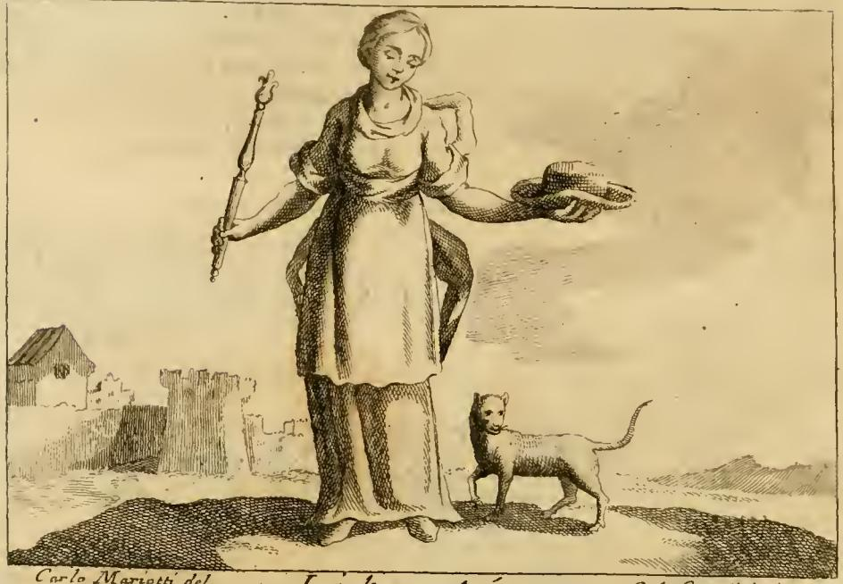

# '자유(Libertà)' 도상의 모자(cappello)는 왜 자유의 상징인가

## 한 줄 답

로마인이 노예를 해방시킬 때 **머리를 밀고 모자(pilleus)를 씌우는** 절차를 밟았고, 이 의식이 자유를 얻는 자들의 수호 여신 **페로니아(Feronia)**의 신전에서 행해졌기 때문이다. 그래서 리파는 자유의 여인에게 모자를 들려준다.

---

## 1. 리파의 원문

Cesare Ripa 『Iconologia』 "LIBERTA" 항목의 도상 규정은 다음과 같다.

> *Donna vestita di bianco. Nella destra mano tiene uno scettro. Nella sinistra un cappello; ed in terra vi si vede un Gatto.*
> — 흰옷을 입은 여인. 오른손에는 홀(scettro), 왼손에는 **모자(cappello)**, 그리고 땅에는 **고양이** 한 마리.

모자에 대한 설명 대목이 이 카드의 근거다.

> *Se le dà il cappello, come dicemmo, perciocché quando volevano i Romani dare libertà ad un Servo: dopo di avergli rasato i capelli, gli facevano portare il cappello; e si faceva questa cerimonia nel tempio di una Dea, creduta protettrice di quelli che acquistavano la libertà, e la chiamavano **Feronia**; però si dipinge ragionevolmente col cappello.*
>
> — 그녀에게 모자를 주는 이유는, 로마인들이 노예에게 자유를 주려 할 때 **그의 머리카락을 깎은 뒤 모자를 쓰게 했기** 때문이다. 그리고 이 의식은 자유를 획득하는 이들의 보호자로 여겨진 여신, **페로니아**라 불리는 신의 신전에서 행해졌다. 그러므로 자유를 모자와 함께 그리는 것은 합당하다.

즉 모자는 은유가 아니라 **실제 법적 절차의 물증**이다. 모자를 쓰고 있다는 사실 자체가 "이 사람은 해방된 자유인"이라는 신분 증명이었다.

---

## 2. 판화에서 실제로 보이는 것

판화를 원문 규정과 대조해 보면 요소가 하나씩 맞아떨어진다.

| 판화에서 관찰되는 것 | 원문 규정 | 의미 |
|---|---|---|
| 흰(밝은) 긴 옷을 입은 여인 | *vestita di bianco* | 해방되는 노예에게 입히던 흰옷 관습(피에리오 발레리아노 인용, 리파 후반부) |
| **오른손에 든 짧은 홀** | *scettro* | 자유의 **권위(autorità)**, 스스로에 대한 지배권 — 자유는 정신·신체·재산에 대한 절대적 소유이기 때문 |
| **왼손을 앞으로 뻗어 받쳐 든, 테 없는 납작한 모자** | *un cappello* | **이 카드의 핵심.** 로마의 해방 모자(pilleus). 머리에 쓴 것이 아니라 **관객에게 내보이듯 손에 받쳐 든** 자세인 점이 중요하다 — 로마 주화의 Libertas 도상을 그대로 옮긴 것 |
| 발치의 **고양이** | *un Gatto* | 고양이는 자유를 몹시 사랑하여 남의 힘에 갇히는 것을 견디지 못한다. 고대 알라니족·부르군트족·슈바벤족이 예속을 극도로 싫어한다는 표시로 군기(insegne)에 고양이를 그렸다 |
| 배경의 성벽·건물 / 빈 들판 | (규정 외) | 판화가의 배경 처리 |

모자를 **머리에 쓰지 않고 손에 들어 보이는** 구도는 우연이 아니다. 리파가 같은 항목에서 열거하는 로마 주화들이 정확히 그 자세를 취한다.

---

## 3. 로마의 해방 절차 — 모자가 끼어드는 자리

노예 해방(**manumissio**)의 정식 절차 중 하나인 **vindicta에 의한 해방**(manumissio vindicta / vindicatio in libertatem)의 흐름은 대략 이렇다.

1. 주인이 노예를 정무관(법무관, praetor) 앞으로 데려간다.
2. 조력자(adsertor libertatis)가 "이 자는 자유인이다"라고 주장하고, 주인은 이를 다투지 않는다.
3. 법무관이 **vindicta(막대)**로 노예를 건드리며 자유인임을 선언한다.
4. 노예의 **머리를 삭발**한다.
5. 삭발한 머리에 **pilleus(펠트 모자)**를 씌운다.

리파가 말한 "머리를 깎고 모자를 씌운다"는 4~5단계다. 삭발은 노예 신분의 표지를 지우는 절단선이고, 모자는 새 신분의 표지를 얹는 행위다. **막대(vindicta)와 모자(pilleus) 둘 다 여신 Libertas의 지물(attribute)로 굳어졌다** — 리파의 여인이 홀과 모자를 각각 한 손에 든 구도가 여기서 나온다.

중요한 제약: **노예는 pilleus를 쓸 수 없었다.** 모자를 쓸 자격 자체가 자유인의 표시였으므로, 모자를 씌우는 순간이 곧 신분 전환의 가시적 완결이었다.

---

## 4. 페로니아(Feronia) — 왜 하필 이 여신의 신전인가

- 세르비우스에 따르면 페로니아는 **dea libertorum**, 해방노예들의 수호 여신이다. 숲·야생·샘의 여신이면서 사회의 가장 낮은 층에게 자유와 시민권을 준다고 여겨져 평민과 해방노예에게 특히 사랑받았다.
- 에트루리아 지역에서 널리 숭배되었고(치미노 산의 성림, 루켄세 평야의 신전), 특히 **테라치나(Terracina)의 신전**이 해방 의식 장소로 쓰였다. 노예는 이곳에서 pilleus를 받았다.
- 테라치나 신전의 좌석에 새겨져 있었다고 전하는 문구가 이 관습을 압축한다.

  > **BENE MERITI SERVI SEDEANT, SURGANT LIBERI**
  > "공로 있는 노예는 앉으라, 자유인으로 일어서라."

  노예가 그 자리에 앉았다가 일어서면 자유인이 된다는 뜻이다. 앉음과 일어섬 사이에 삭발과 모자가 놓인다.

- 리비우스는 기원전 217년 해방된 여성들이 페로니아에게 봉헌금을 모았다고 적는다.

리파는 각주에서 페로니아의 기원 전설도 붙인다. 리쿠르고스의 엄격한 법을 견디지 못한 일부 스파르타인이 도시를 떠나 바다를 오래 표류한 끝에 폰티노 평야에 정착했고, 표류(navigazione)에서 이름을 따 그 땅을 페로니아라 부르고 같은 이름의 여신에게 신전을 세웠다는 것이다. **"자유를 사랑하는 스파르타인들이 만든 신"**이라는 서사가 자유와의 결합을 정당화한다. 리파는 덧붙여, 페로니아의 숲에 불이 났을 때 여신상을 옮기려던 사람들이 목재가 다시 푸르게 살아나는 것을 보고 물러섰다는 『아이네이스』 7권의 이야기와, 그 사제들이 타는 숯 위를 맨발로 걸어도 데지 않았다는 전승도 인용한다.

---

## 5. 로마 주화가 남긴 증거 — 리파가 직접 인용하는 것

리파는 모자가 실제로 자유의 지물로 통용되었음을 주화(medaglia) 뒷면들로 뒷받침한다.

- **티베리우스 기념 주화**: 오른손을 뻗고 왼손으로 **pileo, o sia cappello**(필레우스, 즉 모자)를 받쳐 든 여인, 명문 `LIBERTAS AVGVSTA S. C.` — 티베리우스가 여러 영예를 사양하고 원로원의 승인 없이는 통치의 표시가 될 행동을 하지 않아, 모두가 "옛 자유 속에 사는 듯" 느꼈던 시기의 발행으로 추정.
- **갈바 기념 주화**: 오른손에 pileus, 왼손에 창을 든 여인, `LIBERTAS AVGVST.` 및 `R. XL. S. C.`(Remissa Quadragesima, Senatus Consulto) — 소송 대상 금액의 1/40 부담금을 면제해 소송인들에게 본래의 자유를 되돌려주었음을 표시.
- **또 다른 갈바 주화**: 서 있는 여인이 오른손에 작은 pileus를, 왼손은 창에 기댄 모습, `LIBERTAS PVBLICA S. C.`

리파가 소개하는 **다른 버전의 Libertà 도상**들도 모자를 공통 축으로 삼는다.

- 왼손에 **헤라클레스의 곤봉**, 오른손에 `LIBERTAS AVGVSTI EX S. C.` 명문이 새겨진 모자 — 안토니누스 엘라가발루스 메달에 조각된 형태로, **자기 자신의 용기와 덕으로 획득한 자유**를 뜻한다.
- 오른손에 모자, 땅에는 **부러진 멍에(giogo rotto)** — 예속의 파기.

즉 같은 항목 안에서 홀·곤봉·부러진 멍에는 바뀌지만, **모자는 거의 늘 남는다.** 자유 도상의 최소 필수 지물이다.

---

## 6. 후대로의 계승 — pilleus에서 bonnet rouge까지

- 로마 공화정 말기에 pileus는 자유인의 상징으로 확립되었고, 해방 시 노예에게 주어짐으로써 개인적 자유뿐 아니라 **투표권을 포함한 시민으로서의 libertas**까지 표시했다.
- 카이사르 암살 후 브루투스 측이 pileus를 새긴 주화를 발행하고, 로마인들은 자유를 요구할 때 장대 끝에 모자를 꽂아 들었다(후대의 **liberty pole**로 이어짐).
- 18~19세기 고전 부흥기에 이 pileus가 **프리기아 모자(Phrygian cap)**와 **혼동**되었다. 두 모자는 기원이 다르지만, 이 혼동을 거쳐 앞으로 늘어진 붉은 프리기아 모자가 "자유의 모자"로 정착했다.
- 그 결과가 프랑스 혁명의 **bonnet rouge**, 마리안(Marianne)의 붉은 모자, 그리고 미국·중남미 여러 공화국의 문장·주화에 등장하는 liberty cap이다. 리파의 판화에서 여인이 손바닥에 받쳐 든 그 납작한 모자가 계보의 출발점 쪽에 놓인다.

---

## 7. 암기용 정리

- **모자 = 절차의 산물**: 삭발(옛 신분 제거) → 모자 씌우기(새 신분 부여). 노예는 모자를 쓸 수 없었다.
- **장소 = 페로니아 신전**(테라치나). 페로니아는 dea libertorum, 해방노예의 수호 여신.
- **짝 지물 = vindicta(막대/홀)**. 법무관이 막대로 건드려 선언 → 그래서 리파의 여인은 홀과 모자를 양손에 든다.
- **함께 나오는 상징**: 흰옷(해방 시 복장), 반지, 고양이(예속을 못 견딤), 부러진 멍에, 곤봉(자력으로 얻은 자유).
- **후대**: pilleus → (혼동) → 프리기아 모자 → 프랑스 혁명 bonnet rouge / 마리안.

---

## 출처

- 원문: `.fm/assets/02 Letters to Lust.md` — "LIBERTA" 항목 (Cesare Ripa, 『Iconologia』, 각주 (a) 포함)
- 판화: `.fm/assets/Iconologia (Cesare Ripa)/_page_37_Picture_3.jpeg` (Carlo Marietti del.)
- [Pileus (hat)](https://en-academic.com/dic.nsf/enwiki/7211895)
- [Manumission](https://kids.kiddle.co/Manumission)
- [Feronia (mythology) — Wikipedia](https://en.wikipedia.org/wiki/Feronia_(mythology))
- [November 13 – The Feast of Feronia, Patron Goddess of Freed Slaves](https://dinosaursandbarbarians.com/2024/11/11/november-13-the-feast-of-feronia-patron-goddess-of-freed-slaves/)
- [Phrygian Cap, a Symbol of Freedom Based on Historical Confusion](https://www.labrujulaverde.com/en/2023/12/phrygian-cap-a-symbol-of-freedom-based-on-historical-confusion/)
- [Phrygian cap — Wikipedia](https://en.wikipedia.org/wiki/Phrygian_cap)
- [Liberty pole — Wikipedia](https://en.wikipedia.org/wiki/Liberty_pole)
