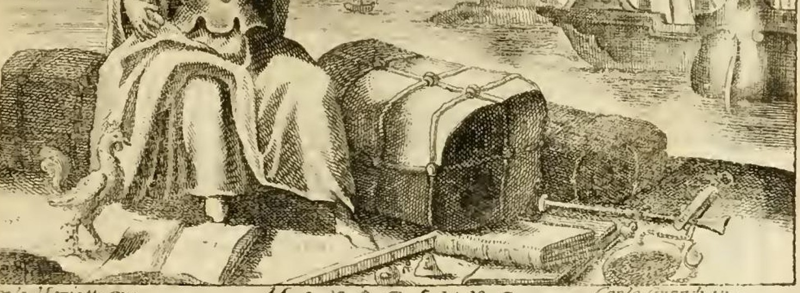
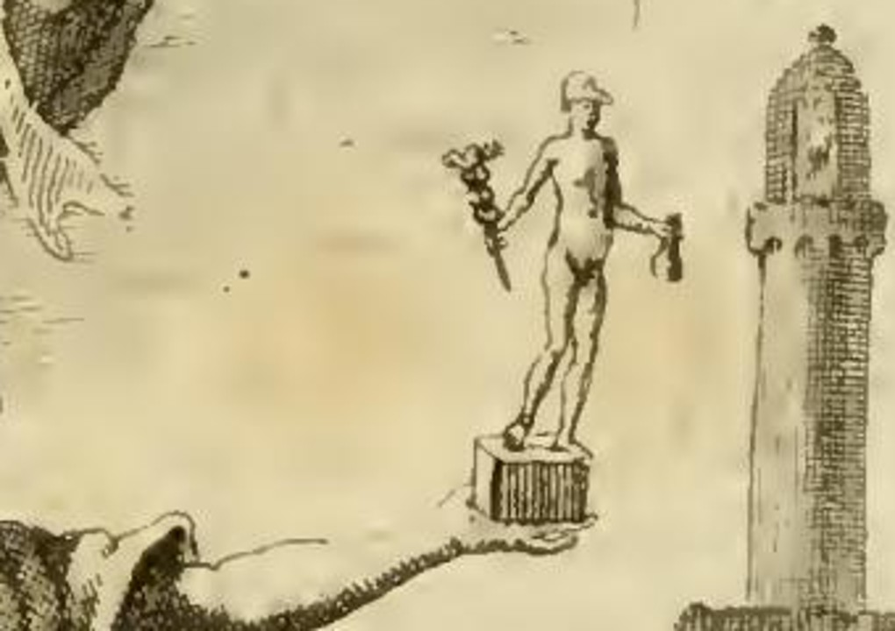
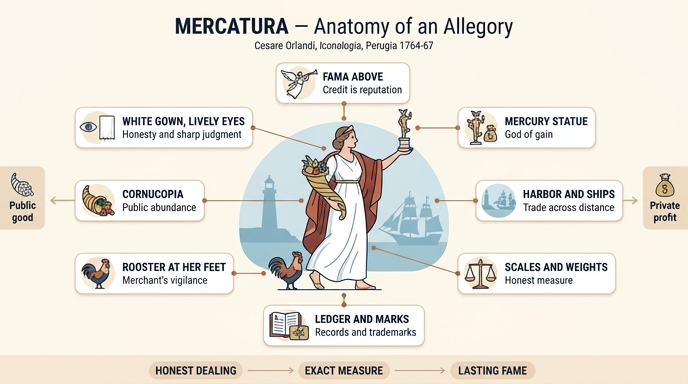

# 오를란디의 '상업(Mercatura)' 의인상 — 도상 전체 지도

> **Q.** 오를란디는 '상업(Mercatura)'을 어떻게 의인화했는가?

이 카드는 세부 근거가 아니라 **도상 전체의 구성**을 묻는 개관 카드다. 즉 "무엇이 그려졌는가"의 목록과 배치를 먼저 머리에 넣고, 개별 지물의 근거는 뒤따르는 카드에서 채우면 된다.

---

## 1. 오를란디의 원문 규정 (도상 처방)

항목 표제는 `MERCATURA. Dell' Abate Cesare Orlandi` — 즉 **리파의 원저 항목이 아니라 편집자 오를란디가 직접 새로 쓴 항목**이다. 도상 처방은 다음과 같다(원문 OCR의 긴 s를 정자로 옮김).

> Donna bella, riccamente vestita con abito di color candido; sia di occhi vivaci. Si ponga avanti un Porto di mare con veduta di Navi, Vascelli ec. Tenga in una mano il corno di dovizia. Coll'altra sostenga una statuetta di Mercurio, che abbia in mano una borsa di denari. Sia in atto di camminare in fretta. Le stia appiedi un Gallo. Si osservino appresso la figura varj libri mercantili, diverse balle, misure, bilance, pesi, marche, ec. In aria si veda volante la Fama.

번역:

> 아름다운 여인, 순백색(candido) 옷을 화려하게 차려입었고, 생기 있는 눈(occhi vivaci)을 가졌다. 그 앞에 배와 선박들이 보이는 항구를 놓는다. 한 손에는 풍요의 뿔(corno di dovizia)을 든다. 다른 손으로는 돈주머니를 든 메르쿠리우스의 작은 상(statuetta)을 받쳐 든다. 서둘러 걷는 자세를 취한다. 발치에는 수탉(Gallo)이 있다. 인물 곁에는 여러 상업 장부, 여러 꾸러미(balle), 계량기(misure), 저울(bilance), 추(pesi), 상표(marche) 등이 보인다. 공중에는 명성(Fama)이 날고 있다.

그리고 정의:

> E' la Mercatura una Professione, che consiste nel comprare, vendere, e cambiare roba a fin di guadagno.
> — 상업은 **이익을 얻기 위해(a fin di guadagno) 물건을 사고, 팔고, 교환하는 직업**이다.

이 한 문장이 뒤의 모든 도덕적 논의의 출발점이다. '이익'이 목적으로 정의에 박혀 있기 때문에, 오를란디는 곧바로 "그 이익이 정당한가"를 따지게 된다.

---

## 2. 판화에서 실제로 보이는 것

원문 처방과 판화를 하나씩 맞춰 보면 다음이 확인된다.

| 화면 위치 | 관찰되는 것 |
|---|---|
| 화면 상단 | **명성(Fama)** 이 날개를 펴고 날며 긴 나팔을 불고 있다 |
| 인물 오른손(관람자 왼쪽) | 팔을 뻗어 **받침대 위의 메르쿠리우스 소상**을 들어 올림 — 페타소스(날개 모자), 한 손에 카두케우스, 다른 손에 **돈주머니** |
| 인물 왼쪽 어깨 뒤 | 과실·잎이 쏟아지는 **풍요의 뿔(cornucopia)** |
| 배경 | **항구** — 등대(molo의 lanterna), 정박한 대형 범선의 돛대와 깃발, 멀리 작은 배들 |
| 인물 발치 왼쪽 | **수탉** 한 마리 |
| 인물 주위·전경 | 끈으로 묶인 **꾸러미(balle)** 더미, 펼쳐진 **장부/서류**, 눈금이 새겨진 **계량 자와 원통형 되(misure)**, **저울대와 접시(bilance)**, **추(pesi)** |
| 하단 여백 | 왼쪽에 도안자 서명(… pin.), 가운데 표제, 오른쪽에 판각자 서명(… inc.) |

**텍스트와 판화의 어긋남 한 가지:** 원문은 "서둘러 걷는 자세(in atto di camminare in fretta)"를 지시하지만, 판화의 여인은 오히려 상품 꾸러미 위에 **걸터앉은/막 일어서려는** 자세로 새겨져 있다. 페루자판 판화는 텍스트 처방을 문자 그대로 옮기지 않는 경우가 흔하다. 시험 답안으로는 원문 처방(서둘러 걷는 자세)을 쓰는 것이 맞고, 판화를 볼 때 이 차이를 알아두면 좋다.

---

## 3. 요소별 의미 — 오를란디 자신의 해설

오를란디는 도상 처방 뒤에 각 지물을 **하나씩 자기가 해설**한다(항목 후반부). 근거가 원문 안에 있다는 점이 이 항목의 특징이다.

| 지물 | 오를란디의 의미 부여 | 핵심어 |
|---|---|---|
| 아름답고 **화려한 옷** | 직업 자체의 가치(pregio), 상업을 하려면 필요한 **자본**, 그리고 현명하게 하면 점점 늘어나는 **부** | 富·資本 |
| **순백색(candido) 옷** | 상인에게 요구되는 **결백함과 정직한 처신**(schiettezza ed onorato procedere) | 信用 |
| **생기 있는 눈** | 정신의 활발함, 생각의 예민함, 여러 사물에 대한 지식, 일 처리의 **뛰어난 눈치**(accortezza) | 判斷力 |
| **항구와 배** | 먼 나라에서 부족한 물자를 들여오고 남는 것을 내보내는 상업의 본질(=항해가 필수) + 바다는 **위험·고난·손실의 상징** | 交易·危險 |
| **풍요의 뿔** | 상업이 가져오는 부 — 종사자에게도, **국가(Stato)에게도** | 公的 富 |
| **돈주머니를 든 메르쿠리우스 소상** | 고대인이 이 모습을 곧 '상업'으로 읽었다(이익과 상품의 신) | 私的 利益 |
| **수탉** | 상인에게 필수인 **경계·주의(vigilanza)** — 고대에도 메르쿠리우스 상 발치에 놓았다 | 警戒 |
| **서둘러 걷는 자세** | 상인이 자기 사업을 다루는 **신속함과 부지런함**(sollecitudine e diligenza) | 迅速 |
| **장부·꾸러미·계량기·저울·추·상표** | 상업에서 실제로 **쓰이고 반드시 필요한 것들**의 표지(distintivo) | 計量·記錄 |
| **명성(Fama)** | 정직한 처신과 좋은 물건으로 **세상에서 이름을 얻어야** 하고, 그것을 얻으면 이익은 확실해진다 | 評判=信用 |

### 원문 인용의 요점

- **메르쿠리우스+수탉**: 첼리오 아우구스토 쿠리오네 『상형문자론』 — "돈주머니를 쥔 메르쿠리우스 상에 수탉을 그 받침대에 놓아 이익·상업·상인을 나타냈다… 수탉은 경계의 상징이니 상인은 깨어 있어야 하고 밤을 온통 잠에 내주어서는 안 된다는 뜻." 조르지오 코디노스, 오비디우스 『행사력』 5권("나에게 이익을 주소서…"), 플라우투스 『스티쿠스』도 함께 인용된다.
- **바다=위험**: 발레리아노(lib. 38)를 근거로, 단 한 번의 폭풍이 부자를 순식간에 비참으로 떨어뜨린다고 하며 프로페르티우스를 인용한다.
- **신속함의 함정**: 카이사르(루카누스 인용)를 부지런함의 모범으로 들면서도, 겉으로만 바쁜 사람은 아무것도 결정하지 못하는 **'괜히 분주한 자(Faccendiere / Ardelione)'** 일 뿐이라며 마르티알리스의 아탈루스 풍자시를 붙인다.

---

## 4. 왜 이 조합인가

세 층이 겹쳐 있다고 보면 정리된다.

1. **상업의 활동 조건 (배경·수단)** — 항구·배·꾸러미: 상업은 공간을 넘어 물자를 옮기는 일이다. 그래서 바다가 배경이고, 그 바다는 동시에 위험이다.
2. **상업의 결과 (양손의 대비)** — 한 손의 **풍요의 뿔** = 공동체가 얻는 풍요, 다른 손의 **돈주머니 든 메르쿠리우스** = 개인이 얻는 이익. 오를란디는 이 둘을 나란히 들려 놓음으로써 "사적 이익 추구가 공적 이익과 양립한다"는 18세기 계몽기의 상업 옹호 논리를 이미지 안에 넣었다.
3. **상업이 요구하는 덕 (인물의 몸과 곁의 도구)** — 흰옷(정직) · 생기 있는 눈(판단) · 서두르는 걸음(신속) · 수탉(경계), 그리고 **저울·추·상표·장부**. 마지막 항목이 중요하다. 상업의 신뢰는 마음가짐만으로 성립하지 않고 **정확한 계량과 표식, 기록**이라는 기술적 기반 위에 선다. 그리고 그 모든 것의 결과가 하늘의 **명성** 이다 — 상인에게 신용은 곧 평판이라는 말이다.

즉 도상 전체가 "**정직·경계·신속하게, 정확한 계량으로 장사하면 사적 이익과 공적 풍요가 함께 오고 명성이 뒤따른다**"는 한 문장을 그림으로 풀어 놓은 것이다.

---

## 5. 체사레 오를란디(Cesare Orlandi)는 누구인가

- 1734년 페루자에서 태어나 1779년에 죽은 성직자·문인('Abate'). 그가 편집·증보한 판본이 이른바 **페루자판** 『이코놀로지아』 — 정식 제목 *Iconologia del Cavaliere Cesare Ripa Perugino, notabilmente accresciuta d'Immagini, di Annotazioni, e di Fatti dall'Abate Cesare Orlandi* (Perugia: Piergiovanni Costantini, **1764–1767, 전 5권**).
- 이 판본은 리파(1555?–1622) 원저의 **마지막이자 가장 호화로운 판본**으로, 새 판화를 대량 추가하고 각 항목마다 오를란디가 붙인 주석과 **`FATTO STORICO SAGRO`(성경의 사례) / `FATTO STORICO PROFANO`(세속사의 사례) / `FATTO FAVOLOSO`(신화의 사례)** 세 절을 덧붙인 것이 특징이다. 이 '상업' 항목에도 성전에서 상인을 쫓아내는 예수(마태 21 등), 라케다이몬인에게 핀잔 들은 자랑쟁이 상인, 상인으로 변장한 케팔로스와 프로크리스 이야기가 차례로 붙어 있다.
- 표제 아래의 `Dell' Abate Cesare Orlandi`는 **"이 항목은 오를란디의 것"** 이라는 표시다. 리파에게는 'Mercatura' 항목이 없었고, 오를란디가 새로 집필했다. 그래서 이 항목은 **16세기 리파의 알레고리 문법(여인 의인상 + 지물 + 고전 인용) 위에 18세기 계몽기의 상업관이 얹힌** 이중 구조를 갖는다. 상업이 국가에 유익하다는 논변, 프랑스 루이 14세의 1669·1701년 칙령, 영국·브르타뉴의 관행, 이프레임 체임버스의 『백과사전(Cyclopaedia)』 인용 같은 **당대 경제·법 자료**가 알레고리 해설에 섞여 나오는 것이 그 증거다.
- 지역색도 있다. 오를란디는 "이 지극히 저명한 도시(=페루자)의 명예로운 상인들"을 칭찬하며 **조반니 피아차, 조반니 안드레아 카날리** 두 사람을 실명으로 거론한다. 알레고리 사전에 당대 실존 상인의 이름이 등장하는, 대단히 18세기적인 대목이다.

---

## 6. 이 항목이 이어지는 방향 (다음 카드 예고)

오를란디는 도상 설명에 그치지 않고 상업을 **도덕적으로 평가**하는 쪽으로 논의를 밀고 간다: 귀족이 상업에 종사해도 가문의 명예가 손상되는가(도매 vs 소매의 구분), 키케로 『의무론』의 "영세한 상업은 천하다 / 대규모 상업은 칭찬받을 만하다"는 평가, 속임수·거짓말·거짓 맹세·가격 담합·하자 은폐 같은 **상인의 악덕**, 그리고 외상 판매(dare a credenza)가 실은 더 큰 이익을 노린 것이며 이자놀이에 가깝다는 비판 — 이 각각이 뒤따르는 카드들의 주제다. 항구·바다의 상징과 메르쿠리우스·수탉의 근거도 별도 카드에서 자세히 다룬다.

---

## 참고

- 원본: 페루자판 『이코놀로지아』 제4권, `MERCATURA. Dell' Abate Cesare Orlandi` 항목 (해당 판화는 원서 104면 부근).
- [Cesare Orlandi — Wikipedia](https://en.wikipedia.org/wiki/Cesare_Orlandi)
- [Iconologia del cavaliere Cesare Ripa, perugino… dell'abate Cesare Orlandi — Yale University Library](https://collections.library.yale.edu/catalog/10000465)
- [Iconologia del cavaliere Cesare Ripa, perugino — NYPL Digital Collections](https://digitalcollections.nypl.org/collections/iconologia-del-cavaliere-cesare-ripa-perugino)

---

## 인포그래픽

