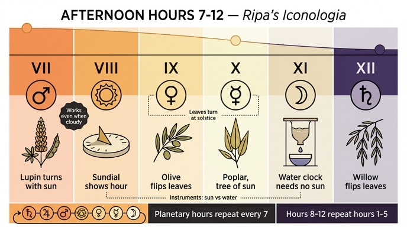

# 낮의 제7시 ~ 제12시 (Ore del Giorno VII–XII)

## 한눈에 보기

리파는 낮 12시간·밤 12시간을 각각 날개 달린 소녀(fanciulla alata)로 의인화한다. 모든 시각은 **두 가지 지물(attributo)** 을 한 손씩 나누어 든다.

- **오른손 = 행성 표지(segno del pianeta)** — 그 시각을 지배하는 행성의 기호
- **왼손 = 자연·기계 시계** — 식물(향일성·하지 반전) 또는 계시 기구

오후는 "해가 기울기 시작하는" 구간이라, 의상 색도 점점 어두워진다.

| 시각 | 행성 표지 | 왼손 지물 | 의상 색 | 지물의 논리 |
|---|---|---|---|---|
| 제7시 | 화성 ♂ | **루핀(lupino) 콩가지** (꼬투리 달린 가지) | 오렌지색(ranciato) | 매일 해를 따라 돌며, **흐린 날에도** 농부에게 시각을 알려줌 (플리니우스 『박물지』 18권 14장) |
| 제8시 | 태양 ☉ | **해시계(oriuolo solare)** — 그림자가 제8시를 가리킴 | 흰색+오렌지 캉장 | 제1시와 같은 태양 표지가 돌아옴. 해시계는 낮의 시간과 밤의 시간을 구별해 준다는 표시 |
| 제9시 | 금성 ♀ | **올리브 가지** | 담황색(giallo pagliato) | 하지(Solstizio)에 잎을 뒤집는 나무 — 플리니우스 전거 |
| 제10시 | 수성 ☿ | **포플러(pioppo) 가지** | 검은 기 도는 노랑 | 올리브와 같은 의미(하지 잎 반전). 폰타노가 "태양의 나무 / Phaetontias arbor(파에톤의 나무)"라 부름 |
| 제11시 | 달 ☾ | **클렙시드라(clepsydra, 물시계)** | 노랑·검정 캉장 | 해가 없어도 작동하는 시계. 키케로·마르티알리스 인용, 발명자는 알렉산드리아의 크테시비오스(비트루비우스 9권) |
| 제12시 | 토성 ♄ | **버드나무(salce) 가지** | 보라색(violato) | 포플러·올리브·버드나무는 모두 하지에 잎을 뒤집는다(플리니우스) |

## 1. 행성 표지는 왜 저 순서인가 — 칼데아 행성시(planetary hours)

리파는 제1시 설명에서 못 박는다. 고대인은 낮 12시간·밤 12시간을 나누고 각 시간을 하나의 행성이 지배하게 했으며, 이를 **행성시(ore planetali)** 라 불렀다(조반니 사크로보스코, 그레고리오 지랄디 인용).

지배 순서는 **칼데아 순서(공전주기가 긴 것부터)**:

```
토성 → 목성 → 화성 → 태양 → 금성 → 수성 → 달  (그리고 다시 토성...)
```

리파는 "시간을 구별하고 시간의 척도인" **태양**에서 출발한다. 그러면 낮 12시간은 자동으로 이렇게 배열된다.

| 시 | 1 | 2 | 3 | 4 | 5 | 6 | 7 | 8 | 9 | 10 | 11 | 12 |
|---|---|---|---|---|---|---|---|---|---|---|---|---|
| 행성 | ☉ | ♀ | ☿ | ☾ | ♄ | ♃ | ♂ | ☉ | ♀ | ☿ | ☾ | ♄ |

핵심은 **주기가 7**이라는 점이다. 따라서

- **제8시 = 제1시 + 7 → 태양**(그래서 제1시와 지물 표지가 겹친다. 리파 자신이 "제1시도 같은 태양 표지를 가진다"고 인정한다)
- **제9시 = 제2시 + 7 → 금성**, **제10시 = 제3시 + 7 → 수성**, **제11시 = 제4시 + 7 → 달**, **제12시 = 제5시 + 7 → 토성**

즉 제8~12시의 행성은 외울 것이 아니라 **제1~5시를 7칸 밀면 나오는 자동 결과**다. 제7시의 화성만이 제6시(목성) 다음의 새 항목이다.

같은 규칙이 밤에도 이어진다. 밤 제1시(=통산 제13시)는 목성 ♃, 밤 제10시(=통산 제22시)는 태양 ☉ — 실제 리파 본문과 정확히 일치한다. 그리고 이 사슬을 24시간 돌리면 다음 날 제1시는 달이 되어 **일요일 → 월요일**이라는 요일 이름이 생긴다. 리파가 인용한 사크로보스코의 논지가 바로 이것이다.

> 다만 리파는 "요일마다 각 시간의 표지가 실제로는 달라지지만, 우리는 특정 요일과 무관하게 낮 12시간·밤 12시간을 절대적으로 그린다"고 단서를 단다. 즉 이 표는 **태양에서 시작하는 표준 견본**이다.

## 2. 식물이 왜 시계 노릇을 하는가

오후의 지물 중 넷이 식물이다. 두 개의 서로 다른 원리가 쓰인다.

### (a) 향일성 — 하루 단위 시계 (제7시 루핀)

루핀은 매일 해를 따라 몸을 돌린다. 리파가 그대로 옮긴 플리니우스 라틴 원문:

> *Nec ullius quae seritur natura assensu terrae mirabilior est: primum omnium cum sole quotidie circumagitur, horasque agricolis etiam nubilo demonstrat.*
> (재배 작물 중 흙에 대한 순응이 이보다 놀라운 것은 없다. 무엇보다도 매일 해와 함께 돌며, **구름 낀 날에도** 농부에게 시각을 알려 준다.)

여기서 결정적인 단어가 **etiam nubilo(흐린 날에도)** 다. 해시계는 구름이 끼면 무용지물인데 루핀은 그렇지 않다 — 그래서 "농부의 시계"다. 이 점은 뒤의 제11시 클렙시드라(해가 없어도 가는 시계)와 짝을 이룬다.

오전에도 같은 향일성 원리가 쓰였다. 제2시는 엘리트로피오(해바라기류)/치커리 꽃다발, 제5시는 엘리트로피오(플리니우스 + 바로 인용, 오비디우스의 클리티에 신화), 제6시는 로토스(해와 함께 물에서 솟았다가 해가 지면 다시 잠기는 풀). 즉 **오전은 "해를 향해 도는 꽃", 오후는 "하지에 잎을 뒤집는 나무"** 로 성격이 갈린다.

### (b) 하지 잎 반전 — 한 해 단위 표지 (제9·10·12시 올리브·포플러·버드나무)

올리브·포플러·버드나무는 **하지(solstizio)를 기점으로 잎의 앞뒤가 뒤집힌다**는 플리니우스의 관찰이 근거다. 리파는 제9시(올리브)에서 "많은 이의 관찰로 확인되었고 플리니우스도 증언한다"고 하고, 제10시(포플러)에서 "올리브와 같은 의미"라 하며, 제12시(버드나무)에서 "포플러·올리브·버드나무가 하지에 잎을 뒤집는다"고 셋을 한꺼번에 묶는다.

- 이 나무들은 **하루의 시각이 아니라 태양의 연중 전환점(하지)** 을 몸으로 표시한다. 리파는 이를 "해가 정점을 지나 기울기 시작한다"는 오후의 의미와 겹쳐 놓았다 — 낮의 후반부 = 태양의 하강 국면이라는 미시적/거시적 대응.
- **포플러**에는 신화 보강이 붙는다. 파에톤이 추락해 죽자 그 누이들(헬리아데스)이 포플러로 변했다는 이야기 때문에 폰타노가 *Phaetontias arbor*("파에톤의 나무")라 부르고, 태양의 나무(albero del Sole)로 통한다. 수성 표지를 든 시각이지만 지물 자체는 태양 계보다.

## 3. 기구 두 개 — 해시계와 물시계

### 제8시: 해시계(oriuolo solare)
- 그림자가 **제8시를 가리키도록** 그린다.
- 제3시에도 같은 해시계가 나오는데, 리파는 "제3시와 제스처를 다르게 하라 — 의미가 달라서가 아니라 **변화를 주어 그림을 아름답게 하기 위해서**"라고 화가에게 지시한다. 도상학적 잉여가 아니라 회화적 변주라는 점을 스스로 밝힌 드문 대목.
- 해시계 발명자는 밀레토스의 아낙시메네스(탈레스의 제자)로 제3시 항목에 적혀 있다(플리니우스 2권).
- 해시계는 "낮의 시간과 밤의 시간을 구별함"을 뜻한다 — 태양 표지가 제1시에서 되돌아온 자리에 붙은 것이 우연이 아니다.

### 제11시: 클렙시드라(clepsydra, 물시계)
- **달 표지**와 짝. 해 없이 작동하는 시계라 밤/달과 어울린다.
- 전거가 두툼하다. 키케로 『신들의 본성에 관하여』 2권("solarium vel descriptum aut ex aqua"), 『투스쿨룸 논총』 끝의 *Cras ergo ad clepsydram*, 『연설가론』, 마르티알리스 6권 — 고대에 **연설 시간을 재는 도구**였다는 용법.
- 제도사: 스키피오 나시카가 로마 건국 595년(기원전 159년)에 물로 밤낮의 시간을 균등하게 나누었다. 이유는 **해시계가 흐린 날 쓸모없었기 때문**(플리니우스 7권).
- 발명자: 알렉산드리아의 크테시비오스, 이발사의 아들(비트루비우스 『건축십서』 9권).

> 흐린 날 문제가 제7시(루핀)와 제11시(클렙시드라) 양쪽에서 반복된다. **자연 시계(루핀) ↔ 인공 시계(클렙시드라)** 가 같은 결함(해시계의 한계)을 각각 다른 방식으로 메우는 구도다.

## 4. 오후의 색 진행

리파는 제8시에서 "여기까지면 남은 시간들의 의상 색 설명으로 충분하다"며 원리를 밝힌다. **시간이 갈수록 낮이 기울고 빛을 잃는다.**

```
제7시 오렌지(직전 시각의 하강 시작) → 제8시 흰+오렌지 → 제9시 담황색
→ 제10시 검은 기 도는 노랑 → 제11시 노랑+검정 → 제12시 보라
```

제12시에는 실리우스 이탈리쿠스의 시구가 붙어 저녁 그림자가 물가로 밀려오는 정경을 그린다.

## 암기 요령

- **행성**: "제1~5시를 7칸 밀면 제8~12시" — ☉ ♀ ☿ ☾ ♄ 가 그대로 반복. 새 항목은 제7시 화성뿐.
- **지물**: 7 루핀(하루 향일성) → 8 해시계 → 9 올리브 / 10 포플러 / 12 버드나무(하지 잎 반전 3형제) → 11 물시계.
- **기구는 두 번**: 8시 해시계(해가 있을 때) ↔ 11시 물시계(해가 없어도).

## 인포그래픽


