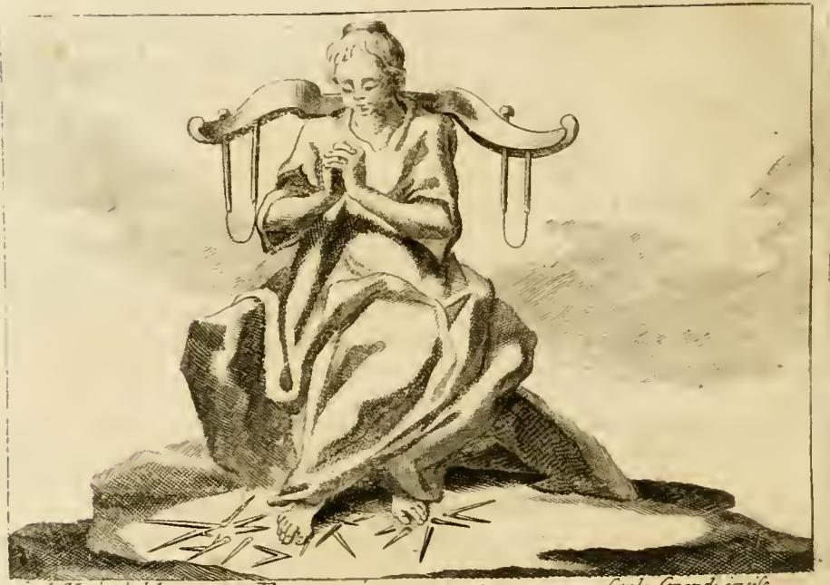

# 인내 (PAZIENZA / Patience)

## 리파의 원문 정의

> **Donna di età matura, a sedere sopra un sasso, con un giogo in ispalla, e colle mani in modo che mostri segno di dolore, e colli piedi ignudi sopra un fascio di spine.**
>
> 성숙한 나이의 여인. **바위 위에 앉아** 있고, **어깨에 멍에**를 지고, **손은 고통의 표시**를 하는 모양이며, **맨발로 가시 다발을 밟고** 있다.

리파는 이어서 인내의 본질을 이렇게 규정한다. "인내는 몸과 마음의 고통을 견뎌내는 데서 드러난다(La Pazienza si scuopre nel sopportare i dolori del corpo, e dell'animo). 그러므로 이 인물을 이런 자세로 그린다."

즉 인내는 '아무 일도 일어나지 않는 평온'이 아니라 **실제로 아픔이 가해지는 상태에서의 버팀**이다. 그래서 도상 전체가 '고통의 원인 + 그 고통을 받는 신체 + 흔들리지 않는 자세'라는 세 겹으로 짜여 있다.

## 판화에서 실제로 보이는 것

판화를 보면 원문의 지시가 하나씩 그대로 옮겨져 있다.

- **어깨 위의 멍에** — 소의 목에 씌우는 이중 아치형 나무 멍에가 양 어깨를 가로질러 걸쳐져 있고, 양쪽 끝에서 목을 채우는 막대(bows)가 아래로 드리워져 있다. 여인은 이 멍에를 손으로 붙잡지도, 벗어던지지도 않는다. 그저 **얹힌 채로 있다** — 짐을 없애는 것이 아니라 짐을 진 상태를 견디는 것이 인내라는 뜻.
- **가슴 앞에 맞잡아 비튼 두 손** — 원문의 "손이 고통의 표시를 하도록(mostri segno di dolour)"에 해당한다. 손가락을 서로 얽어 짜는(wringing) 몸짓은 근세 도상에서 억눌린 고통·비통의 관습적 기호다. 얼굴은 소리치지 않고 아래로 숙여져 있어, **고통은 실재하지만 밖으로 터져 나오지 않는다**는 상태를 보여준다.
- **엉덩이 아래의 거친 바위** — 방석도 의자도 없는 맨 바위 덩어리에 앉아 있다.
- **발밑에 흩어진 뾰족한 가시 다발** — 화면 하단에 날카로운 가시들이 방사형으로 널려 있고, 여인의 **맨발**이 그 위에 놓여 있다. 몸의 다른 부분은 옷으로 덮여 온전한데, 오직 발만 노출되어 가시에 닿아 있다는 대비가 눈에 보이게 그려져 있다.

## 상징 해석

### 가시 — 명예·재산·목숨을 찌르는 아픔

> Le spine sono quelle punture, che toccano nell'onore, o nella roba, o nella vita, le quali sebbene pungono i piedi, cioè danno fastidio nel corso degli affetti terreni; nondimeno lasciano libera la testa, e le altre membra più nobili, perché un'anima ben regolata, e ben disposta sopra la stabilità della virtù, non prova il danno fondato nelle cose terrene.

가시는 사람을 찔러오는 세 종류의 타격, 즉 **명예(onore)·재산(roba)·목숨(vita)**에 가해지는 상처를 뜻한다. 여기서 핵심은 **찔리는 부위**다.

- 가시는 **발만 찌른다.** 발은 지상에 닿는 부분, 곧 **세속적 애착(affetti terreni)이 오가는 통로**다. 그러므로 세속의 손실은 우리의 '가장 낮은 층'에만 상처를 낸다.
- 반면 **머리와 그 밖의 더 고귀한 지체(la testa, e le altre membra più nobili)는 자유롭게 남는다.** 머리는 이성·영혼의 좌소이므로, 재산이 털려도 명예가 훼손되어도 **판단과 영혼 자체는 손대지 못한다.**
- 결론: **덕의 견고함 위에 잘 서 있는 영혼(un'anima ben regolata sopra la stabilità della virtù)은 지상의 것에 근거한 손해를 손해로 느끼지 않는다.** 스토아적 논리 — 외적인 것은 참된 선이 아니므로 그것의 상실은 참된 악이 아니다.

이 대비 구조("발은 찔리나 머리는 자유롭다")가 이 항목 전체의 논지이며, 시험에서 가장 자주 물어지는 지점이다.

### 바위 — 어렵지만 이겨낼 수 있음

> Il sedere sopra il sasso dimostra essere dura cosa saper reggere la Pazienza con animo tranquillo, ma che facilmente si supera.

바위에 앉는 것은 **"평온한 마음(animo tranquillo)으로 인내를 지탱하는 일이 '단단한/힘든 일(dura cosa)'"**이라는 뜻이다. 이탈리아어 `duro`가 '딱딱하다'와 '고되다'를 동시에 뜻하므로, 딱딱한 바위가 곧 고된 과업의 시각적 쌍말(pun)이 된다. 그런데 리파는 곧바로 덧붙인다 — **"그러나 쉽게 극복된다(facilmente si supera)."** 즉 바위는 좌절의 상징이 아니라 **'딱딱하지만 앉을 수는 있는 자리'**, 나아가 그 위에 자리 잡음으로써 확보되는 **부동(不動)의 기반**이기도 하다. 가시가 찔러도 자세가 무너지지 않는 이유가 이 앉은 바위다.

### 멍에 — 항구하고 평온한 마음으로 역경을 견딤

멍에는 바로 다음에 이어지는 두 번째 인내 도상에서 상세히 풀린다. "멍에는 인내의 표지다. 인내란 앞서 말했듯 **오직 역경을 항구하고 평온한 마음으로 견디는 일(tollerare le avversità con animo costante e tranquillo)**에서만 발휘된다." 리파는 여기에 복음서의 구절을 붙인다 — 그리스도께서 "내 멍에는 편하다"고 하신 것은 그 멍에(계명)를 지킨 뒤에 기다리는 상(賞) 때문이며, 하느님의 영예를 열심히 사모하는 그리스도인은 그 멍에에 스스로 목을 내민다는 것.

## 같은 항목의 다른 변형들 (구별해서 기억할 것)

리파는 PAZIENZA 항목에 여러 대안 도상을 나란히 싣는다. 카드가 묻는 것은 **첫 번째(바위+멍에+가시)**이지만, 혼동하지 않도록 정리해 둔다.

| 변형 | 지물 | 의미 |
|---|---|---|
| **① 바위 + 멍에 + 가시** (카드의 답) | 성숙한 여인, 바위에 앉음, 어깨의 멍에, 고통의 손짓, 맨발로 가시 밟기 | 몸과 마음의 고통을 견딤. 가시는 발(세속)만 찌르고 머리는 자유 |
| ② 회갈색 옷 + 멍에 | `berrettino`(검정에 가까운 회갈색) 옷에 황갈색을 곁들임, 어깨의 멍에, 겸손한 표정 | 검정에 가까운 색 = 고행·불만·고통. 그래도 완전한 검정이 아닌 것은 역경 속에서도 덕이 꺼지지 않는 **희망**(해가 져도 다시 빛이 돋듯). 용기(fortezza)의 주요 효과로서, 필요하다면 종살이의 멍에까지 감당. 참지 못하고 자결한 카토는 오히려 비겁하다고 비판됨 |
| ③ 촛불 + 달팽이 | 켠 횃불/큰 초를 들어 **녹은 밀랍을 자기 맨팔에 흘리고**, 발밑에 달팽이 몇 마리 | 달팽이는 껍데기에 여러 날 틀어박혀 나올 때를 기다리므로 인내의 상징 |
| ④ 수갑 + 물방울 | 회갈색 옷, 두 손에 쇠수갑, 옆의 바위에서 물이 **한 방울씩** 수갑 위로 떨어짐 | 기다릴 줄 아는 자에게는 시작이 나빴어도 결국 모든 일이 잘 된다. 물방울이 쇠를 닳게 하듯(gutta cavat lapidem), 로마 교황청에서 오랜 봉사의 인내만으로 추기경에 오른 예 |

**역사·성경의 예시**로는 모든 것을 잃고도 "주님이 주셨고 주님이 가져가셨다"며 축복한 **욥(Giobbe)**, 그리고 얻어맞고 발길질을 당하고도 동요하지 않았으며 크산티페가 설거지물을 끼얹자 "천둥 뒤에 비 오는 걸 내 알고 있었지"라고만 한 **소크라테스**가 실린다.

## 한 줄 요약

> 성숙한 여인이 **딱딱한 바위**(평온한 인내는 고된 일이나 극복 가능)에 앉아 **멍에**(항구한 마음으로 역경을 짐)를 지고 **고통의 손짓**을 하며 **맨발로 가시**(명예·재산·목숨의 상처)를 밟는다 — 가시는 **발=세속적 애착만 찌르고 머리와 고귀한 지체는 건드리지 못하니**, 덕에 굳게 선 영혼은 세속의 손실로 흔들리지 않는다.
