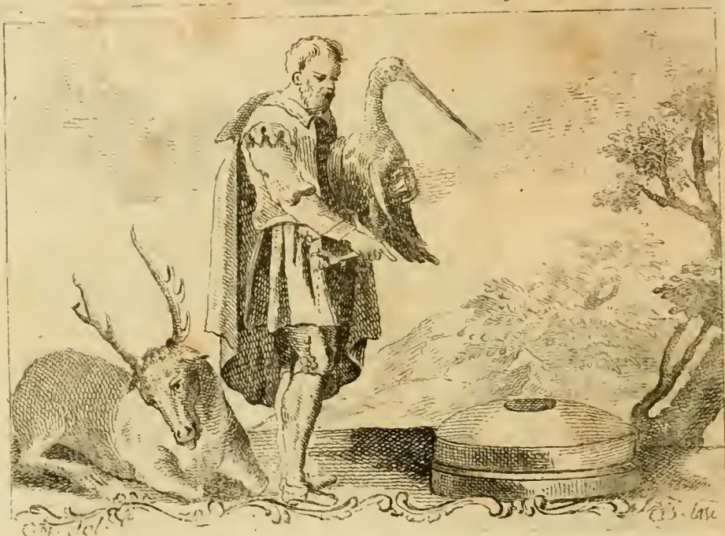

# 상호 필요, 곧 인간 생활의 교류 (Necessità Vicendevole, o sia Commercio della Vita Umana)

## 카드 정리

**질문** — '상호 필요, 곧 인간 생활의 교류'의 도상은?

**답** — 남자가 오른손 검지로 곁의 **이중 맷돌(macina doppia)** 을 가리키고, **왼손에 황새(cicogna)** 를 들고, **발치에 사슴(cervo)** 이 있다. 맷돌은 항상 두 짝이 서로를 필요로 하듯 인간이 혼자서는 모든 것을 할 수 없음을 뜻하며, 그래서 우정을 **'네체시투디네(necessitudini, 필요 관계)'** 라 부른다고 설명한다.

리파 원문의 처방은 이렇다.

> Omo, che col dito indice della destra mano accenni ad una macina doppia, che gli sta accanto. Colla sinistra mano tenga una Cicogna, ed a' piedi un Cervo.
> (남자가 오른손 검지로 곁에 있는 이중 맷돌을 가리킨다. 왼손에는 황새를 들고, 발치에는 사슴이 있다.)

그리고 핵심 논증:

> le macine sono sempre due, ed una ha bisogno dell'altra, e sole mai non possono fare l'opera di macinare: così ancora un Uomo per se stesso non può ogni cosa, e però le amicizie nostre si chiamano necessitudini
> (맷돌은 언제나 둘이고, 하나는 다른 하나를 필요로 하며, 혼자서는 결코 가는 일을 해낼 수 없다. 인간도 마찬가지로 혼자서는 모든 것을 할 수 없으니, 그래서 우리의 우정을 '네체시투디니'라 부른다.)

---

## 원본 도판



도판에서 확인되는 세 가지 배치가 그대로 세 개의 논거에 대응한다.

1. **오른쪽 아래, 두 짝의 맷돌** — 두 개의 둥근 돌이 겹쳐 놓여 있고 위쪽 돌 중앙에 구멍(눈, *oculus*)이 뚫려 있다. 이것이 '이중 맷돌'이며, 남자의 오른팔은 몸 앞으로 내려와 검지로 그쪽을 지시한다. **기계적 상호의존.**
2. **왼팔에 안긴 황새** — 긴 목과 긴 부리가 화면 상단을 가로지르도록 그려져, 목의 길이(= 피로의 원인)가 눈에 먼저 들어오게 배치되어 있다. **비행 중 서로 목을 기대는 협력.**
3. **왼쪽 아래, 엎드린 사슴** — 뿔이 크게 강조된 채 고개를 낮추고 웅크려 있다. 뿔의 무게 때문에 헤엄칠 때 머리를 다른 사슴 등에 얹는다는 이시도루스의 이야기를 가리킨다. **짐을 서로 떠받치는 협력.**

즉 인공물(맷돌) 하나와 동물(황새·사슴) 둘을 나란히 놓아, 상호의존이 기술의 원리이면서 동시에 자연의 원리임을 이중으로 증명하는 구성이다.

---

## 1. 이중 맷돌의 구조 — 반쪽으로는 아무것도 갈 수 없다

회전식 맷돌은 반드시 **두 짝**으로만 작동한다.

| 부분 | 라틴어 | 역할 |
|---|---|---|
| 아랫돌 (고정돌, bedstone) | **meta** | 고정되어 움직이지 않는 받침. 로마식 방아에서는 원뿔 모양 |
| 윗돌 (회전돌, runner stone) | **mola / catillus** | 축을 중심으로 회전. 중앙에 곡물이 들어가는 구멍(*oculus*)이 있다 |

곡물은 윗돌의 구멍으로 들어가 두 돌이 맞닿는 **좁은 틈**을 지나면서 바깥으로 밀려나며 갈린다. 여기서 결정적인 점은, 갈리는 일이 일어나는 장소가 **어느 한쪽 돌의 표면이 아니라 두 돌 '사이'** 라는 것이다. 그래서

- 윗돌만 있으면 받쳐 줄 면이 없어 곡물이 그냥 밀려 나가고,
- 아랫돌만 있으면 누르며 문지를 힘이 없어 곡물이 그대로 얹혀 있다.

각 돌은 단독으로는 성능이 절반인 도구가 아니라, **성능이 0인 도구**다. 이것이 리파가 잡아낸 논리의 정확한 지점이다. 상호의존을 '혼자서도 조금은 되지만 둘이면 더 낫다'(효율의 문제)가 아니라 **'둘이 아니면 아예 성립하지 않는다'**(존재의 문제)로 규정한다. 그래서 이 항목의 제목이 미덕 이름(협동·우애)이 아니라 **'필요(Necessità)'** 인 것이다. 상호부조는 착한 선택이 아니라 인간의 작동 조건이다.

곁가지로 이 이미지가 왜 유독 설득력 있었는지도 짚어 둘 만하다. 맷돌은 전근대인이 매일 보는 가장 흔한 기계였고, 성서에서도 두 짝 맷돌은 생계 자체의 환유였다(신명기 24:6은 "맷돌이나 그 위짝을 담보로 잡지 말라"고 하는데, 한 짝만 떼어 가도 방아 전체가 죽기 때문이다). 한 짝을 빼면 전체가 무용해진다는 감각이 이미 관객 안에 있었다.

---

## 2. `necessitudo` vs `necessitas` — 로마인은 왜 가까운 관계를 '필요'라 불렀나

리파의 문장에서 가장 번역이 어려운 대목이 "우정을 *necessitudini* 라 부른다"이다. 라틴어를 보면 이 문장은 은유가 아니라 **어휘의 사실**을 진술한 것이다.

어원 계열은 이렇다.

```
necesse  (ne- '않다' + cedo '물러나다/양보하다')
   = "물러설 수 없는 것" → 피할 수 없는 것
        ├─ necessitas   : 필연, 강제, 궁핍 (사물·운명 쪽)
        ├─ necessarius  : ① 형용사 "필요한"  ② 명사 "가까운 사람, 인연 있는 사람"
        └─ necessitudo  : ① 필연  ② 친밀한 유대, 혈연·인척·우정 관계 (사람 쪽)
```

핵심은 `necessarius`가 명사로 쓰이면 **"내 사람, 연고자"** 를 뜻한다는 점이다. 즉 라틴어에서 "그는 나의 necessarius다"는 "그는 내게 **없어서는 안 될 사람**이다"와 "그는 나의 **가까운 사이**다"를 한 단어로 말한다. `necessitudo`는 그 관계의 추상명사, 곧 **'필요로 얽힌 상태'** 다.

키케로가 이 어휘의 표준 용례를 만들었다.

- 편지의 상투어 `vetus necessitudo`(오래된 인연), `necessitudo sanguinis`(혈연의 유대) — 여기서 `necessitudo`는 강제나 궁핍이 아니라 **관계의 밀도**를 뜻한다.
- 『의무론』 *De officiis* 1권 53–58절의 유명한 '사회의 단계'(*gradus societatis*) 논의: 인류 전체 → 같은 민족·언어 → 같은 도시 → 친족 → 형제 → 부부·자식으로 좁혀지며 유대가 짙어진다. 이 층위를 가리키는 말이 곧 `necessitudines`다.
- 『우정론』 *Laelius de amicitia*에서 키케로는 오히려 이 통념과 **거리를 둔다**. 이상적 우정(*amicitia*)은 유용성(*utilitas*)에서 생겨나는 것이 아니라 덕과 사랑(*amor*)에서 나오고, 유용성은 우정의 원인이 아니라 결과라는 것이다. 혈연에서는 애정을 뺄 수 있지만 우정에서는 뺄 수 없다고도 한다.

그래서 리파의 문장은 사실 **키케로의 이상론이 아니라 로마 일상어의 감각** 쪽에 서 있다. 우정을 '필요 관계'라 부르는 언어 관습을 그대로 근거로 삼아, 사람 사이의 결속을 도덕적 미덕이 아니라 구조적 결핍에서 도출한다. 카드를 외울 때는 이렇게 잡으면 좋다. **맷돌 = 이 어원의 그림 번역.** 두 짝이 서로에게 '필요'하다는 기계적 사실이, 사람이 서로에게 `necessarius`라는 언어적 사실과 겹친다.

---

## 3. 아리스토텔레스 — 혼자 자족하는 자는 짐승이거나 신이다

리파의 "un Uomo per se stesso non può ogni cosa"(인간은 혼자서 모든 것을 할 수 없다)는 『정치학』 1권의 논변을 압축한 것이다.

- **인간은 본성상 폴리스적 동물**(*ánthrōpos phýsei politikòn zôion*, 1253a). 국가는 계약으로 나중에 만들어진 편의물이 아니라, 인간 본성이 완성되는 자연적 형태다.
- 논증의 출발점은 **자족(αὐτάρκεια, autarkeia)의 결핍**이다. 가정은 "서로 없이는 존재할 수 없는 자들"의 결합에서 시작하고, 가정으로 충족되지 않는 필요 때문에 마을이, 마을로도 안 되어 폴리스가 생긴다. 각 단계는 **앞 단계의 불충분함**이 밀어 올린다.
- 그래서 결론이 유명한 양극이 된다. **공동체 없이 자족할 수 있는 존재는 인간이 아니라 짐승이거나 신이다**(1253a27–29).

리파의 도상과 대조하면 대응이 깔끔하다. 아리스토텔레스에게 폴리스의 근거는 개인의 자족 불가능성이고, 리파에게 맷돌 한 짝의 근거는 그 한 짝의 작동 불가능성이다. 둘 다 **결핍이 결합을 낳는다**는 같은 형식의 논증이다. 다만 아리스토텔레스는 그 결합의 목적을 '좋은 삶(εὖ ζῆν)'에 두는데, 리파는 다음 절에서 보듯 그 결합을 **교역**으로 착지시킨다.

---

## 4. 왜 '상호 필요'가 곧 '상업'인가 — 부제 *Commercio della Vita Umana*의 논리

이 항목의 제목이 "상호 필요, **곧** 인간 생활의 교류"인 것은 리파가 두 개념을 같은 것으로 보기 때문이다. 원문의 논리 사슬은 다음과 같이 이어진다.

1. **격언들** — 그리스에서 온 속담 "한 손이 다른 손을 씻는다"(*Manus manum lavat, & digitus digitum*), 그리고 "**사람이 사람을 살리고, 도시가 도시를 살린다**"(*Homo hominem servat, civitas civitatem*). 여기서 결정적 도약이 일어난다. 상호의존의 단위가 **개인에서 도시·국가로 확대**된다.
2. **그 확대의 실행 수단이 상업이다** — "e questo si fa non con altro mezzo, che col Commercio"(그리고 이것은 상업 외의 다른 수단으로는 이루어지지 않는다). 도시가 도시를 살리는 구체적 행위가 곧 교역이다.
3. **아리스토텔레스의 심의 항목** — 리파는 아리스토텔레스가 "심의(consiglio)의 대상이 되는 다섯 가지" 중 네 번째로 *de iis quae importantur et exportantur*(수입되는 것과 수출되는 것)를 든다고 인용한다. 이는 『수사학』 1권 4장(1359b–1360a)의 목록으로, 정치 연설가가 알아야 할 주제로 재정·전쟁과 평화·국토 방위·**수출입**·입법을 든 대목이다. 리파는 이 '수입과 수출'을 상업의 정의로 쓴다.
4. **섭리 논변(providential argument)** — 가장 흥미로운 대목이다. "이 세계의 위대한 주인(il Gran Maestro di questo Mondo)께서 지혜롭게도 **한 장소에 모든 것을 다 주지 않으셨다**." 지역마다 산물이 다른 것은 자연의 결함이나 우연이 아니라 **의도된 설계**다. 목적은 각 지역이 서로를 필요로 하게 하여, 그 필요를 통해 "한 민족이 다른 민족과 교류하고 어울릴 기회"를 갖게 하는 것이다. 여기서 사고팔기(*permutazione del vendere, e del comprare*)가 나오고, 그것이 곧 **'인간 생활의 상업(Commercio della Vita umana)'** 이다.

이 4번이 이 항목의 사상적 요점이다. 상업은 이윤 추구나 필요악이 아니라 **신이 자원을 불균등하게 배분해 둔 목적을 실현하는 행위**, 즉 인류를 하나로 묶는 섭리의 도구로 격상된다. 항목 끝에서 리파가 "사례는 **상업(Mercanzia)** 항목을 보라"고 넘기는 것도 이 때문이다. 17–18세기 상업 도시(제노바·베네치아·암스테르담)의 자기 정당화 논리로 널리 쓰인 이른바 **'교역의 섭리론(doux commerce의 전사)'** 이 아이코놀로지아 항목 하나에 그대로 들어 있는 셈이다.

정리하면 논증 전체가 하나의 확대 계단이다.

```
맷돌 두 짝 → 친구와 친구 (necessitudo) → 사람과 사람 (manus manum lavat)
          → 도시와 도시 (civitas civitatem) → 나라와 나라 (수출입 = Commercio)
```

같은 원리가 규모만 바꿔 반복된다. 그래서 하나의 알레고리 인물이 '우정'과 '무역'을 동시에 표상할 수 있다.

---

## 5. 검지로 가리키는 손짓 — 도상학의 '이것을 보라' 장치

리파는 그냥 "곁에 맷돌이 있다"고 쓰지 않고 굳이 **"오른손 검지로 가리킨다(col dito indice della destra mano accenni)"** 라고 처방했다. 이 지시(deixis)는 알레고리 도상의 표준 문법이다.

- **어휘 자체가 지시적이다.** 라틴어 *digitus index*는 문자 그대로 '**가리키는** 손가락'이며, *index*는 색인·표지·고발자를 뜻하는 같은 말이다. 이 손가락은 이름부터 기호다.
- **알베르티의 '페스타이우올로(festaiuolo)'.** 알베르티는 『회화론』(*De pictura*)에서, 그림 안에 관객을 향해 지금 무슨 일이 벌어지는지 **알려 주고 이끄는 인물**을 두라고 권했다. 이 인물의 이름은 15세기 연극에서 무대와 관객 사이를 매개하던 배역에서 왔다. 그림 속 손짓은 장식이 아니라 **관객의 시선이 따라가도록 설계된 경로**다.
- **알레고리에서의 기능.** 알레고리 인물은 그 자체로는 뜻이 확정되지 않는다. 뜻은 항상 **지물(attribute)** 이 확정한다. 그런데 지물이 여럿이면(여기서는 맷돌·황새·사슴 셋) 어느 것이 중심 논거인지 위계가 필요하다. 검지가 하는 일이 바로 그 **위계 표시**다. 맷돌이 주논거이고 황새·사슴은 그것을 자연에서 확증하는 보조 사례라는 독해 순서를, 손가락 하나가 지정한다.
- **화면 구성 효과.** 도판을 보면 남자의 왼팔은 황새로 채워져 있어 남는 오른팔이 아래 오른쪽 맷돌로 향한다. 시선은 인물의 얼굴 → 내려가는 오른팔 → 맷돌로 이동하고, 그 아래에서 왼쪽의 사슴과 만나 화면을 한 바퀴 돈다. 지시 손짓이 **읽는 순서를 만드는 장치**로 작동하는 것이다.

암기 팁: **가리키는 손가락 = "이 셋 중 이것이 핵심이다"라는 각주 표시.** 리파에서 검지가 나오면, 그 인물의 정의는 그 손가락이 향한 사물에 있다.

---

## 한 줄 요약

**반쪽으로는 아무것도 갈 수 없는 두 짝 맷돌**을 검지로 가리키는 남자, 목을 서로 기대는 **황새**, 머리를 서로 등에 얹는 **사슴** — 인간의 자족 불가능성(아리스토텔레스)이 언어에는 `necessitudo`(우정 = 필요 관계)로, 세계에는 지역마다 다른 산물을 주신 섭리와 그것을 잇는 **교역**으로 나타난다는 알레고리.

## 참고

- 원전: 체사레 리파 / 체사레 오를란디 편, 『아이코놀로지아』 제4권, "NECESSITA' VICENDEVOLE, O SIA COMMERCIO DELLA VITA UMANA" 항목 (도판: `_page_215_Picture_2.jpeg`)
- 리파가 직접 인용한 전거: 플리니우스 『박물지』 10권 22–23장(황새/두루미의 목 기대기), 이시도루스 『어원지』(헤엄치는 사슴), 아리스토텔레스 『수사학』 1권 4장(수출입)
- 배경 문헌: 아리스토텔레스 『정치학』 1권 1–2장; 키케로 『의무론』 1.53–58, 『우정론』; 알베르티 『회화론』

### 웹 확인 출처

- [Amicitia (Wikipedia)](https://en.wikipedia.org/wiki/Amicitia)
- [Cicero, De Amicitia 18–19 (Haverford OER)](https://oer.haverford.edu/readingfriendship/chapter/cicero-de-amicitia-18-19/)
- [Following the Festaiuolo (Univ. of Vienna, CREA)](https://crea.univie.ac.at/projects/following-the-festaiuolo/)
- [De pictura (Wikipedia)](https://en.wikipedia.org/wiki/De_pictura)
