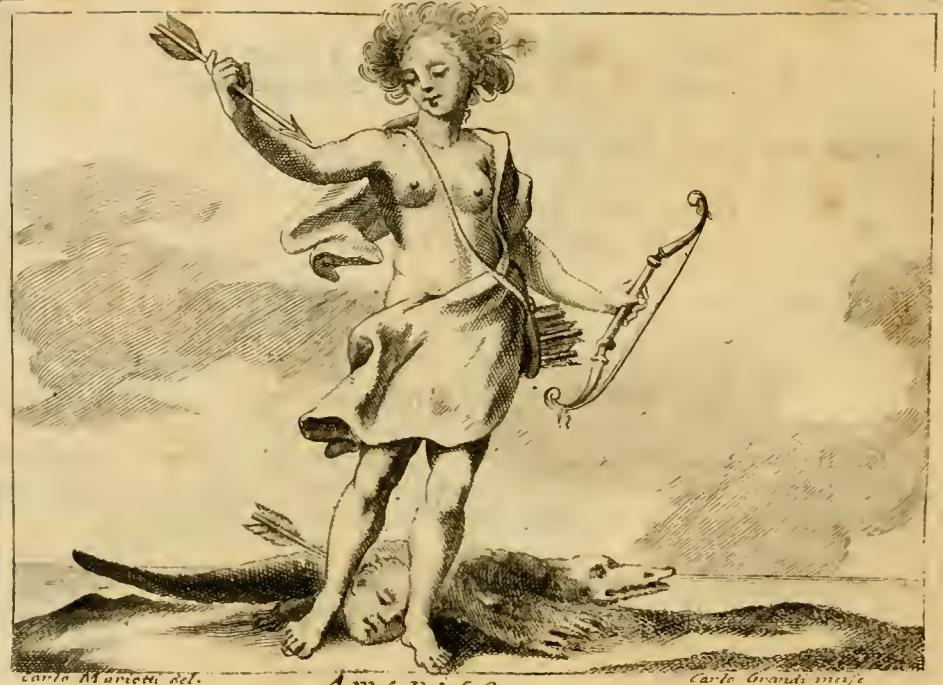

# 리파의 '아메리카(AMERICA)' 의인상

## 1. 원문이 지시하는 도상

체사레 리파 『이코놀로지아』의 「AMERICA」 항목(원문 표제 아래 *Di Cesare Ripa*)은 다음과 같이 규정한다.

> DOnna ignuda, di carnagione fosca, di giallo color misto, di volto terribile, e che un velo rigato di più colori, calandole da una spalla a traverso al corpo, le copra le parti vergognose. Le chiome saranno sparse, ed attorno al corpo sia un vago, ed artificioso ornamento di penne di varj colori. Tenga colla sinistra mano un arco, e colla destra mano una frezza. Abbia al fianco la faretra, parimente piena di frezze. Sotto un piede tenga una testa umana, passata da una frezza; e per terra da una parte sarà una Lucertola, ovvero un Liguro di smisurata grandezza.

정리하면 여덟 가지 요소다.

| 요소 | 원문 표현 | 리파가 붙인 근거 |
|---|---|---|
| 나체 여인 | `Donna ignuda` | 그 지역 사람들이 벌거벗고 다니는 관습(`usanza di que' Popoli di andare ignudi`) |
| 누런빛이 섞인 검은 피부 | `carnagione fosca, di giallo color misto` | 열대 기후 아래 원주민의 피부색이라는 당대 통념 |
| 무서운 얼굴 | `volto terribile` | 사나움·야만성의 표지 |
| 여러 색 줄무늬 베일 | `velo rigato di più colori` | 목화(`bombace`) 등으로 만든 천으로 음부만 가린다는 보고 |
| 풀어헤친 머리 + 여러 색 깃털 장식 | `chiome sparse`, `penne di varj colori` | 깃털 장식은 그들의 관습이며, 때에 따라 **몸 전체에 깃털을 붙이기도** 한다(`impennarsi il corpo`) |
| 왼손의 활 / 오른손의 화살 / 옆구리의 화살통 | `arco`, `frezza`, `faretra` | 활과 화살은 그들의 고유 무기이며, 여러 지방에서는 **남자뿐 아니라 여자도** 늘 사용한다 |
| 발밑의, 화살에 꿰뚫린 사람 머리 | `testa umana, passata da una frezza` | "저 야만족 대부분이 사람 고기를 먹는 데 익숙함을 노골적으로 보여준다" — 전쟁 포로와 사들인 노예를 먹는다는 보고 |
| 거대한 도마뱀(악어) | `Lucertola, ovvero un Liguro di smisurata grandezza` | 그 지방의 특기할 동물로, 너무 크고 사나워서 다른 짐승은 물론 **사람까지 삼킨다**고 함 |

`Liguro`는 스페인어 *lagarto*(도마뱀/악어) 계열의 표기로, 실제로는 악어·카이만을 가리킨다. 판화에서도 도마뱀이라기보다 악어의 형상으로 그려진다.

## 2. 판화에서 실제로 보이는 것

- 여인은 **오른손을 높이 들어 화살을 쥐고**, 왼손에는 **활**을 늘어뜨린다. 원문의 좌우 지정이 그대로 지켜졌다.
- 어깨에서 몸을 가로질러 내려온 **띠 모양의 베일**이 허리 아래를 감싸 음부를 가린다. 가슴은 드러나 있다.
- 머리에는 풀어헤친 머리카락과 함께 **깃털**이 꽂혀 있다.
- 허리 오른쪽으로 **화살이 가득한 화살통**의 깃이 삐져나와 있다.
- 발밑에는 **사람 머리**가 놓여 있고, 그 옆 지면에 **길쭉한 악어**가 화살과 함께 가로누워 있다.
- 판 아래에 `Carlo Mariotti del.` / `Carlo Grandi inc.`(도안·판각자) 서명이 보인다. 즉 이 판본은 1603년 초판의 목판이 아니라 후대(18세기 페루자판 계열)의 재판각본이다.

원문이 열거한 요소가 화면에 거의 빠짐없이 옮겨져 있다는 점이 중요하다. 리파의 텍스트는 **화가에게 주는 시방서**였고, 판화는 그 시방서의 시각적 검증판이다.

## 3. 리파가 밝힌 자료 출처

리파는 이 항목 서두에서 특이한 고백을 한다. **"이 세계 부분은 새로 발견된 것이라 고대 저자들이 아무것도 쓸 수 없었다"**(`Per essere novellamente scoperta questa parte del Mondo, gli antichi Scrittori non possono averne scritto cosa alcuna`). 유럽·아시아·아프리카는 고대 메달과 고전 문헌(하드리아누스·세베루스 메달, 클라우디아누스, 오비디우스, 호라티우스 등)에서 도상을 끌어올 수 있었지만, 아메리카는 그럴 근거가 없었다. 그래서 그는 **동시대 사료**에 의존했다고 밝힌다.

- 지롤라모 질리 신부, 페란테 곤살레스, **조반니 보테로**(Botero, 『Relazioni universali』), 그리고 **예수회 신부들**의 보고
- 몬테풀차노 출신 **파우스토 룽게제(Fausto Rughesi)** 의 구술 — 세계 4대륙 지도(`Tavole di tutte le quattro parti del Mondo`)를 막 출간한 코스모그라피 전문가

즉 아메리카 도상은 고대의 권위가 아니라, **선교사·상인·지도제작자의 여행기 정보를 급조해 알레고리로 굳힌 것**이다. 이것이 다른 세 대륙 항목과 결정적으로 다른 점이다.

## 4. 네 대륙 도상 속에서의 위치

같은 장에 실린 네 대륙을 나란히 놓으면 위계가 드러난다.

- **에우로파(Europa)**: 화려한 옷, 왕관, 신전·서적·악기·무기 — 통치·종교·학문·기예의 소유자
- **아시아(Asia)**: 화려한 옷과 화관, 향로·향료·낙타 — 부와 사치의 땅
- **아프리카(Africa)**: 반쯤 벗은 검은 피부, 코끼리 머리 투구, 산호 목걸이, 전갈·사자·독사, 곡물 풍요의 뿔
- **아메리카(America)**: 완전 나체, 무기, 잘린 머리, 악어 — 옷도, 문명의 상징도 없음

옷을 얼마나 입었는가가 그대로 '문명의 등급'으로 번역된다. 아메리카는 이 사다리의 맨 아래에 놓인다.

## 5. 도상의 계보 — 리파 앞과 뒤

- **앞**: 리파는 무에서 만들어내지 않았다. 16세기 중반 이후 이미 얀 판 데르 스트라트(Jan van der Straet, 라틴명 **스트라다누스**)의 *Nova Reperta / Americen Americus retexit* 판화 — 갑옷과 십자가 깃발을 든 베스푸치가 해먹에서 일어나는 나체 여인 '아메리카'를 '발견'하는 장면 — 와, 테오도어 **드 브리(de Bry)** 가족이 슈타덴·레리의 브라질 여행기를 삽화로 옮긴 *Americae* 연작(1590년대~)이 유통되고 있었다. 드 브리 판화의 인육 조리·사지 절단 장면은 유럽 독자에게 '아메리카=식인'을 각인시킨 결정판이었다. 리파의 '화살에 꿰뚫린 사람 머리'는 이 이미지 창고에서 꺼낸 **압축 기호**다.
- **뒤**: 1603년 삽화판 이후 리파의 아메리카는 표준형이 되어, 지도의 여백 장식(카르투슈), 바로크 천장화, 도자기, 태피스트리로 무한 복제된다. 티에폴로가 뷔르츠부르크 주교궁 계단실 천장에 그린 「네 대륙」(1752-53)의 아메리카 — 악어에 올라탄 깃털관의 여인 — 도 이 계보의 직계 후손이다.

## 6. 이 도상을 어떻게 읽어야 하는가

리파의 '아메리카'는 아메리카에 관한 정보가 아니라, **아메리카를 보는 유럽의 시선에 관한 정보**다. 벌거벗음은 '옷을 만들 줄 모름'으로, 활은 '전쟁밖에 모름'으로, 잘린 머리는 대륙 전체 주민을 향한 '식인종'이라는 일반화로, 거대한 악어는 '사람을 삼키는 자연'으로 번역된다. 이 네 기호가 합쳐지면 결론은 하나다 — 이 땅은 스스로를 다스릴 수 없으므로 누군가가 와서 다스리고 개종시켜야 한다. 정복과 선교를 정당화하는 논리가 알레고리의 문법 안에 미리 심어져 있는 것이다. 더구나 정보원 자체가 선교사와 정복자였으니, 순환 논증에 가깝다. 네 대륙 중 유일하게 가슴을 드러낸 채 관람자를 향하는 여성 신체로 그려진 점도, 대륙을 '차지해야 할 여성'으로 젠더화하는 당대 관습을 그대로 보여준다. 요컨대 이 판화는 신대륙의 초상이 아니라 **타자화의 자화상**이며, 그 사실을 알고 볼 때에만 도상학 자료로서 제대로 기능한다.

---

**참고 자료**

- 원문: `.fm/assets/07 The World and the Continents to Death.md`, 「AMERICA」 항목
- 판화: `.fm/assets/Iconologia (Cesare Ripa)/_page_173_Picture_3.jpeg`
- [Allegories of the Four Continents — The Metropolitan Museum of Art](https://www.metmuseum.org/essays/allegories-four-continents)
- [Jan van der Straet (Stradanus), Allegory of America — The Met](https://www.metmuseum.org/art/collection/search/343845)
- [Continent Allegories in the Baroque Age – A Database (journal18)](https://www.journal18.org/issue5/continent-allegories-in-the-baroque-age-a-database/)
- [Cesare Ripa — Wikipedia](https://en.wikipedia.org/wiki/Cesare_Ripa)
