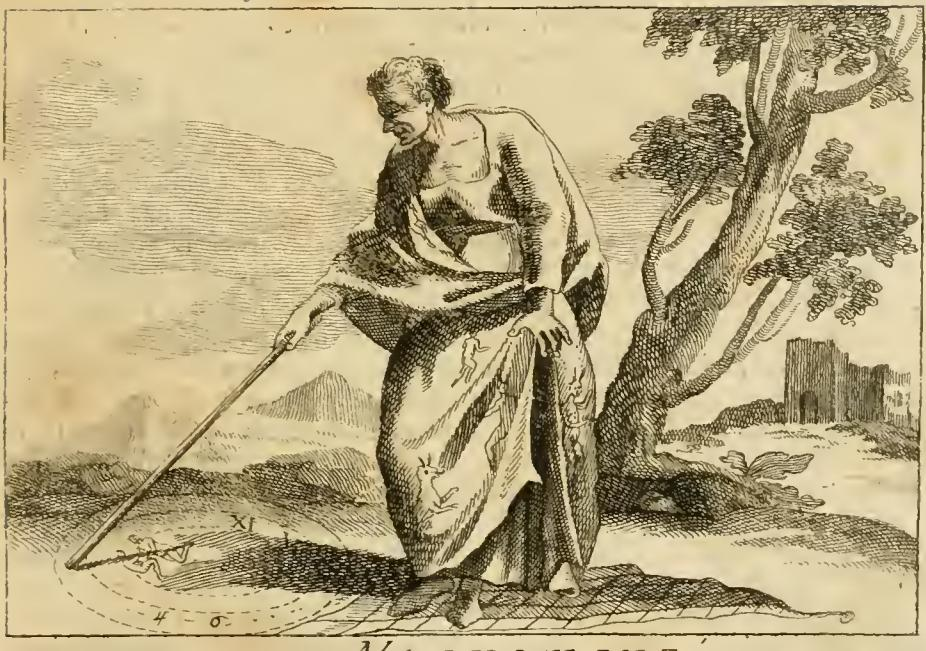

# 강령술(Negromanzia)의 세 지물 — 지팡이·원·그물

**Q.** 강령술 도상에서 지팡이와 원, 그물은 무엇을 뜻하는가?

**A.** 지팡이는 홀이 아닌 천한 막대기로, 짐승에게나 하는 천하고 수치스러운 명령(악마 부림)을 뜻하고, 원은 피에리오에 따라 경배의 상징으로 악마에게 바치는 사악한 경배를 나타낸다. 발밑의 그물은 거짓의 아비를 믿는 강령술사 자신의 기만과, 남을 악에 옭아매려는 술책, 그리고 결국 자기가 지옥의 덫에 걸림을 뜻한다.

이 항목은 리파 원본이 아니라 **체사레 오를란디의 증보**(Perugia, 1764–67)에 새로 들어온 이미지다. 오를란디는 "Di quella formo io l'Immagine"(그 중에서 내가 이 이미지를 만들었다)라고 밝히며, 자기가 형상화한 대상이 마법 일반이 아니라 **`magia ceremoniale`/`demoniaca`**, 즉 "사악하고 불법한 마법"임을 못 박는다. 그래서 세 지물은 모두 **고발용 장치**로 설계돼 있다는 점을 먼저 붙잡아야 한다.

---

## 1. 판화에서 실제로 보이는 것

그림을 실제로 관찰한 요소를, 본문 설명과 하나씩 짝지으면 이렇다.

| 판화에서 보이는 것 | 대응하는 본문 구절 |
|---|---|
| 허리가 꺾일 듯 굽은 노쇠한 인물, 앙상한 목·어깨, 험상궂은 옆얼굴 | `Donna di età senile, e di faccia aspra, rustica, e spaventevole` — 노령과 흉한 얼굴이 이 직업의 기형성·혐오성을 드러냄 |
| 곤두선 헝클어진 머리 | `Ha i capelli rabbuffati` — 공포(orrore)가 피를 얼려 털을 세운다(베르길리우스·오비디우스 인용) |
| 어둡고 긴 망토, 그 위에 **뛰어오르는 네발짐승·뿔 달린 발톱 괴물** 등이 수놓여 있음 | `Manto ricamate varie figure rappresentanti Demonj, Mostri` — 악마와의 거래라는 강령술의 본질 |
| 오른손에 쥔 **아주 가느다란 곧은 막대**, 팔을 뻗어 끝이 땅에 닿아 있음 — 손잡이 장식도, 구슬도, 매듭도 없다 | `Tiene in una mano una verga, colla quale disegna in terra alcuni circoli` |
| 그 막대 끝에서 시작되는 **점선으로 그려진 원**(안팎 두 겹의 동심 호로 보인다) | `alcuni circoli` — 하나가 아니라 여러 겹 |
| 원 안의 **`XI`**, 아래쪽의 **`4`**, 그 옆의 동글게 말린 기호(6 또는 행성·연금술 기호로 읽힌다), 점 몇 개, 그리고 팔다리가 달린 작은 벌레·인간 같은 **꼬불꼬불한 작은 상** | `Le varie immaginette di Uomini, animali ec. caratteri strani, cifre, numeri ec.` |
| **맨발**로 밟고 선, 땅에 펼쳐진 **마름모 격자의 그물** — 오른쪽 끝에 조임끈 고리·매듭까지 보인다(사냥용 그물) | `Posa i piedi sopra la rete` |
| 배경의 **뒤틀린 고목**과 오른쪽 멀리 **폐허가 된 성탑** | 본문에 직접 설명은 없으나, 죽음·황폐·인적 없는 밤의 장소라는 강령술의 무대 관습 |

관찰상 한 가지 유의점: 본문은 이 인물을 **노파**(`Donna`)로 규정하지만, 판화의 얼굴·상반신은 성별이 모호한 노인처럼 새겨져 있다. 판화가가 텍스트를 느슨하게 따랐거나 판본에 따라 새김이 달라진 경우로, 도상 해석에는 영향이 없다.

---

## 2. 지팡이(verga) 대 홀(scettro) — 왜 '막대기'가 정당한 권위의 반대항인가

핵심 문장은 이것이다.

> `Nella verga, che come scettro adopra, si simboleggia il comando, ma un comando vile, e vergognoso; poiché lo scettro è proprio di un comando nobile, e la verga come solita usarsi da povere rozze, e vili persone, come sarebbono i Villani, che con quella comandano alle sole bestie...`
> (그가 **홀처럼 쓰는** 막대기에는 명령이 상징되어 있으나, 그것은 천하고 수치스러운 명령이다. 홀은 고귀한 명령에 고유한 것이고, 막대기는 가난하고 거칠고 천한 사람들 — 예컨대 오직 짐승에게만 그것으로 명령하는 농부들 — 이 쓰는 것이기 때문이다.)

여기서 작동하는 것은 리파식 도상학의 전형적 수법인 **유사 지물의 등급 대립(diminished attribute)** 이다. 강령술사는 "명령하는 자"의 자리에 서 있으므로 명령의 지물을 들어야 한다. 그런데 그 지물을 **홀로 주면 권위를 인정해 버리는 셈**이 된다. 그래서 오를란디는 같은 계열의 최하위 변종을 골라 쥐어 준다.

- **어원과 사회적 함의**: `scettro` < 그리스어 σκῆπτρον(기대는 막대) — 왕·전령·재판관·원로가 짚는 것, 곧 **위임된 합법 권위**의 표지다. 반면 `verga` < 라틴어 *virga*(잔가지, 회초리) — 로마 릭토르의 태형 도구, 목동·마부·농부가 가축을 부리는 몰이 막대, 훈육과 매질의 도구다. 하나는 **동의를 전제한 통치**, 하나는 **강제와 처벌**이다.
- **"짐승에게나 하는 명령"의 이중 타격**: (a) 강령술사가 부리려는 상대가 **이성 없는 짐승 등급**임을 함축한다 — 그런데 그 상대는 악마다. 즉 그는 짐승과 흥정하는 자다. (b) 동시에 화살이 되돌아온다. 짐승을 몰이하는 도구를 든 사람의 신분은 `povere, rozze, e vili persone`, 곧 스스로 천민이다. 지물 하나로 **상대의 격**과 **주체의 격**을 동시에 떨어뜨린다.
- **본문이 명시하는 결론**: `egli fecc[i]a del genere umano si esercita in comandi soprammodo vergognosi, ed infami` — 인간 종의 쓰레기가 지극히 수치스럽고 파렴치한 명령질을 한다는 것. 즉 지팡이는 "권력의 표지"가 아니라 **격하된 권력, 부끄러운 권력**의 표지다.
- **판화가 이 논리를 시각화하는 방식**: 그림 속 막대는 의도적으로 **초라하다.** 굵기가 실낱같고, 곧고, 아무 장식이 없으며, 무엇보다 **위로 들려 있지 않고 땅바닥을 향해 기울어져 흙에 낙서하고 있다.** 홀은 수직으로 세워 쥐는 것이 도상 관습이다. 손에 든 방향 하나로 "명령"이 "땅에 금 긋는 짓"으로 격하된다.

한편 이 대립은 **정당한 목자의 지팡이**(주교의 목장, 시편 23:4의 막대와 지팡이)와도 대비된다. 목자의 지팡이는 영혼을 인도하지만, 강령술사의 막대는 영을 **강제 소환**한다. 인도 대 강제 — 리파류 도상학이 늘 다루는 축이다.

---

## 3. 마법 지팡이는 실제로 어떤 물건이었나 — 그리무아르와 고전 선례

오를란디의 야유가 겨냥하는 실제 관행을 알아야 야유의 무게가 보인다. 근세 마법서(그리무아르) 전통에서 지팡이는 **아무 막대기가 아니라 규정이 극도로 까다로운 제작물**이었다.

**『솔로몬의 열쇠』(*Clavicula Salomonis*) 제2권**의 도구 장(칼·검·낫·단검·창·지팡이·장대 등을 다루는 장)이 대표적이다. 요구 사항의 골자는 이렇다.

- **재질**: 지팡이(wand)는 **개암나무(hazel)** 또는 호두나무. 장대(staff)는 딱총나무·등나무 계열.
- **처녀 목재(virgin wood)**: **한 해 자란 가지**여야 한다 — 아직 열매를 맺거나 잘린 적 없는 순결한 재료.
- **채취 시각**: **수성(Mercurio)의 날과 시**, **해 뜰 때**, **단 한 번의 칼질로** 잘라야 한다. (수성은 전령·중개·언어의 별이다. 영과 교신하는 도구가 수성 시간에 만들어진다는 대응이 핵심.)
- **명각과 성별(聖別)**: 잘라 낸 뒤 신명(神名)과 문자를 새기거나 쓰고, 향으로 훈증하며 축성 기도를 올린다.
- **검·흑병도(black-hilted knife, 아타메)**: 원과 문자를 **땅에 실제로 긋는** 도구이자 영에게 "두려움을 심는" 도구. 즉 그림에서 막대가 하는 일(원 그리기)은 실제 관행에서는 흑병도나 검이 맡는 몫이기도 했다.

여기서 결정적인 아이러니가 생긴다. 실제 술자에게 지팡이는 **한 해 가지·정해진 시각·단 한 번의 칼질·신명 명각·훈증 축성**을 통과한 준(準)성물이었다. 그런데 오를란디는 그것을 **"농부가 소 몰 때 쓰는 나뭇가지"** 한마디로 요약해 버린다. 정교한 의례 체계 전체를 지물의 등급 판정 하나로 무효화하는 것 — 이것이 이 도상의 논쟁적 압축이다.

**고전 선례**도 이 야유를 오히려 강화한다.

- **키르케의 지팡이**(ῥάβδος, 『오디세이아』 10권): 사람을 두드려 **돼지로 바꾼다.** 지팡이가 "인간을 짐승으로 만드는" 도구라는 전례가 이미 있으니, "짐승에게나 하는 명령"이라는 오를란디의 조롱은 신화적 근거를 얻는다. 강령술사가 짐승을 부리는 게 아니라, 그 막대에 닿는 자가 짐승이 되는 것이다.
- **헤르메스/메르쿠리우스의 카두케우스·virga**(『오디세이아』 24권 도입부, 베르길리우스 『아이네이스』 4권): 영혼을 저승으로 몰고 오고 몰고 가는 **영혼 안내자(psychopomp)의 막대**. 강령술이 흉내 내려는 바로 그 기능 — 죽은 자를 부르고 되돌려 보내는 권한 — 이 원래 신의 지물이라는 뜻이다. 강령술사의 막대는 그 **참칭된 복제품**이다.
- **모세와 아론의 지팡이**(출애굽기 7:9–12): 던져서 뱀이 되자 **이집트 마술사들의 지팡이도 뱀이 되었다**. 그러나 아론의 지팡이가 그들의 지팡이를 삼킨다. 성서는 같은 형태의 지팡이 두 개를 나란히 놓고 **출처가 권위를 결정한다**고 판정한다. 오를란디의 대립축(홀 대 막대기)은 이 성서적 판정의 도상학적 번역이다.

---

## 4. 원(circolo) — 경배의 상형문자인가, 보호 결계인가

### 4.1 오를란디가 대는 근거

> `E' il circolo, secondo Pierio Valeriano lib. 39. simbolo dell'adorazione, e perciò per questo si vuol dare ad intendere la scellerata adorazione, che dal Negromante si presta a' Demoni.`
> (원은 피에리오 발레리아노 제39권에 따르면 **경배(adorazione)의 상징**이며, 따라서 이로써 강령술사가 악마에게 바치는 사악한 경배를 이해시키려는 것이다.)

피에리오 발레리아노(Pierio Valeriano Bolzani, 1477–1560)의 『Hieroglyphica』(초판 Basel 1556)는 르네상스 도상학의 최대 사전이며, 리파와 그 증보자들이 상습적으로 인용하는 권위서다. 전 58권 구성이고 각 권이 하나의 사물군(동물·식물·인체·기물·기하 도형 등)의 상형적 의미를 모으는 방식이다.

**주의(검증 결과)**: 판본에 따라 권 번호가 어긋난다. 1614년 쾰른판에서 제39권의 표제는 대략 `De iis, quae per Isidem, et iugeris quadram, et picturas aliquot alias significantur`(이시스, 유게룸의 방형, 그밖의 몇몇 도상으로 표시되는 것들에 관하여)로, 기하 도형·측량 형태를 다루는 대목이다 — 원(circulus)의 상형적 의미가 논의될 자리로는 무리가 없다. 다만 **"lib. 39 = 원 = adoratio"라는 정확한 대응 구절을 특정 판본에서 직접 확인하지는 못했다.** 오를란디의 인용 번호는 그가 참조한 판본(대개 16–17세기 바젤/쾰른 판)의 번호이므로, 원문 확인 시에는 판본을 명시해 대조해야 한다.

### 4.2 원=경배라는 관념 자체의 고전적 뿌리

발레리아노 특정 구절과 별개로, "원 = 경배"는 고대 의례에서 잘 확립된 관념이다. **플루타르코스 『누마 전기』 14장**은 누마의 예배 규정 중 하나로 "**경배할 때는 몸을 돌려라**(turn round as you worship)"를 전하고, 그 이유를 (a) 우주의 회전 운동을 모방하는 것, (b) 동쪽을 향한 신전에 들어선 자가 일출을 등지므로 반 바퀴 돌아 해를 향했다가 다시 돌아 신상을 마주함으로써 **한 바퀴 완전한 원**을 그리며 두 신을 함께 기원에 잇는 것이라고 설명한다. 그는 이를 "이집트의 바퀴들"에 견주기까지 하는데, 이는 발레리아노류 상형학이 즐겨 채집하는 종류의 전거다.

즉 **경배 행위 자체가 원을 그리는 동작(circumambulatio)** 이었다. 제단을 돌고, 몸을 돌리고, 성역을 원으로 순회하는 것 — 라틴어 *circumire*는 그래서 종교적 어휘다. "땅에 원을 그리는 자"는 이 계열에서 곧 "경배를 수행하는 자"로 읽힐 수 있다.

### 4.3 그러나 실제 관행에서 원은 **보호 장치**였다 — 그리고 이것이 결정적이다

**여기가 이 카드의 논쟁적 핵심이다.** 실제 강령술·소환술 문헌에서 원의 기능은 경배가 **아니다.**

- 『솔로몬의 열쇠』 제2권의 원 조성 장에서 원은 **검이나 흑병도로 땅에 그려지고**, 띠 안에 신명(神名)을 채우며, **술자와 조수가 그 안에 서서 소환된 영으로부터 스스로를 방어**하는 장치다. 원 밖으로 발이 나가는 것이 곧 치명적 위험이라는 경고가 반복된다.
- 『레메게톤』의 『고에티아』 계열에서는 더 노골적이다. **술자는 원 안에**, **소환된 영은 원 밖의 삼각형(Triangle of Art) 안에** 강제 배치된다. 원은 신명을 방패로 삼아 영을 **차단하고 결박하는 경계선**이다.
- 즉 원은 구조적으로 **경계·강제·자기 방어**의 기호다. 술자가 신의 이름을 인용해 영을 밀어내는, 위계적으로는 오히려 "악마를 굴복시키려는" 장치다.

오를란디(그리고 그의 전거로 동원된 발레리아노)는 **이 기능을 정면으로 뒤집는다.** 방어선을 **경배의 원**으로, 신명을 방패로 쓰는 행위를 **악마에게 바치는 예배**로 재코드화한다. 이것은 오독이 아니라 **의도된 논쟁적 수사**다. 신학적으로 이렇게 읽어야 할 이유가 분명하기 때문이다.

- 술자는 하느님의 이름을 **자기 안전을 위한 도구로 전용**한다 — 신명 남용이자 사실상의 주술적 계약.
- 무엇보다, 그 원 안에서 실제로 벌어지는 일은 **악마의 임재를 청하고 그 대답을 기다리는 것**이다. 아무리 방어 태세를 갖췄다 해도 **교신 자체가 이미 예배**라는 것이 오를란디의 논지다. 형식이 방어여도 **지향(intentio)이 악마를 향하면 그것이 곧 `adorazione`** 이다.
- 그래서 본문은 그림 속 행위(`l'atto, in cui si figura la nostra Immagine`)를 "강령술사의 가장 고유하고 흔한 행위"라 부르며, 그것이 **`la maligna sua volontà`(그의 악한 의지) 외에 어떤 근거도 없다**고 못 박는다. 원의 효력은 기술이 아니라 **의지의 반역**이다.
- 나아가 하느님이 때로 그 악의를 통해 **자연 질서를 넘는 결과가 실제로 일어나도록 허용**하시는 것 자체가 처벌이라고 한다 — 성공할수록 술자는 `vieppiù nel suo errore si accieca, si abbandona, si perde`(더욱 자기 오류에 눈이 멀고, 버려지고, 파멸한다). **효험이 곧 형벌**이라는 반전.

요약하면: **실제 원 = 보호막 / 도상 속 원 = 경배의 원.** 이 카드의 답을 말할 때 이 전복을 함께 말할 수 있어야 설명이 완성된다.

### 4.4 원 안의 문자·숫자·작은 상은 실제로 무엇이었나

> `Le varie immaginette di Uomini, animali ec. caratteri strani, cifre, numeri ec. significano le varie superstiziose operazioni, che sono soliti porre in esecuzione i Negromanti, per ottenere il lor fine.`

오를란디는 이것들을 "미신적 조작들"로 뭉뚱그리지만, 실제 대응물은 이렇다.

- **문자(caratteri strani) = 인장(sigilla / characteres)**: 각 영에게 고유한 도형적 서명. 영의 이름을 문자판·행성 마방진 위에 투사해 얻는 선분 도형이거나, 전승된 고정 도형이다. 그림 속 원 안의 판독 불가한 꼬부라진 획들이 정확히 이 부류다. **판독 불가능성 자체가 요점**이다 — 뜻을 알 수 없는 기호에 힘을 싣는 것이 미신의 정의이므로.
- **숫자(cifre, numeri) = 시간·행성 대응**: 그림에 보이는 **`XI`**(로마 숫자 11)과 **`4`**, 그리고 그 옆의 동글게 감긴 기호는 **행성시(planetary hour)와 요일 번호, 행성 기호** 계열로 읽는 것이 자연스럽다. 그리무아르 작업은 "달의 어느 시기, 어느 행성의 날, 몇 번째 시" 같은 시간 조건에 전면적으로 의존했다. 원 바닥에 숫자를 적는다는 것은 **의례를 특정 천문 시각에 못 박는** 행위다.
- **작은 상(immaginette) = 밀랍·점토 인형과 펜타클**: 두 갈래를 함께 봐야 한다. (a) 『솔로몬의 열쇠』의 **펜타클/펜타쿨룸은 밀랍·점토·금속 원반**에 봉인과 신명을 새긴 것으로, 원 안에서 쓰이는 보조 도구다. (b) 이탈리아 민간 술법에서 널리 고발된 **`fattura`** — 대상 인물을 닮게 만든 **밀랍·점토 인형**에 이름·머리카락을 붙이고 바늘을 찔러 해를 입히는 감응 주술(envoûtement). 그림 속 원 안에 있는 **팔다리 달린 작은 인간·짐승 형상**은 시각적으로 바로 이 인형/상을 가리키며, 재판 기록에 흔한 물증이었으므로 당대 독자에게는 즉각 유죄의 표지로 읽혔다.
- **원이 하나가 아니라 여럿(`alcuni circoli`)이고 판화에서도 동심의 두 겹 호로 보이는 점**도 실제 관행과 맞는다. 그리무아르 원은 보통 **이중·삼중의 동심원 띠** 사이에 신명을 채우는 구조다.

---

## 5. 그물(rete) — 삼중의 함정

> `Posa i piedi sopra la rete, perché essendo la rete... simbolo delle insidie, e dell'inganno, si vuole con tale atto ombreggiare (1) l'inganno in cui vive il Negromante di prestar fede al Padre delle menzogne, e (2) l'inganno altresì con cui procura di allacciare nell'empietà le anime altrui; e si dimostra per anche che (3) sul folle pensiero di ottenere dal nemico infernale cose grandi, infelicemente cade nelle insidie da lui tese, che sono per rovinarlo nell'eterno abisso di ogni più tremenda sciagura.`

오를란디는 `come altre volte si è detto`(다른 데서도 말했듯)라며 그물을 **기왕에 확립된 상징**으로 인용한다. 실제로 리파의 『이코놀로지아』 안에서 그물·낚싯바늘·올가미는 **Inganno(속임)·Insidia(음모)·Fraude(사기)** 계열 인격화의 상용 지물이다. 그러니 그물이 나오면 독자는 "기만"을 자동으로 읽는다. 오를란디의 솜씨는 그 하나의 지물에서 **방향이 서로 다른 세 개의 기만**을 뽑아내는 데 있다.

| # | 방향 | 내용 | 성서적 배경 |
|---|---|---|---|
| 1 | **자기 → 자기** (속고 있음) | 강령술사 자신이 속아 있다. **거짓의 아비**를 믿고 살기 때문. | **요한복음 8:44** — "그는 처음부터 살인자요 진리가 그 속에 없으므로 진리에 서지 못하고, 거짓을 말할 때마다 자기 것으로 말하나니 이는 그가 거짓말쟁이요 **거짓의 아비**(`pater mendacii`)가 되었음이라." 오를란디의 `Padre delle menzogne`는 이 구절의 직역이다. **논점**: 정보를 얻으려 악마에게 묻는 것은 구조적으로 자멸이다. 거짓말의 근원에게 진실을 조회하는 셈이니까. |
| 2 | **자기 → 타인** (속이는 자) | 남의 영혼을 불경 속에 **옭아매려**(`allacciare`) 한다. 그물이 사냥 도구로서 작동하는 방향. | **잠언 1:17–18** — 그물을 치는 자들이 결국 "자기 목숨을 해하려" 숨어 기다린다. **시편 141:9–10**(불가타 140) — "내게 그들이 놓은 올가미에서 나를 지켜 주소서… 악인들은 자기 그물에 걸리게 하소서." |
| 3 | **자기 → 지옥** (걸려든 자) | 큰 것을 얻겠다는 미친 생각으로 **지옥의 원수가 쳐 놓은 덫에 자기가 떨어진다.** 사냥꾼과 사냥감의 자리가 최종적으로 뒤바뀐다. | **시편 9:16**(불가타 9:16) — "이방 나라들은 자기가 판 함정에 빠지고, **자기가 숨긴 그 그물에 자기 발이 걸렸도다**." **시편 35:8**(불가타 34:8) — "그가 알지 못하는 사이에 멸망이 그에게 임하게 하시고, 그가 숨긴 그물에 스스로 걸리게 하소서." (그물을 놓는 자가 그물에 걸리는 이 어법은 시편의 상투 표현으로, 오를란디의 `cade nelle insidie da lui tese`가 정확히 그것이다.) |

**판화가 이 삼중 구조를 어떻게 담아내는가**: 그림의 그물은 **손에 들려 있지 않다.** 벽에 걸려 있지도, 던지려는 자세도 아니다. **땅에 활짝 펼쳐져 있고, 그 위를 맨발이 밟고 서 있다.** 오른쪽 끝에는 조임끈 고리와 매듭까지 새겨져 있어, 이것이 장식이 아니라 **작동하는 사냥 그물**임을 분명히 한다. 즉 그물은 그가 **쓰는** 도구(의미 2)이면서, 동시에 그가 **딛고 선 바닥**이다 — 그의 존립 기반 자체가 기만이라는 것(의미 1)이고, 발이 이미 그물코 안에 들어가 있다는 것(의미 3)이다. **맨발**이라는 세부가 특히 잔인하다. 덫 위에 아무 보호 없이 선 발, 곧 언제든 조여질 발이다.

여기에 성서의 또 한 겹을 얹을 수 있다. **에스겔 12:13, 호세아 7:12**에서 그물을 던지는 이는 **하느님**이다. 그렇다면 마지막 반전은 이렇게도 읽힌다 — 술자는 악마의 덫에도 걸리고, 심판자의 그물에도 걸린다. 어느 방향으로도 빠져나갈 데가 없다.

---

## 6. 세 지물이 함께 만드는 하나의 논증

세 지물은 각각 독립된 알레고리가 아니라, **하나의 삼단 반전**을 이룬다.

1. **지팡이 = 그는 명령한다.** 단, 홀이 아니라 짐승 몰이 막대로. → 명령권의 **격이 무너진다.**
2. **원 = 그는 경배한다.** 그가 방어라 믿는 선이 실은 예배의 원이다. → 명령하는 자가 실은 **무릎 꿇는 자**다.
3. **그물 = 그는 사로잡힌다.** 남을 잡으려 펼친 그물 위에 자기 맨발이 놓여 있다. → 사냥꾼이 실은 **사냥감**이다.

**표면상의 자세**: 지팡이를 뻗어 땅에 명령의 원을 새기는 지배자.
**도상이 폭로하는 실상**: 짐승 부리는 막대기밖에 못 쥔 천민이, 경배의 원 안에서 거짓의 아비에게 예배하며, 자기 발로 덫을 밟고 선 포로.

그리고 판화의 **자세**가 이 반전을 몸으로 말한다. 그는 서 있지 않고 **허리를 꺾어 굽혀** 땅을 향하고 있다. 도상학에서 굽은 몸은 복종·굴욕의 자세다. **명령하려 몸을 굽히는 순간, 그 굽힘 자체가 경배가 된다.** 배경의 죽은 고목과 무너진 성탑은 그 결말을 미리 보여 주는 풍경이다 — 생명 없고, 무너지고, 사람이 떠난 곳.

오를란디는 이 반전을 마지막에 신학적 명제로 봉인한다. 강령술이 **때로 실제로 통하는 것조차** 하느님이 허용하신 형벌이라는 것. 성공이 파멸의 수단인 기술 — 그러므로 이 그림에서 이기는 자는 결코 그림 속 인물이 아니다.

---

## 7. 함께 알아 두면 좋은 문맥

- **오를란디의 사전 방어**: 그는 도상 설명에 앞서 무라토리(Ludovico Antonio Muratori) 『인간 상상력의 힘에 관하여』 10장을 길게 인용해 **양쪽 극단을 모두 경계**한다. 마법서를 읽지 말고 마법을 논박한 학자들의 책을 읽으라 하면서도, 마녀·주술사 이야기의 상당수가 "순전한 우화이거나 자연적 효과를 약한 상상력이 악마의 작용으로 오인한 것"이며, **"구세주께서 지옥을 굴복시킨 뒤에 악마에게 그토록 큰 힘을 돌리는 것은 우리 거룩한 종교를 모욕하는 일"** 이라고 못 박는다. 즉 이 도판은 "악마의 힘은 크다"는 선전이 아니라, **"악마에게 기대는 인간이 얼마나 우스꽝스럽고 자멸적인가"** 를 그린 것이다. 지팡이의 격하가 바로 이 노선의 시각적 실행이다.
- **`Negromanzia`의 어원과 정의**: 그리스어 νεκρός(죽은 자) + μαντεία(점) → 본래 "죽은 자를 통한 점술, 시신에 영혼을 불러들여 묻는 것". 오를란디는 이프레임 체임버스(Ephraim Chambers)의 『Cyclopaedia』 정의를 끌어와 더 넓게 **"악마와 교신하거나 그 도움으로 놀라운 일을 하는 기술"** 로 확장한다. 라틴어에서 *necro-*가 *nigro-*(검은)로 오염되어 "검은 마법(nigromantia)"이라는 어형이 굳은 것도 이 계열이다.
- **마법의 이분법**: 오를란디는 토마조 가르초니의 『Piazza universale』(담론 41)을 따라 마법을 **자연마법(magia naturale)** — 자연철학의 완성된 지식으로 사물의 숨은 힘을 응용하는 것, 칭찬받을 만한 것 — 과 **의례마법(magia ceremoniale)** — 그 자체로 사악하며 테우르기아·고에티아(=광의의 강령술)·파르마키아로 갈라지는 것 — 으로 나눈다. 그가 형상화한 것은 후자뿐이다. 페르시아의 `Magi`가 본래 **현자**였고 마법이 본래 존경받는 지혜였다는 점(키케로 인용: 마기의 학문을 배우지 않은 자는 페르시아 왕위에 오르지 못했다)을 길게 강조하는 것도, 타락한 갈래만 겨냥한다는 선긋기다.
- **딸린 예화들**: 성서 예화는 **엔돌의 신접한 여인과 사울**(사무엘상 28장) — 하늘에서 얻지 못한 답을 지옥의 기술에서 구한 자의 파멸. 역사 예화는 **보헤미아의 마법사 지토네(Zitone)** — 경쟁 강령술사를 통째로 삼켰다 토해 내 망신시켰으나, 결국 육신과 영혼째로 악마에게 끌려가 영원히 벌받았다는 이야기(두브라비우스 『보헤미아사』). 우화 예화는 **타소 『해방된 예루살렘』의 이스메노**가 숲에 악마를 심어 십자군을 막은 대목. 세 예화 모두 **"성공한 강령술사도 끝은 같다"** 는 6절의 논증을 반복한다.

---

## 8. 확인/미확인 사항 정리

- **확인**: 판화의 지팡이·점선 원·원 안의 `XI`/`4`/기호와 작은 상·발밑 격자 그물·망토의 짐승과 괴물 자수·고목과 폐허 성탑 — 모두 도판에서 직접 관찰됨. 본문 이탈리아어 구절도 원문(assets `09 Music to Nymphs.md`, Negromanzia 항목)에서 직접 확인.
- **확인**: 『솔로몬의 열쇠』 계열의 지팡이 제작 규정(개암/호두, 한 해 가지, 수성의 날과 시 일출, 단 한 번의 칼질, 명각·훈증 축성), 흑병도의 원 작도 기능, 원의 **보호** 기능(술자는 원 안, 영은 밖/삼각형).
- **확인**: 플루타르코스 『누마』 14장의 "경배할 때 몸을 돌려라" — 원=경배 관념의 고전적 근거.
- **미확인**: `Pierio Valeriano lib. 39`에서 "원 = adoratio"라고 명시한 **정확한 구절**. 판본별 권 번호 차이가 있어(1614 쾰른판 제39권 표제는 이시스·유게룸의 방형 등 기하·도상 항목) 원문 대조 시 판본을 특정해야 한다. 오를란디가 이 전거를 **자기 해석의 권위 담보**로 인용한다는 사실 자체는 본문에서 확실하다.
