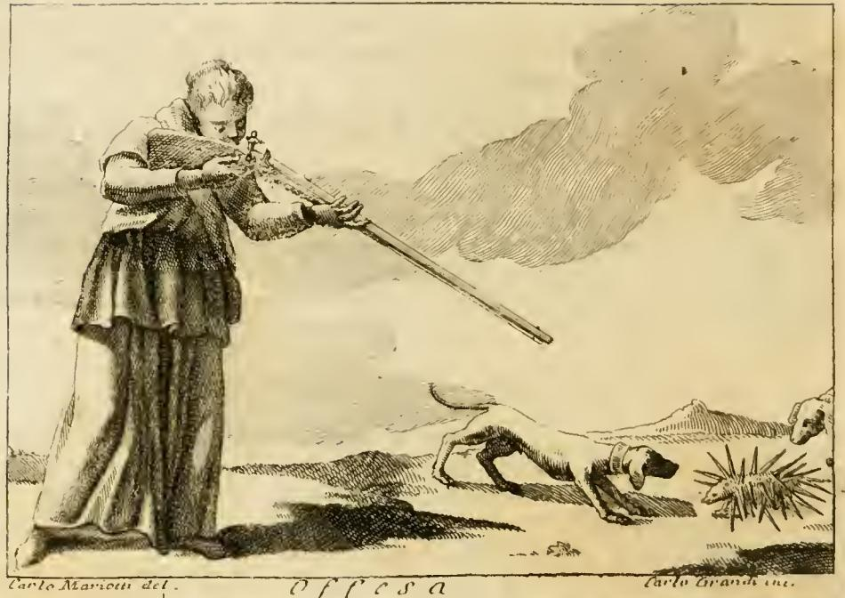

# 모욕(OFFESA)의 도상 — 혀와 칼, 그리고 고슴도치와 개

체사레 리파 『이코놀로지아』 제4권 「OFFESA(모욕/침해)」 항목. 원문은
`.fm/assets/11 Oblivion to Omnipotence of God.md` 353–381행에 있다. 판본은 판화 서명
(`Carlo Mariotti del.` / `Carlo Grandi inc.`)과 "FATTO STORICO SAGRO / PROFANO / FAVOLOSO"
구성으로 보아 **체사레 오를란디(Cesare Orlandi)가 편집한 페루자판(1764–67)** 계열이다.
즉 본문의 리파 원문 위에 18세기 편집자의 보론이 얹혀 있다.

판화에서 실제로 관찰되는 것:

- **왼쪽**: 못생긴 여인이 **두 손으로** 긴 화승총(archibugio)을 들고 뺨에 붙여 조준하고 있다.
  옷은 촘촘한 무늬로 뒤덮여 있는데(상의 전면이 잘게 해칭됨), 판각 해상도상 개별 문양이
  "혀와 칼"임을 육안으로 판별하기는 어렵다. 다만 텍스트의 "온통 혀와 칼로 짜여진 옷"과
  일치하는 **전면 문양 처리**임은 분명하다.
- **오른쪽 아래**: 개 두 마리가 몸을 낮추고 달려들고 있고, 오른쪽 가장자리에 세 번째 개의
  머리가 잘려 보인다(원문은 "두 마리"라고만 한다). 앞선 개는 코를 땅에 붙이듯 낮추고 있다.
- **맨 오른쪽**: 가시를 사방으로 곤두세운 **공 모양의 고슴도치**. 사지도 얼굴도 보이지 않고
  오직 가시 덩어리로만 그려져 있다 — 원문의 "una palla con pungentissime spine"를 그대로 옮긴 것.
- 총구와 개·고슴도치는 같은 지평선 위에 놓여 있어, **가해자(총) → 도발(개) → 되돌아오는 상해
  (고슴도치)** 가 한 화면에 나란히 배치된다.

---

## 0. 도상 전체 처방과 모욕의 정의

### 도상 처방 (원문 359행)

> DOnna brutta. Il color del vestimento sarà simile alla ruggine, tutto contesto di lingue,
> e coltelli. Terrà con ambe le mani un archibugio, in atto, e con attenzione di colpire;
> e per terra vi saranno due Cani, con dimostrazione di pigliare un Riccio, il quale per
> l'Offesa de' Cani, sia fatto in guisa di una palla con pungentissime spine, colle quali
> offenda detti Cani, vedendosi che abbiano insanguinata la bocca dalle punture di dette spine.

> 못생긴 여인. 옷 색은 **녹(ruggine)** 과 비슷하고, 온통 **혀와 칼**로 짜여 있다. 두 손으로
> 화승총을 들고 맞히려는 자세로 주의를 집중한다. 땅바닥에는 **개 두 마리**가 **고슴도치**를
> 잡으려 하는데, 고슴도치는 개들의 공격 때문에 **아주 날카로운 가시가 돋친 공 모양**이 되어
> 그 가시로 개들을 찌르고, 개들은 그 가시에 찔려 **입이 피투성이**가 되어 있다.

(OCR 훼손 복원: `cortelli`→`coltelli`, `contello`→`contesto`, `archibuggio`→`archibugio`,
`dimollrazìone`→`dimostrazione`, `inlunguinata`→`insanguinata`. 장음 s(ſ)를 f로 잘못 읽은
것이 OCR 오류의 대부분이다.)

### 모욕의 정의 (361행, 아리스토텔레스)

> Offesa, ovvero ingiuria, è un'azione ingiusta, fatta con saputa, e con elezione a offesa
> di persona, la quale tollera danno contro il suo volere, dice Aristotele, libro 5. Etica.

> 모욕 곧 침해(ingiuria)란 **알고서(con saputa)**, **선택으로(con elezione)** 저지른 부정한
> 행위로서, 상대가 **자기 뜻에 반해** 손해를 감수하게 되는 것이다.

『니코마코스 윤리학』 5권 8장(1135a–b)에서 아리스토텔레스가 부정한 행위를 (i) 우연(ἀτύχημα),
(ii) 과실(ἁμάρτημα), (iii) 알고 했으나 미리 계획하지 않은 것, (iv) **선택(προαίρεσις)에서
나온 것** 으로 나누고, 마지막만이 온전한 의미의 ἀδίκημα(불의한 행위)라고 한 대목에 대응한다.
그래서 뒤에 나오는 **화승총**이 필요해진다. "겨누고 집중해서 쏘는" 자세 = **고의성**.

> Tiene con ambe le mani l'archibugio... perciocché Offesa si deve intendere quella, colla
> quale si offende **spontaneamente**, e **non per accidente**.
> …Non est considerandum, quid homo faciat, sed **quo animo, & voluntate** faciat.
> (아우구스티누스, 『요한 서간 강해』 7 — 원문 379행 인용)

> 사람이 **무엇을** 했는지가 아니라 **어떤 마음과 의지로** 했는지를 보아야 한다.

옷 색 "녹(ruggine)"의 뜻은 373행: 녹은 **닿는 자리마다 갉아먹고 삭혀 버리므로**, 가해자의
악의를 나타낸다. 크리소스토무스 인용 `Turpitudo iniquitatis est praemium`(불의의 대가는
추함이다)로 "못생긴 여인"이 정당화된다(371행).

---

## ① 혀와 칼 — 말로도 가해지는 모욕

### 원문 (375행)

> Le lingue, ed i coltelli sopra il vestimento dimostrano, che **non solo si offende altrui
> co' fatti, ma ancora colle parole**: *Omne enim, quod non iure fit, iniuria dicitur, sive
> verbis, sive re*, dice Ulpiano.

> 옷 위의 혀와 칼은 **행위로만이 아니라 말로도** 남을 모욕한다는 것을 보여 준다.
> "권리 없이 행해진 모든 것은 **말로든 사물(행위)로든** 침해라 불린다" — 울피아누스.

(OCR `Vulpiano`는 `Ulpiano`. 초기 활자의 U/V 혼용 + 장음 s 오독.)

**법원(法源) 확인.** 리파의 인용문은 『학설휘찬』 D. 47,10,1의 **두 대목을 붙여 놓은 것**이다.

- D. 47,10,1 pr. (Ulpianus libro 56 ad edictum):
  *Iniuria ex eo dicta est, quod non iure fiat: **omne enim, quod non iure fit, iniuria
  fieri dicitur**.*
- D. 47,10,1,1: *Iniuriam autem fieri Labeo ait **aut re aut verbis**: re, quotiens manus
  inferuntur; verbis autem, quotiens non manus inferuntur, convicium fit.*
  ("라베오는 침해가 **행위로든 말로든** 성립한다고 한다. 행위로는 손찌검이 있을 때, 말로는
  손찌검 없이 **공개적 욕설(convicium)** 이 있을 때.")

즉 "sive verbis sive re"는 리파의 수사가 아니라 **로마법 *iniuria* 법리의 정식 분류**다.
로마의 *iniuria*는 우리말 "모욕"보다 훨씬 넓어서 폭행·상해·명예훼손·주거침입 등 인격에 대한
침해 일반을 포괄했고, 그중 *convicium*(집단적 공개 욕설), *infamatio*(명예 실추), *famosus
libellus*(비방문서)가 오늘날의 언어적 모욕에 해당했다. 인격을 침해하는 데 **손이 필요하지
않다**는 것이 이 법리의 핵심이며, 리파의 옷 문양은 이 법 범주를 그림으로 옮긴 것이다.
(→ 그래서 이 도상은 '말도 나쁘다'는 도덕적 훈계가 아니라, **당대 실정법의 범주를 시각화한
것**으로 읽어야 한다.)

### 디오게네스 일화 (377행)

> **Diogene assomigliò le parole al coltello**; e sentendo, che un bel Giovane burlava molto
> disonestamente: "Non ti vergogni," disse, "cavare da una guaina di avorio un coltello di piombo?"

> **디오게네스는 말을 칼에 비유했다.** 잘생긴 젊은이가 아주 상스러운 농담을 하는 것을 듣고
> 그가 말했다. "부끄럽지 않은가, **상아 칼집에서 납 칼을 뽑다니**?"

**출전**: 디오게네스 라에르티오스 『유명한 철학자들의 생애』 **6권 65절**(견유 디오게네스).
그리스어:

> Θεασάμενος μειράκιον εὔμορφον ἀκόσμως λαλοῦν, "οὐκ αἰσχύνῃ," ἔφη, "**ἐξ ἐλεφαντίνου
> κολεοῦ μολυβδίνην ἕλκων μάχαιραν**;"

> "잘생긴 젊은이가 꼴사납게 지껄이는 것을 보고 그가 말했다. '부끄럽지 않은가, **상아 칼집에서
> 납 칼을 뽑다니**?'"

라틴어 전승형: *Non erubescis ex eburnea vagina plumbeum gladium educere?*

**이 일화의 논점은 이중이다.**

1. **불일치(不一致)의 풍자** — 상아 칼집 = 아름다운 외모, 납 칼 = 추한 말. 겉과 속의 불일치를
   찌른다. 납은 물러서 칼로 쓸모없으므로 "무가치함"까지 함의한다.
2. **말 = 칼이라는 은유의 고대성** — 리파가 이 일화를 고른 이유는 여기 있다. 앞 문장이 곧
   `Diogene assomigliò le parole al coltello`이다. 즉 리파는 이 일화를 "겉과 속" 이야기가
   아니라 **"말은 칼이다"라는 등식이 이교 철학에도 이미 있었다는 증거**로 쓴다. 옷 위에서
   *lingua*와 *coltello*가 나란히 반복되는 이유가 바로 이 등식이다.

### 성서 전거 (377행)

리파는 연달아 세 구절을 든다. 원문 표기와 실제 불가타 대조:

| 리파 표기 | 라틴 인용문 | 실제 위치 | 비고 |
|---|---|---|---|
| Salmo **57** | *Filii hominum, dentes eorum arma, & sagittae, & **lingua eorum gladius acutus*** | 불가타 **Ps 56,5** (= 히브리 Ps 57,4) | 히브리/현대 번호로 인용 |
| Eccl. **28** | *Flagelli plaga livorem facit, plaga autem linguae comminuet ossa* | **집회서(Ecclesiasticus/Sirach) 28,21** | 리파는 장만 표기 |
| Salmo **54** | *Quia exacuerunt ut gladium linguas suas, intenderunt arcum rem amaram, ut sagittent in occultis immaculatum* | 불가타 **Ps 63,4** (= 히브리 Ps **64,3–4**) | **"54"는 "64"의 오식(誤植)/OCR 오류로 추정** |

번역:

- **Ps 56,5 (57,4)**: "사람의 아들들 — 그들의 이는 무기요 화살이며, **그들의 혀는 날카로운 칼**이다."
  → **질문의 '그들의 혀는 날카로운 칼'이 바로 이 구절**이다.
- **Sir 28,21**: "채찍의 매질은 멍을 만들지만, **혀의 매질은 뼈를 부순다**."
  → 물리적 상해보다 말의 상해가 더 깊다는 **강도(强度)의 비교**. 집회서 28장은 통째로
  "혀의 힘"에 관한 장이다.
- **Ps 63,4 (64,3–4)**: "그들이 **혀를 칼처럼 갈았고**, 쓰디쓴 것을 화살 삼아 활을 당겨,
  숨어서 흠 없는 이를 쏘려 한다."
  → **활·화살 이미지**가 등장한다는 점이 결정적이다. 도상에서 여인이 **매복하듯 겨눈
  화승총**은 이 구절의 "*intenderunt arcum ... ut sagittent **in occultis***"(숨어서 쏘려고
  활을 당겼다)를 **르네상스식 화기(火器)로 번안한 것**으로 읽을 수 있다. 혀·칼·활/총이
  하나의 계열을 이룬다.

정리하면 리파의 인용 순서에는 논리가 있다: **혀=칼(Ps 56) → 혀의 상해가 더 깊음(Sir 28) →
혀=갈아 만든 칼이자 매복한 활(Ps 63)** 로, 은유가 점점 "겨누어 쏘는 행위"로 옮겨 가며
도상 중앙의 총으로 수렴한다.

### 배경: 혀의 죄와 그 무게

- **신학**: 중세 이래 *peccata linguae*(혀의 죄)는 독립된 죄 목록으로 정리되었다.
  토마스 아퀴나스 『신학대전』 II-II, q.72–76은 *contumelia*(모욕), *detractio*(험담),
  *susurratio*(수군거림), *derisio*(조롱), *maledictio*(저주)를 차례로 다루며, 특히
  q.72(contumelia)는 **명예(honor)를 직접 겨냥한 언어 침해**를 별도의 대죄로 분류한다.
  리파가 365행에서 "여인으로 그리는 것은 **남의 명예(l'onore altrui)** 를 침해하는 자를
  나타내기 위함이며, 명예는 그 무엇보다 값진 것"이라고 한 것이 정확히 이 항목이다.
- **성서 계열**: 야고보서 3,5–8(*lingua ignis est* — "혀는 불이다… 길들일 수 없는 악이요
  죽음의 독으로 가득하다"), 잠언 12,18(*est qui promittit et quasi gladio pungitur
  conscientiae* / "함부로 말하는 자의 말은 칼로 찌르는 것 같다"), 잠언 18,21.
- **『이코놀로지아』 내부 대응**: 같은 책 「죄(Peccato)」 항목에서 P. 빈첸치오 리치의 도상도
  *"Nel vestimento vi sono molte lingue dipinte"*(옷에 여러 개의 혀가 그려져 있다)라고 한다
  (`15 Madness to Stubbornness.md` 127행). **옷 전면의 혀 문양 = 말의 죄**라는 시각 코드가
  이 책 안에서 반복 사용되는 관용어임을 확인할 수 있다.

---

## ② 고슴도치와 개 — 모욕의 귀책(歸責)

### 원문 (381행)

> La dimostrazione dell'Offesa de' Cani, col Riccio, nella guisa che dicemmo, ne dimostra,
> che **l'offesa che si fa per ira, non è causa, e principio colui che opera con ira; ma
> colui che prima ad ira lo provocò**; e però sopra di ciò si può dire: ***Ledentes leduntur***.

> 앞서 말한 방식의, 개들이 고슴도치에게 가하는 공격의 묘사는 이것을 보여 준다. **분노 때문에
> 저질러진 모욕의 원인이자 단초는, 분노에 차서 행동한 자가 아니라, 그를 먼저 분노하게
> 자극한 자**라는 것. 그러므로 이에 대해 이렇게 말할 수 있다: ***해치는 자들이 해를 입는다***.

### 격언의 정체 — 원문 대조 결과

원문이 실제로 쓰는 격언은 **`Ledentes leduntur`** = 고전 정서법으로 **`Laedentes laeduntur`**
("해치는 자들이 해를 입는다")이다. 3인칭 복수 능동분사 *laedentes* + 3인칭 복수 수동
*laeduntur*의 **어근 반복(polyptoton)** 으로, "가해=피해"가 같은 동사에서 되돌아온다는 것을
형태로 보여 준다.

따라서 과제에서 후보로 제시된 셋 중 어느 것도 아니다:

- ✗ *qui nocet, nocetur* — 뜻은 같지만 **리파가 쓴 낱말이 아니다**(*nocere*가 아니라 *laedere*).
- ✗ *volenti non fit iniuria* (D. 47,10,1,5 *nulla iniuria est, quae in volentem fiat*) —
  이는 **피해자의 동의**가 침해 성립을 막는다는 법리로, 여기서 다루는 **도발자의 귀책**과는
  논점이 다르다. (다만 같은 D. 47,10 장에 속하고, 리파가 이미 울피아누스를 인용했으므로
  **문맥상 인접한 법리**로 함께 알아 둘 만하다.)
- ✗ 시편 7,16 (*Lacum aperuit, et effodit eum; et incidit in foveam quam fecit* / "그가 웅덩이를
  파고 후벼 놓고는, 제가 만든 함정에 빠졌다") — **관념적으로 같은 계열**이고 시편 9,16
  (*infixae sunt gentes in interitu quem fecerunt*)도 같지만, 리파는 이 절에서 성서를 인용하지
  않고 **격언 한 줄만** 붙인다. 앞의 ①절에서 성서를 세 번 인용한 것과 뚜렷이 대비된다.

### 논리 구조

고슴도치는 **먼저 공격하지 않는다.** 원문이 명시적으로 *"il quale **per l'Offesa de' Cani**,
sia fatto in guisa di una palla"* — "**개들의 공격 때문에** 공 모양이 되었다"라고 한다. 즉

1. 개가 먼저 달려든다 (도발)
2. 고슴도치는 **웅크린다** (순수 방어, 부동)
3. 개가 스스로 가시에 박혀 **입에서 피를 흘린다** (자초한 상해)

고슴도치는 자세를 바꾼 것 외에 **아무 행위도 하지 않았다**. 상해의 **작용인(causa)이자
단초(principio)** 는 먼저 움직인 쪽에 있다. 이것이 리파가 *causa, e principio*라는
아리스토텔레스적 인과 용어를 굳이 쓴 이유다 — 앞의 ①절에서 세운 "고의·선택이 있어야 모욕"
이라는 정의를, 여기서 **분노에 의한 반응**에 적용해 귀책을 도발자에게 되돌린다.

### 고슴도치의 자연지 배경

- **플리니우스 『박물지』 8권 56장(§133)**: 위험을 느끼면 *"입과 발을 오므려 **공 모양으로**
  말아, 가시 말고는 아무 데도 잡을 곳이 없게 만든다"*. 또 겨울 양식을 위해 **떨어진 사과 위를
  굴러 가시에 꽂아** 나르고 한 알은 입에 문 채 나무 구멍으로 옮긴다고 전한다. 리파의
  "*fatto in guisa di una palla con pungentissime spine*"는 이 기술의 **직역에 가까운 반향**이며,
  판화가가 고슴도치를 사지도 얼굴도 없는 **순수한 가시 덩어리**로 그린 것도 여기서 나온다.
- **중세 동물지(Physiologus / bestiary)**: 플리니우스의 두 특징이 그대로 계승되어, 가시로
  무장한 채 웅크리는 **자기방어**와 열매를 꽂아 나르는 **선견(先見)** 의 두 갈래 알레고리가 굳어졌다.
- **아르킬로코스 단편 201**: πόλλ' οἶδ' ἀλώπηξ, ἀλλ' ἐχῖνος ἓν μέγα ("여우는 많은 것을 알지만,
  **고슴도치는 하나의 큰 것을 안다**"). 그 "하나의 큰 것"이 바로 **웅크려 방어하는 기술**이다.
  이사야 벌린이 이 단편을 사상가 유형론으로 유명하게 만들었지만, 고대의 원의는 훨씬 소박하게
  "단 하나의, 그러나 완벽한 자기방어책"이었다. 리파의 논지 — 고슴도치는 **공격 수단이 없고
  오직 방어만 안다** — 와 정확히 맞물린다.
- **엠블럼 전통**: 르네상스 동물 엠블럼에서 고슴도치는 통상 **자기방어의 신중함/선견**으로
  쓰인다(요아힘 카메라리우스 2세 『Symbolorum et Emblematum』 제2권 *ex animalibus
  quadrupedibus* 계열이 대표적). 다만 **알치아토 『Emblemata』에 고슴도치 엠블럼이 있다는 것은
  이번 조사로 확인하지 못했다** — 특정 엠블럼 번호로 단정하지 말 것. 확실한 것은
  "고슴도치=수동적 자기방어"라는 코드가 리파 당대에 널리 통용되고 있었다는 사실이다.

여기서 도상의 **비대칭**이 중요하다. 총과 개는 **능동적 공격**이고, 고슴도치만이 **수동적
방어**다. 그래서 화면에서 유일하게 피를 흘리는 것은 **공격한 쪽(개의 입)** 이다.

---

## ③ 항목 전체의 구성 — 하나의 도상에 담긴 세 단계

「Offesa」 도상은 장식적 나열이 아니라 **논증의 순서**로 배치되어 있다.

| 단계 | 상징 | 다루는 문제 | 전거 |
|---|---|---|---|
| **정의** | 못생김 + 녹빛 옷 | 모욕이란 무엇이며 왜 추한가 | 아리스토텔레스 『윤리학』 5권, 크리소스토무스 |
| **주체** | 여인 | 명예(honor)를 침해하는 자 | 리파 자신 |
| **고의** | 두 손으로 겨눈 화승총 | 우연이 아니라 **의지·선택**에 의한 것 | 아리스토텔레스, 아우구스티누스 |
| **수단** | **혀와 칼** 문양의 옷 | **말로도** 모욕이 가해진다 | 울피아누스(D. 47,10,1), 디오게네스, Ps 56·Sir 28·Ps 63 |
| **귀책** | **고슴도치와 개** | 분노로 저지른 모욕조차 **먼저 도발한 자** 책임 | *Laedentes laeduntur* |

즉 **"모욕의 정의 → 수단 → 책임 소재"** 가 순서대로 배치된다. 특히 마지막 항은 **가해자를
그린 도상 안에 가해자를 면책할 수 있는 논리**를 넣은 것으로, 도덕적 알레고리가 아니라
**책임 귀속에 관한 법적 사고**가 이 항목을 관통하고 있음을 보여 준다.

이 독법은 뒤이어 붙은 오를란디의 사례들로도 확인된다.

- **FATTO STORICO SAGRO** (385행): 암몬 왕 하눈(Amon)이 다윗의 조문 사절단의 **수염 절반을
  깎고 옷을 절반 잘라** 돌려보낸 사건(2사무 10장). 물리적 상해가 아닌 **모욕(oltraggio)**
  이 전쟁의 원인이 된다 — ①의 사례.
- **FATTO STORICO PROFANO** (393행): 리쿠르고스가 폭동 중 몽둥이에 한쪽 눈을 잃고도, 넘겨진
  가해자를 벌하지 않고 교육해 일 년 뒤 훌륭한 시민으로 만들어 민회에 세운 이야기 —
  *"Che virtuoso vendicare le ricevute offese!"*("받은 모욕을 이 얼마나 덕스럽게 갚았는가!")
  — 도발–보복의 연쇄를 끊는 반례.
- **FATTO FAVOLOSO** (397행): 네오프론과 아이기피오스가 서로 모욕을 되갚다 파국에 이르러
  모두 새로 변하는 이야기 — ②의 *Laedentes laeduntur*를 신화로 예시한 것.

---

## OCR 훼손·복원 일람 (본문 353–381행)

| OCR 형태 | 복원 | 근거 |
|---|---|---|
| `cortelli` / `coltelli` 혼재 | *coltelli* | 장음 ſ/f/t 오독 |
| `tutto contello di lingue` | *tutto **contesto** di lingue* (contessere, 짜 넣다) | 문맥 |
| `inlunguinata la bocca` | *insanguinata la bocca* | 문맥 |
| `dice Vulpiano` | *dice **Ulpiano*** | D. 47,10,1 대조로 확정 |
| `nel Salmo 54` | *nel Salmo **64*** (불가타 63) | 인용문이 Ps 63,4와 일치 |
| `Filti hominum` | *Filii hominum* | 불가타 대조 |
| `Flagelli plaga lìvorem facìet` | *…livorem **facit*** | 불가타 대조 |
| `commìnuct offa` | *comminuet **ossa*** | 불가타 대조 |
| `^ia e.xacuerunt` | *Quia exacuerunt* | 불가타 대조 |
| `ut fagiiterS in occultis` | *ut **sagittent** in occultis* | 불가타 대조 |
| `Ledentes leduntur` | *Laedentes laeduntur* (원문 표기 그대로가 중세 정서법) | 고전 정서법 복원 |
| `Arillotele` / `Augulh` / `S. Crif.` | *Aristotele* / *Augustino* / *S. Crisostomo* | 장음 s 오독 |

**미확정 사항**: (1) 리파가 알치아토를 염두에 두었는지 여부는 확인 불가. (2) `S. Crif. serm. 4.
super epist. ad Ephes.`의 정확한 크리소스토무스 설교 번호는 대조하지 못했다. (3) 판화의 옷
문양이 실제로 혀와 칼인지는 이 해상도에서 판별 불가(고해상 원판 필요).

---

## 참고 자료

- [Diogenes Laertius, *Lives of Eminent Philosophers* VI (Perseus)](https://www.perseus.tufts.edu/hopper/text?doc=Perseus%3Atext%3A1999.01.0258%3Abook%3D6%3Achapter%3D2) — 6.65 "상아 칼집 / 납 칼"
- [Digest of Justinian, Liber XLVII (Latin Library)](https://www.thelatinlibrary.com/justinian/digest47.shtml) — D. 47,10 *De iniuriis et famosis libellis*
- [Vulgata, Liber Psalmorum 56](https://www.bibliacatolica.com.br/en/vulgata-clementina-vs-neo-vulgata-latina/liber-psalmorum/56/) — *lingua eorum gladius acutus*
- [Vulgata, Ecclesiasticus 28](https://vulgate.org/ot/ecclesiasticus_28.htm) — 28,21 *plaga linguae comminuet ossa*
- [Pliny, *Natural History* VIII.56 (Perseus)](https://www.perseus.tufts.edu/hopper/text?doc=Perseus:text:1999.02.0137:book%3D8:chapter%3D56) — 고슴도치
- [Alciato at Glasgow](https://www.emblems.arts.gla.ac.uk/alciato/) — 엠블럼 전통 확인용
