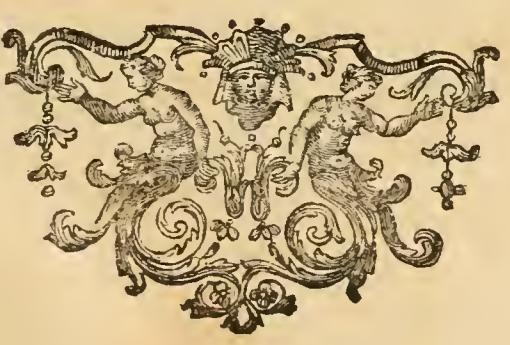

# 정치 (POLITICA) — 오른손에 저울을 든 여인

## 원문 (Iconologia, 「POLITICA. Di Cesare Ripa」)

> Donna, che colla destra mano tenga un pajo di bilance. Perchè la Politica aggiusta in modo gli stati della Repubblica, che l'uno per l'altro si solleva, e si sostenta sopra la terra, con quella felicità della quale è capace fra quelle miserie l'infermità, e la debole natura nostra.

**직역**

> 오른손에 한 쌍의 저울을 든 여인. 왜냐하면 정치는 공화국의 여러 신분(stati)을 조정(aggiusta)하여, 하나가 다른 하나에 의해 들어 올려지고 이 땅 위에서 지탱되게 하기 때문이다. 우리의 병약하고 연약한 본성이 이 비참함 가운데서 감당할 수 있는 만큼의 행복과 더불어.

이 항목은 리파 항목 중에서도 유난히 짧다. 지물(持物)은 **저울 단 하나**이고, 설명도 한 문장으로 끝난다. 그만큼 "저울 = 정치"라는 등식 하나에 모든 의미가 압축되어 있다.

---

## 1. 지물(attribute) 분해

| 요소 | 의미 |
|---|---|
| **여인(Donna)** | 리파의 관행. 추상 개념(virtù, arte, scienza)은 이탈리아어에서 여성 명사이므로 여성상으로 의인화한다. `la Politica` |
| **오른손(destra mano)** | 리파에서 오른손은 그 개념의 **본질적·능동적 기능**을 쥐는 자리다. 저울이 정치의 부수적 도구가 아니라 정치 그 자체임을 뜻한다 |
| **한 쌍의 저울(un pajo di bilance)** | 양팔 저울. 무게를 **비교해 균형점을 찾는** 도구 — 자르거나 벌하는 도구가 아니다 |

없는 것도 중요하다. **칼도, 왕관도, 홀(笏)도, 법전도 없다.** 같은 책에서 저울을 든 다른 인물들과 비교하면 이 부재가 눈에 띈다.

- **법률(Legge Civile)** — 저울 + **칼**, 저울의 한쪽 접시에 릭토르의 속간(fasces), 다른 쪽에 왕관, 왼손에 법전 (01 Weariness to Pandering)
- **편파(Parzialità)** — 저울을 **발밑에 밟고** 선 추한 여인. 정의를 짓밟는 악덕의 표지 (14 Idleness to Patience)
- **음악(Musica)** — 발치의 저울 안에 쇠망치들. "귀의 판단에 필요한 **정확한 비례**" (09 Music to Nymphs)
- **관대함(Magnanimità)** 도상 중 한 아이가 "올바른 저울과 곧은 정의의 칼"을 든다 (03 Machine of the World to Marriage)

즉 리파에게 저울은 일관되게 **정당한 비례·균형의 척도**다. 다만 정의·법률에서는 저울이 늘 **칼**과 짝지어 "재고 나서 집행한다"는 뜻이 되는 반면, **정치의 저울에는 칼이 없다**. 정치의 일은 처벌이 아니라 **조정(aggiustare)** 이라는 점이 지물의 취사선택으로 드러난다.

---

## 2. "공화국의 여러 신분(gli stati della Repubblica)"

`stati`는 여기서 근대적 의미의 "국가"가 아니라 **신분·계층·계급**(estates, 三部會의 그 estates)이다. 성직자·귀족·평민, 혹은 이탈리아 도시국가의 여러 계층·당파를 가리킨다. `Repubblica`도 특정 정체가 아니라 고전적 의미의 **공적 공동체(res publica)** 다.

정치란 이 이질적인 신분들의 무게를 저울질해 **서로가 서로를 떠받치는 구조**로 배치하는 기술이다. 원문의 표현이 정확히 그렇다.

- `l'uno per l'altro si solleva` — 하나가 **다른 하나 덕분에** 들어 올려지고
- `si sostenta sopra la terra` — 이 땅 위에서 지탱된다

저울 은유의 핵심이 여기 있다. 양팔 저울에서 한쪽 접시가 올라가는 이유는 **반대쪽에 무게가 실렸기 때문**이다. 즉 각 신분은 서로를 억누르는 경쟁자가 아니라, **상대의 무게가 있어야 자기 자리를 얻는 상호 지탱 관계**다. 정치가 하는 일은 한쪽을 없애는 것이 아니라 **받침점을 잡아 균형을 만드는 것**이다.

---

## 3. "이 비참함 속에서 가능한 만큼의 행복" — 정치의 목적과 한계

마지막 종속절이 이 항목의 사상적 무게중심이다.

> con quella felicità della quale è capace fra quelle miserie l'infermità, e la debole natura nostra
> (이 비참함들 가운데서 우리의 병약함과 연약한 본성이 감당할 수 있는 그만큼의 행복과 더불어)

두 겹의 주장이 겹쳐 있다.

**(1) 정치의 목적은 행복(felicità)이다.** 아리스토텔레스-토마스주의 전통의 `felicitas politica`(정치적 행복). 같은 책 안에서 이 개념이 반복된다.

- 「빈곤(Povertà)」 항목: 집시 모습으로 그리는 이유는 재물도 고귀함도 취향도 희망도 없어 "**정치적 삶의 목적인 저 행복**의 한 조각조차 줄 수 없는" 처지이기 때문이다. (같은 16장, 바로 몇 항목 뒤)
- 「신중(Prudenza)」 항목 서두: "**정치적 행복(felicità politica)** — 그에 따라 질서 있게 살면 하늘에 예비된 행복으로 오르는 데 변명거리를 만들지 않게 되는 것" (18 Prudence to Quiet)

**(2) 그러나 그 행복은 상한이 있다.** `miserie`(이 세상의 비참), `infermità`(병약함), `debole natura nostra`(우리의 연약한 본성)라는 세 단어가 연달아 제동을 건다. 정치는 지상낙원을 만들지 못한다. **타락한 인간 본성이 감당할 수 있는 최대치**까지만 행복을 끌어올릴 뿐이다. 완전한 행복(felicità celeste)은 정치가 아니라 은총의 영역이다.

이 겸손한 한계 설정이 저울 이미지와 정확히 맞물린다. 저울은 **완벽한 영점을 선언하는 도구가 아니라, 주어진 무게들 사이에서 최선의 균형점을 찾는 도구**다. 리파의 정치는 이상국가의 설계자가 아니라 **현실의 무게를 다루는 조정자**다.

---

## 4. 판본의 삽화 상황

이 판본에서 「POLITICA」 항목에는 **인물 판화가 붙어 있지 않다.** 짧은 본문 아래에 페이지 마무리용 장식 컷(테일피스)만 놓여 있고, 곧바로 「POVERTÀ」 항목으로 넘어간다.

위 컷은 좌우 대칭의 아라베스크 장식이다. 가운데 정면 얼굴을 중심으로 좌우에 인어 형태의 인물이 거울처럼 마주 보고, 양쪽 끝에 장식 펜던트가 대칭으로 매달려 있다. **정치의 도상은 아니지만**, 좌우 무게를 정확히 맞춘 이 대칭 구성 자체가 공교롭게도 항목의 메시지(균형·상호 지탱)와 시각적으로 겹친다 — 기억용 고리로 쓰기에는 나쁘지 않다.

앞선 항목들(「평면기하학 Planemetria」, 「시 Poesia」)에는 전면 인물 판화가 실려 있으므로, 정치 항목의 삽화 부재는 스캔 누락이 아니라 이 판본의 편집 상태로 보인다.

---

## 5. 암기용 정리

- **한 줄**: 오른손에 **저울**을 든 여인.
- **왜 저울인가**: 공화국의 여러 **신분(stati)** 을 저울처럼 맞춰, 하나가 다른 하나 덕에 들리고 지탱되게 하므로.
- **왜 칼이 없는가**: 정치의 일은 처단이 아니라 **조정(aggiustare)**.
- **목표와 한계**: 이 땅의 **비참 속에서**, 연약한 인간 본성이 **감당할 수 있는 만큼의 행복**까지만.

한 문장 고리: **"정치 = 칼 없는 저울. 신분들을 맞물려 세우되, 인간이 견딜 수 있는 만큼의 행복까지."**
